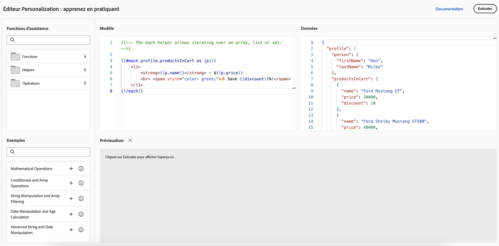

# Commencer avec la personnalisation{#add-personalization}

>[!CONTEXTUALHELP]
>id="ajo_homepage_card5"
>title="Personnaliser des expériences"
>abstract="Utilisez **Adobe Journey Optimizer** pour adapter vos messages à chaque personne destinataire spécifique en exploitant les données et informations que vous possédez à son sujet. Il peut s’agir de son prénom, de ses centres d’intérêt, de son lieu de résidence, de ses achats, etc."

Les fonctionnalités de personnalisation d’[!DNL Adobe Journey Optimizer] vous permettent d’adapter vos messages à chaque destinataire en exploitant les données et informations que vous possédez à son sujet. Il peut s’agir de son prénom, de ses centres d’intérêt, de son lieu de résidence, de ses achats, etc.

## Fonctionnement de la personnalisation

Grâce à l’**éditeur de personnalisation**, vous pouvez sélectionner, organiser, personnaliser et valider toutes les données afin de personnaliser le contenu et utiliser divers outils tels que des fonctions d’assistance ou des expressions prédéfinies pour personnaliser efficacement les messages.

Journey Optimizer utilise une syntaxe de personnalisation intégrée basée sur Handlebars, qui vous permet de créer des expressions avec du contenu encadré par des accolades doubles **`{{}}`**.

Lors du traitement du message, Journey Optimizer remplace l’expression par les données contenues dans le jeu de données Experience Platform. Par exemple, `Hello {{profile.person.name.firstName}} {{profile.person.name.lastName}}` devient `Hello John Doe` de manière dynamique.

Cette syntaxe vous permet de personnaliser des messages dans plusieurs champs, notamment l’objet des e-mails, le corps des messages, les notifications push ou les URL.

## Données utilisées pour la personnalisation

La personnalisation est basée sur les données de profil gérées par le schéma **Profil individuel XDM** défini dans Adobe Experience Platform. Le schéma **Profil individuel XDM** est le seul que vous pouvez utiliser pour personnaliser le contenu dans [!DNL Journey Optimizer]. Pour en savoir plus, consultez la [documentation du modèle de données Adobe Experience Platform (XDM)](https://experienceleague.adobe.com/fr/docs/experience-platform/xdm/home){target="_blank"}.

Vous pouvez également utiliser les **attributs calculés** pour personnaliser le contenu. Les attributs calculés vous permettent de résumer des événements comportementaux individuels en attributs de profil calculés disponibles sur Adobe Experience Platform. [Découvrir comment utiliser les attributs calculés](../audience/computed-attributes.md)

En outre, [!DNL Journey Optimizer] vous permet d’utiliser les données d’Adobe Experience Platform dans l’éditeur de personnalisation pour personnaliser le contenu. Pour ce faire, les jeux de données nécessaires à la personnalisation de la recherche doivent d’abord être activés par le biais d’un appel API. Après cela, vous pouvez utiliser les données pour personnaliser le contenu dans Journey Optimizer. Cette fonctionnalité est actuellement disponible en version Beta. [En savoir plus](../personalization/aep-data-perso.md)

## Découvrez et testez la personnalisation. {#playground}

**[!DNL Adobe Journey Optimizer]** comprend un outil interactif conçu pour vous aider à apprendre et à tester les fonctionnalités de personnalisation.

Ce terrain de jeu fournit un environnement simulé pour écrire et tester du code de personnalisation à l’aide de données d’exemple sans nécessiter de jeux de données actifs. Vous pouvez tirer parti des exemples de code prédéfinis, modifier les payloads de profil factices et prévisualiser la sortie de votre code de personnalisation en temps réel.

➡️ [Accédez au terrain de jeu de la personnalisation.](https://experienceleague.adobe.com/fr/apps/journey-optimizer/ajo-personalization){target="_blank"}

## Explorons plus en détail

Maintenant que vous savez comment effectuer des personnalisations dans **[!DNL Journey Optimizer]**, il est temps d’examiner plus en détail ces sections de documentation pour commencer à utiliser cette fonctionnalité.

<table style="table-layout:fixed"><tr style="border: 0;">
<td>

<a href="personalization-build-expressions.md"><strong>Ajouter une personnalisation</strong></a>

</td>
<td>

<a href="../personalization/personalization-syntax.md"><strong>Syntaxe de personnalisation</strong>

</td>
<td>

<a href="../personalization/functions/functions.md"><strong>Liste des fonctions d’assistance</strong></a>

</td>
<td>

<a href="../personalization/personalization-use-case.md"><strong>Cas d’utilisation de la personnalisation</strong></a>

</td>
</tr></table>

## Tutoriels vidéo{#video-perso}

Découvrez comment utiliser les informations d’événement contextuelles d’un parcours pour personnaliser un message.

>[!VIDEO](https://video.tv.adobe.com/v/334165?quality=12)

Découvrez comment ajouter une personnalisation basée sur un profil à un message et comment utiliser l’appartenance à une audience comme condition préalable à un bloc de personnalisation.

>[!VIDEO](https://video.tv.adobe.com/v/334078?quality=12)

Découvrez comment tirer parti du terrain de jeu de l’éditeur de personnalisation pour écrire et tester du code de personnalisation à l’aide de données d’exemple.

>[!VIDEO](https://video.tv.adobe.com/v/3457868?quality=12)

Découvrez d’autres tutoriels vidéo sur les fonctionnalités de personnalisation et les bonnes pratiques dans les [tutoriels sur la personnalisation](https://experienceleague.adobe.com/fr/docs/journey-optimizer-learn/tutorials/personalize-content/personalization-editor-overview){target="_blank"}.
