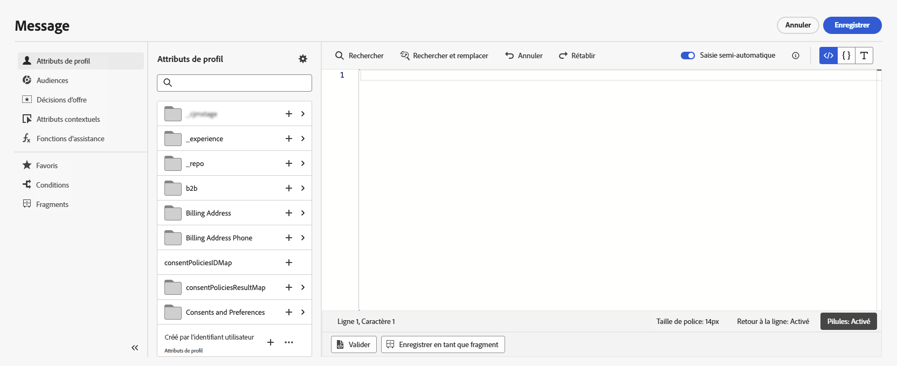

# Prise en main de la personnalisation{#add-personalization}

Découvrez les [!DNL Adobe Journey Optimizer] fonctionnalités de personnalisation pour adapter vos messages à chaque destinataire spécifique en exploitant les données et informations que vous possédez à son sujet. Il peut s&#39;agir de son prénom, de ses centres d&#39;intérêt, de l&#39;endroit où il habite, de ce qu&#39;il a acheté et plus encore.

[!DNL Journey Optimizer] utilise une syntaxe de personnalisation simple  **** intégrée basée sur Handlebars qui vous permet de créer des expressions avec des contenus entourés de doubles accolades **{}}**. Vous pouvez ajouter plusieurs expressions dans le même contenu ou champ sans restriction. En savoir plus dans [Syntaxe de personnalisation](personalization-syntax.md).

La personnalisation est basée sur les données de profil gérées par le schéma **Profil individuel XDM** défini dans Adobe Experience Platform. Pour plus d&#39;informations à ce sujet, consultez la [documentation du modèle de données Adobe Experience Platform (XDM)](https://experienceleague.adobe.com/docs/experience-platform/xdm/home.html?lang=fr).

>[!CAUTION]
>Le schéma **Profil individuel XDM** est le seul que vous pouvez utiliser pour personnaliser le contenu dans [!DNL Journey Optimizer].

**Exemples :**

* `Hello {{profile.person.name.firstName}} {{profile.person.name.lastName}}`

* `Hello {{profile.person.name.fullName}}`

Lors du traitement du message (email et push), Journey Optimizer remplace l’expression par les données contenues dans la base de données de la plateforme Experience Cloud :  `Hello {{profile.person.name.firstName}} {{profile.person.name.lastName}}` devient &quot;Bonjour John Doe&quot;.

## Contexte de personnalisation{#personalization-areas}

Le contenu et l&#39;affichage des messages diffusés par [!DNL Journey Optimizer] peuvent être personnalisés de différentes manières.

Dans chaque champ contenant l&#39;icône de l&#39;éditeur, vous pouvez ouvrir l&#39;éditeur de personnalisation (également appelé Éditeur d&#39;expression) et définir la personnalisation.

### Personnaliser vos emails

Lorsque vous créez un e-mail, vous pouvez ajouter une personnalisation dans le champ **Objet de l&#39;e-mail** du message.

Dans le Concepteur d&#39;email, vous pouvez personnaliser le contenu :

* Dans le **message** : cliquez dans un bloc de texte, puis cliquez sur l&#39;icône **Personnaliser** dans la barre d&#39;outils contextuelle et sélectionnez le champ **Insérer une personnalisation**. Pour plus d&#39;informations sur l&#39;interface du Concepteur d&#39;email, reportez-vous à [cette section](../design-emails.md).

   

* Pour un **lien** : sélectionnez du texte ou une image à l&#39;intérieur d&#39;un bloc de texte, puis cliquez sur l&#39;icône **Insérer un lien** de la barre d&#39;outils contextuelle. Dans la fenêtre, vous pouvez ajouter un bloc de personnalisation en cliquant sur l&#39;icône **Ajouter une personnalisation**.

   

Dans les deux cas, vous accédez à l’éditeur de personnalisation.

### Personnaliser vos notifications push

Vous pouvez également personnaliser vos **notifications push** dans les champs suivants :

* **Titre**
* **Corps**
* **Son personnalisé**
* **Badges**
* **Données personnalisées**

Pour en savoir plus sur la configuration des notifications push, consultez [cette section](../push-gs.md).

## Utilisation de l’éditeur d’expression

L&#39;éditeur d&#39;expression est l&#39;élément central de la personnalisation dans [!DNL Journey Optimizer].

Il est disponible dans tous les contextes où vous devez définir une personnalisation (par exemple, dans les emails, les notifications push et les offres).

Dans l&#39;interface de l&#39;éditeur d&#39;expression, vous sélectionnez, organisez, personnalisez et validez toutes les données afin de personnaliser votre contenu.

La partie gauche de l&#39;écran affiche un sélecteur de domaine qui vous permet de sélectionner la source en vue de la personnalisation. Les sources disponibles sont les suivantes :

* **Profil** : répertorie toutes les références associées au schéma de profil décrit dans la [ documentation du modèle de données Adobe Experience Platform (XDM)](https://experienceleague.adobe.com/docs/experience-platform/xdm/home.html).
* **Appartenance à un segment** : répertorie tous les segments créés dans le service Adobe Experience Platform Segmentation. Vous trouverez [ici](https://experienceleague.adobe.com/docs/experience-platform/segmentation/home.html?lang=fr) plus d&#39;informations sur la segmentation
* **Offres** : répertorie toutes les offres associées à un emplacement spécifique. Sélectionnez l&#39;emplacement, puis insérez les offres dans votre contenu. Pour obtenir une documentation complète sur la gestion des offres, consultez [cette section](../deliver-personalized-offers.md)
* **Contexte** : lorsque l&#39;activité **Message** est utilisée dans un parcours, les champs de parcours contextuels sont disponibles dans ce menu. En savoir plus dans [cette section](personalization-use-case.md)
* **Fonctions d&#39;assistance** : répertorie toutes les fonctions d&#39;assistance disponibles pour effectuer des opérations sur les données, comme des calculs, une mise en forme ou des conversions des données, des conditions, et les manipuler dans le contexte de la personnalisation. En savoir plus dans [cette section](functions/functions.md)

Lorsqu&#39;elle est sélectionnée, la référence est ajoutée dans l&#39;éditeur.

>[!NOTE]
>
>L&#39;icône d&#39;informations située en regard de l&#39;icône « + » ouvre une info-bulle fournissant plus de détails sur chaque variable.

Dans l&#39;exemple suivant, l&#39;éditeur d&#39;expression vous permet de sélectionner les profils dont l&#39;anniversaire est aujourd&#39;hui, puis de terminer la personnalisation en insérant une offre spécifique correspondant à cette journée.

