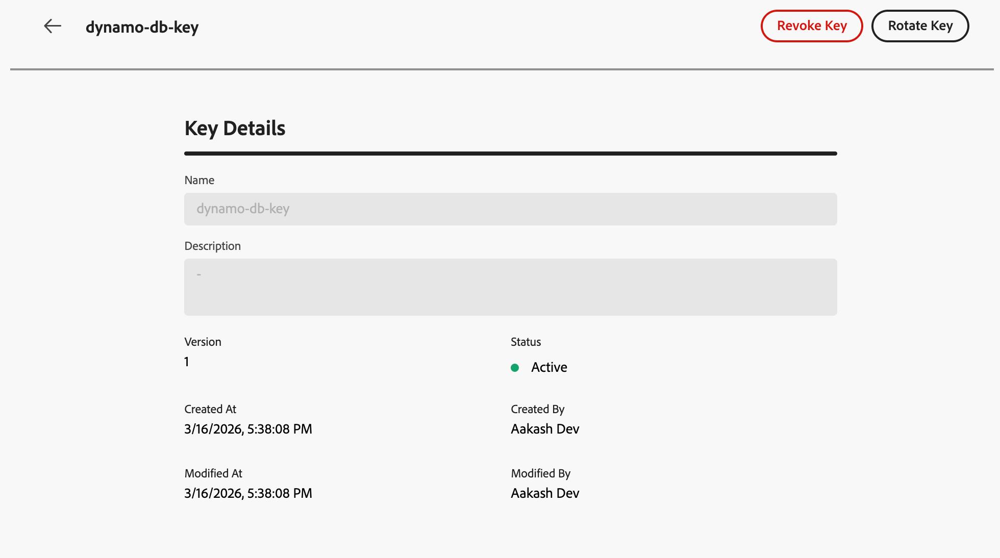

# Paramètres de chiffrement de l’URL {#url-parameter-encryption}

>[!AVAILABILITY]
>
>Cette fonctionnalité est en disponibilité limitée. Contactez votre représentant ou représentante Adobe pour en obtenir l’accès.
>
>Actuellement, cette fonctionnalité n’est disponible que pour le canal E-mail .

## Pourquoi utiliser le chiffrement des paramètres d’URL ? {#why-url-parameter-encryption}

Les liens de tracking et les URL de page de destination personnalisés incluent souvent des attributs de profil, des identifiants, des jetons ou d’autres valeurs dans la chaîne de requête. Ces paramètres sont généralement visibles en tant que texte brut dans l’e-mail ou le SMS et ils restent lisibles si quelqu’un copie, partage ou met en signet le lien. Cela peut constituer un risque pour la sécurité et la confidentialité lorsque les valeurs peuvent inclure des informations d’identification personnelle (PII) ou d’autres données sensibles qu’elles doivent protéger.

[!DNL Journey Optimizer] fournit un assistant de chiffrement dans l’éditeur de personnalisation afin que vous puissiez chiffrer n’importe quelle valeur d’expression au moment du rendu (par exemple, un attribut de profil, un jeton ou une chaîne que vous avez créée à partir de plusieurs champs). Le chiffrement nécessite toujours une clé provenant du registre de votre organisation.

Vous chiffrez uniquement les paramètres de requête de votre choix à l’aide de clés gérées par les administrateurs dans un registre au niveau du sandbox, de sorte que les valeurs confidentielles ne restent pas exposées en texte clair lorsque le lien est partagé ou inspecté.

### Fonctionnement {#how-it-works}

* **Administrateurs** utilisez le registre des clés pour [créer des clés](#create-keys) et [gérer des clés](#manage-keys) conformément aux politiques de sécurité de votre entreprise.
* **Spécialistes du marketing** insérez l’assistant `Encrypt` dans l’éditeur de personnalisation et transmettez la valeur à protéger, ainsi qu’un identifiant de clé active dans le registre. Pour connaître la syntaxe et les options, voir [cette section](functions/helpers.md#url-parameter-encryption-helper).

>[!IMPORTANT]
>
>Le déchiffrement est la responsabilité de votre organisation. [!DNL Journey Optimizer] chiffre les valeurs lors du rendu du message. Votre site web, votre application ou votre API doit déchiffrer les paramètres à l’aide des mêmes matériaux et processus cryptographiques que vous définissez, conformément à votre modèle de sécurité.

### Exemple

Une URL de page de destination peut utiliser un paramètre de requête tel que `token` dont la valeur est un jeton de chaîne (par exemple, une payload JSON avec des identifiants d’offre ou de profil). Sans chiffrement, ce jeton de chaîne est visible en tant que texte brut dans le lien. Encapsuler cette valeur avec l’assistant de chiffrement remplace la payload sensible par le texte chiffré dans l’URL tout en laissant le reste du lien inchangé.

## Création de clés {#create-keys}

Avant de pouvoir utiliser l’assistant de chiffrement des paramètres d’URL, vous devez créer une clé. Pour ce faire, procédez comme suit.

<!--
>[!IMPORTANT]
>
>To access and manage keys, you you must have the **View Key Registry** and **Manage Key Registry** permissions granted. [Learn more](../administration/high-low-permissions.md)-->

1. Accédez à **[!UICONTROL Administration]** > **[!UICONTROL Configurations]**.

1. Cliquez sur le bouton **[!UICONTROL Gérer]** pour ouvrir le **[!UICONTROL Registre des clés]**.

   {width="80%"}

1. À l’aide du bouton dédié, créez les clés selon les besoins de votre organisation.

   {width="80%"}

1. Attribuez-leur un libellé ou un identifiant clair que vos équipes peuvent référencer dans l’éditeur de personnalisation.

   {width="80%"}

1. Cliquez sur **[!UICONTROL Soumettre]** pour confirmer vos modifications.

Une fois une clé créée, les marketeurs peuvent utiliser l&#39;assistant [chiffrement des paramètres d&#39;URL](functions/helpers.md#url-parameter-encryption-helper) de l&#39;éditeur de personnalisation pour chiffrer les valeurs spécifiques qu&#39;ils placent dans les paramètres de requête d&#39;URL.

## Gestion des clés {#manage-keys}

Pour gérer les clés, procédez comme suit.

1. Accédez au **[!UICONTROL Registre des clés]**. Toutes les clés créées pour le sandbox actuel s’affichent dans une vue de liste.

   {width="100%"}

1. Cliquez sur une clé avec le statut **[!UICONTROL Actif]** pour ouvrir les détails de la clé.

   {width="80%"}

1. Cliquez sur le bouton **[!UICONTROL Révoquer]** pour désactiver définitivement la clé du nouveau chiffrement.

   Une fois qu’une clé est révoquée, les tentatives de l’utiliser dans l’assistant doivent échouer au moment du rendu. Les entrées révoquées restent visibles pour l’audit ; vos équipes peuvent toujours avoir besoin du matériel correspondant pour déchiffrer les payloads plus anciennes sur vos propres systèmes.

1. Cliquez sur le bouton **[!UICONTROL Rotation]** pour fournir un nouveau matériau de clé tout en conservant un identifiant de clé stable où vos parcours et campagnes le référencent déjà.

   Les documents antérieurs sont conservés dans le registre avec un statut révoqué et une raison appropriée (par exemple, un horodatage de rotation), et une nouvelle ligne ou version reflète la clé active.

   >[!NOTE]
   >
   >Seules les clés actives doivent être sélectionnées pour chiffrer les nouvelles valeurs dans l’éditeur de personnalisation. N’utilisez pas de clés révoquées pour le nouveau contenu.
