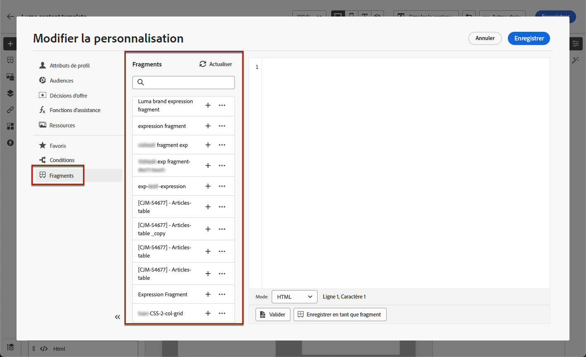
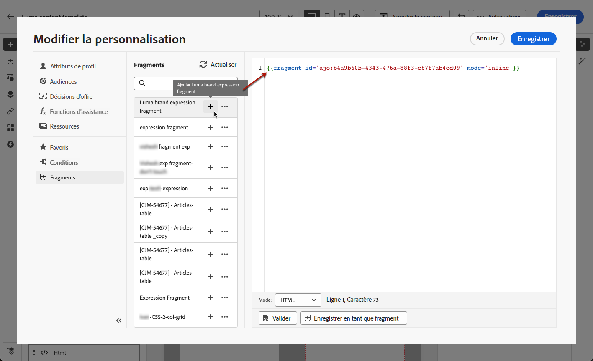
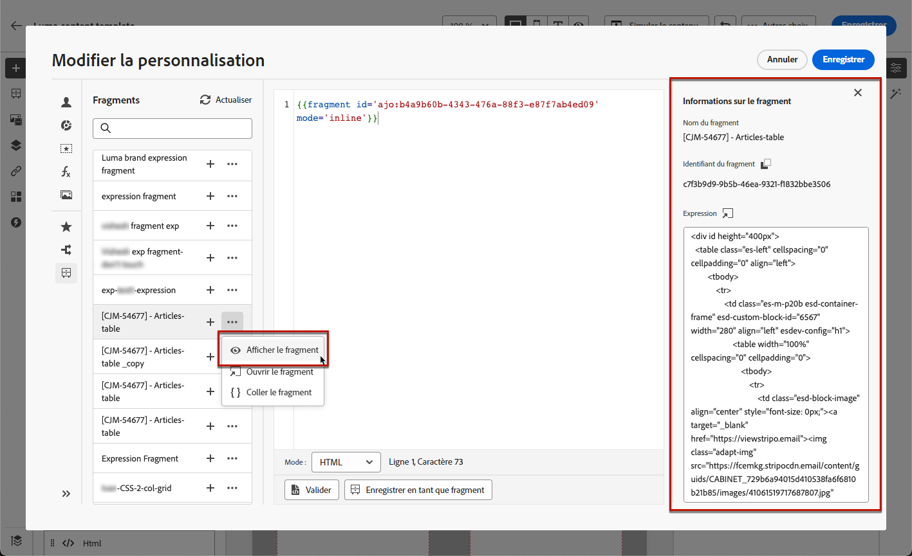
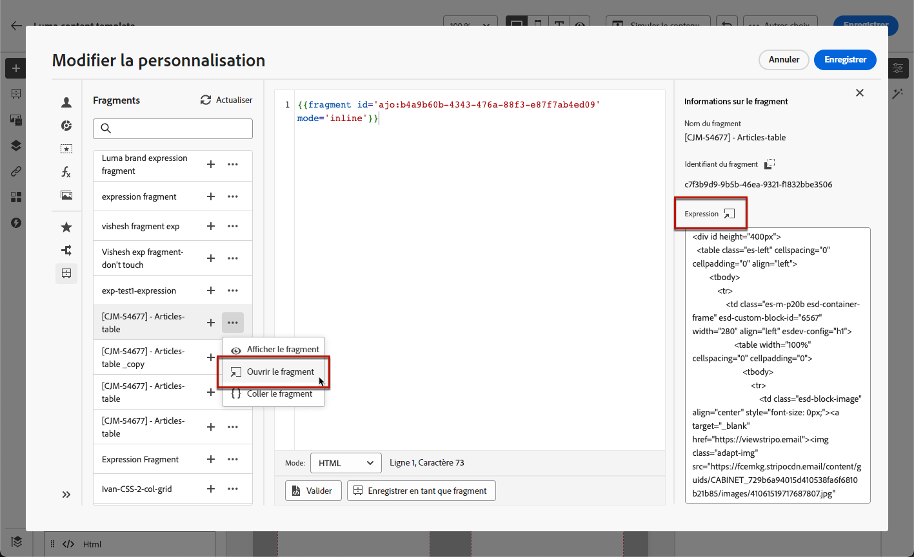
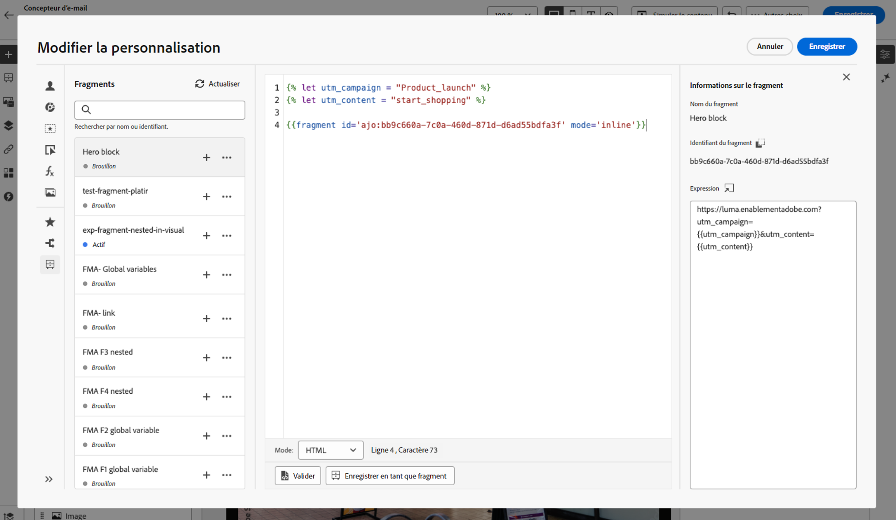
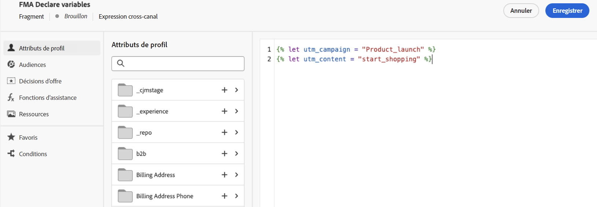
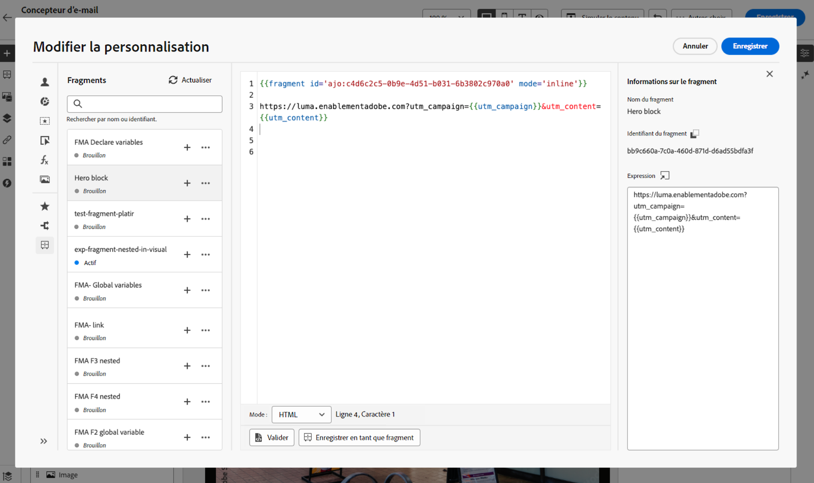
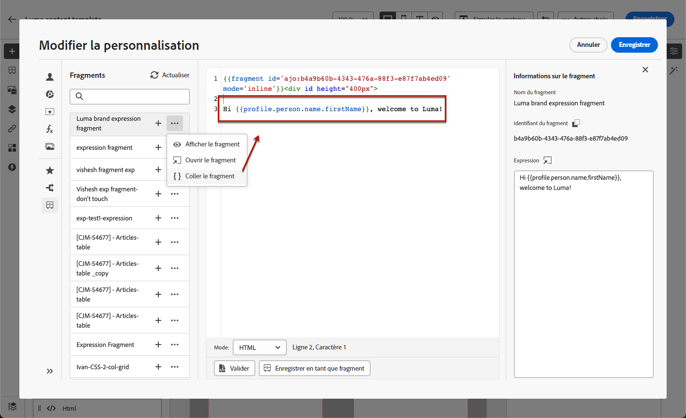

# Utiliser des fragments d’expression {#use-expression-fragments}

>[!BEGINSHADEBOX]

**Sur cette page :** découvrez comment insérer et réutiliser des fragments d’expression dans l’éditeur de personnalisation, utiliser des variables implicites, utiliser des fragments dans des boucles, personnaliser des champs modifiables et rompre l’héritage dans Adobe Journey Optimizer.

>[!ENDSHADEBOX]

Lorsque vous utilisez l’**éditeur de personnalisation**, vous pouvez utiliser tous les fragments d’expression qui ont été créés ou enregistrés dans le sandbox actuel.

Un fragment est un composant réutilisable pouvant être référencé dans des campagnes et des parcours [!DNL Journey Optimizer]. Cette fonctionnalité permet de construire à l’avance plusieurs blocs de contenu personnalisés qui peuvent être utilisés par les utilisateurs et les utilisatrices marketing pour assembler rapidement des contenus dans le cadre d’un processus de conception amélioré. [En savoir plus sur les fragments](../content-management/fragments.md)

➡️ [Découvrez comment gérer, créer et utiliser des fragments dans cette vidéo.](../content-management/fragments.md#video-fragments)

## Utiliser un fragment d’expression {#use-expression-fragment}

Pour ajouter des fragments d’expression à votre contenu, procédez comme suit :

>[!NOTE]
>
>Vous pouvez ajouter jusqu’à 30 fragments pour une diffusion donnée. Les fragments ne peuvent être imbriqués que jusqu’à un seul niveau.

1. Ouvrez l’[éditeur de personnalisation](personalization-build-expressions.md) et sélectionnez le bouton **[!UICONTROL Fragments]** dans le volet de gauche.

   La liste affiche tous les fragments d’expression qui ont été créés ou enregistrés en tant que fragments sur le sandbox actuel. [Découvrez comment créer des fragments](../content-management/create-fragments.md)
Ils sont triés par date de création : les fragments d’expression récemment ajoutés sont affichés en premier dans la liste.

   

   Vous pouvez également actualiser cette liste.

   >[!NOTE]
   >
   >Si certains fragments sont modifiés ou ajoutés pendant que vous modifiez votre contenu, la liste se met à jour en tenant compte des dernières modifications.

1. Cliquez sur l’icône + en regard d’un fragment d’expression pour insérer l’ID de fragment correspondant dans l’éditeur.

   

   >[!CAUTION]
   >
   >Vous pouvez ajouter n’importe quel fragment **Brouillon** ou **Actif** à votre contenu. Cependant, vous ne pouvez pas activer votre parcours ou votre campagne si un fragment ayant le statut **Brouillon** est utilisé dans ce parcours ou cette campagne. Lors de la publication du parcours ou de la campagne, les brouillons de fragment affichent une erreur et vous devez les approuver pour pouvoir les publier.

1. Une fois l’ID du fragment ajouté, si vous ouvrez le fragment d’expression correspondant et que vous [le modifiez](../content-management/manage-fragments.md#edit-fragments) depuis l’interface, les modifications sont synchronisées. Elles sont automatiquement propagées à tous les parcours/campagnes ayant le statut Brouillon ou Actif contenant cet ID de fragment.

1. Cliquez sur le bouton **[!UICONTROL Plus d’actions]** à côté d’un fragment. Dans le menu contextuel qui s’ouvre, sélectionnez **[!UICONTROL Afficher le fragment]** pour obtenir plus d’informations sur ce fragment. L’**[!UICONTROL ID du fragment]** s’affiche également et peut être copié à partir de cet emplacement.

   

1. Vous pouvez ouvrir le fragment d’expression dans une autre fenêtre pour modifier son contenu et ses propriétés, à l’aide de l’option **[!UICONTROL Ouvrir le fragment]** dans le menu contextuel ou à partir du volet **[!UICONTROL Informations sur le fragment]**. [En savoir plus sur la modification d’un fragment](../content-management/manage-fragments.md#edit-fragments)

   

1. Vous pouvez ensuite personnaliser et valider votre contenu comme vous le faites habituellement, à l’aide de toutes les fonctionnalités de personnalisation et de création de l’[éditeur de personnalisation](personalization-build-expressions.md).

1. Dans certains cas, il vous suffit de calculer des variables. Vous pouvez donc masquer le contenu du fragment d’expression. Pour ce faire, utilisez l’attribut `render` et définissez-le sur `false`. Par exemple :

   ```
   Hi {{profile.person.name.firstName|fragment id='ajo:fragmentId/variantId' mode ='inline' render=false}}
   ```

>[!NOTE]
>
>Si vous créez un fragment d’expression qui contient plusieurs sauts de ligne et l’utilisez dans un [SMS](../mobile/create-mobile-message.md#sms-content) ou une [notification push](../push/design-push.md), les sauts de ligne sont conservés. Veillez donc à tester votre message [SMS](../mobile/send-mobile-message.md) ou [push](../push/send-push.md) avant de l’envoyer.

## Utiliser des variables implicites {#implicit-variables}

Les variables implicites améliorent la fonctionnalité de fragment existante afin d’optimiser l’efficacité en matière de réutilisation du contenu et de cas d’utilisation de script. Les fragments peuvent utiliser des variables d’entrée et créer des variables de sortie qui peuvent être utilisées dans le contenu des campagnes et des parcours.

Cette fonctionnalité peut par exemple être utilisée pour initialiser les paramètres de suivi de vos e-mails, en fonction de la campagne ou du parcours en cours, et utiliser ces paramètres dans les liens personnalisés ajoutés au contenu de l’e-mail.

Les cas d’utilisation suivants sont possibles :

1. **Utiliser une variable d’entrée dans un fragment**

   Lorsqu’un fragment est utilisé dans un contenu d’action de campagne/parcours, il peut exploiter des variables qui ont été déclarées à l’extérieur du fragment. Voici un exemple :

   

   Nous pouvons voir ci-dessus que la variable `utm_content` est déclarée dans le contenu de la campagne. Lorsque le fragment **Bloc principal** est utilisé, il affiche un lien auquel la valeur du paramètre `utm_content` est ajoutée. Le résultat définitif est : `https://luma.enablementadobe.com?utm_campaign= Product_launch&utm_content= start_shopping`.

1. **Utiliser les variables de sortie d’un fragment**

   Les variables calculées ou définies dans un fragment peuvent être utilisées dans votre contenu. Dans l’exemple suivant, un fragment **F1** déclare un ensemble de variables :

   

   Dans un contenu d’e-mail, vous pouvez avoir la personnalisation suivante :

   

   Le fragment F1 initialise les variables suivantes : `utm_campaign` et `utm_content`. Ces paramètres seront ensuite ajoutés au lien dans le contenu du message. Le résultat définitif est le suivant est : `https://luma.enablementadobe.com?utm_campaign= Product_launch&utm_content= start_shopping`.

>[!NOTE]
>
>Au moment de l’exécution, le système développe ce qui se trouve à l’intérieur des fragments, puis interprète le code de personnalisation de haut en bas. Sachant cela, des cas d’utilisation plus complexes peuvent être réalisés. Par exemple, vous pouvez disposer d’un fragment F1 transmettant des variables à un autre fragment F2, situé dessous. Vous pouvez également disposer d’un fragment visuel F1 qui transmet des variables à un fragment d’expression imbriqué F2.

## Utiliser des fragments d’expression dans les boucles {#fragments-in-loops}

Lors de l’utilisation de fragments d’expression dans des boucles `{{#each}}`, il est important de comprendre comment fonctionne la portée des variables. Les fragments d’expression peuvent accéder aux variables globales définies dans le contenu de votre message, mais ils ne peuvent pas recevoir de variables spécifiques aux boucles en tant que paramètres.

### Modèle pris en charge : utilisation de variables globales {#global-variables-in-loops}

Les fragments d’expression peuvent référencer des variables globales définies en dehors du fragment, même s’il est appelé dans une boucle. Il s’agit de l’approche recommandée si vous devez utiliser des fragments dans des contextes itératifs.

**Exemple : utiliser un fragment avec des variables globales dans une boucle**

Dans le contenu de votre message, définissez une variable globale et utilisez un fragment qui y fait référence :

```handlebars


{{#each context.journey.actions.GetProducts.items as |product|}}
  <div class="product">
    <h3>{{product.name}}</h3>
    <p>Price: ${{product.price}}</p>
    {{fragment id='ajo:fragment123/variant456' mode='inline'}}
  </div>
{{/each}}
```

Dans le fragment d’expression (fragment123), vous pouvez référencer la variable `globalDiscount` :

```handlebars
<p class="discount-info">Save {{globalDiscount}}% on all items!</p>
```

Ce modèle fonctionne, car la variable globale est accessible dans tout le message, y compris dans les fragments, quel que soit le contexte de la boucle.

### Non pris en charge : transmission de variables de boucle en tant que paramètres de fragment {#loop-variables-limitations}

Vous ne pouvez pas transmettre l’élément d’itération actif (par exemple, `product` dans l’exemple ci-dessus) en tant que paramètre à un fragment d’expression. Le fragment ne peut pas accéder directement aux variables définies dans une boucle à partir du bloc de `{{#each}}` environnant.

**Exemple : ce qui NE fonctionne PAS**

```handlebars
{{#each context.journey.actions.GetProducts.items as |product|}}
  <!-- This will NOT work as expected -->
  {{fragment id='ajo:fragment123/variant456' mode='inline' currentProduct=product}}
{{/each}}
```

Le fragment ne peut pas recevoir `product` en tant que paramètre et l’utiliser en interne, car le transfert de paramètre pour les variables spécifiques à la boucle n’est pas pris en charge dans l’implémentation actuelle.

### Solutions recommandées {#fragments-in-loops-workarounds}

Lorsque vous devez utiliser des fragments d’expression avec des données provenant d’une boucle, envisagez d’utiliser les approches suivantes :

1. **Inclure la logique directement dans le message** : au lieu d’utiliser un fragment pour la logique spécifique à la boucle, ajoutez le code de personnalisation directement dans votre bloc `{{#each}}`.

   ```handlebars
   {{#each context.journey.actions.GetProducts.items as |product|}}
     <div class="product">
       <h3>{{product.name}}</h3>
       <p>Price: ${{product.price}}</p>
       {{#if product.price > 100}}
         <span class="premium-badge">Premium Product</span>
       {{/if}}
     </div>
   {{/each}}
   ```

2. **Utiliser des fragments en dehors des boucles** : si le contenu du fragment ne dépend pas de la boucle, appelez le fragment avant ou après le bloc d’itération.

   ```handlebars
   {{fragment id='ajo:fragment123/variant456' mode='inline'}}
   
   {{#each context.journey.actions.GetProducts.items as |product|}}
     <div class="product">
       <h3>{{product.name}}</h3>
       <p>Price: ${{product.price}}</p>
     </div>
   {{/each}}
   ```

3. **Définir plusieurs variables globales** : si vous devez transmettre différentes valeurs à un fragment à chaque itération, définissez des variables globales avant chaque appel au fragment (bien que cela limite la flexibilité).

>[!NOTE]
>
>Pour effectuer une itération sur des données contextuelles et utiliser des boucles, consultez le guide complet sur l’[itération sur les données contextuelles](iterate-contextual-data.md) qui inclut les bonnes pratiques, des conseils pour résoudre les problèmes et des modèles avancés.

## Personnaliser des champs modifiables {#customize-fields}

Si certaines parties d’un fragment d’expression ont été rendues modifiables à l’aide de variables, vous pouvez remplacer leurs valeurs par défaut à l’aide d’une syntaxe spécifique. [Découvrir comment rendre personnalisables vos fragments](../content-management/customizable-fragments.md)

Pour personnaliser les champs, procédez comme suit :

1. Insérez le fragment dans votre code à partir du menu **[!UICONTROL Fragments]**.

1. Utilisez le code `<fieldId>="<value>"` à la fin de la syntaxe pour remplacer la valeur par défaut de la variable.

   Dans l’exemple ci-dessous, nous remplaçons la valeur d’une variable dont l’ID est « sports » par la valeur « yoga ». Cela affichera « yoga » dans le contenu de votre fragment partout où la variable « sports » est référencée.

   

Un exemple montrant comment ajouter des champs modifiables dans des fragments d’expression et remplacer leurs valeurs lors de la création d’un e-mail est disponible dans [cette section](../content-management/customizable-fragments.md#example).

## Utiliser la résolution de fragment dynamique {#dynamic-resolution}

Au lieu d’incorporer de manière statique un ID de fragment au moment de la conception, vous pouvez résoudre l’ID de fragment de manière dynamique au moment de l’exécution par destinataire. Cela permet à différents profils de recevoir des blocs de contenu entièrement différents au sein d’une même campagne ou d’un même parcours, en fonction des attributs de profil, des recherches de jeux de données ou des données contextuelles.

[Découvrez comment utiliser les fragments dynamiques](../content-management/dynamic-fragments.md)

## Rompre l’héritage {#break-inheritance}

Lorsque vous ajoutez un identifiant de fragment à l’éditeur de personnalisation, les modifications apportées au fragment d’expression d’origine sont synchronisées.

Cependant, vous pouvez également coller le contenu d’un fragment d’expression dans l’éditeur. Dans le menu contextuel, sélectionnez **[!UICONTROL Coller le fragment]** pour insérer ce contenu.



Dans ce cas, l’héritage du fragment d’origine est rompu. Le contenu du fragment est copié dans l’éditeur et les modifications ne sont plus synchronisées.

Il devient un élément autonome qui n’est plus lié au fragment d’origine. Vous pouvez le modifier comme tout autre élément de votre code.

## Référence rapide {#quick-reference}

Cette section contient des connaissances structurées destinées à soutenir l’interprétation, la récupération et la réponse aux questions liées à ce sujet.

Pour une compréhension totale, ces informations doivent être combinées avec la documentation de cette page. Aucune des sources n’est conçue pour être autonome. La page décrit la fonctionnalité, tandis que cette section fournit un contexte supplémentaire qui permet de clarifier la terminologie, l’intention, l’applicabilité et les contraintes.

>[!BEGINTABS]

>[!TAB Vue d’ensemble]

**TL;DR**

Cette page explique comment insérer, personnaliser et gérer des fragments d’expression dans l’éditeur de personnalisation, y compris des variables implicites, l’utilisation de fragments dans des boucles, des champs modifiables, une résolution dynamique et la rupture de l’héritage.

**Intentions**

* Insérer un fragment d’expression à partir du menu Fragments et comprendre la propagation automatique des modifications
* Utiliser des variables implicites : variables d’entrée (déclarées en dehors du fragment, utilisées à l’intérieur) et variables de sortie (déclarées à l’intérieur du fragment, utilisées dans le contenu du message environnant)
* Utiliser les fragments d&#39;expression dans les boucles : tirer parti des variables globales pour l&#39;accès aux fragments ; comprendre les limites de la transmission de variables de boucle en tant que paramètres.
* Remplacer les champs modifiables dans un fragment personnalisable à l’aide de la syntaxe `<fieldId>="<value>"`
* Résoudre dynamiquement les identifiants de fragment au moment de l’exécution en fonction des attributs de profil, des recherches de jeux de données ou des données contextuelles
* Rompre l’héritage en collant le contenu du fragment directement dans l’éditeur

>[!TAB Glossaire]

* **Fragment d’expression** : composant d’expression de personnalisation réutilisable référencé par un identifiant dans les campagnes et les parcours. Les modifications apportées au fragment se propagent automatiquement à tout le contenu qui y fait référence. *(spécifique au produit)*
* **Variables implicites** : variables qui étendent la fonctionnalité du fragment ; variables d’entrée (déclarées dans le contenu de la campagne/du parcours, consommées dans le fragment) et variables de sortie (déclarées dans le fragment, disponibles dans le contenu du message environnant). *(spécifique au produit)*
* **Variable d’entrée** : variable déclarée en dehors du fragment (dans le contenu de campagne ou de parcours) que le fragment peut référencer et utiliser en interne.
* **Variable de sortie** : variable déclarée ou calculée à l’intérieur d’un fragment qui devient disponible pour être utilisée dans le contenu du message environnant après l’appel du fragment.
* **Champs modifiables** : les variables de fragment exposées pour permettre à l’utilisateur qui insère de remplacer les valeurs par défaut à l’aide de la syntaxe `<fieldId>="<value>"`, sans modifier la source du fragment. *(spécifique au produit)*
* **Résolution de fragment dynamique** : possibilité de résoudre un identifiant de fragment au moment de l’exécution (en fonction des attributs de profil, des recherches de jeux de données ou des données contextuelles) plutôt que d’incorporer un identifiant de fragment statique au moment de la conception. *(spécifique au produit)*
* **Rompre l’héritage** : en utilisant l’option « Coller le fragment » du menu contextuel, le contenu du fragment est copié dans l’éditeur en tant qu’élément autonome qui ne se synchronise plus avec le fragment d’origine. *(spécifique au produit)*

>[!TAB  Terminologie ]

* **Nom canonique : fragment d’expression** — variantes : fragment, fragment d’expression
* **Synonymes :** « identifiant du fragment » = identifiant utilisé pour référencer le fragment dans les expressions
* **Ne pas confondre :** insérer un fragment par ID (référencé ; les modifications se propagent automatiquement à tout le contenu) ≠ rompre l’héritage/coller le fragment (contenu copié dans l’éditeur ; élément autonome, plus lié à l’original)
* **Ne pas confondre :** variables d’entrée (déclarées en dehors du fragment, consommées à l’intérieur) ≠ variables de sortie (déclarées à l’intérieur du fragment, consommées à l’extérieur dans le contenu du message environnant)
* **Ne pas confondre :** le brouillon de fragment (peut être ajouté au contenu, mais bloque la publication du parcours/de la campagne jusqu’à ce qu’il soit approuvé) ≠ le fragment actif (entièrement publié ; sûr pour les parcours et les campagnes actifs).

>[!TAB Mécanismes de sécurisation et limitations]

* Il est possible d’ajouter un maximum de 30 fragments dans une diffusion donnée.
* Les fragments ne peuvent être imbriqués que jusqu’à un seul niveau.
* Un parcours ou une campagne ne peut pas être activé ou publié s’il contient un fragment avec le statut Brouillon . Les brouillons de fragments doivent être approuvés avant d’être publiés.
* Les fragments d’expression ne peuvent pas recevoir de variables de boucle (l’élément d’itération `{{#each}}` actuel) en tant que paramètres. Il s’agit d’une limitation connue. Utilisez des variables globales ou une logique intégrée comme solution.
* Si un fragment contenant plusieurs sauts de ligne est utilisé dans du contenu de SMS ou de notification push, les sauts de ligne sont conservés ; testez le contenu avant l’envoi.

>[!TAB FAQ]

**Q : Combien de fragments peut-on ajouter dans une seule diffusion ?**

Jusqu’à 30 fragments.

**Q : Les fragments peuvent-ils être imbriqués dans d’autres fragments ?**

Oui, mais uniquement jusqu’à 1 niveau d’imbrication.

**Q : Que se passe-t-il si j’utilise un fragment de brouillon dans un parcours ou une campagne ?**

Vous pouvez ajouter un Brouillon de fragment au contenu, mais vous ne pouvez pas activer ni publier le parcours ou la campagne tant que le fragment n’a pas été approuvé et que son statut n’est pas passé à Actif.

**Q : Un fragment d’expression peut-il recevoir l’élément de boucle actuel (par exemple, `product` dans `{{#each}}`) en tant que paramètre ?**

Non. Les fragments d’expression ne peuvent pas recevoir de variables de boucle en tant que paramètres. Utilisez des variables globales déclarées en dehors de la boucle (auxquelles le fragment peut accéder) ou incluez la logique de personnalisation directement dans la boucle au lieu d’utiliser un fragment.

**Q : Qu’est-ce que la rupture de l’héritage et quand dois-je l’utiliser ?**

La rupture de l’héritage signifie que vous utilisez « Coller le fragment » à partir du menu contextuel pour copier directement le contenu du fragment dans l’éditeur. Le contenu collé devient un élément autonome qui ne se synchronise plus avec le fragment d’origine. Utilisez-le lorsque vous devez personnaliser le contenu au-delà de ce que les champs modifiables permettent, sachant que les modifications futures du fragment d’origine ne se propageront pas à cette copie.

>[!ENDTABS]

<!-- ai-section-version: 1 | source-hash: 64745ff0 -->

