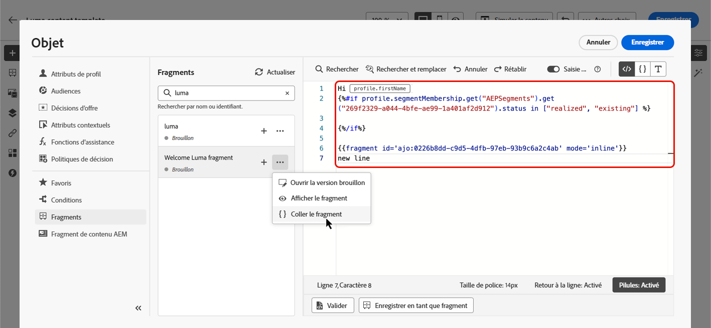

# Utiliser des fragments d’expression {#use-expression-fragments}

Lorsque vous utilisez l’**éditeur de personnalisation**, vous pouvez utiliser tous les fragments d’expression qui ont été créés ou enregistrés dans le sandbox actuel.

Un fragment est un composant réutilisable qui peut être référencé dans [!DNL Journey Optimizer] campagnes et parcours. Cette fonctionnalité permet de précréer plusieurs blocs de contenu personnalisés qui peuvent être utilisés par les utilisateurs marketing pour assembler rapidement le contenu dans un processus de conception amélioré. [Découvrez comment créer et gérer des fragments](../content-management/fragments.md).

➡️ [Découvrez comment gérer, créer et utiliser des fragments dans cette vidéo.](../content-management/fragments.md#video-fragments)

## Utiliser un fragment d’expression {#use-expression-fragment}

Pour ajouter des fragments d’expression à votre contenu, procédez comme suit :

>[!NOTE]
>
>Vous pouvez ajouter jusqu’à 30 fragments dans une diffusion donnée. Les fragments ne peuvent être imbriqués qu’à un niveau maximum.

1. Ouvrez l’[éditeur de personnalisation](personalization-build-expressions.md) et sélectionnez le bouton **[!UICONTROL Fragments]** dans le volet de gauche.

   La liste affiche tous les fragments d’expression qui ont été créés ou enregistrés en tant que fragments sur le sandbox actuel. Ils sont triés par date de création : les fragments d’expression récemment ajoutés sont affichés en premier dans la liste. [En savoir plus](../content-management/fragments.md#create-expression-fragment)

   

   Vous pouvez également actualiser cette liste.

   >[!NOTE]
   >
   >Si certains fragments ont été modifiés ou ajoutés pendant que vous modifiez votre contenu, la liste est mise à jour avec les dernières modifications.

1. Cliquez sur l’icône + en regard d’un fragment d’expression pour insérer l’ID de fragment correspondant dans l’éditeur.

   

   >[!CAUTION]
   >
   >Vous pouvez ajouter n’importe quel **Version préliminaire** ou **En direct** fragment dans votre contenu. Cependant, vous ne pourrez pas activer votre parcours ou campagne si un fragment avec le statut En création y est utilisé. Lors de la publication parcours ou de la campagne, les fragments de brouillon affichent une erreur et vous devez les approuver pour pouvoir publier.
   >
   > Notez que les statuts des fragments sont déployés progressivement au cours des jours qui suivent la publication de Journey Optimizer en juin. Bien que certains utilisateurs disposent d’un accès immédiat, d’autres peuvent rencontrer un délai avant qu’il ne soit disponible dans leur environnement. Si cette amélioration n’est pas encore disponible dans votre environnement, veuillez noter que le fragment ne doit pas obligatoirement être **En direct** à utiliser dans vos parcours et campagnes.

1. Une fois l’ID du fragment ajouté, si vous ouvrez le fragment d’expression correspondant et que vous [le modifiez](../content-management/fragments.md#edit-fragments) depuis l’interface, les modifications sont synchronisées. Ils sont automatiquement propagés à tous les parcours/campagnes actifs ou de brouillon contenant cet identifiant de fragment.

1. Cliquez sur le bouton **[!UICONTROL Autres actions]** en regard d’un fragment. Dans le menu contextuel qui s’ouvre, sélectionnez **[!UICONTROL Afficher le fragment]** pour obtenir plus d’informations sur ce fragment. L’**[!UICONTROL ID du fragment]** s’affiche également et peut être copié à partir de cet emplacement.

   

1. Vous pouvez ouvrir le fragment d’expression dans une autre fenêtre pour modifier son contenu et ses propriétés, à l’aide de l’option **[!UICONTROL Ouvrir le fragment]** dans le menu contextuel ou à partir du volet **[!UICONTROL Informations sur le fragment]**. [En savoir plus sur la modification d’un fragment](../content-management/fragments.md#edit-fragments)

   

1. Vous pouvez ensuite personnaliser et valider votre contenu comme vous le faites habituellement, à l’aide de toutes les fonctionnalités de personnalisation et de création de l’[éditeur de personnalisation](personalization-build-expressions.md).

>[!NOTE]
>
>Si vous créez un fragment d’expression qui contient plusieurs sauts de ligne et l’utilisez dans un contenu [SMS](../sms/create-sms.md#sms-content) ou [notification push](../push/design-push.md), les sauts de ligne sont conservés. Veillez donc à tester votre [SMS](../sms/send-sms.md) ou [notification push](../push/send-push.md) avant de l’envoyer.

## Rompre l’héritage {#break-inheritance}

Lorsque vous ajoutez un identifiant de fragment à l’éditeur de personnalisation, les modifications apportées au fragment d’expression d’origine sont synchronisées.

Cependant, vous pouvez également coller le contenu d’un fragment d’expression dans l’éditeur. Dans le menu contextuel, sélectionnez **[!UICONTROL Coller le fragment]** pour insérer ce contenu.

Dans ce cas, l’héritage du fragment d’origine est rompu. Le contenu du fragment est copié dans l’éditeur et les modifications ne sont plus synchronisées.

Il devient un élément autonome qui n’est plus lié au fragment d’origine. Vous pouvez le modifier comme tout autre élément de votre code.

