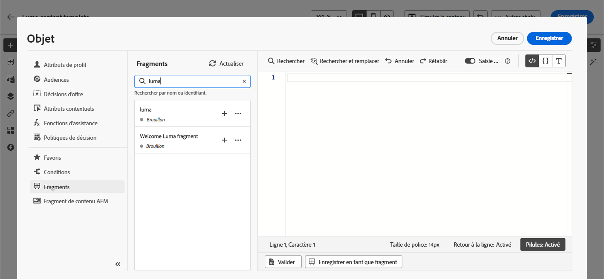
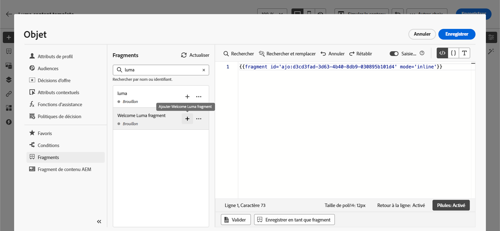
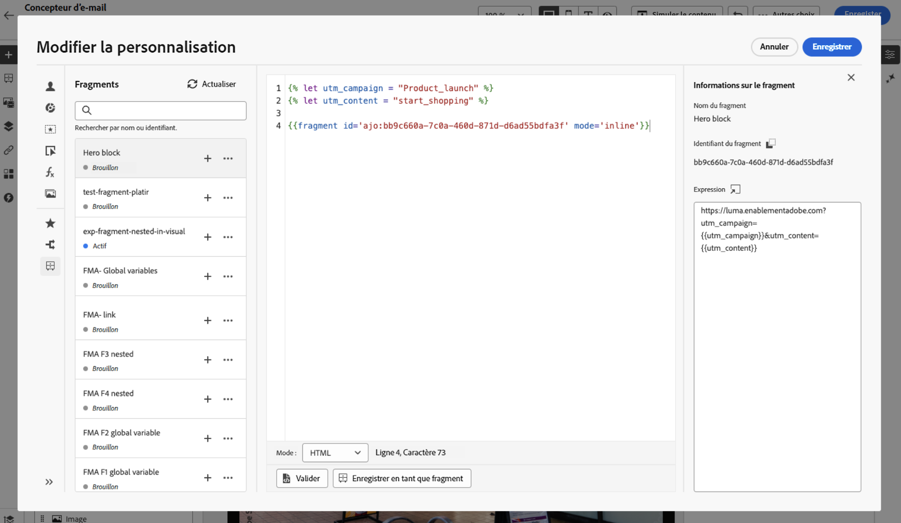

# Utiliser des fragments d’expression {#use-expression-fragments}

Lorsque vous utilisez l’**éditeur de personnalisation**, vous pouvez utiliser tous les fragments d’expression qui ont été créés ou enregistrés dans le sandbox actuel.

Un fragment est un composant réutilisable pouvant être référencé dans des campagnes et des parcours [!DNL Journey Optimizer]. Cette fonctionnalité permet de construire à l’avance plusieurs blocs de contenu personnalisés qui peuvent être utilisés par les utilisateurs et les utilisatrices marketing pour assembler rapidement des contenus dans le cadre d’un processus de conception amélioré. [En savoir plus sur les fragments](../content-management/fragments.md)

➡️ [Découvrez comment gérer, créer et utiliser des fragments dans cette vidéo.](../content-management/fragments.md#video-fragments)

## Utiliser un fragment d’expression {#use-expression-fragment}

Pour ajouter des fragments d’expression à votre contenu, procédez comme suit :

>[!NOTE]
>
>Vous pouvez ajouter jusqu’à 30 fragments pour une diffusion donnée. Les fragments ne peuvent être imbriqués que jusqu’à un seul niveau.

1. Ouvrez l’[éditeur de personnalisation](personalization-build-expressions.md) et sélectionnez le bouton **[!UICONTROL Fragments]** dans le volet de gauche.

   La liste affiche tous les fragments d’expression qui ont été créés ou enregistrés en tant que fragments sur le sandbox actuel. [Découvrez comment créer des fragments](../content-management/create-fragments.md)
lls sont triés par date de création : les fragments d’expression récemment ajoutés s’affichent en premier dans la liste.

   

   Vous pouvez également actualiser cette liste.

   >[!NOTE]
   >
   >Si certains fragments sont modifiés ou ajoutés pendant que vous modifiez votre contenu, la liste se met à jour en tenant compte des dernières modifications.

1. Cliquez sur l’icône + en regard d’un fragment d’expression pour insérer l’ID de fragment correspondant dans l’éditeur.

   

   >[!CAUTION]
   >
   >Vous pouvez ajouter n’importe quel fragment **Brouillon** ou **Actif** à votre contenu. Cependant, vous ne pouvez pas activer votre parcours ou votre campagne si un fragment ayant le statut **Brouillon** est utilisé dans ce parcours ou cette campagne. Lors de la publication du parcours ou de la campagne, les brouillons de fragment affichent une erreur et vous devez les approuver pour pouvoir les publier.

1. Une fois l’ID du fragment ajouté, si vous ouvrez le fragment d’expression correspondant et que vous [le modifiez](../content-management/manage-fragments.md#edit-fragments) depuis l’interface, les modifications sont synchronisées. Elles sont automatiquement propagées à tous les parcours/campagnes ayant le statut Brouillon ou Actif contenant cet ID de fragment.

1. Cliquez sur le bouton **[!UICONTROL Plus d’actions]** à côté d’un fragment. Dans le menu contextuel qui s’ouvre, sélectionnez **[!UICONTROL Afficher le fragment]** pour obtenir plus d’informations sur ce fragment. L’**[!UICONTROL ID du fragment]** s’affiche également et peut être copié à partir de cet emplacement.

   

1. Vous pouvez ouvrir le fragment d’expression dans une autre fenêtre pour modifier son contenu et ses propriétés, à l’aide de l’option **[!UICONTROL Ouvrir le fragment]** dans le menu contextuel ou à partir du volet **[!UICONTROL Informations sur le fragment]**. [En savoir plus sur la modification d’un fragment](../content-management/manage-fragments.md#edit-fragments)

   

1. Vous pouvez ensuite personnaliser et valider votre contenu comme vous le faites habituellement, à l’aide de toutes les fonctionnalités de personnalisation et de création de l’[éditeur de personnalisation](personalization-build-expressions.md).

1. Dans certains cas, il vous suffit de calculer des variables. Vous pouvez donc masquer le contenu du fragment d’expression. Pour ce faire, utilisez l’attribut `render` et définissez-le sur `false`. Par exemple :

   ```
   Hi {{profile.person.name.firstName|fragment id='ajo:fragmentId/variantId' mode ='inline' render=false}}
   ```

>[!NOTE]
>
>Si vous créez un fragment d’expression qui contient plusieurs sauts de ligne et l’utilisez dans un [SMS](../sms/create-sms.md#sms-content) ou une [notification push](../push/design-push.md), les sauts de ligne sont conservés. Veillez donc à tester votre message [SMS](../sms/send-sms.md) ou [push](../push/send-push.md) avant de l’envoyer.

## Utiliser des variables implicites {#implicit-variables}

Les variables implicites améliorent la fonctionnalité de fragment existante afin d’optimiser l’efficacité en matière de réutilisation du contenu et de cas d’utilisation de script. Les fragments peuvent utiliser des variables d’entrée et créer des variables de sortie qui peuvent être utilisées dans le contenu des campagnes et des parcours.

Cette fonctionnalité peut par exemple être utilisée pour initialiser les paramètres de suivi de vos e-mails, en fonction de la campagne ou du parcours en cours, et utiliser ces paramètres dans les liens personnalisés ajoutés au contenu de l’e-mail.

Les cas d’utilisation suivants sont possibles :

1. **Utiliser une variable d’entrée dans un fragment**

   Lorsqu’un fragment est utilisé dans un contenu d’action de campagne/parcours, il peut exploiter des variables qui ont été déclarées à l’extérieur du fragment. Voici un exemple :

   

   Nous pouvons voir ci-dessus que la variable `utm_content` est déclarée dans le contenu de la campagne. Lorsque le fragment **Bloc principal** est utilisé, il affiche un lien auquel la valeur du paramètre `utm_content` est ajoutée. Le résultat définitif est : `https://luma.enablementadobe.com?utm_campaign= Product_launch&utm_content= start_shopping`.

1. **Utiliser les variables de sortie d’un fragment**

   Les variables calculées ou définies dans un fragment peuvent être utilisées dans votre contenu. Dans l’exemple suivant, un fragment **F1** déclare un ensemble de variables :

   

   Dans un contenu d’e-mail, vous pouvez avoir la personnalisation suivante :

   

   Le fragment F1 initialise les variables suivantes : `utm_campaign` et `utm_content`. Ces paramètres seront ensuite ajoutés au lien dans le contenu du message. Le résultat définitif est le suivant est : `https://luma.enablementadobe.com?utm_campaign= Product_launch&utm_content= start_shopping`.

>[!NOTE]
>
>Au moment de l’exécution, le système développe ce qui se trouve à l’intérieur des fragments, puis interprète le code de personnalisation de haut en bas. Sachant cela, des cas d’utilisation plus complexes peuvent être réalisés. Par exemple, vous pouvez disposer d’un fragment F1 transmettant des variables à un autre fragment F2, situé dessous. Vous pouvez également disposer d’un fragment visuel F1 qui transmet des variables à un fragment d’expression imbriqué F2.


## Personnaliser des champs modifiables {#customize-fields}

Si certaines parties d’un fragment d’expression ont été rendues modifiables à l’aide de variables, vous pouvez remplacer leurs valeurs par défaut à l’aide d’une syntaxe spécifique. [Découvrir comment rendre personnalisables vos fragments](../content-management/customizable-fragments.md)

Pour personnaliser les champs, procédez comme suit :

1. Insérez le fragment dans votre code à partir du menu **[!UICONTROL Fragments]**.

1. Utilisez le code `<fieldId>="<value>"` à la fin de la syntaxe pour remplacer la valeur par défaut de la variable.

   Dans l’exemple ci-dessous, nous remplaçons la valeur d’une variable dont l’ID est « sports » par la valeur « yoga ». Cela affichera « yoga » dans le contenu de votre fragment partout où la variable « sports » est référencée.

   

Un exemple montrant comment ajouter des champs modifiables dans des fragments d’expression et remplacer leurs valeurs lors de la création d’un e-mail est disponible dans [cette section](../content-management/customizable-fragments.md#example).

## Rompre l’héritage {#break-inheritance}

Lorsque vous ajoutez un identifiant de fragment à l’éditeur de personnalisation, les modifications apportées au fragment d’expression d’origine sont synchronisées.

Cependant, vous pouvez également coller le contenu d’un fragment d’expression dans l’éditeur. Dans le menu contextuel, sélectionnez **[!UICONTROL Coller le fragment]** pour insérer ce contenu.


Dans ce cas, l’héritage du fragment d’origine est rompu. Le contenu du fragment est copié dans l’éditeur et les modifications ne sont plus synchronisées.

Il devient un élément autonome qui n’est plus lié au fragment d’origine. Vous pouvez le modifier comme tout autre élément de votre code.

