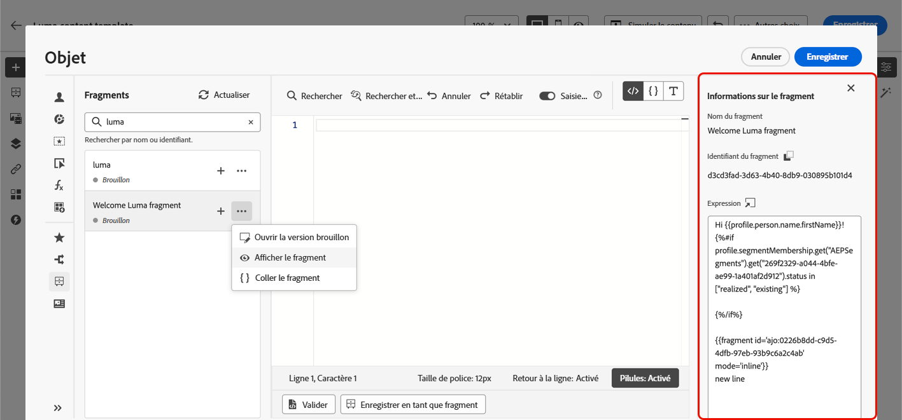
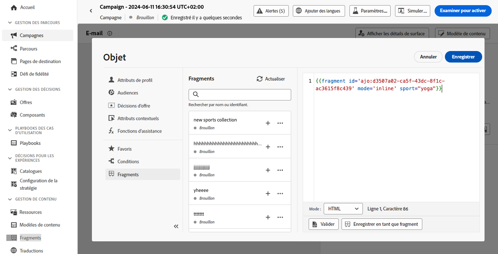

# Utiliser des fragments d’expression {#use-expression-fragments}

Lorsque vous utilisez l’**éditeur de personnalisation**, vous pouvez utiliser tous les fragments d’expression qui ont été créés ou enregistrés dans le sandbox actuel.

Un fragment est un composant réutilisable pouvant être référencé dans des campagnes et des parcours [!DNL Journey Optimizer]. Cette fonctionnalité permet de construire à l’avance plusieurs blocs de contenu personnalisés qui peuvent être utilisés par les utilisateurs et les utilisatrices marketing pour assembler rapidement des contenus dans le cadre d’un processus de conception amélioré. [Découvrez comment créer et gérer des fragments](../content-management/fragments.md).

➡️ [Découvrez comment gérer, créer et utiliser des fragments dans cette vidéo.](../content-management/fragments.md#video-fragments)

## Utiliser un fragment d’expression {#use-expression-fragment}

Pour ajouter des fragments d’expression à votre contenu, procédez comme suit :

>[!NOTE]
>
>Vous pouvez ajouter jusqu’à 30 fragments pour une diffusion donnée. Les fragments ne peuvent être imbriqués que jusqu’à un seul niveau.

1. Ouvrez l’[éditeur de personnalisation](personalization-build-expressions.md) et sélectionnez le bouton **[!UICONTROL Fragments]** dans le volet de gauche.

   La liste affiche tous les fragments d’expression qui ont été créés ou enregistrés en tant que fragments sur le sandbox actuel. Ils sont triés par date de création : les fragments d’expression récemment ajoutés s’affichent en premier dans la liste. [En savoir plus](../content-management/fragments.md#create-expression-fragment)

   

   Vous pouvez également actualiser cette liste.

   >[!NOTE]
   >
   >Si certains fragments sont modifiés ou ajoutés pendant que vous modifiez votre contenu, la liste se met à jour en tenant compte des dernières modifications.

1. Cliquez sur l’icône + en regard d’un fragment d’expression pour insérer l’ID de fragment correspondant dans l’éditeur.

   

   >[!CAUTION]
   >
   >Vous pouvez ajouter n’importe quel fragment **Brouillon** ou **Actif** à votre contenu. Cependant, vous ne pouvez pas activer votre parcours ou votre campagne si un fragment ayant le statut de brouillon est utilisé dans ce parcours ou cette campagne. Lors de la publication du parcours ou de la campagne, les fragments de brouillon affichent une erreur et vous devez les approuver pour pouvoir les publier.

1. Une fois l’ID du fragment ajouté, si vous ouvrez le fragment d’expression correspondant et que vous [le modifiez](../content-management/fragments.md#edit-fragments) depuis l’interface, les modifications sont synchronisées. Elles sont automatiquement propagées à tous les parcours/campagnes ayant le statut Brouillon ou Actif contenant cet ID de fragment.

1. Cliquez sur le bouton **[!UICONTROL Plus d’actions]** à côté d’un fragment. Dans le menu contextuel qui s’ouvre, sélectionnez **[!UICONTROL Afficher le fragment]** pour obtenir plus d’informations sur ce fragment. L’**[!UICONTROL ID du fragment]** s’affiche également et peut être copié à partir de cet emplacement.

   

1. Vous pouvez ouvrir le fragment d’expression dans une autre fenêtre pour modifier son contenu et ses propriétés, à l’aide de l’option **[!UICONTROL Ouvrir le fragment]** dans le menu contextuel ou à partir du volet **[!UICONTROL Informations sur le fragment]**. [En savoir plus sur la modification d’un fragment](../content-management/fragments.md#edit-fragments)

   

1. Vous pouvez ensuite personnaliser et valider votre contenu comme vous le faites habituellement, à l’aide de toutes les fonctionnalités de personnalisation et de création de l’[éditeur de personnalisation](personalization-build-expressions.md).

>[!NOTE]
>
>Si vous créez un fragment d’expression qui contient plusieurs sauts de ligne et l’utilisez dans un contenu [SMS](../sms/create-sms.md#sms-content) ou [notification push](../push/design-push.md), les sauts de ligne sont conservés. Veillez donc à tester votre [SMS](../sms/send-sms.md) ou [notification push](../push/send-push.md) avant de l’envoyer.

## Personnaliser des champs modifiables {#customize-fields}

Si certaines parties d’un fragment d’expression ont été rendues modifiables à l’aide de variables, vous pouvez remplacer leurs valeurs par défaut à l’aide d’une syntaxe spécifique. [Découvrir comment rendre personnalisables vos fragments](../content-management/customizable-fragments.md)

Pour personnaliser les champs, procédez comme suit :

1. Insérez le fragment dans votre code à partir du menu **Fragments**.

1. Utilisez le code `<fieldId>="<value>"` à la fin de la syntaxe pour remplacer la valeur par défaut de la variable.

   Dans l’exemple ci-dessous, nous remplaçons la valeur d’une variable dont l’ID est « sports » par la valeur « yoga ». Cela affichera « yoga » dans le contenu de votre fragment partout où la variable « sports » est référencée.

   

Un exemple montrant comment ajouter des champs modifiables dans des fragments d’expression et remplacer leurs valeurs lors de la création d’un e-mail est disponible dans [cette section](../content-management/customizable-fragments.md#example).

## Rompre l’héritage {#break-inheritance}

Lorsque vous ajoutez un identifiant de fragment à l’éditeur de personnalisation, les modifications apportées au fragment d’expression d’origine sont synchronisées.

Cependant, vous pouvez également coller le contenu d’un fragment d’expression dans l’éditeur. Dans le menu contextuel, sélectionnez **[!UICONTROL Coller le fragment]** pour insérer ce contenu.

Dans ce cas, l’héritage du fragment d’origine est rompu. Le contenu du fragment est copié dans l’éditeur et les modifications ne sont plus synchronisées.

Il devient un élément autonome qui n’est plus lié au fragment d’origine. Vous pouvez le modifier comme tout autre élément de votre code.

