# Prévisualisation et test de vos messages{#preview-and-proof}

Une fois le contenu de votre message défini, vous pouvez utiliser des profils de test pour le prévisualisation et le tester. Si vous avez inséré [du contenu personnalisé](personalization/personalize.md), vous pourrez vérifier comment ce contenu s’affiche dans le message en exploitant les données du profil de test.

Pour détecter d’éventuelles erreurs dans le contenu des courriels ou les paramètres de personnalisation, envoyez des BAT pour tester les profils. Un BAT doit être envoyé chaque fois qu’une modification est apportée afin de valider le contenu le plus récent.

>[!CAUTION]
>
>Vous devez disposer de profils de test pour pouvoir prévisualisation vos messages et envoyer des BAT. [En savoir plus](building-journeys/testing-the-journey.md#create-test-profile).

Pour tester le contenu de votre message, vous devez :

* [sélectionner des profils de test](#select-test-profiles)
* [vérifier la prévisualisation du message](#preview-your-messages)

Vous pourrez ensuite [envoyer des BAT](#send-proofs) à vos profils de test.

De plus, exploitez votre compte **Litmus** dans [!DNL Journey Optimizer] pour prévisualisation instantanément votre **rendu de courrier électronique** dans les clients de messagerie les plus courants. Vous pouvez ensuite vous assurer que le contenu de votre courrier électronique s’affiche correctement et fonctionne correctement dans chaque boîte de réception. Découvrez comment déverrouiller les Prévisualisations de courriel Litmus dans [cette section](#email-rendering)

## Sélectionner des profils de test{#select-test-profiles}

Les profils de test vous permettent de cible d’autres destinataires qui ne répondent pas aux critères de ciblage définis.

Pour sélectionner des profils de test, procédez comme suit :

1. Dans l’interface de messagerie ou dans le concepteur de courrier électronique, cliquez sur le bouton **[!UICONTROL Prévisualisation]** pour accéder à la sélection du profil de test.

   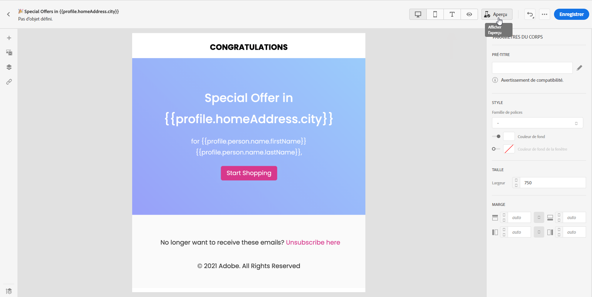

1. Sélectionnez l&#39;espace de nommage à utiliser pour identifier les profils de test en cliquant sur l&#39;icône de sélection **[!UICONTROL espace de nommage d&#39;identité]**.

   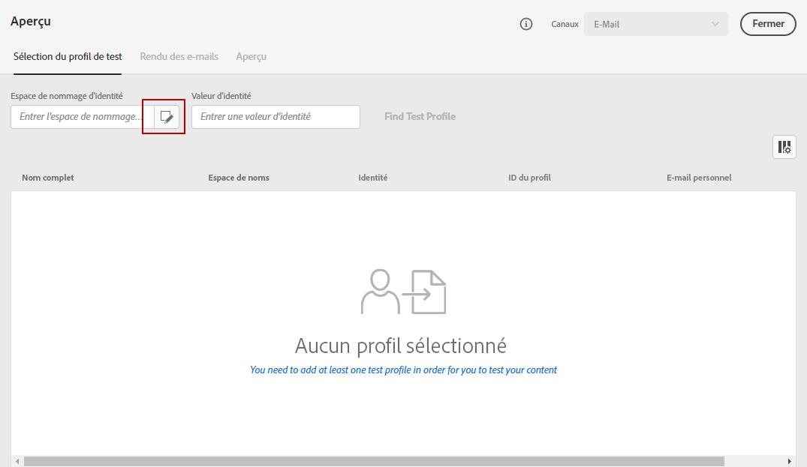

   Pour en savoir plus sur les espaces de nommage d&#39;identité de Adobe Experience Platform [dans cette section](https://experienceleague.adobe.com/docs/experience-platform/identity/namespaces.html?lang=en#getting-started).

   Dans l’exemple ci-dessous, nous utiliserons l’espace de nommage **Courriel**.

1. Utilisez le champ de recherche pour trouver l’espace de nommage, sélectionnez-le et cliquez sur **[!UICONTROL Sélectionner]**.

   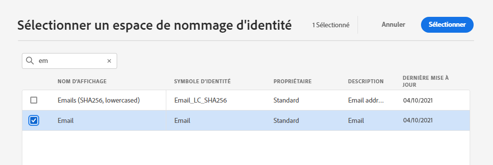

1. Saisissez la valeur permettant d’identifier le profil de test et cliquez sur **[!UICONTROL Rechercher le profil de test]**.

   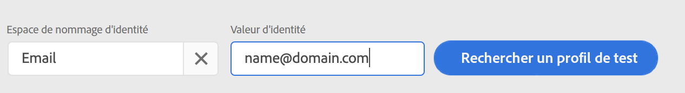

1. Si vous avez ajouté la personnalisation à votre message, ajoutez d’autres profils afin que vous puissiez tester différentes variantes du message en fonction des données du profil. Une fois ajoutés, les profils sont répertoriés sous les champs de sélection.

   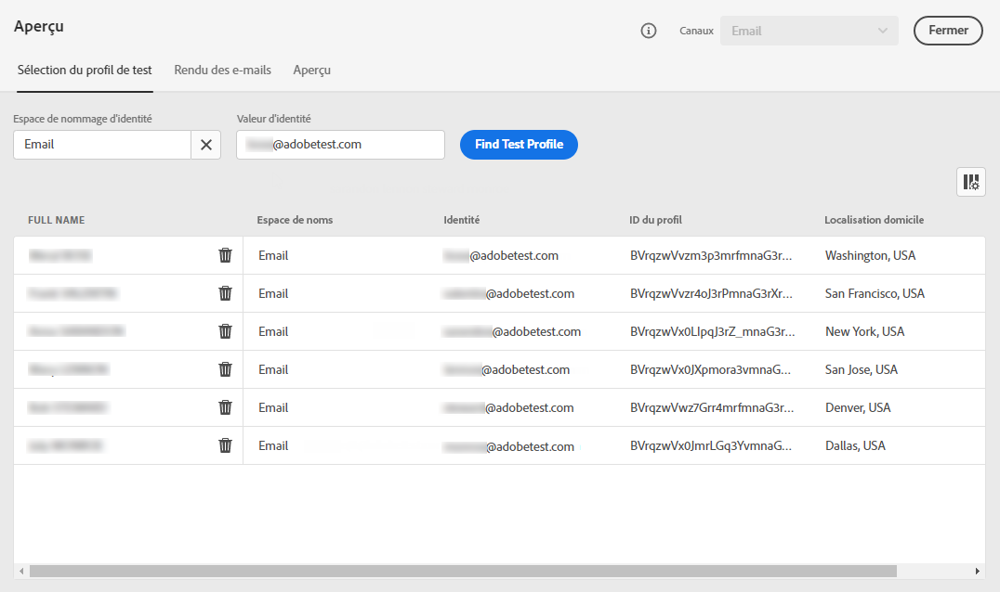

   En fonction des éléments de personnalisation du message, cette liste affiche les données de chaque profil de test dans les colonnes associées.

## Messages de prévisualisation{#preview-your-messages}

Une fois les [profils de test](#select-test-profiles) sélectionnés, vous pouvez prévisualisation vos messages et vérifier le contenu.

1. Cliquez sur l&#39;onglet **[!UICONTROL Prévisualisation]** pour tester votre message.

1. Sélectionnez un profil de test. Vous pouvez vérifier les valeurs disponibles dans les colonnes. Utilisez les flèches droite/gauche pour parcourir les données.

   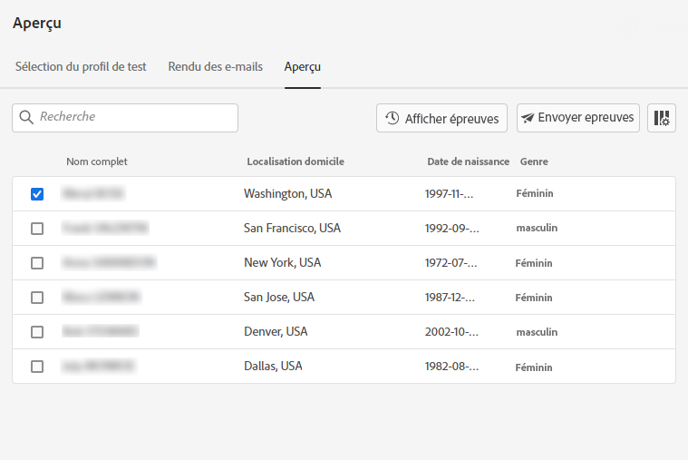

1. Cliquez sur l&#39;icône **[!UICONTROL Sélectionner les données]** au-dessus de la liste pour ajouter ou supprimer des colonnes.

   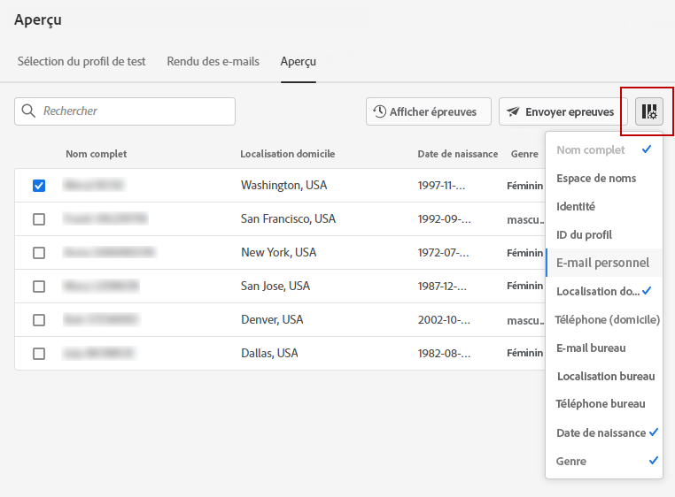

   Vous pouvez voir les champs de personnalisation spécifiques au message actuel à la fin de la liste. Dans cet exemple, la ville de profil, le prénom et le nom de famille. Sélectionnez ces champs et assurez-vous que ces valeurs sont renseignées dans vos profils de test.

1. Dans la prévisualisation de messages, les éléments personnalisés sont remplacés par les données de profil de test sélectionnées.

   Par exemple, pour ce message, le contenu des courriels et l’objet des courriels sont personnalisés :

   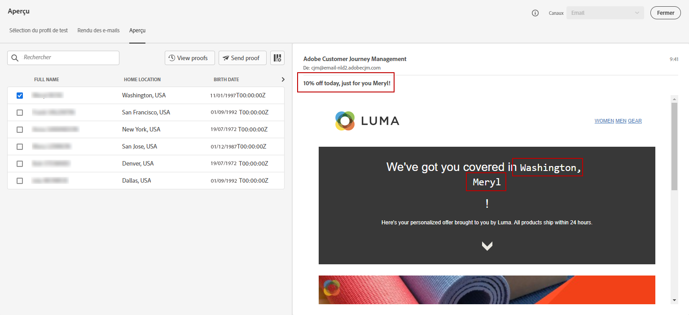

1. Sélectionnez d’autres profils de test pour prévisualisation du rendu du courrier électronique pour chaque variante de votre message.

Pour une prévisualisation de notification Push :

1. Accédez au canal **[!UICONTROL Push]** à partir de la liste déroulante **[!UICONTROL Canaux]** située en haut à gauche de l’écran **[!UICONTROL Prévisualisation]**.

   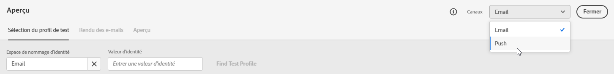

1. Appliquez les mêmes étapes que celles décrites ci-dessus pour sélectionner un profil de test et sélectionner le type de périphérique à prévisualisation de contenu : **[!UICONTROL iOS]** ou **[!UICONTROL Android]**

   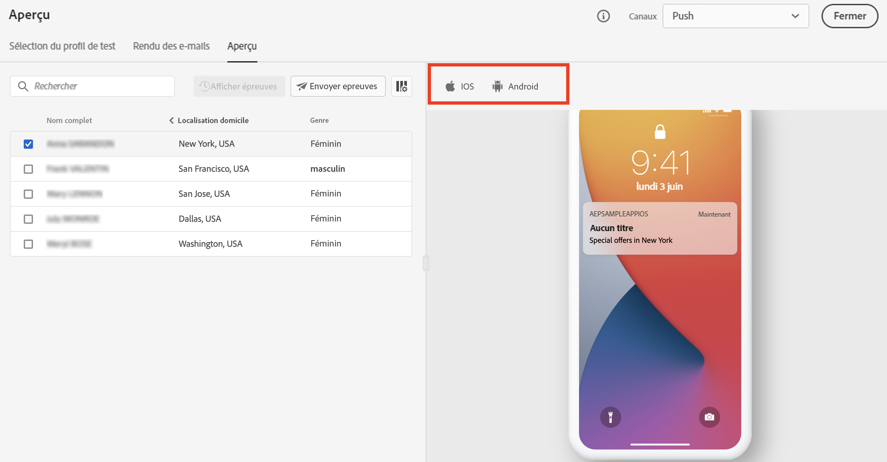

1. Dans la prévisualisation Push, les données du profil de test sont exploitées dans le contenu du message.

   Par exemple, pour cette notification Push, le titre et le corps sont personnalisés :

   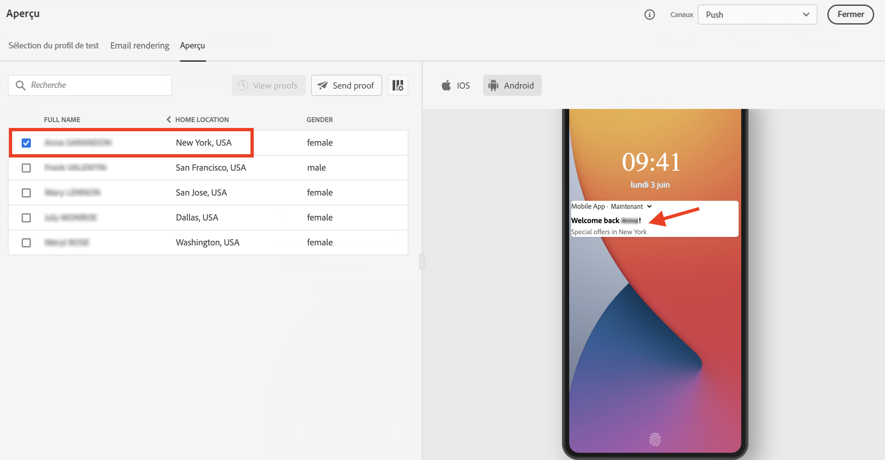

## Envoyer des BAT{#send-proofs}

Un BAT est un message spécifique qui vous permet de tester un message avant de l’envoyer à l’audience principale. Les destinataires du BAT sont chargés d&#39;approuver le message : rendu, contenu, paramètres de personnalisation, configuration.

Une fois les [profils de test](#select-test-profiles) sélectionnés, vous pouvez envoyer des BAT.

1. Dans l’écran **[!UICONTROL Prévisualisation]**, cliquez sur le bouton **[!UICONTROL Envoyer le BAT]**.

   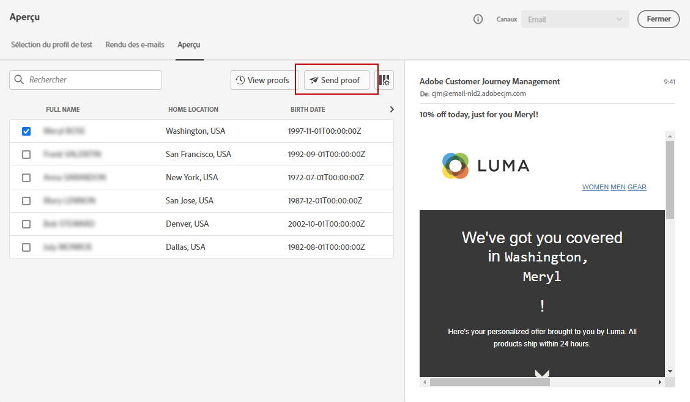

1. Sélectionnez les profils de test qui recevront le BAT et cliquez sur **[!UICONTROL Envoyer le BAT]**. Si nécessaire, vous pouvez ajouter un préfixe à l’objet du BAT.

   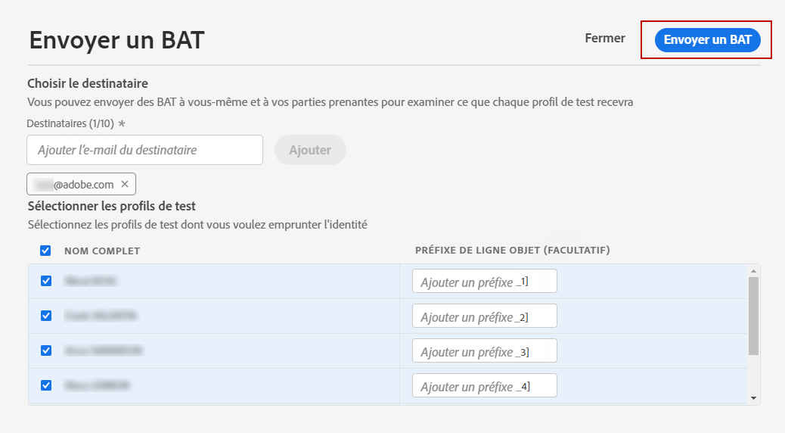

1. De nouveau dans l’écran **[!UICONTROL Prévisualisation]**, cliquez sur le bouton **[!UICONTROL BAT de Vue]** pour vérifier l’état.

   

Vous devez envoyer des BAT après toute modification du contenu du message.

## Rendu du courrier électronique{#email-rendering}

Vous pouvez exploiter votre compte **Litmus** dans [!DNL Journey Optimizer] pour prévisualisation instantanément votre **rendu de courrier électronique** dans les clients de messagerie les plus courants.

Pour accéder aux fonctionnalités de rendu des courriels, vous devez :

* Posséder un compte Litmus
* [Sélectionner des profils de test](#select-test-profiles)

Suivez ensuite les étapes ci-dessous :

1. Dans le concepteur de courrier électronique, cliquez sur le bouton **[!UICONTROL Prévisualisation]** et sélectionnez l’onglet **[!UICONTROL Rendu du courrier électronique]**.

1. Cliquez sur **Connecter votre compte Litmus** dans la section supérieure droite.

   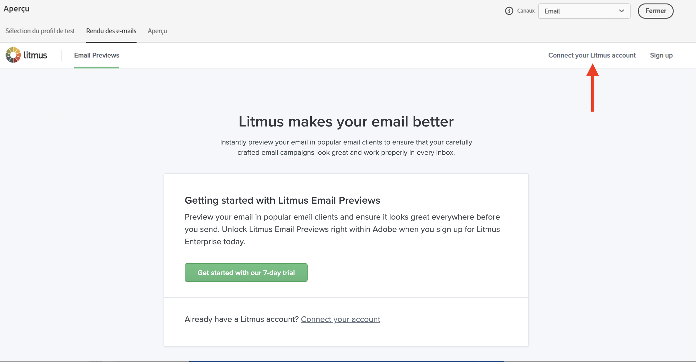

1. Saisissez vos informations d’identification et connectez-vous.

   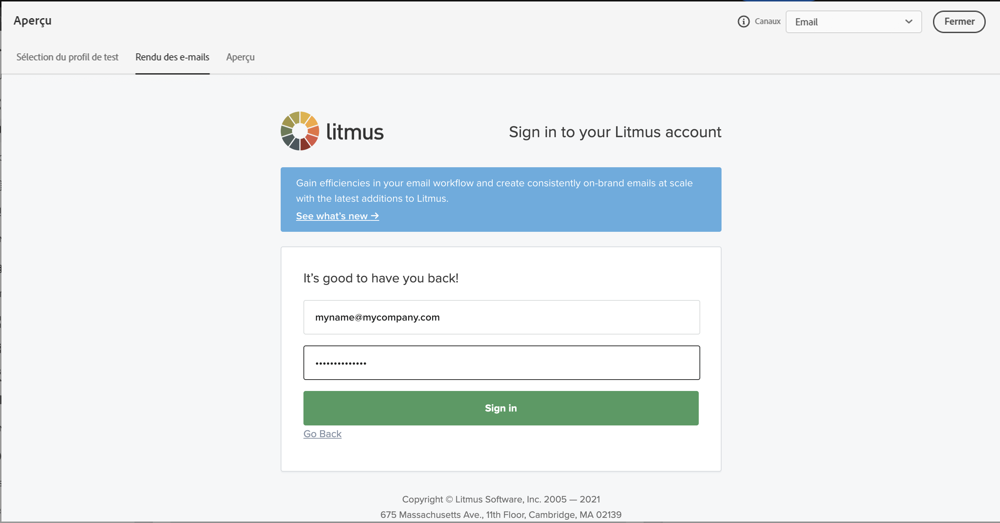

1. Cliquez sur le bouton **Exécuter le test** pour générer des prévisualisations électroniques.

1. Vérifiez le contenu de vos e-mails sur les clients courants de bureau, mobiles et Web.

   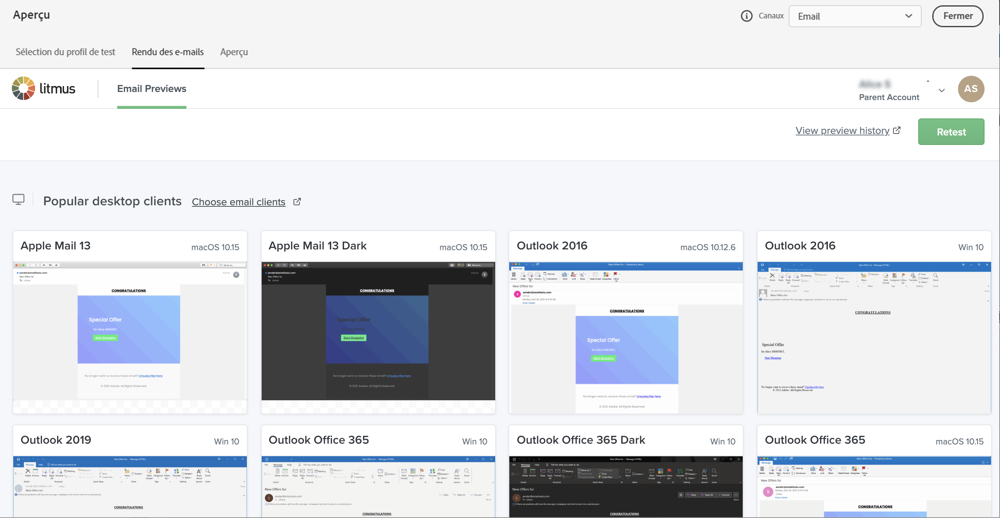

>[!CAUTION]
>
>Lorsque vous connectez votre compte **Litmus** à [!DNL Journey Optimizer], vous acceptez que les messages de test soient envoyés à Litmus : une fois envoyés, ces courriels ne sont plus gérés par Adobe. En conséquence, la politique de rétention des données par courriel de Litmus s’applique à ces courriels, y compris les données de personnalisation qui peuvent être incluses dans ces messages de test.

