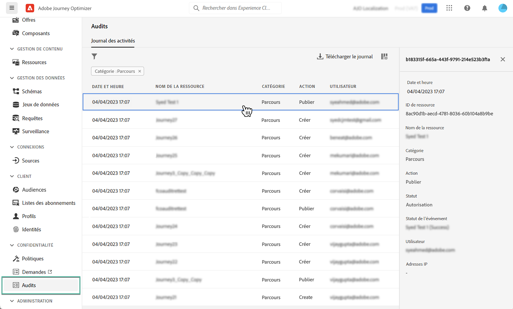

# Actions d’audit sur les ressources Journey Optimizer {#track-changes}

## À propos des journaux d’audit {#audit-logs}

>[!IMPORTANT]
>
>Pour afficher et exporter le journal d’audit, l’autorisation **[!DNL View User Activity Log]** doit vous avoir été accordée. [En savoir plus](../administration/ootb-product-profiles.md).

Avec Journey Optimizer, vous pouvez identifier les actions effectuées par les utilisateurs du système sur divers services et fonctionnalités tels que les parcours, les messages, les pages de destination, etc.

Cela vous permet d’accroître la visibilité des activités exécutées dans le système, de résoudre les problèmes et d’aider votre entreprise à se conformer aux réglementations et aux politiques de gestion des données d’entreprise.

Chaque action est enregistrée avec des métadonnées dans des « journaux d’audit » qui sont accessibles dans Adobe Experience Platform. Pour plus d’informations sur les journaux d’audit, y compris sur leur affichage et leur gestion dans l’interface utilisateur ou l’API, reportez-vous à la [documentation d’Adobe Experience Platform](https://experienceleague.adobe.com/docs/experience-platform/landing/governance-privacy-security/audit-logs/overview.html?lang=fr).

## Types d’événements capturés par les journaux d’audit {#events}

Le tableau suivant décrit les actions sur lesquelles les ressources Journey Optimizer sont enregistrées par les journaux d’audit. La liste complète des actions capturées dans les journaux d’audit est disponible dans la [documentation d’Adobe Experience Platform](https://experienceleague.adobe.com/docs/experience-platform/landing/governance-privacy-security/audit-logs/overview.html?lang=fr#category).

>[!NOTE]
>
>Journaux d’audit liés à **gestion des décisions** ne sont visibles qu’à partir du fichier CSV qui peut être téléchargé à l’aide de la variable **[!UICONTROL Journal de téléchargement]** bouton .

| Ressource | Action |
|-----------|------------------|
| Campagne AJO | Créer/Supprimer/Mettre à jour/Activer/Arrêter |
| Paramètre général du canal AJO | Créer / Supprimer / Mettre à jour |
| Groupe d’adresses IP AJO | Créer / Supprimer / Mettre à jour |
| Page de destination AJO | Créer / Supprimer / Mettre à jour / Publier / Dépublier |
| Modèle HTML de page de destination AJO | Créer / Supprimer / Mettre à jour |
| Préréglage de la page de destination AJO | Créer / Supprimer / Mettre à jour |
| Sous-domaine de page de destination AJO | Créer / Supprimer / Mettre à jour |
| Préréglage de message AJO | Créer / Supprimer / Mettre à jour |
| Enregistrement PTR AJO | Créer / Supprimer / Mettre à jour |
| Modèle d’expression enregistré AJO | Créer / Supprimer / Mettre à jour |
| Informations d’identification de l’API SMS AJO | Créer / Supprimer / Mettre à jour |
| Sous-domaine AJO | Créer / Supprimer / Mettre à jour |
| Liste de suppression AJO | Créer / supprimer / télécharger un fichier CSV |
| Groupe de champs | Créer / Supprimer / Mettre à jour |
| Parcours | Créer / Supprimer / Mettre à jour / Arrêter / Publier |
| Action personnalisée de parcours | Créer / Supprimer / Mettre à jour |
| Source de données de parcours | Créer / Supprimer / Mettre à jour |
| Événement de parcours | Créer / Supprimer / Mettre à jour |
| Règle de fréquence des messages | Créer / Supprimer / Mettre à jour |
| Stratégie de classement | Créer / Supprimer / Mettre à jour |
