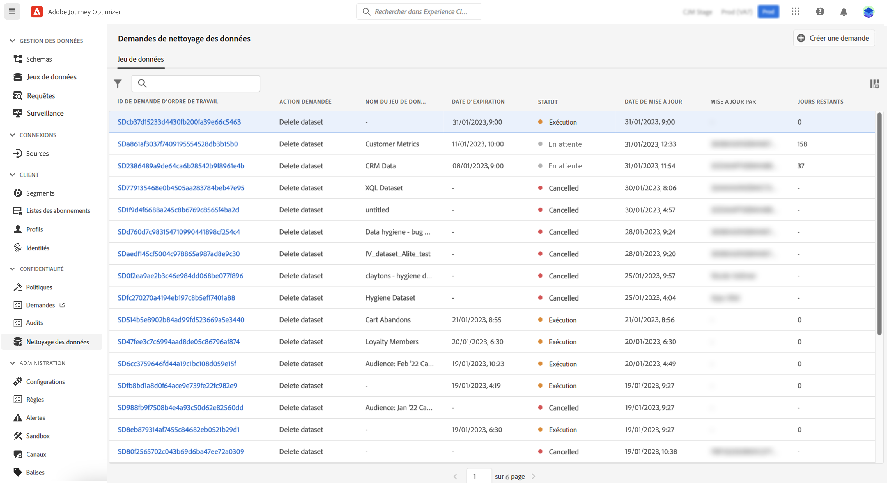

# Effectuer des opérations de cycle de vie des données {#data-hygiene}

>[!AVAILABILITY]
>
>Les fonctionnalités de cycle de vie des données ne sont actuellement disponibles que pour les organisations qui ont acheté les offres complémentaires **Healthcare Shield** et **Privacy and Security Shield**.

Comme les données sont ingérées en permanence dans Adobe Experience Platform, il devient essentiel de s’assurer que vos données sont utilisées comme prévu, mises à jour si nécessaire et supprimées selon les politiques de l’entreprise.

Ces tâches peuvent être effectuées à l’aide du menu **[!UICONTROL Cycle de vie des données]** qui vous permet de configurer et de planifier les opérations d’hygiène des données, en veillant à ce que vos enregistrements soient correctement conservés.

## Recommandations {#data-hygiene-recommendations}

Lors de l’exécution d’opérations de nettoyage des données (telles que la suppression d’identités ou de jeux de données), n’oubliez pas que les événements de diffusion historiques associés aux identités supprimées n’apparaîtront plus dans les rapports standard ou les requêtes de lac de données. Cela peut entraîner des incohérences entre le nombre d’e-mails **Diffusés** et le nombre d’e-mails **Reçus** dans les boîtes de réception des destinataires, en particulier pour les parcours plus anciens.

Avant d’exécuter des suppressions à grande échelle, validez et exportez toutes les données de diffusion ou de création de rapports requises. Si une réconciliation s’avère nécessaire après le nettoyage des données, contactez l’assistance Adobe pour accéder aux journaux archivés ou utilisez des requêtes de jeu de données d’événement de feedback sur les messages pour obtenir des données récentes.

## En savoir plus {#data-hygiene-learn-more}

Pour plus d’informations sur Privacy Service et sur la réalisation des opérations de cycle de vie des données, consultez la documentation d’Adobe Experience Platform :

* [Vue d’ensemble de Privacy Service](https://experienceleague.adobe.com/docs/experience-platform/privacy/home.html?lang=fr)
* [&#x200B; Cycle de vie des données dans Adobe Experience Platform &#x200B;](https://experienceleague.adobe.com/docs/experience-platform/hygiene/home.html?lang=fr)
