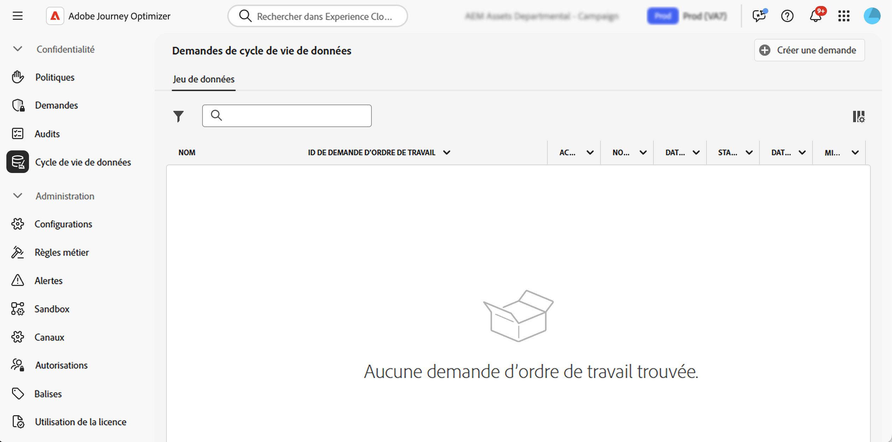

# Exécution des opérations d’hygiène des données {#data-hygiene}

>[!AVAILABILITY]
>
>Les fonctionnalités d’hygiène des données ne sont actuellement disponibles que pour les organisations qui ont acheté la variable **Bouclier de santé** et **Protection de la vie privée et protection** offres complémentaires.

Comme les données sont ingérées en permanence dans Adobe Experience Platform, il devient essentiel de s’assurer que vos données sont utilisées comme prévu, mises à jour si nécessaire et supprimées par les stratégies de l’entreprise.

Ces tâches peuvent être effectuées à l’aide de la fonction **[!UICONTROL Hygiène des données]** qui vous permet de configurer et de planifier les opérations d’hygiène des données, en veillant à ce que vos enregistrements soient correctement conservés.

Pour plus d’informations sur le Privacy Service et sur les opérations d’hygiène des données, consultez la documentation de Adobe Experience Platform :

* [Présentation de Privacy Service](https://experienceleague.adobe.com/docs/experience-platform/privacy/home.html?lang=fr)
* [Hygiène des données dans Adobe Experience Platform](https://experienceleague.adobe.com/docs/experience-platform/hygiene/home.html?lang=en)
