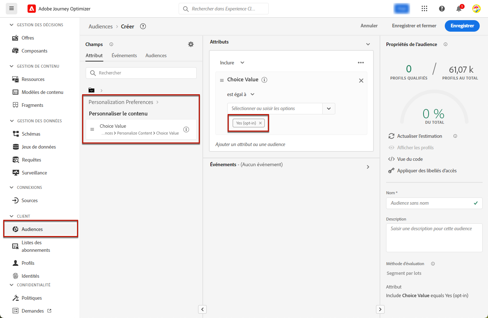
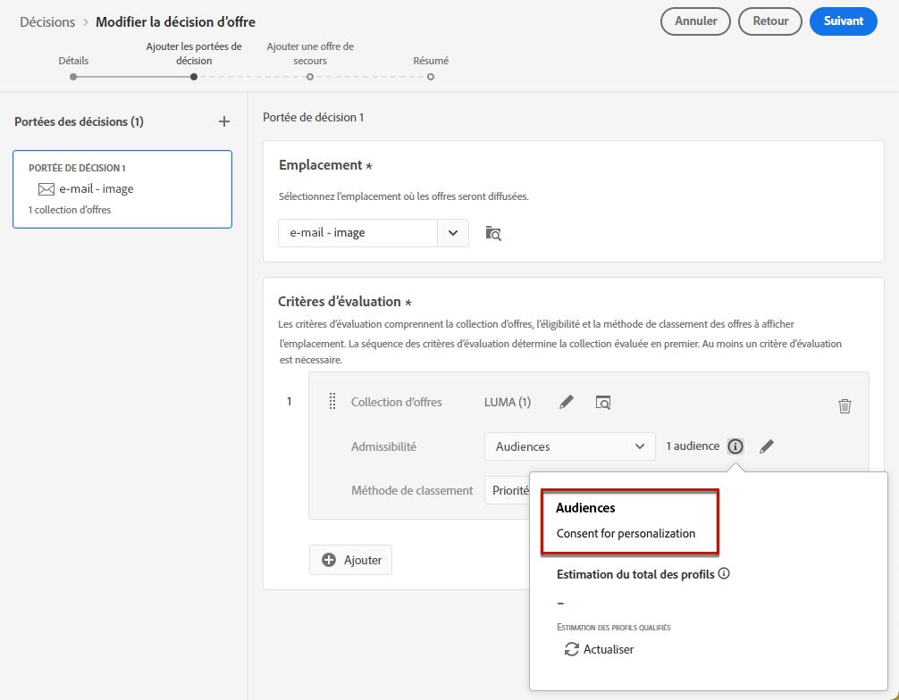
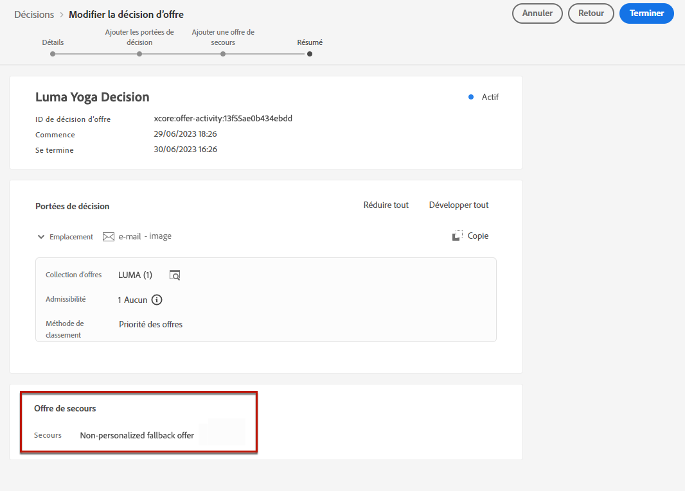
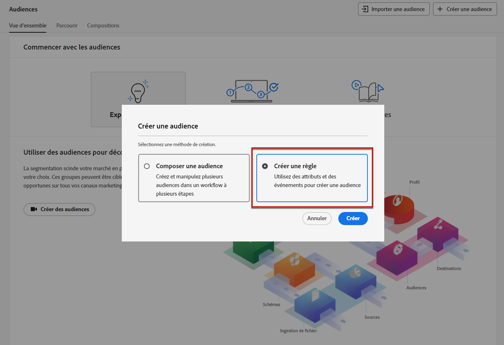
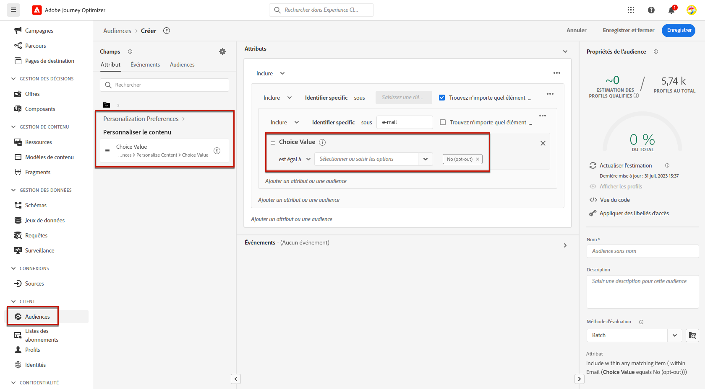
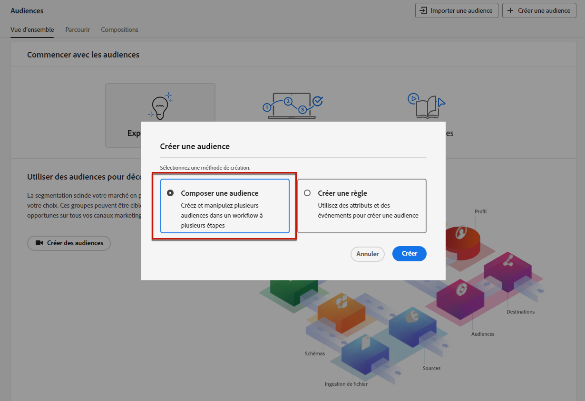
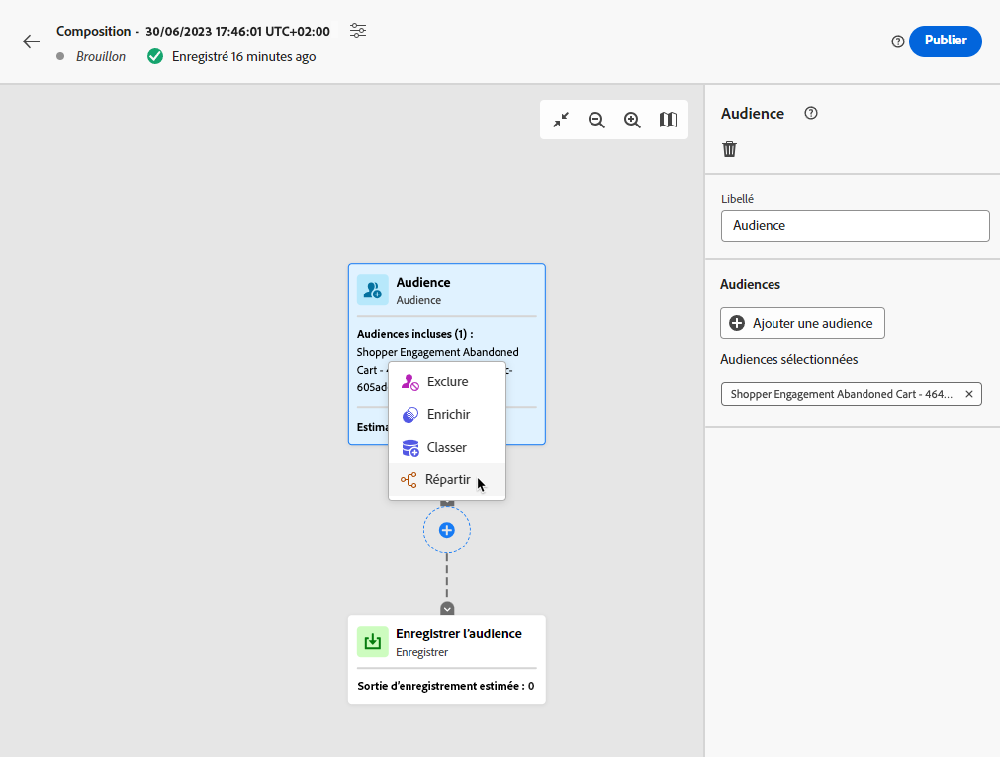
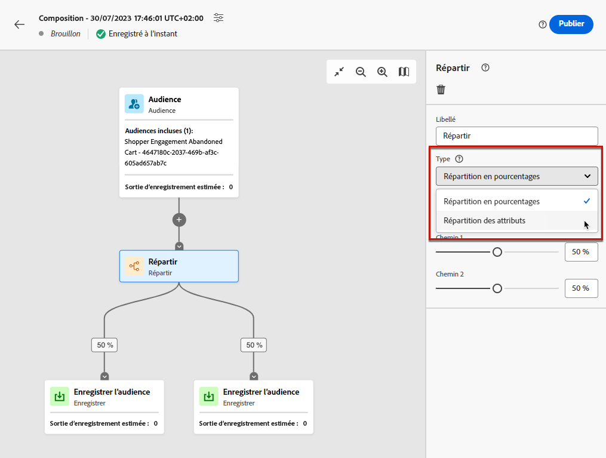
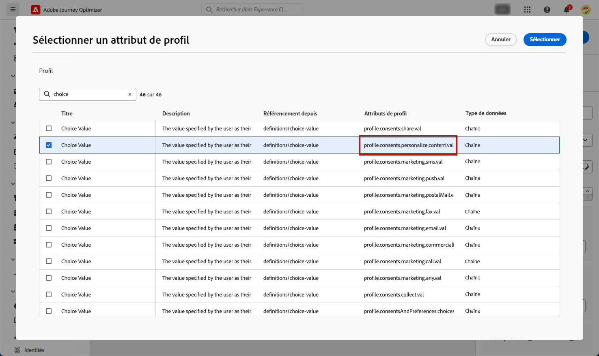
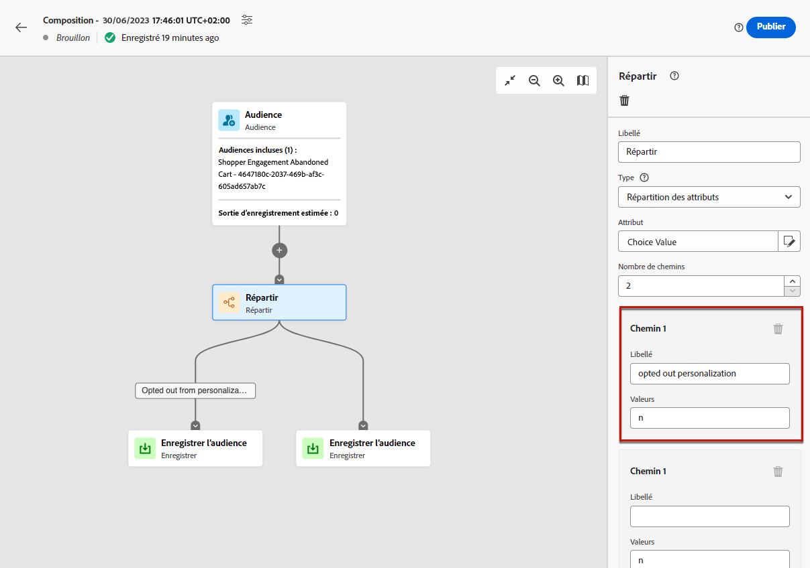

# Gérer le processus d’opt-out {#consent}

La possibilité pour les destinataires de se désabonner de la réception des communications d’une marque est une exigence légale, ainsi que de veiller au respect de leur choix. Le non-respect de ces réglementations entraîne des risques juridiques pour votre marque. Cela vous aide à éviter d’envoyer des communications non sollicitées à vos personnes destinataires, ce qui pourrait les faire marquer vos messages comme des courriers indésirables et nuire à votre réputation.

Pour en savoir plus sur la législation applicable, consultez la [documentation Experience Platform](https://experienceleague.adobe.com/docs/experience-platform/privacy/regulations/overview.html?lang=fr#regulations){target="_blank"}.

## Gérer les désabonnements dans les parcours et les campagnes {#opt-out-ajo}

Lors de l’envoi de messages à partir des parcours ou des campagnes, vous devez toujours vous assurer que les clientes et clients peuvent se désabonner des futures communications. Une fois désinscrits, les profils sont automatiquement supprimés de l’audience des futurs messages marketing.

Alors que **[!DNL Journey Optimizer]** offre des moyens permettant de gérer les désinscriptions des e-mails et des SMS, les notifications push ne nécessitent aucune action de votre part, car les destinataires peuvent annuler leur abonnement depuis leurs appareils. Par exemple, lors du téléchargement ou de l’utilisation de votre application, ils peuvent choisir d’arrêter les notifications. De même, ils peuvent modifier les paramètres de notification par le biais du système d’exploitation mobile.

>[!NOTE]
>
>En outre, vous pouvez tirer parti de l’**API REST de suppression** Journey Optimizer pour contrôler vos messages sortants à l’aide des listes de suppression et des listes autorisées. [Découvrez comment utiliser l’API REST de suppression.](https://developer.adobe.com/journey-optimizer-apis/references/suppression/){target="_blank"}

Découvrez comment gérer les désinscriptions des e-mails et des SMS de Journey Optimizer dans les sections suivantes :

<table style="table-layout:fixed"><tr style="border: 0;">
<td>

<a href="../email/email-opt-out.md"><strong>Gestion du processus de désinscription aux e-mails</strong>

</td>
<td>

<a href="../sms/sms-opt-out.md"><strong>Gestion du processus de désinscription aux SMS</strong></a>

</td>
</tr></table>

>[!NOTE]
>
>Dans [!DNL Journey Optimizer], le consentement est géré par le [Schéma de consentement](https://experienceleague.adobe.com/docs/experience-platform/xdm/field-groups/profile/consents.html?lang=fr){target="_blank"} d’Experience Platform. Par défaut, la valeur du champ de consentement est vide et traitée comme un consentement pour recevoir vos communications. Vous pouvez remplacer cette valeur par défaut lors de l’intégration par l’une des valeurs possibles répertoriées [ici](https://experienceleague.adobe.com/docs/experience-platform/xdm/data-types/consents.html?lang=fr#choice-values){target="_blank"} ou utiliser des [politiques de consentement](../action/consent.md) pour remplacer la logique par défaut.

## Implémenter le consentement de personnalisation {#opt-out-personalization}

Vos clientes et clients peuvent également refuser (opt-out) la présentation de contenus personnalisés. Une fois qu’un profil a refusé la personnalisation, vous devez vous assurer que ses données ne sont pas utilisées pour celle-ci. Vous devez en outre remplacer tout contenu personnalisé par une variante de secours.

### Dans la gestion des décisions {#opt-out-decision-management}

Lors de l’utilisation des offres, les préférences de personnalisation ne sont pas automatiquement implémentées dans les [portées de décision](../offers/offer-activities/create-offer-activities.md#add-decision-scopes) utilisées à partir d’une requête d’API de [prise de décision](../offers/api-reference/offer-delivery-api/decisioning-api.md) ou de [prise de décision Edge](../offers/api-reference/offer-delivery-api/edge-decisioning-api.md). Dans ce cas, vous devez appliquer manuellement le consentement de personnalisation. Pour ce faire, procédez comme suit.

>[!NOTE]
>
>Les portées de décision utilisées dans les canaux [!DNL Journey Optimizer] créés répondent à cette exigence de la campagne ou du parcours auxquels ils appartiennent.

1. Créez une audience [Adobe Experience Platform](../audience/about-audiences.md) à l’aide du [service de segmentation](https://experienceleague.adobe.com/docs/experience-platform/segmentation/ui/overview.html?lang=fr){target="_blank"} et utilisez un attribut de profil tel que **[!UICONTROL Personnaliser le contenu = Oui (opt-in)]** pour cibler les utilisateurs et utilisatrices qui ont consenti à la personnalisation.

   

1. Lors de la création d’une [décision](../offers/offer-activities/create-offer-activities.md), ajoutez une portée de décision et définissez une contrainte d’éligibilité basée sur cette audience pour chaque collection de critères d’évaluation contenant des offres personnalisées.

   

1. Créez une [offre de secours](../offers/offer-library/creating-fallback-offers.md) qui n’inclut pas de contenu personnalisé.

1. [Attribuez](../offers/offer-activities/create-offer-activities.md#add-fallback) l’offre de secours non personnalisée à la décision.

   

1. [Examinez et enregistrez](../offers/offer-activities/create-offer-activities.md#review) la décision.

Si un utilisateur ou une utilisatrice :

* a consenti à la personnalisation, la portée de la décision détermine la meilleure offre pour ce profil ;

* n’a pas consenti à la personnalisation, le profil correspondant ne sera éligible à aucune des offres qui se trouvent dans les critères d’évaluation et recevra donc l’offre de secours non personnalisée.

>[!NOTE]
>
>Le consentement pour utiliser les données de profil dans la [modélisation des données](../offers/ranking/ai-models.md) n’est pas encore pris en charge dans [!DNL Journey Optimizer].

### Dans l’éditeur de personnalisation {#opt-out-expression-editor}

L’[éditeur de personnalisation](../personalization/personalization-build-expressions.md) lui-même n’effectue aucune vérification ou application du consentement, car il n’est pas impliqué dans la diffusion des messages.

Cependant, l’utilisation de libellés de contrôle d’accès basés sur le droit permet de restreindre les champs pouvant être utilisés pour la personnalisation. L’[aperçu du message](../content-management/preview.md) et le [service de rendu des e-mails](../content-management/rendering.md) masquera les champs identifiés avec des informations sensibles.

>[!NOTE]
>
>En savoir plus sur le contrôle d’accès au niveau de l’objet (OLAC) dans [cette section](../administration/object-based-access.md).

Dans les campagnes [!DNL Journey Optimizer], la politique de consentement est appliquée comme suit :

* Vous pouvez inclure des définitions de politique de consentement dans le cadre de la création de l’audience afin de s’assurer que l’audience sélectionnée pour la campagne a déjà **exclu du filtre les profils qui ne correspondent pas aux critères de consentement**.

* [!DNL Journey Optimizer] effectue une vérification générale du consentement au niveau du canal afin de **garantir que les profils ont choisi** de recevoir des communications marketing sur le canal correspondant.

  >[!NOTE]
  >
  >Actuellement, l’objet de la campagne [!DNL Journey Optimizer] n’effectue aucune vérification supplémentaire de l’application de la politique de consentement.

Pour appliquer manuellement le consentement à la personnalisation dans les campagnes, suivez l’une des options ci-dessous.

### Utiliser le créateur de règles de segments

Vous pouvez utiliser le créateur de règles de segments pour créer une audience contenant des profils d’exclusion.

1. Créez une audience [Adobe Experience Platform](../audience/about-audiences.md) à l’aide du [service de segmentation](https://experienceleague.adobe.com/docs/experience-platform/segmentation/ui/overview.html?lang=fr){target="_blank"}.

   

1. Sélectionnez un attribut de profil tel que **[!UICONTROL Personnaliser le contenu = Non (opt-out)]** pour exclure les utilisateurs et utilisatrices qui n’ont pas consenti à la personnalisation.

   

1. Cliquez sur **[!UICONTROL Enregistrer]**.

Vous pouvez désormais utiliser cette audience pour filtrer les profils qui n’ont pas donné leur consentement à la personnalisation de vos campagnes.

### Utiliser une activité de partage dans un workflow de composition

Vous pouvez également ajouter une vérification du consentement à la personnalisation à une audience en ajoutant une activité de partage à un workflow de composition.

1. Créez une audience à l’aide de l’option **[!UICONTROL Composer une audience]**. [En savoir plus sur la création d’un workflow de composition](../audience/get-started-audience-orchestration.md)

   

1. Ajoutez l’audience de départ à l’aide du bouton spécifique situé à droite.

1. Cliquez sur l’icône **+** et sélectionnez une activité **[!UICONTROL Partage]** pour créer une audience partagée.

   

1. Dans le volet de droite, sélectionnez **[!UICONTROL Répartition des attributs]** comme type de partage.

   

1. Cliquez sur l’icône en forme de crayon en regard du champ **[!UICONTROL Attribut]** pour afficher la fenêtre **[!UICONTROL Sélectionner un attribut de profil]**.

1. Recherchez l’attribut de consentement à la personnalisation (`profile.consents.personalize.content.val`) et sélectionnez-le.

   

1. **[!UICONTROL Chemin 1]** est l’audience non personnalisée. Choisissez un libellé pertinent.

1. Sélectionnez la valeur appropriée dans cette [liste](https://experienceleague.adobe.com/docs/experience-platform/xdm/data-types/consents.html?lang=fr#choice-values){target="_blank"}.

   Dans ce cas, nous utiliserons `n` pour indiquer que les utilisateurs et utilisatrices ne consentent pas à l’utilisation de leurs données à des fins de personnalisation.

   

1. Vous pouvez créer un chemin d’accès distinct pour les autres valeurs de choix. Vous pouvez également supprimer les autres chemins d’accès et activer **[!UICONTROL Autres profils]** pour inclure tous les autres profils qui n’avaient pas la valeur de choix de `n`.

1. Une fois que vous avez terminé, cliquez sur **[!UICONTROL Enregistrer l’audience]** pour chaque chemin d’accès afin d’enregistrer le résultat de votre workflow dans une nouvelle audience. Une audience est enregistrée dans Adobe Experience Platform pour chaque chemin d’accès.

1. Une fois terminé, publiez le workflow de composition.

Vous pouvez désormais utiliser cette audience pour filtrer les profils qui n’ont pas donné leur consentement à la personnalisation de vos campagnes.

>[!NOTE]
>
>Gardez à l’esprit que si vous créez une audience qui n’a pas donné son consentement pour la personnalisation et que vous la sélectionnez ensuite pour activation dans une campagne, les outils de personnalisation restent disponibles. Il appartient à l’utilisateur ou à l’utilisatrice marketing de comprendre que s’il ou elle travaille avec une audience qui ne doit pas recevoir de personnalisation, il ou elle ne doit pas utiliser les outils de personnalisation.
