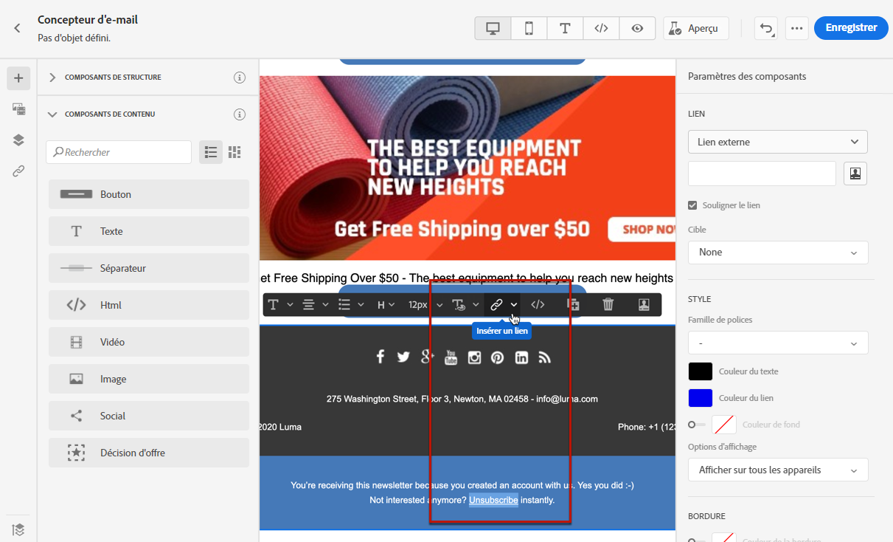
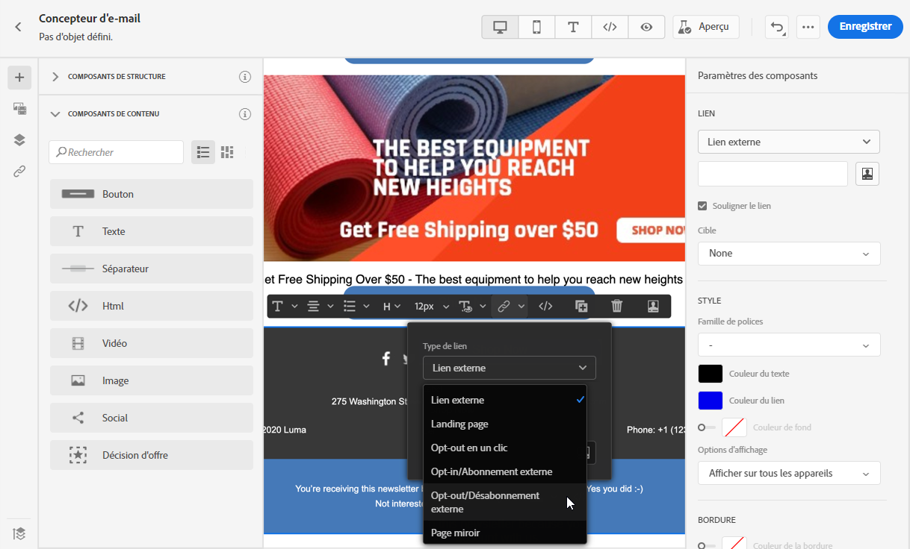
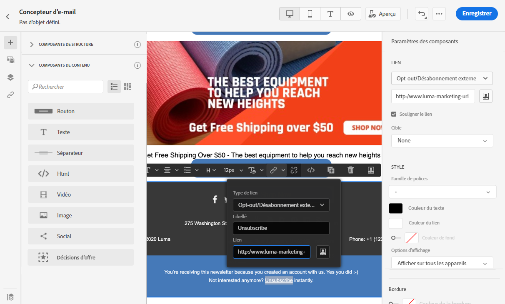
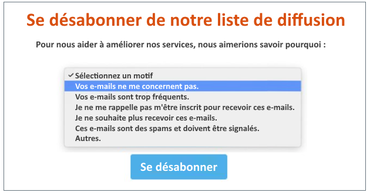
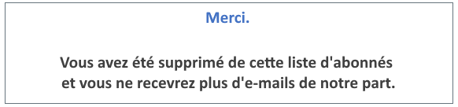
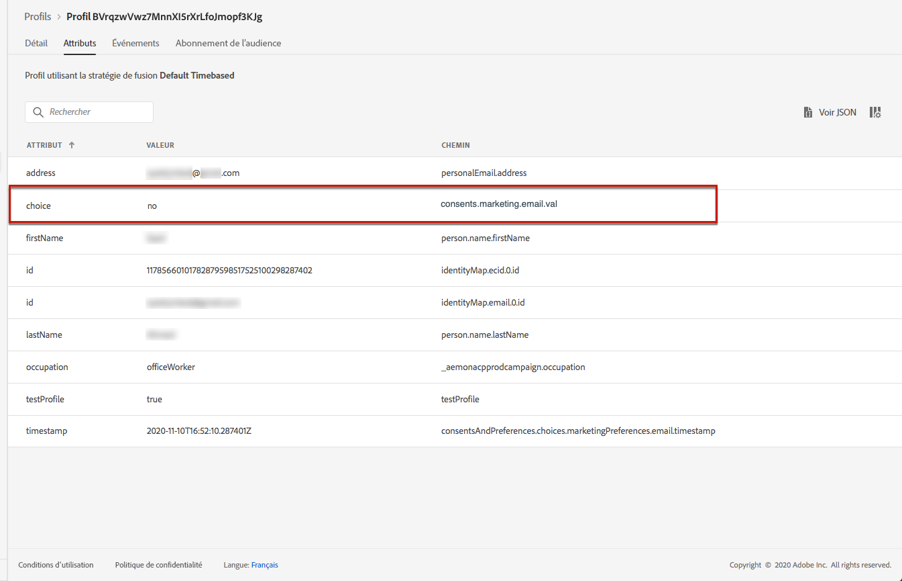
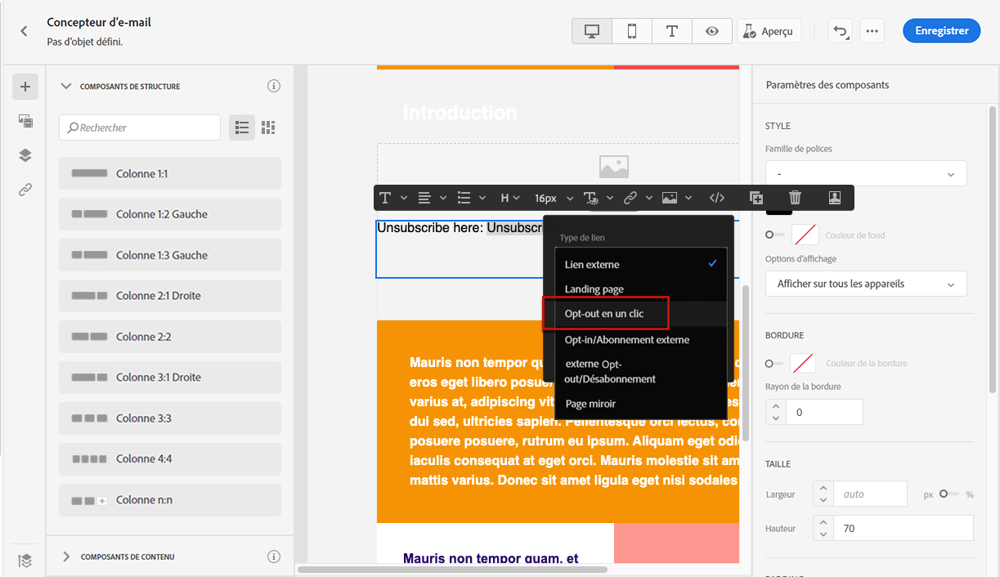
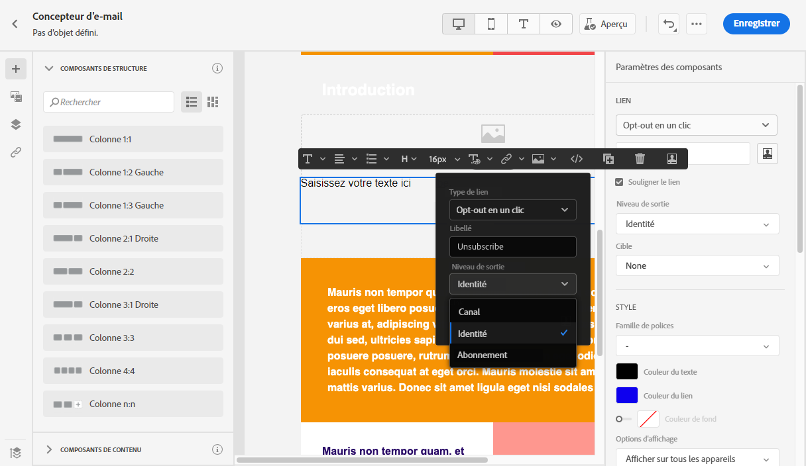
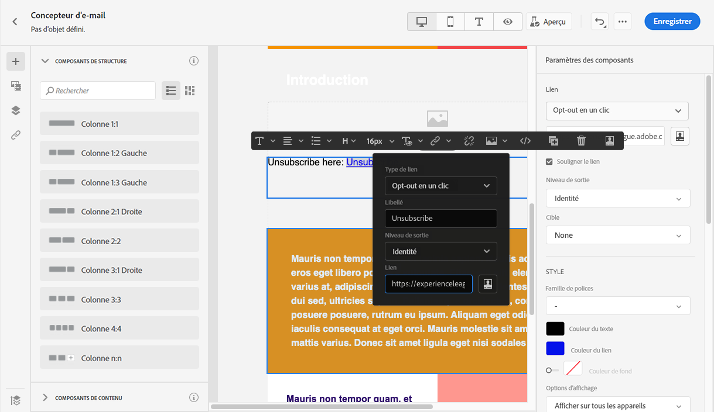
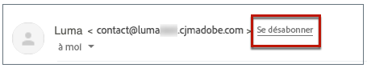

# Gestion du processus d’opt-out {#consent}

Utilisez [!DNL Journey Optimizer] pour suivre le consentement de vos destinataires en matière de communication et comprendre comment ils veulent interagir avec votre marque en gérant leurs préférences et leurs abonnements.

Des règlements tels que le RGPD stipulent que vous devez respecter des exigences spécifiques avant de pouvoir utiliser les informations provenant de sujets de données. En outre, les sujets de données devraient pouvoir modifier leur consentement à tout moment.

**Pourquoi est-ce important ?**

* Le fait de ne pas se conformer à ces règlements introduit des risques juridiques réglementaires pour votre marque.
* Cela vous aide à éviter d&#39;envoyer des communications non sollicitées à vos destinataires, ce qui pourrait les faire marquer vos messages comme des courriers indésirables et nuire à votre réputation.

Pour en savoir plus sur la gestion de la confidentialité et les réglementations applicables, consultez la [documentation Experience Platform](https://experienceleague.adobe.com/docs/experience-platform/privacy/home.html?lang=fr){target=&quot;_blank&quot;}.

>[!NOTE]
>
>Dans [!DNL Journey Optimizer], le consentement est géré par le [Schéma de consentement](https://experienceleague.adobe.com/docs/experience-platform/xdm/field-groups/profile/consents.html?lang=fr){target=&quot;_blank&quot;} d’Experience Platform. Par défaut, la valeur du champ de consentement est vide et traitée comme un consentement pour recevoir vos communications. Vous pouvez modifier cette valeur par défaut lors de l’intégration à l’une des valeurs possibles répertoriées [ici](https://experienceleague.adobe.com/docs/experience-platform/xdm/data-types/consents.html?lang=fr#choice-values){target=&quot;_blank&quot;}.

## Gérer le processus d’opt-out aux e-mails {#opt-out-management}

La possibilité pour les destinataires de se désabonner de la réception des communications d&#39;une marque est une exigence légale. Pour en savoir plus sur la législation applicable, consultez la [documentation d’Experience Platform](https://experienceleague.adobe.com/docs/experience-platform/privacy/regulations/overview.html?lang=fr#regulations){target=&quot;_blank&quot;}.

Par conséquent, vous devez toujours inclure un **lien de désabonnement** dans chaque e-mail envoyé aux destinataires :

* Lorsqu&#39;ils cliquent sur ce lien, les destinataires sont dirigés vers une page de destination contenant un bouton pour confirmer leur désinscription.
* Une fois leur choix confirmé, les données des profils seront mises à jour avec ces informations.

>[!NOTE]
>
>Les e-mails de type marketing doivent inclure un lien d’opt-out, qui n’est pas obligatoire pour les messages transactionnels. La catégorie du message (**[!UICONTROL Marketing]** ou **[!UICONTROL Transactionnel]**) est définie au niveau de la [surface du canal](../configuration/channel-surfaces.md#email-type) (c’est-à-dire des préréglages du message) et lors de la [création du message](../messages/get-started-content.md#create-new-message).

### Opt-out externe {#opt-out-external-lp}

Pour cela, vous pouvez insérer dans un e-mail un lien vers une page de destination externe afin de permettre aux utilisateurs de se désabonner de la réception des communications de votre marque.

#### Ajouter un lien de désabonnement {#add-unsubscribe-link}

Vous devez d’abord ajouter un lien de désabonnement dans un message. Pour ce faire, procédez comme suit :

1. Construisez votre page de destination de désinscription.

1. Hébergez-la sur le système tiers de votre choix.

1. [Créez un message](../messages/get-started-content.md) dans un parcours.

1. Sélectionnez du texte dans votre contenu et [insérez un lien](../design/message-tracking.md#insert-links) à l’aide de la barre d’outils contextuelle.

   

1. Sélectionnez **[!UICONTROL Désinscription/opt-out externe]** à partir de la liste déroulante **[!UICONTROL Type de lien]**.

   

1. Dans le champ **[!UICONTROL Lien]**, collez le lien vers votre page de destination tierce.

   

1. Cliquez sur **[!UICONTROL Enregistrer]**.

#### Implémenter un appel API pour le processus d’opt-out {#opt-out-api}

Pour que vos destinataires soient désinscrits lorsqu’ils envoient leur choix à partir de la page de destination, vous devez implémenter un **appel API d’abonnement** via [Adobe Developer](https://developer.adobe.com/){target=&quot;_blank&quot;} pour mettre à jour les préférences des profils correspondants.

Cet appel POST est le suivant :

Point dʼentrée : platform.adobe.io/journey/imp/consent/preferences

Paramètres de requête:

* **params** : contient la payload chiffrée
* **sig** : signature
* **pid** : identifiant de profil chiffré

Ces trois paramètres seront inclus dans l’URL de page de destination tierce envoyée à votre destinataire :


Exigences d’en-tête :

* x-api-key
* x-gw-ims-org-id
* x-sandbox-name
* autorisation (jeton utilisateur de votre compte technique)

Contenu de la requête :

```
{
   "marketing": [
       {
            "type": "email",           
            "choice": "no",          
            "scope": "channel"       
        }
    ],
 
}
```

[!DNL Journey Optimizer] utilisera ces paramètres pour mettre à jour le choix du profil correspondant par le biais de l’appel API [Adobe Developer](https://developer.adobe.com){target=&quot;_blank&quot;}.

#### Envoyer le message avec le lien de désinscription {#send-message-unsubscribe-link}

Une fois que vous avez configuré le lien de désinscription sur votre page de destination et implémenté l’appel API, votre message est prêt à être envoyé.

1. Envoyer le message incluant le lien par le biais d’un [parcours](../building-journeys/journey.md).

1. Une fois le message reçu, si le destinataire clique sur le lien de désinscription, votre page de destination s’affiche.

   

1. Si le destinataire envoie le formulaire (ici, en appuyant sur le bouton **Se désinscrire** dans votre page de destination), les données de profil sont mises à jour via l’[appel API](#opt-out-api).

1. Le destinataire désabonné est ensuite redirigé vers un écran de message de confirmation indiquant que la désinscription a réussi.

   

   Par conséquent, cet utilisateur ne recevra aucune communication de votre marque à moins d&#39;être de nouveau abonné.

1. Pour vérifier que le choix du profil correspondant a été mis à jour, accédez à Experience Platform puis au profil en sélectionnant un espace de noms d’identité et une valeur d’identité correspondante. Pour en savoir plus, consultez la [documentation d’Experience Platform](https://experienceleague.adobe.com/docs/experience-platform/profile/ui/user-guide.html?lang=fr#getting-started){target=&quot;_blank&quot;}.

   

   Dans l&#39;onglet **[!UICONTROL Attributs]**, vous pouvez voir la valeur de **[!UICONTROL choice]** remplacée par **[!UICONTROL no]**.

### Opt-out en un clic {#one-click-opt-out}

Comme de nombreux clients recherchent un processus plus facile pour se désabonner, vous pouvez également ajouter un lien d’opt-out en un clic dans votre contenu d’e-mail. Ce lien permettra à vos destinataires de se désinscrire rapidement de vos communications, sans être redirigés vers une page de destination dans laquelle ils doivent confirmer leur désinscription. Cela permet d’accélérer le processus de désinscription.

Pour ajouter un lien d&#39;opt-out dans votre e-mail, procédez comme suit.

1. [Insérez un lien](../design/message-tracking.md#insert-links) et sélectionnez **[!UICONTROL Opt-out en un clic]** comme type de lien.

   

1. Sélectionnez le mode d’application de la désinscription : au niveau du canal, de l’identité ou de l’abonnement.

   

   * **[!UICONTROL Canal]** : le processus d’opt-out s’applique aux futurs messages envoyés à la cible du profil (c’est-à-dire son adresse e-mail) pour le canal actuel. Si plusieurs cibles sont associées à un profil, le processus d’opt-out s’applique à toutes les cibles (adresses e-mail, par exemple) du profil pour ce canal.
   * **[!UICONTROL Identité]** : le processus d’opt-out s’applique aux futurs messages envoyés à la cible spécifique (c’est-à-dire l’adresse e-mail) utilisée pour le message en cours.
   * **[!UICONTROL Abonnement]** : le processus d’opt-out s’applique aux futurs messages associés à une liste d’abonnement spécifique. Cette option ne peut être sélectionnée que si le message actif est associé à une liste d’abonnement.

1. Saisissez l’URL de la page de destination vers laquelle l’utilisateur sera redirigé une fois désabonné. Cette page n’est disponible que pour confirmer que la désinscription a réussi.

   >[!NOTE]
   >
   >Si vous avez activé l’option **List-Unsubscribe** au niveau des paramètres des surfaces du canal, cette URL sera également utilisée lorsque les utilisateurs cliqueront sur le lien de désabonnement dans l’en-tête de l’e-mail. [En savoir plus](#unsubscribe-header)

   

   Vous pouvez personnaliser vos liens. Pour en savoir plus sur les URL personnalisées, consultez [cette section](../personalization/personalization-syntax.md).

1. Enregistrez vos modifications.

Une fois votre message envoyé via un [parcours](../building-journeys/journey.md), si un destinataire clique sur le lien d&#39;opt-out, il est immédiatement désinscrit.

### Lien de désabonnement dans l’en-tête de l’e-mail {#unsubscribe-header}

>[!CONTEXTUALHELP]
>id="ajo_admin_preset_unsubscribe"
>title="Ajout d’un lien de désabonnement à l’en-tête d’un e-mail"
>abstract="Activez List-Unsubscribe pour ajouter un lien de désabonnement à l’en-tête de l’e-mail. Pour définir une URL de désabonnement, insérez un lien d’opt-out en un clic dans le contenu de l’e-mail."
>additional-url="https://experienceleague.adobe.com/docs/journey-optimizer/using/privacy/consent.html?lang=en#one-click-opt-out" text="Désinscription en un clic"

Si l’[option List-Unsubscribe](../configuration/channel-surfaces.md#list-unsubscribe) est activée au niveau des surfaces du canal, les e-mails correspondants envoyés avec [!DNL Journey Optimizer] incluent un lien de désabonnement dans l’en-tête de l’e-mail.

Par exemple, le lien de désabonnement s&#39;affiche comme suit dans Gmail :



>[!NOTE]
>
>Pour afficher le lien de désabonnement dans l’en-tête de l’e-mail, le client de messagerie du destinataire doit prendre en charge cette fonctionnalité.

L’adresse de désabonnement est l’adresse **[!UICONTROL Mailto (unsubscribe)]** par défaut affichée dans la surface de canal correspondante. [En savoir plus](../configuration/channel-surfaces.md#list-unsubscribe).

Pour définir une URL de désabonnement personnalisée, insérez un lien d&#39;opt-out en un clic dans le contenu de l&#39;e-mail et saisissez l&#39;URL de votre choix. [En savoir plus](#one-click-opt-out)

En fonction du client de messagerie, cliquer sur le lien de désabonnement de l&#39;en-tête peut avoie l&#39;un des impacts suivants :

* La demande de désabonnement est envoyée à l’adresse de désabonnement par défaut.

* Le destinataire est dirigé vers l&#39;URL de la page de destination que vous avez spécifiée lors de l&#39;ajout du lien d&#39;opt-out à votre message.

   >[!NOTE]
   >
   >Si vous n&#39;ajoutez pas de lien d&#39;opt-out en un clic dans le contenu de votre message, aucune page de destination ne s&#39;affichera.

* Le profil correspondant est immédiatement exclu et ce choix est mis à jour dans Experience Platform. Pour en savoir plus, consultez la [documentation d’Experience Platform](https://experienceleague.adobe.com/docs/experience-platform/profile/ui/user-guide.html#getting-started){target=&quot;_blank&quot;}.

## Gestion des processus d’opt-out push {#push-opt-out-management}

Les destinataires push peuvent se désabonner eux-mêmes via leurs appareils.

Par exemple, lors du téléchargement ou de l’utilisation de votre application, ils peuvent choisir d’arrêter les notifications. De même, ils peuvent modifier les paramètres de notification par le biais du système d’exploitation mobile.

## Gestion des processus d’opt-out des SMS {#sms-opt-out-management}

Conformément aux normes et réglementations du secteur, tous les messages de marketing SMS doivent contenir un moyen pour que les destinataires puissent facilement se désabonner. Une fois désinscrits, les profils sont automatiquement supprimés de l’audience des futurs messages marketing.

>[!NOTE]
>
>L’ajout d’un lien de désinscription n’est pas obligatoire pour les messages transactionnels.

Adobe Journey Optimizer traite automatiquement les mots-clés suivants dans les messages entrants : **DÉMARRER**, **STOP**, et **UNSTOP**. Ces mots-clés déclenchent des réponses standard automatiques de la part du fournisseur SMS.

Pour en savoir plus sur le fonctionnement de la prise en charge native des mots-clés entrants (démarrage, arrêt et redémarrage) pour les SMS, regardez la vidéo suivante:

>[!VIDEO](https://video.tv.adobe.com/v/344026?quality=12)
