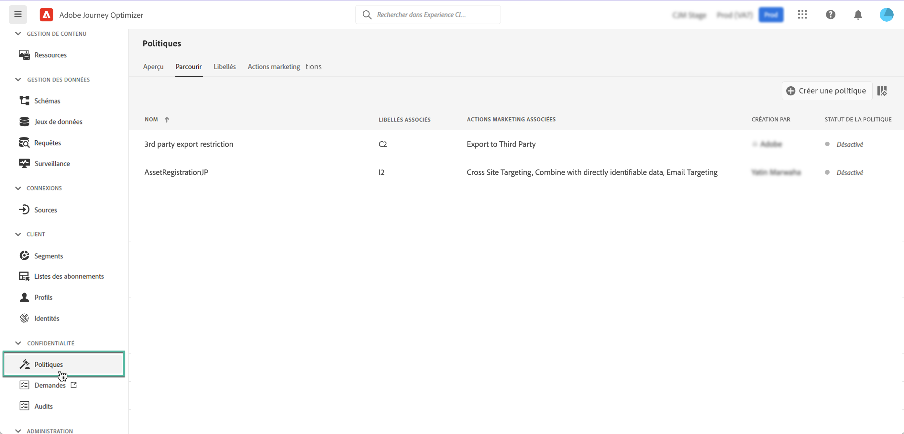

# Stratégies d’utilisation des données {#Policies}

Avec Adobe Experience Platform **Service de gouvernance des données**, vous pouvez appliquer des restrictions d’utilisation des données à l’aide d’étiquettes, d’actions marketing et de stratégies.

Pour ce faire, le service Gouvernance des données vous permet d’appliquer des libellés d’utilisation des données aux jeux de données et aux champs, en les classant en fonction des stratégies d’utilisation des données associées.

Les stratégies d’utilisation des données sont des règles qui décrivent les types d’actions marketing que vous êtes autorisé ou non à effectuer sur des données d’Experience Platform. Elles sont accessibles à partir du **[!UICONTROL Stratégies]** .

Pour plus d’informations sur la structure de gouvernance des données et sur l’utilisation des libellés et des stratégies, consultez la documentation de Adobe Experience Platform :

* [Présentation du service de gouvernance des données](https://experienceleague.adobe.com/docs/experience-platform/data-governance/home.html?lang=fr)
* [Présentation des libellés d’utilisation des données](https://experienceleague.adobe.com/docs/experience-platform/data-governance/labels/overview.html?lang=en)
* [Stratégies d’utilisation des données](https://experienceleague.adobe.com/docs/experience-platform/data-governance/policies/overview.html)
