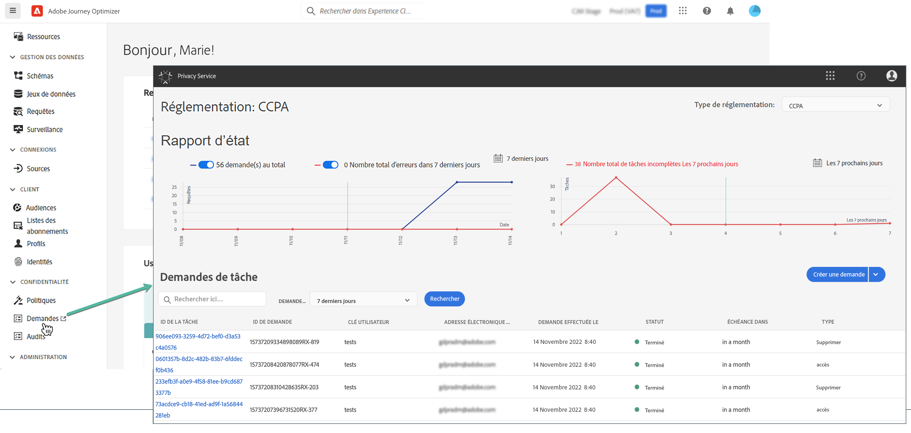

# Demandes d’accès à des informations personnelles {#track-changes}

>[!BEGINSHADEBOX]

**Sur cette page :** utilisez Adobe Experience Platform Privacy Service pour envoyer et gérer des demandes d’accès et de suppression de données pour Adobe Journey Optimizer, afin de pouvoir respecter les droits des titulaires de données et d’automatiser la conformité aux réglementations de confidentialité.

>[!ENDSHADEBOX]

Adobe Experience Platform **Privacy Service** fournit une API RESTful ainsi qu’une interface utilisateur vous permettant de gérer les demandes de données des clients. Grâce à Privacy Service, vous pouvez soumettre des demandes d’accès et de suppression de données personnelles des clients depuis les applications Adobe Experience Cloud. Cela facilite la mise en conformité automatique avec les réglementations légales et organisationnelles liées à la confidentialité.

Les demandes d’accès à des informations personnelles peuvent être créées et gérées à partir du menu **[!UICONTROL Demandes]**.



Pour plus d’informations sur Privacy Service et sur la manière de créer et gérer des demandes d’accès à des informations personnelles, consultez la [documentation d’Adobe Experience Platform](https://experienceleague.adobe.com/docs/experience-platform/privacy/home.html?lang=fr){target="_blank"}.

<!--
* [Privacy Service overview](https://experienceleague.adobe.com/docs/experience-platform/privacy/home.html?lang=fr)
* [Managing privacy jobs in the Privacy Service UI](https://experienceleague.adobe.com/docs/experience-platform/privacy/ui/user-guide.html?lang=fr)
-->

## Gérer les demandes individuelles d’accès à des informations personnelles que vous pouvez envoyer à Adobe Journey Optimizer {#data-privacy-requests}

Vous pouvez envoyer des demandes individuelles pour accéder aux données de la clientèle d’Adobe Journey Optimizer et les supprimer de deux manières :

* Par le biais de l’**Interface d’utilisation de Privacy Service**. [En savoir plus](https://experienceleague.adobe.com/docs/experience-platform/privacy/ui/user-guide.html?lang=fr){target="_blank"}
* Via l’API **&#x200B;**. [En savoir plus](https://experienceleague.adobe.com/fr/docs/experience-platform/privacy/api/overview){target="_blank"}
  <!--More specific information on Privacy Service API [here](https://developer.adobe.com/experience-platform-apis/references/privacy-service/#_blank).-->

Privacy Service prend en charge deux types de demandes : l’**accès aux données** et la **suppression de données**.

Pour les **demandes d’accès**, spécifiez « **Adobe Journey Optimizer** » dans l’IU (ou « **CJM** » comme code de produit dans l’API).

Pour les **demandes de suppression**, en plus de la demande « **Adobe Journey Optimizer** », vous devez également envoyer des demandes de suppression à **trois services en amont** pour empêcher Journey Optimizer de réinjecter les données supprimées. Si ces services en amont ne sont pas spécifiés, la demande « Adobe Journey Optimizer » restera à l’état « traitement » jusqu’à la création des demandes de suppression pour les services en amont.

Voici les trois services en amont :

* Profil (code produit : « profileService »)
* Lac de données AEP (code produit : « AdobeCloudPlatform »)
* Identité (code produit : « identity »)

>[!NOTE]
>
>Ce guide porte uniquement sur la manière d’effectuer des demandes d’accès à des informations personnelles pour [!UICONTROL Adobe Journey Optimizer].
>
>* Si vous prévoyez également d’effectuer des demandes d’accès à des informations personnelles pour le lac de données de Platform, reportez-vous à ce [guide](https://experienceleague.adobe.com/fr/docs/experience-platform/catalog/privacy), en plus de ce tutoriel.
>
>* Pour le profil client en temps réel, reportez-vous à ce [guide](https://experienceleague.adobe.com/fr/docs/experience-platform/profile/privacy).
>* Pour le Service d’identités, reportez-vous à ce [guide](https://experienceleague.adobe.com/fr/docs/experience-platform/identity/privacy).
>
>Pour les demandes de suppression et d’accès, vous devez appeler ces systèmes individuels afin de vous assurer que les demandes sont traitées par chacun d’entre eux. L’envoi d’une demande d’accès à des informations personnelles à [!DNL Adobe Journey Optimizer] ne supprime pas les données de tous ces systèmes.

## Créer des demandes d’accès et de suppression

### Conditions préalables

Pour envoyer des demandes d’accès et de suppression de données pour Adobe Journey Optimizer, vous devez disposer des éléments suivants :

* un ID d’organisation Adobe ;
* un identifiant d’identité de la personne sur laquelle vous souhaitez agir et le ou les espaces de noms correspondants. Pour plus d’informations sur les espaces de noms d’identité dans Adobe Journey Optimizer et Experience Platform, voir [Vue d’ensemble de l’espace de noms d’identité](https://experienceleague.adobe.com/fr/docs/experience-platform/identity/features/namespaces).

>[!IMPORTANT]
>
>Lors de l’envoi de demandes d’accès à des informations personnelles, veillez à spécifier « [!DNL '**Adobe Journey Optimizer**] » en tant que nom de produit ciblé et **tous les espaces de noms d’identité** (par exemple, « E-mail », « ECID » ou « ID de fidélité ») associés aux données de profil qui doivent être consultées ou supprimées. Pour les demandes de suppression, si vous n’incluez pas explicitement le nom du produit et tous les espaces de noms applicables, les données ne sont pas supprimées de [!DNL Adobe Journey Optimizer].

### Valeurs de champ requises dans Journey Optimizer pour les requêtes d’API

```json
"companyContexts":
    "namespace": imsOrgID
    "value": <Your Adobe Organization ID Value>

"users":
    "action": either access or delete

    "userIDs":
        "namespace": e.g. email, aaid, ecid, etc.
        "type": standard
        "value": <Data Subject's Identity Identifier>

"include":
    CJM (which is the Adobe product code for Adobe Journey Optimizer)
    profileService (product code for Profile)
    AdobeCloudPlatform (product code for AEP Data Lake)
    identity (product code for Identity)

"regulation":
    gdpr, ccpa, pdpa, lgpd_bra, or nzpa_nzl (which is the privacy regulation that applies to the request)
```


### Exemple de demande d’accès dans le cadre du RGPD :

Depuis l’interface d’utilisation :

{width="60%" align="center"}

Par le biais de l’API :

```json
// JSON Request
{
   "companyContexts":[
      {
         "namespace":"imsOrgID",
         "value":"745F37C35E4B776E0A49421B@AdobeOrg"
      }
   ],
   "users":[
      {
         "action":[
            "access"
         ],
         "userIDs":[
            {
               "namespace":"ecid",
               "value":"38400000-8cf0-11bd-b23e-10b96e40000d",
               "type":"standard"
            },
            {
               "namespace":"email",
               "value":"johndoe4@gmail.com",
               "type":"standard"
            }
         ]
      }
   ],
   "include":[
      "CJM"
   ],
   "regulation":"gdpr"
}
```

```json
// JSON Response
{
    "requestId": "17163122360480365RX-705",
    "totalRecords": 1,
    "jobs": [
        {
            "jobId": "e709b1f4-1796-11ef-b422-eddd0aebc40d",
            "customer": {
                "user": {
                    "key": "John Doe",
                    "action": [
                        "access"
                    ],
                    "userIDs": [
                        {
                            "namespace": "ecid",
                            "value": "38400000-8cf0-11bd-b23e-10b96e40000d",
                            "type": "standard",
                            "namespaceId": 4,
                            "isDeletedClientSide": false
                        },
                        {
                            "namespace": "email",
                            "value": "johndoe4@gmail.com",
                            "type": "standard",
                            "namespaceId": 6,
                            "isDeletedClientSide": false
                        }
                    ]
                }
            }
        }
    ]
}
```

### Exemple de demande de suppression dans le cadre du RGPD :

Depuis l’interface d’utilisation :

{width="60%" align="center"}

Par le biais de l’API :

```json
// JSON Request
{
  "companyContexts": [
    {
      "namespace": "imsOrgID",
      "value": "745F37C35E4B776E0A49421B@AdobeOrg"
    }
  ],
  "users": [
    {
      "action": [
          "delete"
      ],
      "userIDs": [
        {
          "namespace": "ecid",
          "value": "38400000-8cf0-11bd-b23e-10b96e40000d",
          "type": "standard"
        },
                {
          "namespace": "email",
          "value": "johndoe4@gmail.com",
          "type": "standard"
        }
      ]
    }
  ],
  "include": [
    "CJM", "profileService", "AdobeCloudPlatform", "identity"
  ],
  "regulation": "gdpr"
}
```

```json
// JSON Response
{
    "requestId": "17163122360480365RX-705",
    "totalRecords": 1,
    "jobs": [
        {
            "jobId": "e709b1f4-1796-11ef-b422-eddd0aebc40d",
            "customer": {
                "user": {
                    "key": "John Doe",
                    "action": [
                        "delete"
                    ],
                    "userIDs": [
                        {
                            "namespace": "ecid",
                            "value": "38400000-8cf0-11bd-b23e-10b96e40000d",
                            "type": "standard",
                            "namespaceId": 4,
                            "isDeletedClientSide": false
                        },
                        {
                            "namespace": "email",
                            "value": "johndoe4@gmail.com",
                            "type": "standard",
                            "namespaceId": 6,
                            "isDeletedClientSide": false
                        }
                    ]
                }
            }
        }
    ]
}
```
