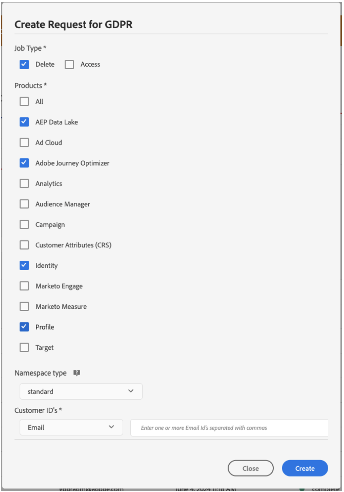

# Demandes d’accès à des informations personnelles {#track-changes}

Adobe Experience Platform **Privacy Service** fournit une API RESTful ainsi qu’une interface utilisateur vous permettant de gérer les demandes de données des clients. Grâce à Privacy Service, vous pouvez soumettre des demandes d’accès et de suppression de données personnelles des clients depuis les applications Adobe Experience Cloud. Cela facilite la mise en conformité automatique avec les réglementations légales et organisationnelles liées à la confidentialité.

Les demandes d’accès à des informations personnelles peuvent être créées et gérées à partir du menu **[!UICONTROL Demandes]**.


Pour plus d’informations sur Privacy Service et sur la création et la gestion des demandes d’accès à des informations personnelles, consultez la documentation d’Adobe Experience Platform :

* [Présentation de Privacy Service](https://experienceleague.adobe.com/docs/experience-platform/privacy/home.html?lang=fr)
* [Gérer les traitements relatifs à la confidentialité dans l’interface utilisateur de Privacy Service](https://experienceleague.adobe.com/docs/experience-platform/privacy/ui/user-guide.html?lang=fr)


## Gestion des demandes de confidentialité des données individuelles que vous pouvez envoyer à Adobe Journey Optimizer {#data-privacy-requests}

Vous pouvez envoyer des requêtes individuelles pour accéder aux données des consommateurs de Adobe Journey Optimizer et les supprimer de deux manières :

* Par le biais de la **Interface utilisateur du Privacy Service**. Consultez la documentation [here](https://experienceleague.adobe.com/en/docs/experience-platform/privacy/ui/user-guide#_blank).
* Par le biais de la **API PRIVACY SERVICE**. Consultez la documentation [here](https://developer.adobe.com/experience-platform-apis/references/privacy-service/#_blank) et informations sur l’API [here](https://developer.adobe.com/experience-platform-apis/#_blank).

Le Privacy Service prend en charge deux types de requêtes : **accès aux données** et **suppression de données**.

>[!NOTE]
>
>Ce guide porte uniquement sur la manière d’effectuer des demandes d’accès à des informations personnelles pour Adobe Journey Optimizer. Si vous prévoyez également d’effectuer des demandes d’accès à des informations personnelles pour le lac de données de Platform, reportez-vous à cette section [guide](https://experienceleague.adobe.com/en/docs/experience-platform/catalog/privacy) en plus de ce tutoriel. Pour le profil client en temps réel, reportez-vous à cette section [guide](https://experienceleague.adobe.com/en/docs/experience-platform/profile/privacy) et pour le service Identity, reportez-vous à cette section [guide](https://experienceleague.adobe.com/en/docs/experience-platform/identity/privacy). Pour les requêtes de suppression et d’accès, vous devez appeler ces systèmes individuels afin de vous assurer que les requêtes sont traitées par chacun d’eux. L’envoi d’une demande d’accès à des informations personnelles à Adobe Journey Optimizer ne supprimera pas les données de tous ces systèmes.

Pour **demandes d’accès**, spécifiez &quot;Adobe Journey Optimizer&quot; dans l’interface utilisateur (ou &quot;CJM&quot; comme code de produit dans l’API).

Pour **suppression de requêtes**, en plus de la requête &quot;Adobe Journey Optimizer&quot;, vous devez également envoyer des requêtes de suppression à trois services en amont pour empêcher Journey Optimizer de réinjecter les données supprimées. Si ces services en amont ne sont pas spécifiés, la requête &quot;Adobe Journey Optimizer&quot; restera à l’état &quot;traitement&quot; jusqu’à la création des requêtes de suppression pour les services en amont.

Les trois services en amont sont :

* Profil (code produit : &quot;profileService&quot;)
* Lac de données AEP (code produit : &quot;AdobeCloudPlatform&quot;)
* Identité (code produit : &quot;identité&quot;)

## Comment créer des demandes d’accès et de suppression

### Conditions préalables

Pour envoyer des demandes d’accès et de suppression de données pour Adobe Journey Optimizer, vous devez disposer des éléments suivants :

* un identifiant de l’organisation IMS ;
* un identifiant d’identité de la personne sur laquelle vous souhaitez agir et le ou les espaces de noms correspondants. Pour plus d’informations sur les espaces de noms d’identité dans Adobe Journey Optimizer et Experience Platform, voir [présentation de l’espace de noms d’identité](https://experienceleague.adobe.com/en/docs/experience-platform/identity/features/namespaces).

### Valeurs de champ requises dans Adobe Journey Optimizer pour les requêtes API

```json
"companyContexts":
    "namespace": imsOrgID
    "value": <Your IMS Org ID Value>

"users":
    "action": either access or delete

    "userIDs":
        "namespace": e.g. email, aaid, ecid, etc.
        "type": standard
        "value": <Data Subject's Identity Identifier>

"include":
    CJM (which is the Adobe product code for Adobe Journey Optimizer)
    profileService (product code for Profile)
    AdobeCloudPlatform (product code for AEP Data Lake)
    identity (product code for Identity)

"regulation":
    gdpr, ccpa, pdpa, lgpd_bra, or nzpa_nzl (which is the privacy regulation that applies to the request)
```


### Exemple de demande d’accès RGPD :

Dans l’interface utilisateur :


Via l’API :

```json
// JSON Request
{
   "companyContexts":[
      {
         "namespace":"imsOrgID",
         "value":"745F37C35E4B776E0A49421B@AdobeOrg"
      }
   ],
   "users":[
      {
         "action":[
            "access"
         ],
         "userIDs":[
            {
               "namespace":"ecid",
               "value":"38400000-8cf0-11bd-b23e-10b96e40000d",
               "type":"standard"
            },
            {
               "namespace":"email",
               "value":"johndoe4@gmail.com",
               "type":"standard"
            }
         ]
      }
   ],
   "include":[
      "CJM"
   ],
   "regulation":"gdpr"
}
```

```json
// JSON Response
{
    "requestId": "17163122360480365RX-705",
    "totalRecords": 1,
    "jobs": [
        {
            "jobId": "e709b1f4-1796-11ef-b422-eddd0aebc40d",
            "customer": {
                "user": {
                    "key": "John Doe",
                    "action": [
                        "access"
                    ],
                    "userIDs": [
                        {
                            "namespace": "ecid",
                            "value": "38400000-8cf0-11bd-b23e-10b96e40000d",
                            "type": "standard",
                            "namespaceId": 4,
                            "isDeletedClientSide": false
                        },
                        {
                            "namespace": "email",
                            "value": "johndoe4@gmail.com",
                            "type": "standard",
                            "namespaceId": 6,
                            "isDeletedClientSide": false
                        }
                    ]
                }
            }
        }
    ]
}
```

### Exemple de demande de suppression RGPD :

Dans l’interface utilisateur :



Via l’API :

```json
// JSON Request
{
  "companyContexts": [
    {
      "namespace": "imsOrgID",
      "value": "745F37C35E4B776E0A49421B@AdobeOrg"
    }
  ],
  "users": [
    {
      "action": [
          "delete"
      ],
      "userIDs": [
        {
          "namespace": "ecid",
          "value": "38400000-8cf0-11bd-b23e-10b96e40000d",
          "type": "standard"
        },
                {
          "namespace": "email",
          "value": "johndoe4@gmail.com",
          "type": "standard"
        }
      ]
    }
  ],
  "include": [
    "CJM", "profileService", "AdobeCloudPlatform", "identity"
  ],
  "regulation": "gdpr"
}
```

```json
// JSON Response
{
    "requestId": "17163122360480365RX-705",
    "totalRecords": 1,
    "jobs": [
        {
            "jobId": "e709b1f4-1796-11ef-b422-eddd0aebc40d",
            "customer": {
                "user": {
                    "key": "John Doe",
                    "action": [
                        "delete"
                    ],
                    "userIDs": [
                        {
                            "namespace": "ecid",
                            "value": "38400000-8cf0-11bd-b23e-10b96e40000d",
                            "type": "standard",
                            "namespaceId": 4,
                            "isDeletedClientSide": false
                        },
                        {
                            "namespace": "email",
                            "value": "johndoe4@gmail.com",
                            "type": "standard",
                            "namespaceId": 6,
                            "isDeletedClientSide": false
                        }
                    ]
                }
            }
        }
    ]
}
```
