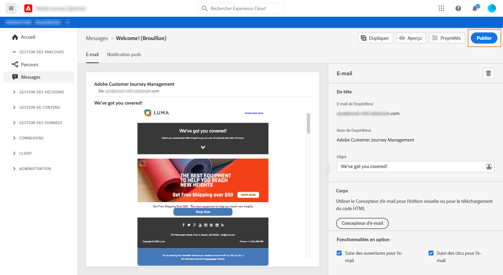
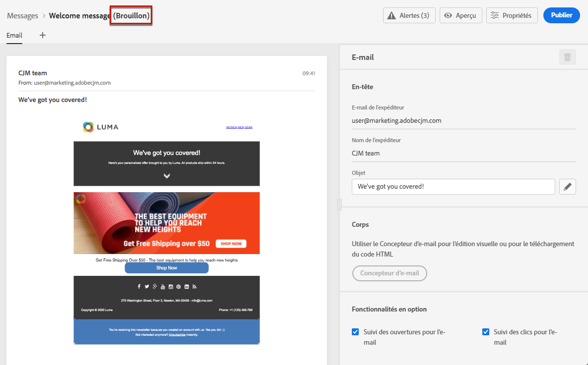

# Publier vos messages {#publish-manage-messages}

## Publier un message {#publish-message}

Une fois votre message créé, vous pouvez le publier pour le rendre disponible pour exécution.

>[!CAUTION]
>
>Avant de publier, vérifiez et résolvez les alertes. [En savoir plus](alerts.md).

Une fois votre message publié, il est ajouté à la liste de messages avec l’état **[!UICONTROL Publié]**.

Il est alors prêt à être déclenché par un ou plusieurs [parcours](building-journeys/journey.md).

## Mettre à jour un message en lecture seule {#modify-message}

Après publication, un message est en lecture seule. Vous pouvez toujours le mettre à jour en créant une nouvelle version préliminaire de ce message.

Vous pouvez ainsi mettre à jour le contenu ou corriger un problème, par exemple, sans publier à nouveau l’ensemble du parcours où votre message est utilisé.

>[!NOTE]
>
>La version préliminaire peut être modifiée alors que la version publiée est toujours publiée et active.

Pour mettre à jour un message publié :

1. Dans la liste de messages, sélectionnez votre message pour l’ouvrir.

1. Cliquez sur **[!UICONTROL Modifier]**.

   

1. Validez votre choix. Une version préliminaire du message est créée.

   

1. Modifiez le contenu ou les paramètres selon vos besoins.
1. Cliquez sur **[!UICONTROL Publier]**. Cette action publiera la nouvelle version du message qui sera utilisée pour les prochaines exécutions.

Dès que la nouvelle version est publiée, lors du prochain appel API, un nouveau message d’exécution est généré. Le prochain profil entrant recevra la nouvelle version.

<!--For batch messages, the audience/segment being processed in the previous execution will not be affected by the new version. Only the next incoming API call with an audience/segment will generate a new message execution with the new version.-->
