# Configuration du canal de notifications push {#push-notification-configuration}

[!DNL Journey Optimizer] vous permet de créer vos parcours et d’envoyer des messages à une audience ciblée. Avant de commencer à envoyer des notifications push avec [!DNL Journey Optimizer], vous devez vous assurer que les configurations et les intégrations sont en place sur l’application mobile, ainsi que dans [!DNL Adobe Experience Platform] et [!DNL Adobe Experience Platform Launch]. Pour comprendre le flux de données des notifications push dans [!DNL Adobe Journey Optimizer], reportez-vous à [cette page](push-gs.md).

## Avant de commencer

<!--
### Check provisioning

Your Adobe Experience Platform account must be provisioned to contain following schemas and datasets for push notification data flow to function correctly:

| Schema <br>Dataset                                                                       | Group of fields                                                                                                                                                                         | Operation                                                |
| -------------------------------------------------------------------------------------- | --------------------------------------------------------------------------------------------------------------------------------------------------------------------------------------- | -------------------------------------------------------- |
| CJM Push Profile Schema <br>CJM Push Profile Dataset                                     | Push Notification Details<br>Adobe CJM ExperienceEvent - Message Profile Details<br>Adobe CJM ExperienceEvent - Message Execution Details<br>Application Details<br>Environment Details | Register Push Token                                      |
| CJM Push Tracking Experience Event Schema<br>CJM Push Tracking Experience Event Dataset | Push Notification Tracking                                                                                                                                                              | Track interactions and provide data for the reporting UI |
-->

### Configuration des autorisations

Avant de créer une application mobile, vous devez vous assurer que vous disposez ou attribuez les autorisations utilisateur appropriées dans **Adobe Experience Platform Launch**. Pour en savoir plus, consultez la [documentation Adobe Experience Platform Launch](https://experienceleague.adobe.com/docs/launch/using/admin/user-permissions.html?lang=fr).

>[!CAUTION]
>
>La configuration push doit être effectuée par un utilisateur expert. Selon votre modèle de mise en oeuvre et les personnes impliquées dans cette mise en oeuvre, vous devrez peut-être attribuer l’ensemble des autorisations à un profil de produit unique ou partager des autorisations entre le développeur de l’application et l’administrateur **Adobe Journey Optimizer**. En savoir plus sur les **autorisations Adobe Experience Platform Launch** dans [cette documentation](https://experienceleague.adobe.com/docs/launch/using/admin/user-permissions.html?lang=en#platform-launch-permissions)

<!--ou need to your have access to perform following roles :

* Manage Datastreams
* Manage Client-side Properties
* Manage App Configurations
-->

Pour attribuer des droits **Propriété** et **Société**, procédez comme suit :

1. Accédez à **[!DNL Admin Console]**.

1. Dans l&#39;onglet **[!UICONTROL Produits]**, sélectionnez la vignette **[!UICONTROL Adobe Experience Platform Launch]**.

   

1. Sélectionnez un **[!UICONTROL Profil de produit]** existant ou créez-en un en cliquant sur le bouton **[!UICONTROL Nouveau profil]**. Découvrez comment créer un **[!UICONTROL nouveau profil]** dans la [documentation de la console d’administration](https://experienceleague.adobe.com/docs/experience-platform/access-control/ui/create-profile.html?lang=fr#ui).

1. Dans l&#39;onglet **[!UICONTROL Autorisations]**, sélectionnez **[!UICONTROL Droits de propriété]**.

   

1. Cliquez sur **[!UICONTROL Ajouter tout]**. Vous ajouterez ainsi les droits suivants à votre profil de produit :
   * **[!UICONTROL Approuver]**
   * **[!UICONTROL Développer]**
   * **[!UICONTROL Gérer les environnements]**
   * **[!UICONTROL Gérer les extensions]**
   * **[!UICONTROL Publier]**

   Ces autorisations sont requises pour installer et publier l’extension Adobe Journey Optimizer et publier la propriété de l’application dans le SDK Adobe Experience Platform Mobile.

1. Sélectionnez ensuite **[!UICONTROL Droits d&#39;entreprise]** dans le menu de gauche.

   

1. Ajoutez les droits suivants :

   * **[!UICONTROL Gérer les configurations d&#39;application]**
   * **[!UICONTROL Gérer les propriétés]**

   Ces autorisations sont requises pour que le développeur de l’application mobile configure les informations d’identification push dans **Adobe Experience Launch** et définissent les paramètres prédéfinis de notification push dans **Adobe Journey Optimizer**.

   

1. Cliquez sur **[!UICONTROL Enregistrer]**.

Pour attribuer ce **[!UICONTROL profil de produit]** aux utilisateurs, procédez comme suit :

1. Accédez à **[!DNL Admin Console]**.

1. Dans l&#39;onglet **[!UICONTROL Produits]**, sélectionnez la vignette **[!UICONTROL Adobe Experience Platform Launch]**.

1. Sélectionnez votre **[!UICONTROL Profil de produit]** précédemment configuré.

1. Dans l&#39;onglet **[!UICONTROL Utilisateurs]**, cliquez sur **[!UICONTROL Ajouter un utilisateur]**.

   

1. Saisissez le nom ou l&#39;adresse email de votre utilisateur et sélectionnez-le. Cliquez ensuite sur **[!UICONTROL Enregistrer]**.

   >[!NOTE]
   >
   >Si l&#39;utilisateur n&#39;a pas été créé auparavant dans Admin Console, consultez la [documentation relative à l&#39;ajout d&#39;utilisateurs](https://helpx.adobe.com/fr/enterprise/admin-guide.html/enterprise/using/manage-users-individually.ug.html#add-users).

   

### Configuration de votre application

La configuration technique implique une collaboration étroite entre le développeur de l’application et l’administrateur de l’entreprise. Avant de commencer à envoyer des notifications push avec [!DNL Journey Optimizer], vous devez définir les paramètres dans Adobe Experience Platform Launch et intégrer votre application mobile avec les SDK Adobe Experience Platform Mobile.

Suivez les étapes de mise en oeuvre présentées dans les liens ci-dessous :

* Pour **Apple iOS** : Découvrez comment enregistrer votre application avec des APNS dans la [Documentation Apple](https://developer.apple.com/documentation/usernotifications/registering_your_app_with_apns)
* Pour **Google Android** : Découvrez comment configurer une application cliente Firebase Cloud Messaging sur Android dans [Documentation Google](https://firebase.google.com/docs/cloud-messaging/android/client)

### Intégration de votre application mobile avec le SDK Adobe Experience Platform

Le SDK Mobile Adobe Experience Platform fournit des API d’intégration côté client pour vos mobiles via des SDK compatibles Android et iOS. Consultez la [documentation du SDK Mobile Adobe Experience Platform](https://aep-sdks.gitbook.io/docs/getting-started/overview) pour obtenir une configuration avec les SDK mobiles Adobe Experience Platform dans votre application.

D’ici la fin de cette période, vous aurez également créé et configuré une propriété mobile dans Adobe Experience Platform Launch. En règle générale, vous créez une propriété mobile pour chaque application mobile que vous souhaitez gérer. Découvrez comment créer et configurer une propriété mobile dans la [documentation Adobe Experience Platform Launch](https://aep-sdks.gitbook.io/docs/getting-started/create-a-mobile-property).


## Étape 1 : Ajout des informations d’identification push de votre application dans Adobe Experience Platform Launch {#push-credentials-launch}

Après avoir accordé les autorisations utilisateur appropriées, vous devez maintenant ajouter les informations d&#39;identification push de votre application mobile dans [!DNL Adobe Experience Platform Launch].

L’enregistrement des informations d’identification push de l’application mobile est nécessaire pour autoriser Adobe à envoyer des notifications push en votre nom. Reportez-vous aux étapes détaillées ci-dessous :

1. Dans [!DNL Adobe Experience Platform Launch], vérifiez que **[!UICONTROL Côté client]** est sélectionné dans le menu déroulant.

1. Sélectionnez l’onglet **[!UICONTROL Configurations d’application]** dans le panneau de gauche et cliquez sur **[!UICONTROL Configuration d’application]** pour créer une configuration.

1. Entrez un **[!UICONTROL Nom]** pour la configuration.

1. Dans le menu déroulant **[!UICONTROL Type de service de messagerie]**, sélectionnez le **[!UICONTROL Type de service de messagerie]** à utiliser pour ces informations d’identification.

   * **Pour Android**

      

      1. Indiquez l’ **[!UICONTROL ID d’application (nom du package Android)]** : en règle générale, le nom du module est l’ID d’application dans votre fichier `build.gradle`.

      1. Faites glisser et déposez les informations d’identification push FCM. Pour plus d’informations sur la manière d’obtenir les informations d’identification push, voir [Documentation Google](https://firebase.google.com/docs/admin/setup#initialize-sdk).
   * **Pour iOS**

      

      1. Renseignez l’application mobile **Bundle Id** dans le champ **[!UICONTROL App ID (iOS Bundle ID)]** . L’ID de bundle d’application se trouve dans l’onglet **Général** de la cible Principale dans **XCode**.

      1. Faites glisser et déposez la **Clé d’authentification de notification push Apple** pour votre compte de développeur Apple. Cette clé peut être obtenue à partir de la page **Certificats**, **Identifiants** et **Profils**.

      1. Indiquez l’ **ID de clé**. Chaîne de 10 caractères attribuée lors de la création de la clé d’authentification p8. Elle se trouve sous l’onglet **Clés** de la page **Certificats**, **Identifiants** et **Profils**.

      1. Indiquez l’ **ID d’équipe**. Il s’agit d’une valeur de chaîne qui se trouve sous l’onglet Appartenance .


1. Cliquez sur **[!UICONTROL Enregistrer]** pour créer votre configuration d’application.

<!--
## Step 2: Set up a mobile property in Adobe Experience Platform Launch {#launch-property}

Setting up a mobile property allows the mobile app developer or marketer to configure the mobile SDKs attributes such as Session Timeouts, the [!DNL Adobe Experience Platform] sandbox to be targeted and the **[!UICONTROL Adobe Experience Platform Datasets]** to be used for mobile SDK to send data to.

For further details and procedures on how to set up a **[!UICONTROL Platform Launch property]**, refer to the steps detailed in [Adobe Experience Platform Mobile SDK documentation](https://aep-sdks.gitbook.io/docs/getting-started/create-a-mobile-property#create-a-mobile-property).


To get the SDKs needed for push notification to work you will need the following SDK extensions, for both Android and iOS:

* **[!UICONTROL Mobile Core]** (installed automatically)
* **[!UICONTROL Profile]** (installed automatically)
* **[!UICONTROL Adobe Experience Platform Edge]**
* **[!UICONTROL Adobe Experience Platform Assurance]**, optional but recommended to debug the mobile implementation.

Learn more about [!DNL Adobe Experience Platform Launch] extensions in [Adobe Experience Platform Launch documentation](https://experienceleague.adobe.com/docs/launch-learn/implementing-in-mobile-android-apps-with-launch/configure-launch/launch-add-extensions.html).
-->

## Étape 2 : Configuration de l’extension Adobe Journey Optimizer dans votre propriété mobile

L’ **extension Adobe Journey Optimizer** pour les SDK mobiles Adobe Experience Platform alimente les notifications push pour vos applications mobiles et vous aide à collecter des jetons push utilisateur et à gérer la mesure des interactions avec les services Adobe Experience Platform.

Découvrez comment configurer l’extension Journey Optimizer dans la [documentation du SDK Mobile Adobe Experience Platform](https://aep-sdks.gitbook.io/docs/using-mobile-extensions/adobe-journey-optimizer).


<!-- 
**[!UICONTROL Edge configuration]** is used by **[!UICONTROL Edge]** extension to send custom data from mobile device to [!DNL Adobe Experience Platform]. 
To configure [!DNL Adobe Experience Platform], you must provide the **[!UICONTROL Sandbox]** name and **[!UICONTROL Event Dataset]**.

For further details and procedures on how to create **[!UICONTROL Edge configuration]**, refer to the steps detailed in [Adobe Experience Platform Mobile SDK documentation](https://aep-sdks.gitbook.io/docs/getting-started/configure-datastreams).

1. From [!DNL Adobe Experience Platform Launch], select the **[!UICONTROL Edge Configurations]** tab and click **[!UICONTROL Edge Configurations]**.
    
1. Select **[!UICONTROL New Edge Configuration]** to add a new **[!UICONTROL Edge Configuration]**.
1. Enter a **[!UICONTROL Name]** and click **[!UICONTROL Save]**

1. Click the **[!UICONTROL Adobe Experience Platform]** toggle to enable it.

1. Fill in the **[!UICONTROL Sandbox]**, **[!UICONTROL Event dataset]** and **[!UICONTROL Profile Dataset]** fields. Then, click **[!UICONTROL Save]**.
    
    


1. From [!DNL Adobe Experience Platform Launch], ensure that **[!UICONTROL Client Side]** is selected in the drop-down menu.

1. select the **[!UICONTROL Properties]** tab and click **[!UICONTROL New Property]**.

    

1. Enter a **[!UICONTROL Name]** for your new property.

1. Select **[!UICONTROL Mobile]** as **[!UICONTROL Platform]**.

    

1. Click **[!UICONTROL Save]** to create your new property.

To configure **[!UICONTROL Adobe Experience Platform Edge Extension]** to send custom data from mobile devices to [!DNL Adobe Experience Platform].

1. Select your previously created property and select the **[!UICONTROL Extensions]** tab to view the extensions for this property.

    

1. Click **[!UICONTROL Configure]** under the **[!UICONTROL Adobe Experience Platform Edge]** Network' extension.

1. From the **[!UICONTROL Edge Configuration]** drop-down list, select the **[!UICONTROL Edge Configuration]** created in the previous steps. For more information on **[!UICONTROL Edge Configuration]**, refer to this [section](#edge-configuration).

1. Click **[!UICONTROL Save]**.

To configure **[!UICONTROL Adobe Experience Platform Messaging]** extension to send push profile and push interactions to the correct datasets, follow the same steps as above. Use **[!UICONTROL Sandbox]**, **[!UICONTROL Event dataset]** and **[!UICONTROL Profile Dataset]** created in the [Adobe Experience Platform setup](#edge-configuration).
-->

<!--
## Step 4: Publish the Property {#publish-property}

You now need to publish the property to integrate your configuration and to use it in the mobile app. 

To publish your property, refer to the steps detailed in [Adobe Experience Platform Mobile SDK documentation](https://aep-sdks.gitbook.io/docs/getting-started/create-a-mobile-property#publish-the-configuration)

## Step 5: Configure the ProfileDataSource {#configure-profiledatasource}

To configure the `ProfileDataSource`, use the `ProfileDCInletURL` from [!DNL Adobe Experience Platform] setup and add the following in the mobile app:

```
    MobileCore.updateConfiguration(
    mutableMapOf("messaging.dccs" to <ProfileDCSInletURL>)
```

-->

## Étape 3 : Test de votre application mobile avec un événement {#mobile-app-test}

Après avoir configuré votre application mobile dans Adobe Experience Platform et Adobe Launch, vous pouvez désormais la tester avant d’envoyer des notifications push à vos profils. Dans ce cas pratique, nous allons créer un parcours pour cibler notre application mobile et définir un événement qui déclenchera la notification push.

<!--
You can use a test mobile app for this use case. For more on this, refer to this [page](https://wiki.corp.adobe.com/pages/viewpage.action?spaceKey=CJM&title=Details+of+setting+the+mobile+test+app) (internal use only).
-->

Pour que ce parcours fonctionne, vous devez créer un schéma XDM. Pour plus d’informations, reportez-vous à la [documentation XDM](https://experienceleague.adobe.com/docs/experience-platform/xdm/schema/composition.html?lang=en#schemas-and-data-ingestion).

1. Dans le menu de gauche, accédez à **[!UICONTROL Schémas]**.

1. Cliquez sur **[!UICONTROL Créer un schéma]** puis sélectionnez **[!UICONTROL XDM ExperienceEvent]**.

   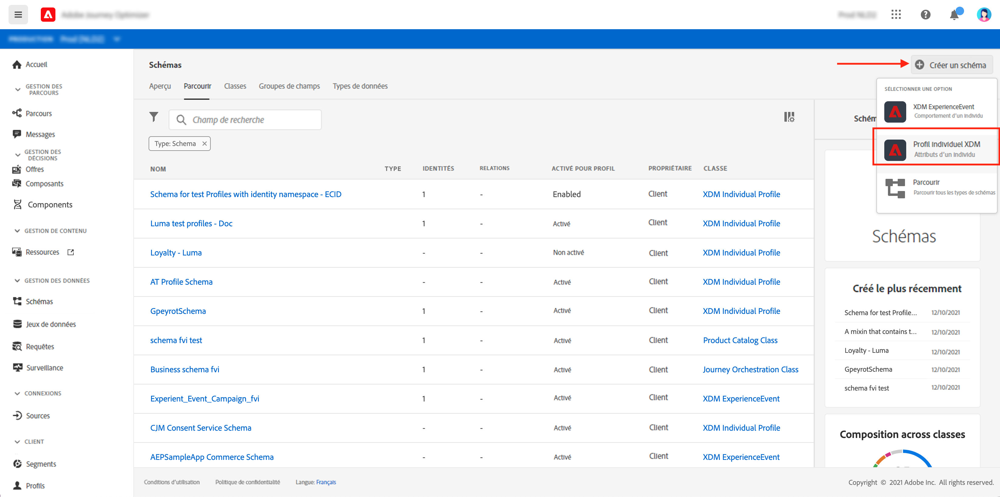

1. Sélectionnez **[!UICONTROL Créer un groupe de champs]**.

1. Saisissez un **[!UICONTROL Nom d’affichage]** et une **[!UICONTROL Description]**. Cliquez sur **[!UICONTROL Ajouter des groupes de champs]** lorsque vous avez terminé. Pour plus d’informations sur la création de groupes de champs, consultez la [documentation du système XDM](https://experienceleague.adobe.com/docs/experience-platform/xdm/tutorials/create-schema-ui.html?lang=fr).


   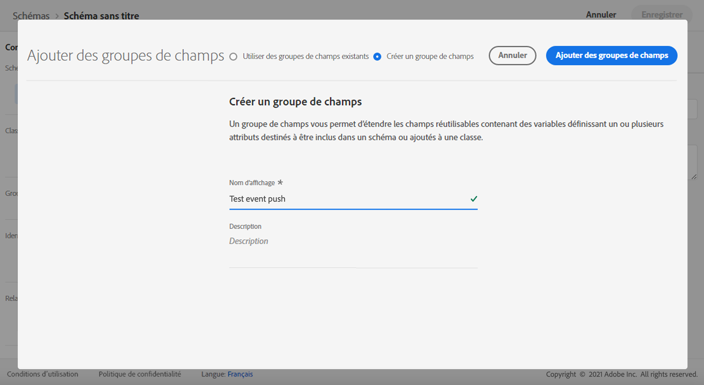

1. Sur le côté gauche, sélectionnez le schéma. Dans le volet de droite, saisissez le nom de votre schéma et votre description. Activez ce schéma pour **[!UICONTROL Profil]**.

   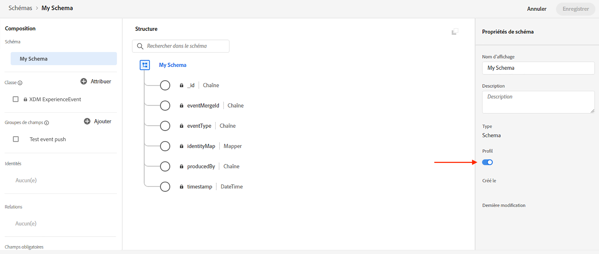


1. Sur le côté gauche, sélectionnez le groupe de champs, puis cliquez sur l’icône + pour créer un champ. Dans la zone **[!UICONTROL Le champ regroupe les propriétés]**, sur le côté droit, saisissez un **[!UICONTROL nom du champ]**, **[!UICONTROL nom d’affichage]** et sélectionnez **[!UICONTROL Chaîne]** comme **[!UICONTROL type]**.

   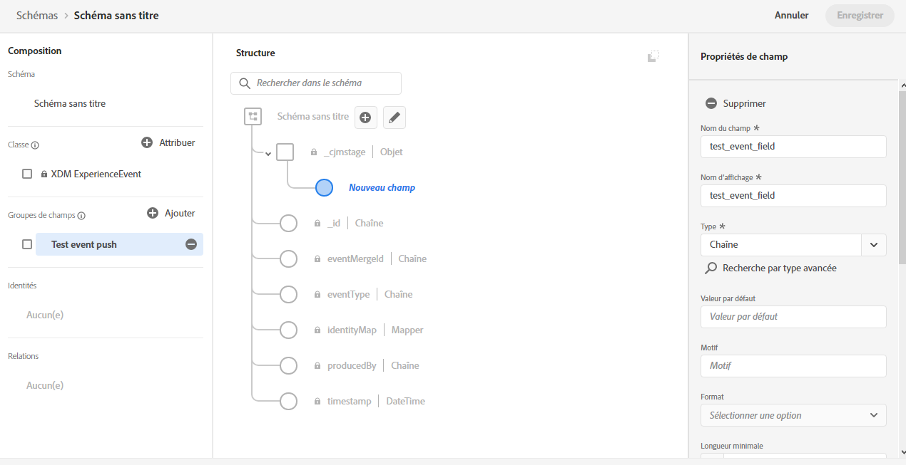

1. Cochez **[!UICONTROL Obligatoire]** et cliquez sur **[!UICONTROL Appliquer]**.

1. Cliquez sur **[!UICONTROL Enregistrer]**. Votre schéma est maintenant créé et peut être utilisé dans un événement.

Vous devez ensuite configurer un événement.

1. Dans le menu de gauche de la page d’accueil, sous ADMINISTRATION, sélectionnez **[!UICONTROL Configurations]**. Cliquez sur **[!UICONTROL Gérer]** dans la section **[!UICONTROL Événements]** pour créer votre événement.

1. Cliquez sur **[!UICONTROL Créer un événement]**. Le volet de configuration des événements s’ouvre sur le côté droit de l’écran.

   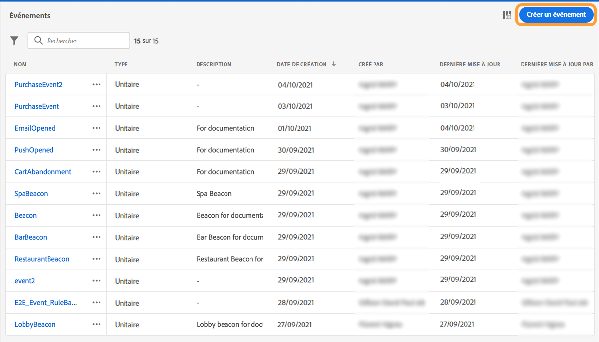

1. Saisissez le nom de votre événement. Vous pouvez également ajouter une description.

1. Dans le champ **[!UICONTROL Type d&#39;identifiant d&#39;événement]**, sélectionnez **[!UICONTROL Basé sur des règles]**.

1. Dans la section **[!UICONTROL Paramètres]**, sélectionnez le schéma créé précédemment.

   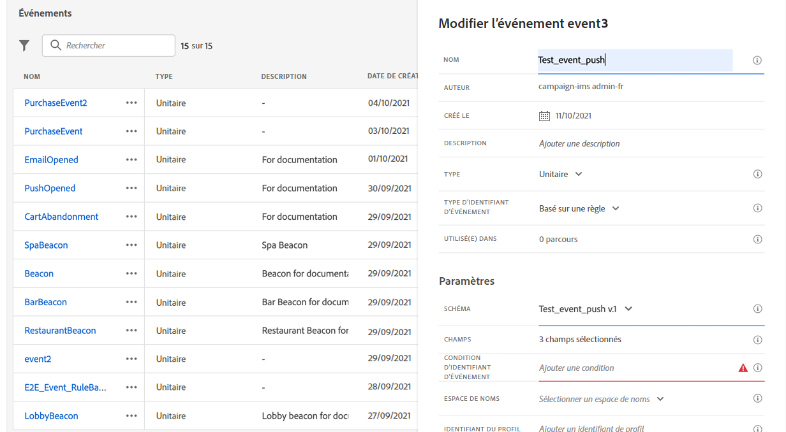

1. Dans la liste des champs, vérifiez que le champ créé dans le groupe de champs du schéma est sélectionné.

   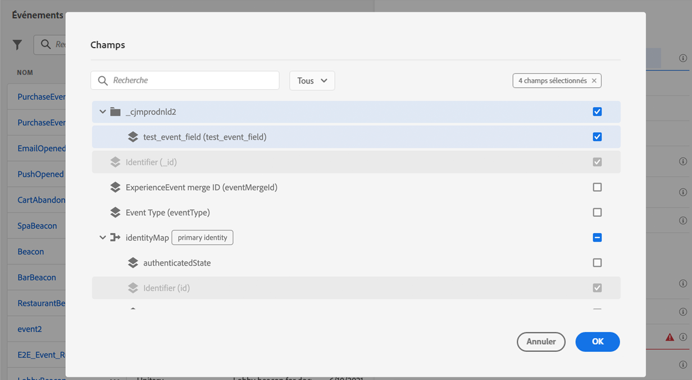

1. Cliquez sur **[!UICONTROL Modifier]** dans le champ **[!UICONTROL Condition de l’ID d’événement]** . Faites glisser et déposez le champ précédemment ajouté pour définir la condition qui sera utilisée par le système pour identifier les événements qui déclencheront votre parcours.

   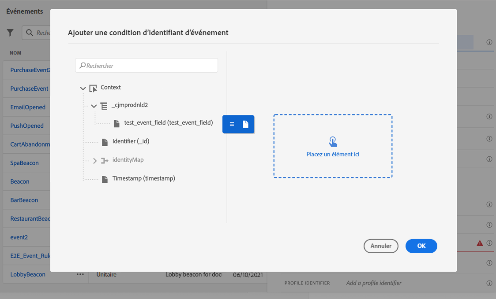

1. Saisissez la syntaxe à utiliser pour déclencher votre notification push dans votre application de test, dans cet exemple **confirmation de commande**.

   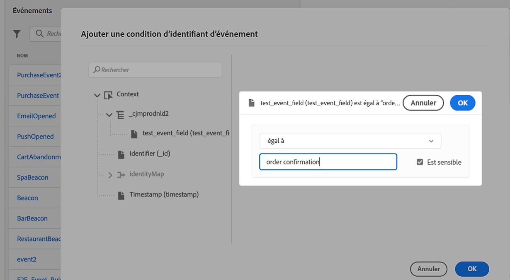

1. Sélectionnez **[!UICONTROL ECID]** comme **[!UICONTROL Espace de noms]**.

1. Cliquez sur **[!UICONTROL Ok]** puis sur **[!UICONTROL Enregistrer]**.

Votre événement est maintenant créé et peut maintenant être utilisé dans un parcours.

1. Dans le menu de gauche, cliquez sur **[!UICONTROL Parcours]**.

1. Cliquez sur **[!UICONTROL Créer un Parcours]** pour créer un parcours.

1. Modifiez les propriétés du parcours dans le volet de configuration qui s&#39;affiche dans la partie droite. En savoir plus dans cette [section](building-journeys/journey-gs.md#change-properties).

1. Commencez par faire glisser l’événement créé lors des étapes précédentes à partir de la liste déroulante **[!UICONTROL Événements]**.

   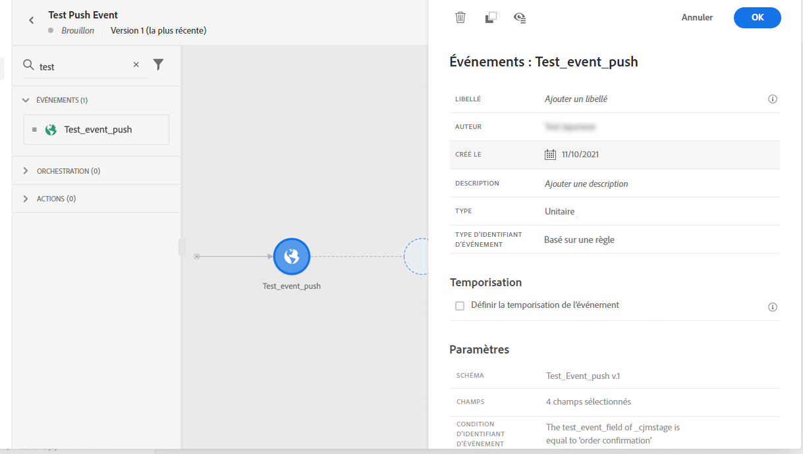

1. Dans la liste déroulante **[!UICONTROL Actions]**, placez une activité **[!UICONTROL Message]** dans votre parcours.

1. Sélectionnez un message créé précédemment. Pour plus d’informations sur la création de notifications push, consultez cette [page](create-message.md).

1. Placez une activité **[!UICONTROL Fin]** dans votre parcours.

1. Cliquez sur la bascule **[!UICONTROL Test]** pour commencer à tester vos notifications push et cliquez sur **[!UICONTROL Déclencher un événement]**.

   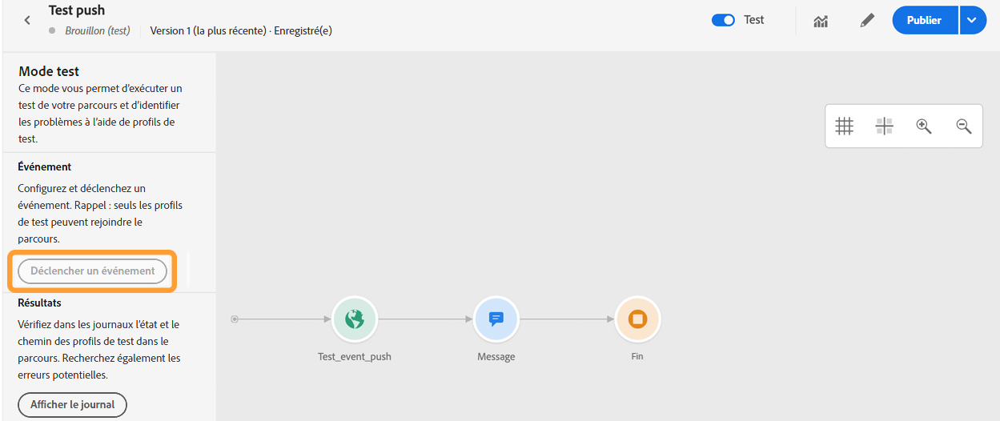

1. Saisissez votre ECID dans le champ **[!UICONTROL Clé]** puis saisissez **confirmation de commande** dans le deuxième champ.

   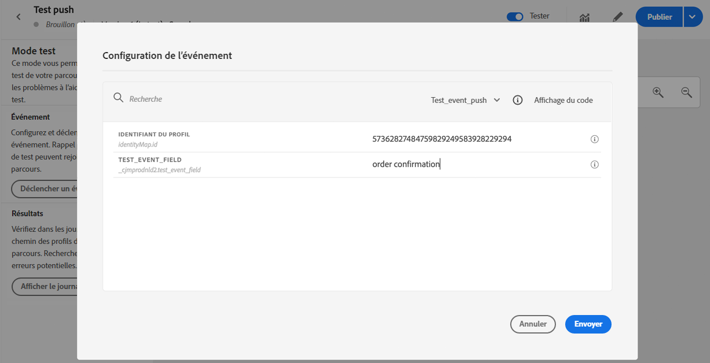

1. Cliquez sur **[!UICONTROL Envoyer]**.

Votre événement sera déclenché et vous recevrez votre notification push vers votre application mobile.

## Étape 4 : Création d’un paramètre prédéfini de message pour push{#message-preset}

Une fois votre application mobile configurée dans [!DNL Adobe Experience Platform Launch], vous devez créer un préréglage de message afin de pouvoir envoyer des notifications push depuis **[!DNL Journey Optimizer]**.

Découvrez comment créer et configurer un préréglage de message dans [cette section](configuration/message-presets.md).

Vous êtes maintenant prêt à envoyer des notifications push avec Journey Optimizer.

* Découvrez comment créer un message push dans [cette page](create-push.md).
* Découvrez comment envoyer ajouter un message dans un parcours dans [cette section](building-journeys/journeys-message.md).
