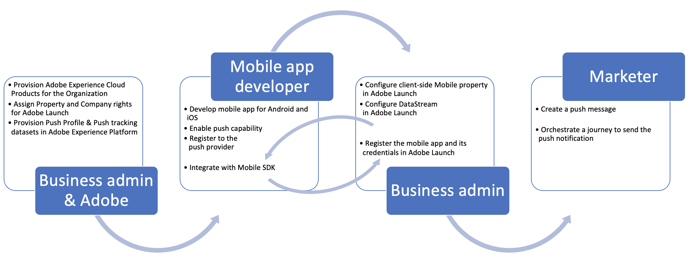

# Configuration de notifications push {#get-started-push}

Les notifications push vous aident à atteindre les utilisateurs de votre application mobile à tout moment, en particulier lorsqu’ils n’utilisent pas activement votre application. Les notifications push peuvent vous aider à réaliser divers cas d’utilisation, tels que fournir des mises à jour sur votre service, demander à un utilisateur de prendre des mesures, alerter l’utilisateur d’une nouvelle transaction, etc. Les plateformes d’appareil nécessitent un accord préalable avant que les utilisateurs finaux puissent recevoir ou afficher vos notifications. L’inclusion de l’utilisateur peut être reçue dès le lancement de l’application pour la première fois après l’installation ou au cours d’une session ou d’un workflow ultérieur, selon le cas. [!DNL Journey Optimizer] prend en charge les notifications push et vous aide à envoyer des notifications hautement pertinentes à des taux de débit de pointe. Les notifications push peuvent inclure la personnalisation et un contexte basé sur les Parcours afin d’exploiter les informations de données de votre marque avec Adobe Experience Cloud.

Cette page vous aidera à configurer et comprendre les services et les workflows clés impliqués dans les notifications push dans [!DNL Journey Optimizer].

## Définition des notifications push avec Adobe Journey Optimizer

Pour envoyer des notifications push avec Adobe Journey Optimizer, vous devez effectuer les étapes suivantes :

1. Consultez la documentation pour obtenir une configuration avec les [SDK mobiles Adobe Journey Optimizer et Adobe Experience Platform](https://aep-sdks.gitbook.io/docs/beta/adobe-journey-optimizer) dans votre application.
1. Créer [paramètre prédéfini pour le canal de messagerie push](configuration/message-presets.md)

## Notifications push et Adobe Journey Optimizer

Le graphique suivant montre les systèmes et services impliqués dans les flux de données associés et montre comment les notifications push sont diffusées du point de vue du service de bout en bout.

1. Enregistrement de votre application mobile de marque (Android ou iOS) avec les APNS d’Apple et les services de messagerie push Google FCM
1. Les services de messagerie génèrent un jeton push, qui est un identifiant qu’Adobe Journey Optimizer utilisera pour cibler l’appareil spécifique avec une notification push.
1. Le jeton push généré précédemment est transmis à Adobe Experience Platform et synchronisé avec Real-time Customer Profile. cela est fait en standard avec un SDK client facile à intégrer
1. Les messages push sont créés dans Adobe Journey Optimizer, les messages push sont créés selon un paramètre prédéfini de message.
1. Les messages push peuvent être inclus dans le canevas d’orchestration en Parcours.
1. Lors de la publication par Parcours, les profils client basés sur les conditions de Parcours sont qualifiés pour recevoir des notifications push, les payloads de messagerie push sont personnalisés à cette étape.
1. Les payloads push personnalisées sont transférées vers un service de diffusion de messagerie push interne.
1. Ce service interne valide ensuite les informations d’identification de l’application associée au message, et
1. Envoie le message aux services de messagerie Apple et Google pour une diffusion finale
1. Les commentaires des services de messagerie sont signalés, les erreurs et les succès sont consignés pour la création de rapports dans les rapports Parcours Live et globaux.
1. Les notifications push sont diffusées sur les appareils de l’utilisateur final.
1. Les interactions de notification push de l’utilisateur final sont envoyées en tant qu’événements d’expérience du client de l’utilisateur final via l’intégration du SDK.

## Rôles des services clés dans les notifications push

* **Les** fournisseurs de services de notification push sont les services web des composants principaux qui diffusent des notifications de serveurs distants vers des applications mobiles.

   [!DNL Adobe Journey Optimizer]  prend en charge les plateformes Android et iOS et s’intègre ainsi aux fonctionnalités suivantes :
   * [Firebase Cloud Messaging (FCM)](https://firebase.google.com/docs/cloud-messaging)  - pour envoyer des notifications à l’application mobile Android
   * [Apple Push Notification Service (APNS)](https://developer.apple.com/library/archive/documentation/NetworkingInternet/Conceptual/RemoteNotificationsPG/APNSOverview.html)  - pour envoyer des notifications à l’application mobile iOS

* **SDK Adobe Experience Platform Mobile** qui fournit des API d’intégration côté client pour vos mobiles via des SDK compatibles Android et iOS. Le SDK fournit une extension Journey Optimizer Adobe exposant diverses API spécifiques à la messagerie push et permettant le flux de données, comme l’enregistrement du jeton push ou l’envoi d’événements de suivi push ou de tout autre événement d’expérience personnalisé à Adobe Experience Platform. Le SDK fournit également diverses autres extensions qui activent d’autres fonctionnalités Adobe Experience Cloud ainsi que des fonctionnalités de partenaires tiers.

   L’intégration du SDK nécessite également la configuration des services de collecte de données [Adobe Experience Platform](https://experienceleague.adobe.com/docs/launch/using/home.html) tels que :

   * Création d’un flux de données pour configurer les jeux de données de profil et d’événement d’expérience sur lesquels les données sont transmises à Adobe Experience Platform
   * Création de propriétés mobiles côté client et ajout d’extensions. Le SDK s’intègre étroitement à ces extensions pour offrir une expérience de collecte de données transparente.
   * Enregistrement de l’identifiant de lot d’applications mobiles et des informations d’identification de l’application

* **Adobe Experience Platform Real-time Customer**  Profile offre une vue d’ensemble de chaque client en combinant des données issues de plusieurs canaux, notamment le web, les appareils mobiles, le CRM et des tiers. Profile vous permet de consolider vos données client en une vue unifiée offrant un compte horodaté et exploitable de chaque interaction client. Le jeton push d’un utilisateur de l’application donné est stocké par rapport au profil de l’utilisateur en tant que données d’enregistrement, tandis que les interactions de l’utilisateur avec les notifications push sont suivies en tant que données d’événements de série temporelle. [En savoir plus sur le profil client en temps réel de Adobe Experience Platform](https://experienceleague.adobe.com/docs/experience-platform/profile/home.html?lang=fr)

* **[!DNL Adobe Journey Optimizer]** : une fois vos intégrations d’applications mobiles avec les composants mentionnés ci-dessus en place et vos profils client dans Adobe Experience Platform, vous pouvez créer et orchestrer des notifications push dans Adobe Journey Optimizer pour interagir avec vos utilisateurs.

## Configuration technique push et workflows pratiques

Le graphique suivant présente les différentes étapes, de bout en bout, de la configuration des composants qui forment l’ossature du flux de données push. Les éléments d’action ont été classés en fonction du rôle exécutant la configuration et du composant en cours de configuration.

