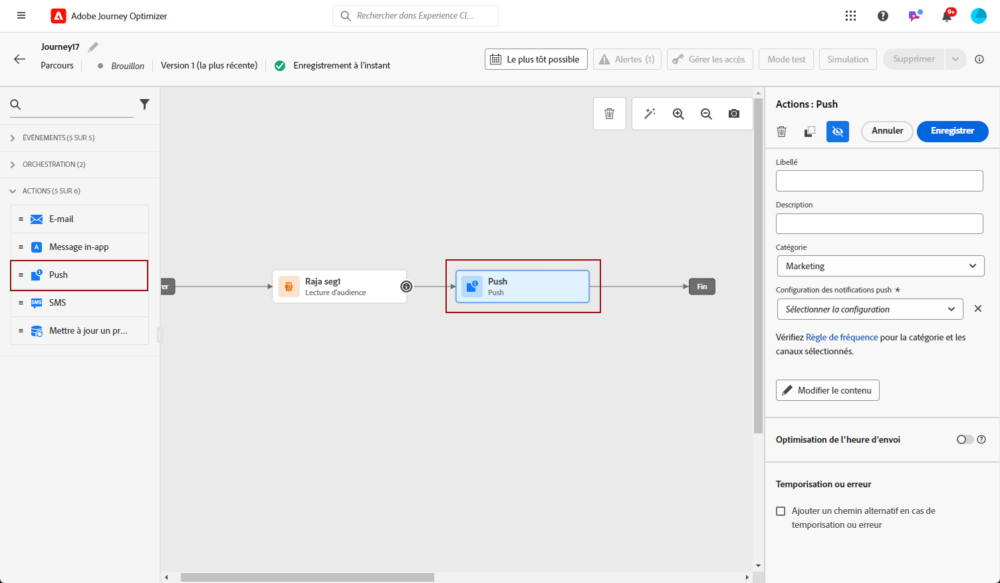
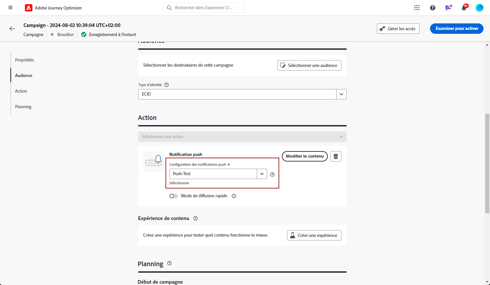

# Créer une notification push {#create-push-notification}

>[!CONTEXTUALHELP]
>id="ajo_message_push"
>title="Créer un message push"
>abstract="Ajoutez votre message push et commencez à le personnaliser à l’aide de l’éditeur de personnalisation."

Vous pouvez créer des notifications push pour les appareils mobiles (iOS et Android) et les navigateurs web. Cette page vous guide tout au long du processus de configuration d’une notification push dans un parcours ou une campagne.

## Créer la notification push dans un parcours ou une campagne {#create}

Pour créer une notification push, procédez comme suit :

>[!BEGINTABS]

>[!TAB Ajouter une notification push à un parcours]

1. Ouvrez votre parcours, puis effectuez un glisser-déposer d’une activité **[!UICONTROL Action]** depuis la section **[!UICONTROL Actions]** de la palette. En savoir plus sur l’activité [Action](../building-journeys/journey-action.md).

   >[!IMPORTANT]
   >
   >Tous les canaux natifs étant désormais accessibles par le biais de l’activité Action , les activités de canal natives héritées seront abandonnées avec la version de mars. Les parcours existants qui incluent des actions héritées continueront à fonctionner en l’état. Aucune migration n’est requise.

1. Sélectionnez **[!UICONTROL Push]** comme type d’action.

   

1. Saisissez un **[!UICONTROL Libellé]** pour identifier votre action dans la zone de travail du parcours.

1. Cliquez sur le bouton **[!UICONTROL Configurer l’action]**.

1. Vous accédez à l’onglet **[!UICONTROL Actions]**. À partir de là, sélectionnez ou créez la configuration push à utiliser. [En savoir plus](push-configuration.md)

   

1. En outre :

   * Vous pouvez appliquer des règles de limitation à votre action push en sélectionnant un jeu de règles dans la liste déroulante **[!UICONTROL Règles métier]**. [En savoir plus](../conflict-prioritization/channel-capping.md)

   * Vous pouvez utiliser l’option **[!DNL Send time optimization]** pour prévoir le meilleur moment pour envoyer le message afin d’optimiser l’engagement en fonction des taux historiques d’ouverture et de clic. [Voici comment procéder](../building-journeys/send-time-optimization.md)

1. Utilisez le **[!UICONTROL mode de diffusion rapide]** pour envoyer votre notification push en grandes quantités. [Voici comment procéder](#rapid-delivery)

1. Sélectionnez le bouton **[!UICONTROL Modifier le contenu]** et créez votre contenu selon vos besoins. [En savoir plus](design-push.md)

1. Une fois le contenu de votre message défini, vous pouvez utiliser des profils de test ou des exemples de données d’entrée chargés à partir d’un fichier CSV/JSON ou ajoutés manuellement pour prévisualiser son contenu. [Voici comment procéder](send-push.md)

1. Revenez à la zone de travail parcours. Si nécessaire, complétez votre flux de parcours en faisant glisser et en déposant des actions ou des événements supplémentaires. [En savoir plus](../building-journeys/about-journey-activities.md)

   >[!NOTE]
   >
   >Pour suivre le comportement de vos destinataires par le biais des ouvertures de notifications push et/ou les interactions avec celles-ci, assurez-vous que les options dédiées dans la section de tracking sont activées dans l’[activité E-mail](../building-journeys/journey-action.md).

Pour plus d’informations sur la création, la configuration et la publication d’un parcours, consultez [cette page](../building-journeys/journey-gs.md).

>[!TAB Ajouter une notification push à une campagne]

1. Accédez au menu **[!UICONTROL Campagnes]**, puis cliquez sur **[!UICONTROL Créer une campagne]**.

1. Sélectionner le type de campagne que vous souhaitez exécuter.

   * **Scheduled - Marketing** : permet d’exécuter la campagne immédiatement ou à une date spécifiée. Les campagnes planifiées visent à envoyer des messages marketing. Elles sont configurées et exécutées à partir de l’interface d’utilisation.

   * **Déclenchée par API - Marketing/Transactionnelle** : permet d’exécuter la campagne à l’aide d’un appel API. Les campagnes déclenchées par API sont destinées à envoyer des messages marketing, ou transactionnels, c’est-à-dire des messages envoyés suite à une action effectuée par une personne : réinitialisation du mot de passe, abandon de panier, etc.

1. Dans la section **[!UICONTROL Propriétés]**, modifiez le **[!UICONTROL Titre]** et la **[!UICONTROL Description]** de votre campagne.

1. Cliquez sur le bouton **[!UICONTROL Sélectionner une audience]** pour définir l’audience à cibler à partir de la liste des audiences Adobe Experience Platform disponibles. [En savoir plus](../audience/about-audiences.md).

1. Dans le champ **[!UICONTROL Espace de noms d’identité]**, choisissez l’espace de noms à utiliser pour identifier les personnes à partir de l’audience sélectionnée. [En savoir plus](../event/about-creating.md#select-the-namespace).

1. Dans la section **[!UICONTROL Actions]**, sélectionnez la **[!UICONTROL notification push]** et sélectionnez ou créez une configuration.

   En savoir plus sur la configuration des notifications push pour les appareils mobiles sur [cette page](push-configuration.md) et pour le web sur [cette page](push-configuration-web.md).

   

1. Cliquez sur **[!UICONTROL Créer une expérience]** pour commencer à configurer votre expérience de contenu et créer des traitements afin de mesurer leurs performances et d’identifier la meilleure option pour votre audience cible. [En savoir plus](../content-management/content-experiment.md)

1. Les campagnes sont conçues pour être exécutées à une date spécifique ou à une fréquence récurrente. Découvrez comment configurer le **[!UICONTROL Planning]** de votre campagne dans [cette section](../campaigns/create-campaign.md#schedule).

1. Dans le menu **[!UICONTROL Déclencheurs d’action]**, choisissez la **[!UICONTROL fréquence]** de votre notification push :

   * Une fois
   * Quotidien
   * Hebdomadaire
   * Mensuel

1. Dans l’écran de configuration de la campagne, cliquez sur le bouton **[!UICONTROL Modifier le contenu]** pour configurer le contenu push. [Créer une notification push](design-push.md)

1. Une fois le contenu de votre message défini, vous pouvez utiliser des profils de test ou des exemples de données d’entrée chargés à partir d’un fichier CSV/JSON ou ajoutés manuellement pour prévisualiser son contenu. [Voici comment procéder](send-push.md)

1. Lorsque votre notification push est prête, effectuez la configuration de votre [campagne](../campaigns/create-campaign.md) pour l’envoyer.

   Pour suivre le comportement de vos destinataires par le biais des ouvertures de notifications push et/ou les interactions avec celles-ci, assurez-vous que les options dédiées dans la section de tracking sont activées dans la [campagne](../campaigns/create-campaign.md).

Pour plus d’informations sur la création, la configuration et l’activation d’une campagne, consultez [cette page](../campaigns/get-started-with-campaigns.md).

>[!ENDTABS]

**Rubriques connexes**

* [Configuration du canal push](push-gs.md)
* [Ajouter un message dans un parcours](../building-journeys/journey-action.md)

## Mode de diffusion rapide {#rapid-delivery}

>[!CONTEXTUALHELP]
>id="ajo_campaigns_rapid_delivery"
>title="Mode de diffusion rapide"
>abstract="Le mode de diffusion rapide vous permet d’envoyer des messages à grande vitesse sur le canal push pour une taille d’audience inférieure à 30 millions."

Le mode de diffusion rapide est un module complémentaire de [!DNL Journey Optimizer] qui permet d’envoyer très rapidement des messages push en grande quantité dans le cadre d’une campagne.

La diffusion rapide est utilisée lorsque le retard dans la diffusion des messages est critique pour l’entreprise, quand vous souhaitez envoyer une alerte push urgente sur les téléphones mobiles, par exemple une nouvelle de dernière minute aux personnes qui ont installé votre application d&#39;actualités.

Pour plus d’informations sur les performances lors de l’utilisation du mode de diffusion rapide, reportez-vous à la section [Description du produit Adobe Journey Optimizer](https://helpx.adobe.com/fr/legal/product-descriptions/adobe-journey-optimizer.html){target="_blank"}.

### Conditions préalables {#prerequisites}

La messagerie en diffusion rapide est fournie avec les conditions suivantes :

* La diffusion rapide est disponible pour les campagnes **[!UICONTROL planifiées]** uniquement et n’est pas disponible pour les campagnes déclenchées par l’API.
* Aucune personnalisation n’est autorisée dans le message push.
* L’audience cible doit contenir moins de 30 millions de profils.
* Vous pouvez exécuter jusqu’à 5 campagnes simultanément à l’aide du mode de diffusion rapide.

### Activation du mode de diffusion rapide

1. Créez une campagne de notification push et activez/désactivez l’option **[!UICONTROL Diffusion rapide]**.

   

1. Configurez le contenu du message et sélectionnez l’audience à cibler. [Découvrir comment créer une campagne](#create)

   >[!IMPORTANT]
   >
   >Assurez-vous que le contenu du message ne contient aucune personnalisation et que l’audience contient moins de 30 millions de profils.

1. Vérifiez et activez votre campagne comme vous le faites habituellement. Notez que, en mode test, les messages ne sont pas envoyés via le mode de diffusion rapide.