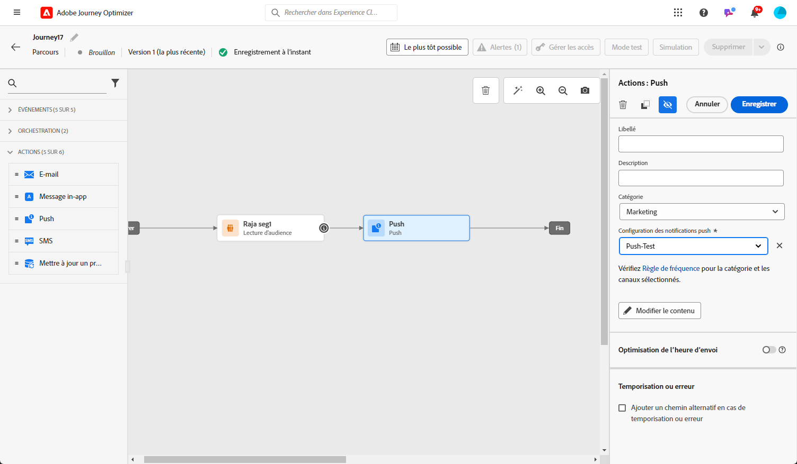
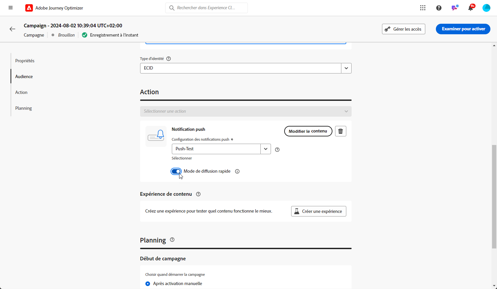

# Créer une notification push {#create-push-notification}

>[!CONTEXTUALHELP]
>id="ajo_message_push"
>title="Création de messages push"
>abstract="Ajoutez votre message push et commencez à le personnaliser à l&#39;aide de l&#39;éditeur d&#39;expression."

## Créer la notification push dans un parcours ou une campagne {#create}

Pour créer une notification push, procédez comme suit :

>[!BEGINTABS]

>[!TAB Ajout d’une notification push à un parcours]

1. Ouvrez votre parcours, puis faites glisser et déposez une activité Push depuis la section Actions de la palette.

   

1. Fournissez des informations de base sur votre message (libellé, description, catégorie), puis choisissez la surface du message à utiliser.

   

   >[!NOTE]
   >
   >Si vous envoyez une notification push à partir d’un parcours, vous pouvez tirer parti de la fonction d’optimisation de l’heure d’envoi d’Adobe Journey Optimizer pour prévoir le meilleur moment pour envoyer le message afin d’optimiser l’engagement en fonction des taux d’ouverture et de clic historiques. [Découvrez comment utiliser l’optimisation du temps d’envoi](../building-journeys/journeys-message.md#send-time-optimization)

   Pour plus d’informations sur la configuration d’un parcours, reportez-vous à la section [cette page](../building-journeys/journey-gs.md)

1. Dans l’écran de configuration du parcours, cliquez sur le **[!UICONTROL Edit content]** pour configurer le contenu push. [Concevoir une notification push](design-push.md)

1. Une fois le contenu de votre message défini, vous pouvez utiliser des profils de test pour le prévisualiser et le tester.

1. Lorsque votre notification push est prête, effectuez la configuration de votre [parcours](../building-journeys/journey-gs.md) pour l’envoyer.

   Pour suivre le comportement de vos destinataires par le biais des ouvertures et/ou interactions push, assurez-vous que les options dédiées dans la section de tracking sont activées dans la variable [activité email](../building-journeys/journeys-message.md).

>[!TAB Ajout d’une notification push à une campagne]

1. Créez une campagne planifiée ou déclenchée par une API, sélectionnez **[!UICONTROL Push notification]** comme action et choisissez la variable **[!UICONTROL App surface]** à utiliser. [En savoir plus sur la configuration push](push-configuration.md).

   

1. Cliquez sur **[!UICONTROL Create]**.

1. Dans la **[!UICONTROL Properties]** , modifiez la section de votre campagne **[!UICONTROL Title]** et **[!UICONTROL Description]**.

   

1. Cliquez sur le bouton **[!UICONTROL Select audience]** pour définir l’audience à cibler à partir de la liste des segments Adobe Experience Platform disponibles. [En savoir plus](../segment/about-segments.md).

1. Dans le **[!UICONTROL Identity namespace]** , choisissez l’espace de noms à utiliser pour identifier les individus du segment sélectionné. [En savoir plus](../event/about-creating.md#select-the-namespace).

   

1. Les campagnes sont conçues pour être exécutées à une date spécifique ou à une fréquence récurrente. Découvrez comment configurer le **[!UICONTROL Schedule]** de votre campagne dans [cette section](../campaigns/create-campaign.md#schedule).

1. Dans la **[!UICONTROL Action triggers]** , choisissez la variable **[!UICONTROL Frequency]** de votre notification push :

   * Une fois
   * Quotidien
   * Hebdomadaire
   * Mensuel

1. Dans l&#39;écran de configuration de l&#39;opération, cliquez sur le bouton **[!UICONTROL Edit content]** pour configurer le contenu push. [Concevoir une notification push](design-push.md)

1. Une fois le contenu de votre message défini, vous pouvez utiliser des profils de test pour le prévisualiser et le tester.

1. Lorsque votre notification push est prête, effectuez la configuration de votre [campaign](../campaigns/create-campaign.md) pour l’envoyer.

   Pour suivre le comportement de vos destinataires par le biais des ouvertures et/ou interactions push, assurez-vous que les options dédiées dans la section de tracking sont activées dans la variable [campaign](../campaigns/create-campaign.md).

>[!ENDTABS]

**Rubriques connexes**

* [Configuration du canal push](push-gs.md)
* [Ajout d’un message dans un parcours](../building-journeys/journeys-message.md)

## Mode de diffusion rapide {#rapid-delivery}

>[!CONTEXTUALHELP]
>id="ajo_campaigns_rapid_delivery"
>title="Mode de diffusion rapide"
>abstract="Le mode de diffusion rapide permet d&#39;envoyer rapidement des messages sur le canal push à une taille d&#39;audience inférieure à 30 M."

Le mode de diffusion rapide, précédemment appelé mode de rafale dans les parcours, est un [!DNL Journey Optimizer] module complémentaire permettant d’envoyer très rapidement des messages push dans de grands volumes par le biais de campagnes.

La diffusion rapide est utilisée lorsque le retard dans la diffusion des messages est essentiel pour l’entreprise, lorsque vous souhaitez envoyer une alerte push urgente sur les téléphones mobiles, par exemple une info-bulle destinée aux utilisateurs qui ont installé votre application de canal d’actualités.

Pour plus d&#39;informations sur les performances lors de l&#39;utilisation du mode de diffusion Rapide, reportez-vous à la section [Description du produit Adobe Journey Optimizer](https://helpx.adobe.com/legal/product-descriptions/adobe-journey-optimizer.html).

### Conditions préalables {#prerequisites}

La messagerie de diffusion rapide est fournie avec les exigences suivantes :

* La livraison rapide est disponible pour **[!UICONTROL Scheduled]** campagnes uniquement et n’est pas disponible pour les campagnes déclenchées par l’API,
* Aucune personnalisation n&#39;est autorisée dans le message push,
* L&#39;audience cible doit contenir moins de 30 millions de profils,
* Vous pouvez exécuter simultanément jusqu’à 5 campagnes à l’aide du mode de diffusion Rapid .

### Activation du mode de diffusion Rapid

1. Créer une campagne de notification push et activer/désactiver la variable **[!UICONTROL Rapid delivery]** .

1. Configurez le contenu du message et sélectionnez l’audience à cibler. [Découvrez comment créer une campagne](#create)

   >[!IMPORTANT]
   >
   >Assurez-vous que le contenu du message ne contient aucune personnalisation et que l’audience contient moins de 30 millions de profils.

1. Vérifiez et activez votre campagne comme vous le faites habituellement. Notez que, en mode test, les messages ne sont pas envoyés via le mode de diffusion Rapid .