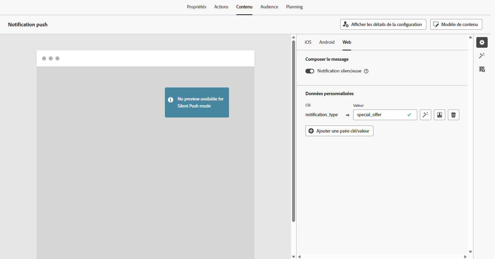
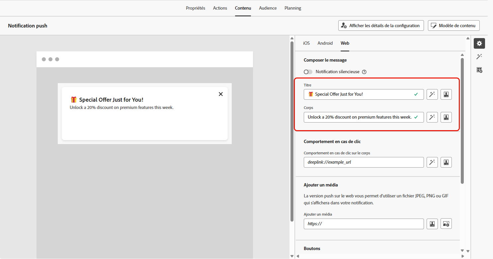
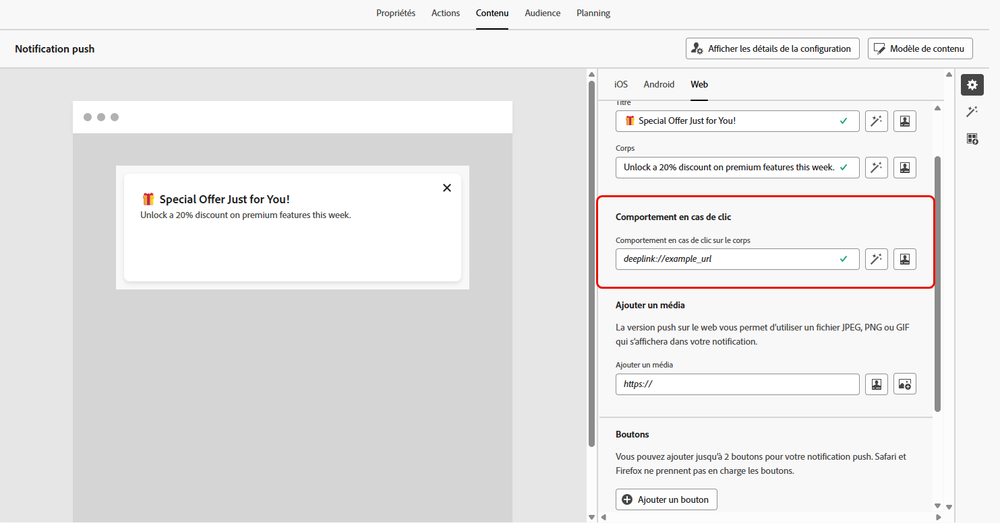
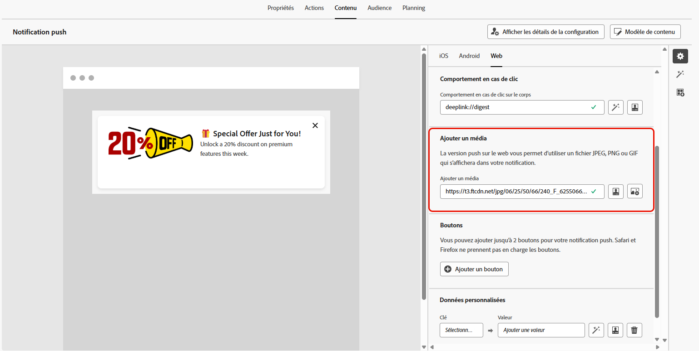
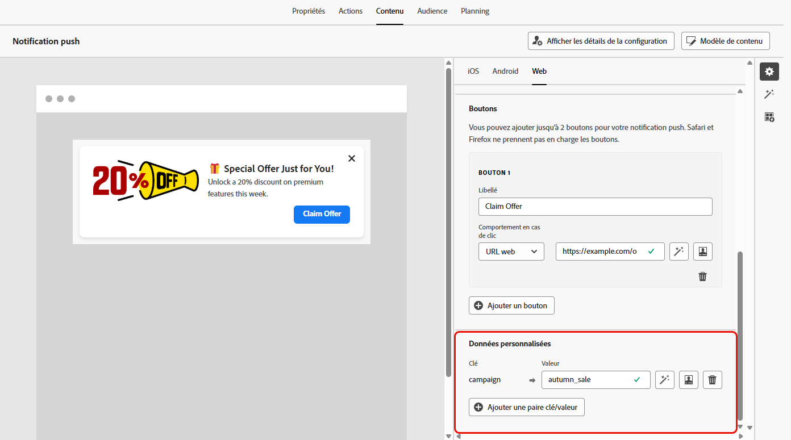

# Concevoir une notification push web {#design-push-notification}

>[!AVAILABILITY]
>
>Actuellement, les notifications push web dans Journey Optimizer ne prennent pas en charge la fonctionnalité **Notification silencieuse**, mais seront disponibles ultérieurement.

Après avoir créé votre campagne ou parcours de notification push web, vous pouvez procéder à la conception de son contenu et de sa structure en fonction de vos besoins. Notez qu’avant d’envoyer toute notification push web, il est nécessaire de configurer ce canal dans votre [configuration des canaux](push-configuration-web.md).

<!--
## Send a silent notification {#silent-notification}

A silent push notification (also called a background notification) is a hidden message sent to your web application without alerting the user.

To enable a silent notification, enable the **[!UICONTROL Silent Notification]** option. When this option is used, the notification is delivered directly to the application, and no alert, banner, or sound is shown to the user.

Use the **Custom Data** section to include additional information in the form of key-value pairs. 

-->

## Titre et contenu {#push-title-body}

Pour composer votre message, cliquez sur les champs **[!UICONTROL Titre]** et **[!UICONTROL Corps]**. Utilisez l’éditeur de personnalisation pour définir du contenu, [personnaliser des données](../personalization/personalize.md) et ajouter du [contenu dynamique](../personalization/get-started-dynamic-content.md).

Cliquez sur **[!UICONTROL Modifier le texte avec l’assistant IA]** pour générer facilement votre contenu à l’aide de l’assistant IA Journey Optimizer.

## Comportement en cas de clic {#on-click-behavior}

Utilisez le champ **[!UICONTROL Comportement en cas de clic dans le corps]** pour définir un lien profond qui détermine ce qui se produit lorsqu’une personne clique dans le corps de la notification. Vous pouvez ainsi envoyer directement les utilisateurs et utilisatrices vers une page ou une section spécifique de votre application web.

## Ajouter un média {#add-media-push}

Saisissez l’URL du média dans le champ **[!UICONTROL Ajouter un média]**. Vous pouvez également inclure des jetons de personnalisation dans l’URL pour personnaliser le contenu en fonction de chaque personne.

Cliquez sur  pour générer rapidement des médias à l’aide de l’assistant IA Journey Optimizer.

## Ajouter des boutons {#add-buttons-push}

Rendez vos notifications push web interactives en ajoutant des boutons à votre contenu.

Notez que les boutons ne sont visibles que lorsque l’appareil est déverrouillé. Si l’écran est verrouillé, seuls les **[!UICONTROL Titre]** et **[!UICONTROL Message]** s’affichent.

Utilisez l&#39;option **[!UICONTROL Ajouter un bouton]** pour définir le libellé de chaque bouton et l’action associée, comme décrit ci-dessous :

* **[!UICONTROL Lien profond]** : redirigez les personnes vers une vue, une section ou un onglet spécifique dans votre application. Saisissez l’URL du lien profond dans le champ associé.

* **[!UICONTROL URL web]** : redirigez les personnes vers une page web externe. Saisissez l&#39;URL dans le champ associé.

## Données personnalisées {#custom-data}

Dans la section **[!UICONTROL Données personnalisées]**, vous pouvez ajouter des paires clé-valeur personnalisées à la payload de notification. Ces valeurs peuvent être utilisées par votre application web pour déclencher des actions spécifiques ou personnaliser l’expérience de la personne. Pour plus d’informations sur la configuration des notifications push dans Adobe Experience Platform, consultez [cette section](push-gs.md).

