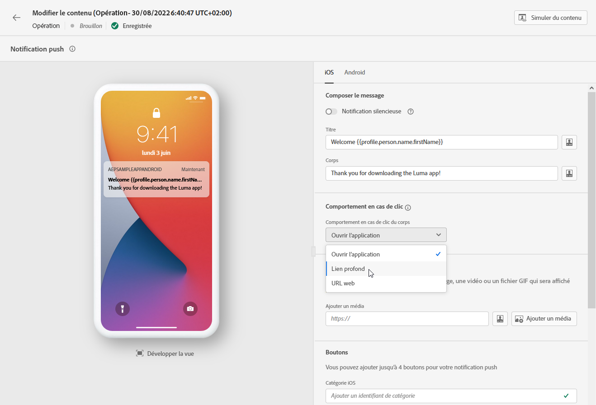
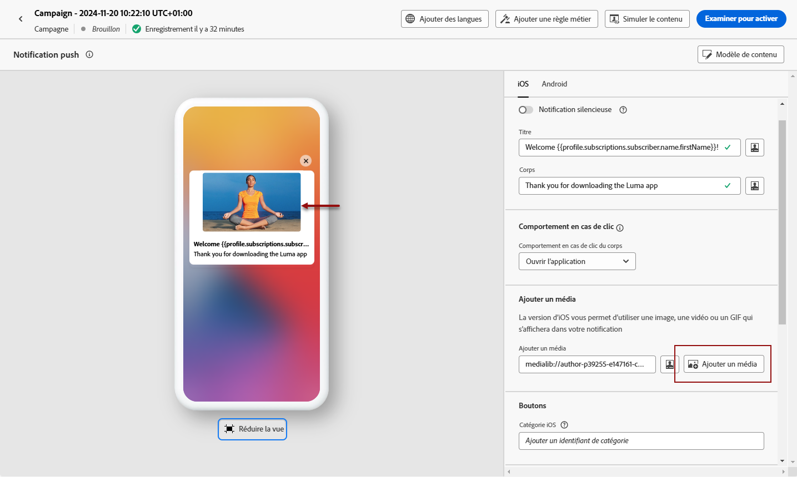
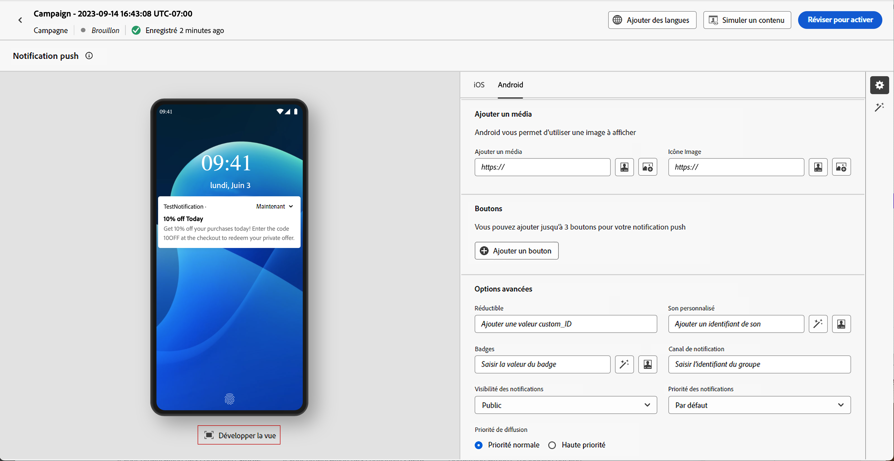

# Concevoir une notification push {#design-push-notification}

## Titre et corps {#push-title-body}

>[!CONTEXTUALHELP]
>id="ajo-message-push-compose"
>title="Personnalisez votre notification push."
>abstract="Pour composer votre message, saisissez le contenu dans les champs **Titre** et **Corps**. Pour inclure des jetons de personnalisation, ouvrez la boîte de dialogue de personnalisation."

Pour composer votre message, cliquez sur les champs **[!UICONTROL Titre]** et **[!UICONTROL Corps]**. Utilisez l’éditeur de personnalisation pour définir du contenu, personnaliser des données et ajouter du contenu dynamique. En savoir plus sur la [personnalisation](../personalization/personalize.md) et le [contenu dynamique](../personalization/get-started-dynamic-content.md) dans l’éditeur de personnalisation.

Utilisez la section de prévisualisation des appareils pour visualiser la façon dont s’affiche la notification push sur les appareils iOS et Android.

Accélérez la création de votre contenu avec l’assistant AI et générez du texte de notification push attrayant avec l’assistant [&#x200B; AI pour la génération de texte](../content-management/generative-text.md) ou créez des notifications push complètes avec l’assistant [&#x200B; AI pour la génération de contenu complète](../content-management/generative-full-content.md).

## Comportement en cas de clic {#on-click-behavior}

>[!CONTEXTUALHELP]
>id="ajo-message-push-onclick"
>title="À propos du comportement en cas de clic"
>abstract="Sélectionnez le comportement lorsquʼun destinataire clique sur le contenu de la notification push."

Sélectionnez le comportement lorsquʼun utilisateur clique sur le contenu de la notification push.

* Pour ouvrir l’application, sélectionnez l’option **[!UICONTROL Ouvrir l’application]**. Lʼapplication associée à la notification est définie dans la [configuration de canal](../configuration/channel-surfaces.md) (c’est-à-dire le paramètre prédéfini du message).
* Pour rediriger l’utilisateur vers un élément de contenu spécifique dans une application, sélectionnez l’option **[!UICONTROL Lien profond]** .  Le contenu spécifique peut être un affichage spécifique, une section spécifique d’une page ou un certain onglet. Une fois lʼoption sélectionnée, saisissez le lien profond dans le champ correspondant.
* Pour rediriger l’utilisateur vers une URL externe, utilisez l’option **[!UICONTROL URL Web]**. Une fois lʼoption sélectionnée, saisissez lʼURL dans le champ correspondant.

## Ajouter un média {#add-media-push}

>[!CONTEXTUALHELP]
>id="ajo-message-push-media"
>title="Ajouter des médias à votre notification push"
>abstract="Vous pouvez ajouter une image, une vidéo ou un GIF qui s’affichent dans votre notification."

Dans la version iOS de votre notification push, vous pouvez ajouter une image, une vidéo ou un GIF qui s’affiche dans votre notification.

Dans la version Android, vous pouvez uniquement ajouter une icône d&#39;image et une image pour les notifications étendues.

Deux options sont disponibles. Vous pouvez :

* Cliquez sur le bouton **[!UICONTROL Ajouter un média]** pour sélectionner une ressource dans **[!DNL Adobe Experience Manager Assets]**.

  Découvrez comment utiliser **[!DNL Adobe Experience Manager Assets]** sur [cette page](../integrations/assets.md).

* Vous pouvez également saisir lʼURL du média en cliquant sur le champ **[!UICONTROL Ajouter un média]**. Dans ce cas, vous pouvez ajouter une personnalisation à l’URL.

Une fois ajouté, le média s&#39;affiche à droite du corps de la notification.

Notez que lors de l’inclusion de pièces jointes de média dans la payload de notification push, telles que des images dans des champs de données personnalisés tels que `adb_media`, votre application mobile doit implémenter une gestion côté client spécifique pour que les images s’affichent sur les appareils :

* **iOS** : votre application doit mettre en œuvre une [extension du service de notification](https://developer.apple.com/documentation/usernotifications/modifying_content_in_newly_delivered_notifications){target="_blank"} pour télécharger et traiter le contenu multimédia à partir de la payload. En outre, l’option **[!UICONTROL Ajouter un indicateur de contenu modifiable]** doit être activée dans la section [Options avancées](#advanced-options-push).
* **Android** : votre application doit implémenter le [workflow d’affichage et de suivi automatique](https://developer.adobe.com/client-sdks/edge/adobe-journey-optimizer/push-notification/android/automatic-display-and-tracking/){target="_blank"} pour gérer les pièces jointes d’image de la payload.

## Ajouter des boutons {#add-buttons-push}

>[!CONTEXTUALHELP]
>id="ajo-message-push-buttons"
>title="Ajoutez des boutons pour que les personnes puissent interagir avec votre notification push."
>abstract="Dans cette section, ajoutez les boutons call-to-action à votre message. Pour Apple iOS, indiquez un identifiant de catégorie de notification. Pour Google Android, vous pouvez inclure du texte et des cibles personnalisés pour chaque bouton."

Créez une notification exploitable en ajoutant des boutons à votre contenu push.

Si l’écran de l’appareil est verrouillé, les boutons suivants ne s’affichent pas : seuls le **Titre** et le **Message** de la notification sont visibles. Si leur appareil est déverrouillé, les destinataires verront les boutons.

Dans la version Android, vous pouvez ajouter jusquʼà trois boutons.

Dans la version iOS, un identifiant de catégorie de notification est spécifié. Les catégories de notifications doivent être préconfigurées dans l&#39;application iOS, qui définira les boutons à afficher et les actions à effectuer. Consultez la [documentation Apple](https://developer.apple.com/documentation/usernotifications/declaring_your_actionable_notification_types) pour en savoir plus.

1. Cliquez sur **[!UICONTROL Ajouter un bouton]** pour définir les paramètres : le libellé et lʼaction correspondante. Les actions possibles sont les mêmes que pour le [comportement en cas de clic](#on-click-behavior).

1. Utilisez l’icone **[!UICONTROL Expansion de l’affichage]** sous l’image d’aperçu centrale pour prévisualiser vos boutons personnalisés.

   

## Envoyer une notification silencieuse {#silent-notification}

>[!CONTEXTUALHELP]
>id="ajo_message_push_silent_notification"
>title="À propos des notifications silencieuses"
>abstract="Envoyez des notifications sans déranger l&#39;utilisateur ou l&#39;utilisatrice. Les notifications ne sont pas affichées dans le centre de notifications ni dans la barre de notifications."

Une notification push silencieuse (ou notification en arrière-plan) est une instruction masquée qui est transmise à l’application. Elle est par exemple utilisée pour informer votre application de la disponibilité d&#39;un nouveau contenu ou pour lancer un téléchargement en arrière-plan.

Sélectionnez l&#39;option **[!UICONTROL Notification silencieuse]** pour avertir l&#39;application en silence : dans ce cas, la notification est transférée directement à l&#39;application. Aucune alerte ne s&#39;affiche sur l&#39;écran de l&#39;appareil.

Utilisez la section **[!UICONTROL Données personnalisées]** pour ajouter des paires clé-valeur.

## Données personnalisées {#custom-data}

>[!CONTEXTUALHELP]
>id="ajo-message-push-custom"
>title="Configurez les données personnalisées de votre notification push."
>abstract="Ajoutez des variables personnalisées à la payload, en fonction de la configuration de votre application mobile."

Dans la section **[!UICONTROL Données personnalisées]**, vous pouvez ajouter des variables personnalisées à la payload, en fonction de la configuration de votre application mobile. Pour plus d’informations sur la configuration des notifications push dans Adobe Experience Platform, consultez [cette section](push-gs.md).

## Options avancées {#advanced-options-push}

>[!CONTEXTUALHELP]
>id="ajo-message-push-advanced"
>title="Configurez les options avancées de votre notification push."
>abstract="Cette section vous permet d’améliorer la personnalisation de votre notification push."

Vous pouvez configurer les **[!UICONTROL options avancées]** pour votre notification push. Les paramètres disponibles sont répertoriés ci-dessous :

| Paramètre | Description |
|---------|---------|
| **[!UICONTROL Réductible]** (iOS/Android) | Un message réductible est un message qui peut être remplacé par un nouveau message s&#39;il est obsolète. Les messages utilisés pour indiquer à une application mobile de synchroniser les données du serveur constituent des cas d&#39;utilisation courants de messages réductibles. Par exemple, une application sportive qui informe les utilisateurs du dernier score. Seul le message le plus récent est pertinent. D’un autre côté, avec un message non réductible, chaque message est important pour l’application cliente et doit être diffusé. |
| **[!UICONTROL Son personnalisé]** (iOS/Android) | Son à émettre par le terminal mobile lors de la réception de la notification. Le son doit être assemblé dans l&#39;application. |
| **[!UICONTROL Badges]** (iOS/Android) | Un badge est utilisé pour afficher directement sur l&#39;icône de l&#39;application le nombre de nouvelles informations non lues.  La valeur du badge disparaît dès que l&#39;utilisateur ouvre ou lit le nouveau contenu de l&#39;application. Lorsqu&#39;une notification est reçue sur un appareil, elle peut actualiser ou ajouter une valeur de badge pour l&#39;application associée. Par exemple, si vous stockez le nombre d&#39;articles non lus de vos clients, vous pouvez tirer parti de la personnalisation pour envoyer la valeur unique de badge d&#39;articles non lus pour chaque client. Pour plus d&#39;informations sur la personnalisation, consultez [cette section](../personalization/personalize.md). |
| **[!UICONTROL Groupe de notifications]** (iOS uniquement) | Associez un groupe de notification à la notification push. À partir d&#39;iOS 12, les groupes de notifications vous permettent de consolider les threads de message et les rubriques de notification en identifiants de threads. Par exemple, une marque peut envoyer des notifications marketing sous un identifiant de groupe, tout en conservant d&#39;autres notifications de type opérationnel sous un ou plusieurs identifiants différents. Pour illustrer cela, vous pouvez avoir les groupes de notification groupID : 123 « Consultez la nouvelle collection printanière de pulls » et groupID : 456 « Votre colis a été livré ». Dans cet exemple, toutes les notifications de diffusion sont regroupées sous l&#39;identifiant de groupe : 456. |
| **[!UICONTROL Canal de notification]** (Android uniquement) | Associez un canal de notification à la notification push. À partir d&#39;Android 8.0 (niveau API 26), toutes les notifications doivent être affectées à un canal pour s&#39;afficher. Consultez à ce sujet la [documentation pour développeur Android](https://developer.android.com/guide/topics/ui/notifiers/notifications#ManageChannels). |
| **[!UICONTROL Ajouter un indicateur de disponibilité de contenu]** (iOS uniquement) | Envoie l&#39;indicateur de disponibilité de contenu dans la payload push pour veiller à ce que l&#39;application sorte de veille à la réception de la notification push et puisse accéder ainsi aux données de la payload.  Ce mécanisme fonctionne même si l&#39;application est en cours d&#39;exécution à l&#39;arrière-plan et qu&#39;elle ne nécessite pas l&#39;intervention de l&#39;utilisateur (comme appuyer sur la notification push, par exemple). Toutefois, il ne s&#39;applique pas si l&#39;application n&#39;est pas en cours d&#39;exécution. Consultez à ce sujet la [documentation pour développeur Apple](https://developer.apple.com/library/content/documentation/NetworkingInternet/Conceptual/RemoteNotificationsPG/CreatingtheNotificationPayload.html). |
| **[!UICONTROL Ajouter un indicateur de contenu modifiable]** (iOS uniquement) | Envoie l&#39;indicateur de contenu modifiable dans la payload push et permet de modifier le contenu de la notification push en utilisant l&#39;extension d&#39;application du service de notification fournie dans le SDK iOS. Consultez à ce sujet la [documentation pour développeur Apple](https://developer.apple.com/library/content/documentation/NetworkingInternet/Conceptual/RemoteNotificationsPG/ModifyingNotifications.html). Vous pouvez ensuite exploiter vos extensions d&#39;applications mobiles pour modifier davantage le contenu ou la présentation des notifications push envoyées depuis [!DNL Journey Optimizer]. Par exemple, les utilisateurs peuvent utiliser cette option pour déchiffrer des données, modifier le corps ou le titre d&#39;une notification, ajouter un identifiant de thread à une notification, etc. **Important** : cet indicateur doit être activé lors de l’inclusion de pièces jointes de média (images, vidéos) via des champs de payload (tels que `adb_media`) pour qu’elles s’affichent sur les appareils iOS. Votre application doit également implémenter une extension du service de notification pour télécharger et traiter le contenu multimédia à partir de la payload. |
| **[!UICONTROL Ajouter une expiration pour la notification push]** (iOS uniquement) | Sélectionnez la **date et l’heure** de l’expiration de votre notification push. Sur iOS, l’expiration des notifications s’applique de manière irréversible, ce qui signifie que tout message qui atteint le service APNS après son heure d’expiration n’est pas diffusé, ce qui garantit que les clientes et clients ne reçoivent jamais de notifications obsolètes ou non pertinentes. Consultez à ce sujet la [documentation pour le développement Apple](https://developer.apple.com/documentation/usernotifications/sending-notification-requests-to-apns). |
| **[!UICONTROL Visibilité des notifications]** (Android uniquement) | Définit la visibilité de la notification push.  <b>Private</b> affichera la notification sur tous les écrans verrouillés, mais dissimulera les informations sensibles ou privées sur les écrans verrouillés sécurisés.  <b>public</b> affichera la notification dans son intégralité sur tous les écrans verrouillés.  <b>secret</b> ne divulguera aucune partie de la notification sur un écran verrouillé sécurisé.  Consultez à ce sujet la [documentation pour développeur Android](https://developer.android.com/reference/android/app/Notification). |
| **[!UICONTROL Priorité des notifications]** (Android uniquement) | Définit l&#39;importance de la notification push de Faible à Max. Cette opération détermine l&#39;intrusion de la notification push lors de sa diffusion. Consultez à ce sujet la [documentation pour développeur Android](https://developer.android.com/guide/topics/ui/notifiers/notifications#importance) |
| **[!UICONTROL Priorité de diffusion]** (Android uniquement) | Définit une priorité élevée ou normale pour vos notifications push. Pour plus d&#39;informations sur la priorité des messages, consultez la [documentation destinée aux développeurs Google](https://firebase.google.com/docs/cloud-messaging/concept-options#setting-the-priority-of-a-message). |
| **[!UICONTROL Durée de vie]** (Android uniquement) | Définissez le nombre de secondes au-delà duquel votre message expirera. Sur Android, l’expiration est traitée comme une fenêtre de diffusion : Firebase Cloud Messaging (FCM) convertit le délai d’expiration en une valeur de durée de vie (TTL) à partir de la réception du message, ce qui signifie que les campagnes non diffusées peuvent être envoyées plus tard que prévu ou même en dehors du délai souhaité. Consultez à ce sujet la [documentation pour le développement Android](https://firebase.google.com/docs/cloud-messaging/concept-options#ttl). |
