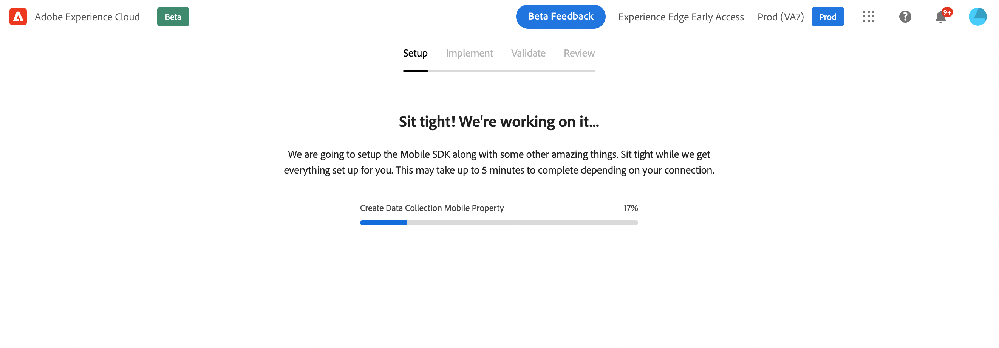
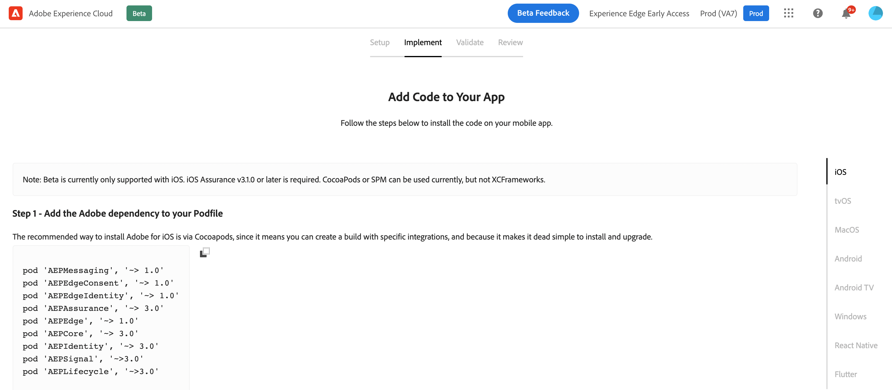

# Workflow de démarrage rapide de l’intégration mobile {#mobile-wf}

Le nouveau **workflow de démarrage rapide de l’intégration mobile** est une nouvelle fonctionnalité de produit qui permet de configurer rapidement le SDK mobile d’Adobe Experience Platform, de commencer à collecter et valider les données d’événement mobile et d’envoyer des notifications push avec [!DNL Journey Optimizer].

Cette fonctionnalité est accessible à partir de la page d’accueil d’**[!DNL Adobe Experience Platform Data Collection]** à l’ensemble des clientes et clients en tant que version Beta publique.

## Commencer{#gs-mobile-wf}

Ce nouveau workflow automatise la configuration de la collecte de données en réduisant le nombre total de clics et en accélérant la configuration mobile pour Journey Optimizer. Ce workflow de démarrage rapide vous permet de suivre quatre étapes simples pour [configurer](#gs-mobile-wf), [implémenter](#implement-mobile-wf), [valider](#valid-mobile-wf) et [réviser](#review-mobile-wf) votre configuration mobile.

Pour accéder au nouveau workflow de démarrage rapide de l’intégration mobile, accédez à **[!DNL Data Collection]** à partir du sélecteur de solution. Sélectionnez ensuite la vignette **[!DNL Start Collecting Mobile Data]** sur la page d’accueil.

Voici quelques autres fonctionnalités :

* Workflow simple en quatre étapes et interface utilisateur.
* Fournit une configuration de base pour commencer à collecter en quelques minutes des données d’événement mobile via le [SDK mobile d’Adobe Experience Platform](https://developer.adobe.com/client-sdks/documentation){target="_blank"}.
* Permet de tester et de valider un événement push mobile de base à l’aide d’[Adobe Experience Platform Assurance](https://experienceleague.adobe.com/docs/experience-platform/assurance/home.html?lang=fr){target="_blank"}.
* Crée et configure automatiquement toutes les ressources de Journey Optimizer et de collecte de données nécessaires.
* Donne des conseils et affiche des info-bulles sur le produit.
* Fournit une transition naturelle pour une implémentation plus avancée, le cas échéant.

## Configurer {#setup-mobile-wf}

La première étape de ce workflow crée et configure automatiquement toutes les ressources Journey Optimizer et de collecte de données nécessaires, telles que les propriétés mobiles, les extensions mobiles, l’extension Journey Optimizer, les règles, les éléments de données, etc.

Après avoir accepté les conditions générales de la version Beta, saisissez le nom de votre application mobile, puis cliquez sur **[!DNL Next]**.

Fournissez les informations pour les plateformes iOS et Android, y compris votre ID d’application et vos clés d’authentification ou votre fichier de clé.

## Implémenter{#implement-mobile-wf}

L’étape suivante fournit des conseils détaillés pour l’installation du code sur votre application mobile.

## Valider{#valid-mobile-wf}

Vérifiez l’implémentation avant de la valider. Vous pouvez envoyer une notification push de test.

## Réviser {#review-mobile-wf}

La configuration automatisée est terminée. Vous pouvez désormais accéder à la propriété mobile de votre balise et configurer vos règles ou votre élément de données, puis commencer à envoyer des notifications push avec Adobe Journey Optimizer.

**Rubriques connexes**

* [Prise en main des notifications push](../../rp_landing_pages/push-landing-page.md)
* [Flux de données et composants des notifications push](push-gs.md)
* [Configuration du canal push](push-configuration.md)
* [Rapport des notifications push](../reports/journey-global-report-cja-push.md#track-link-url-push)
* [Créer une notification push](create-push.md)
