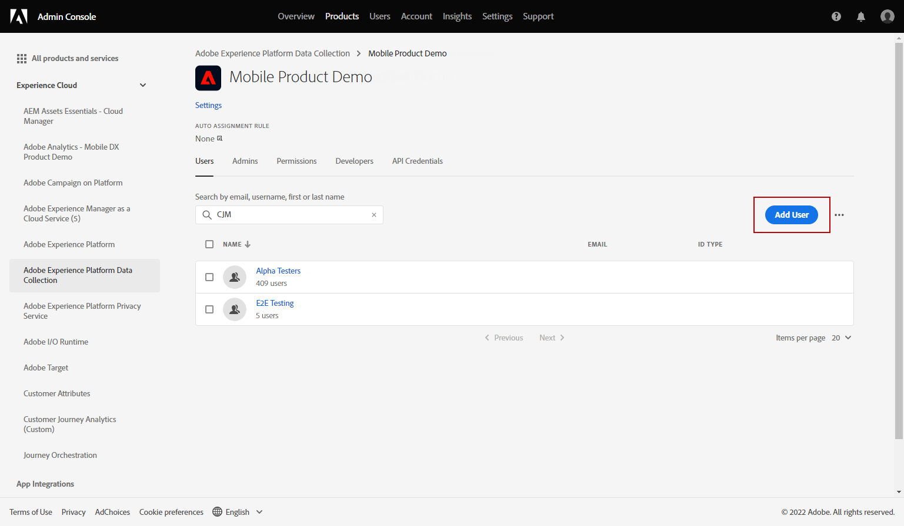
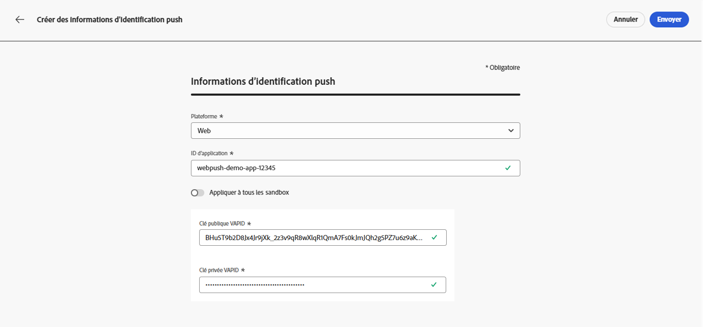
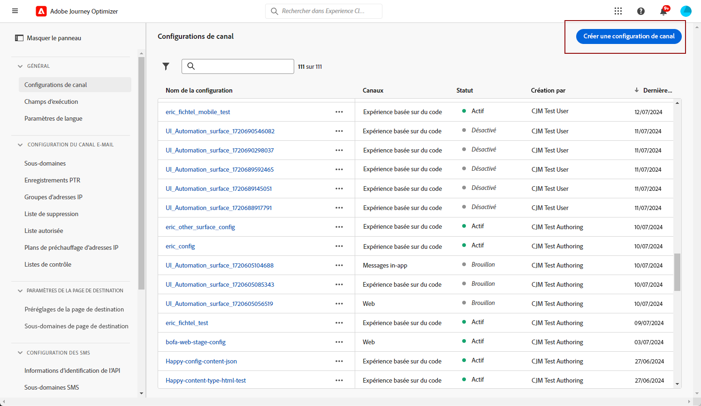
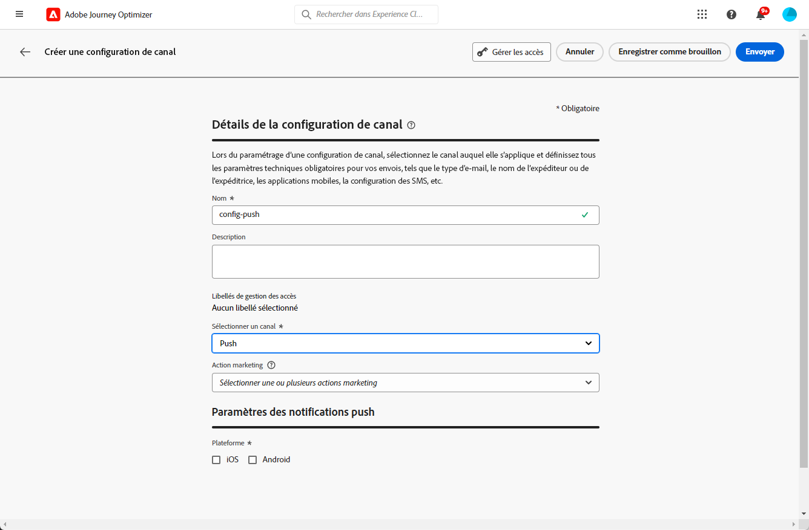

# Configurer le canal de notification push web {#push-notification-configuration}

[!DNL Journey Optimizer] vous permet de créer vos parcours et d&#39;envoyer des messages à une audience ciblée. Avant de commencer à envoyer des notifications push Web avec [!DNL Journey Optimizer], vous devez vous assurer que les configurations et les intégrations sont en place dans Adobe Experience Platform. Pour comprendre le flux de données des notifications push dans [!DNL Adobe Journey Optimizer], reportez-vous à [cette page](push-gs.md).

>[!AVAILABILITY]
>
>Le nouveau **workflow de démarrage rapide de l’intégration mobile** est désormais disponible. Utilisez cette nouvelle fonctionnalité de produit pour configurer rapidement le SDK mobile, afin de commencer à collecter et valider les données d’événement mobile et d’envoyer des notifications push mobiles. Cette fonctionnalité est accessible via la page d’accueil de collecte de données en tant que version Beta publique. [En savoir plus](mobile-onboarding-wf.md)
>

## Avant de commencer {#start-push}

### Configuration des autorisations {#setup-permissions}

Avant de créer une application mobile, vous devez dʼabord vous assurer que vous possédez ou accordez les autorisations utilisateur appropriées pour les balises dans Adobe Experience Platform. Pour en savoir plus, consultez la [documentation sur les balises](https://experienceleague.adobe.com/docs/experience-platform/tags/admin/user-permissions.html?lang=fr){target="_blank"}.

>[!CAUTION]
>
>La configuration des notifications push doit être effectuée par un utilisateur expérimenté. Selon votre modèle de mise en œuvre et les rôles impliqués dans cette mise en œuvre, vous devrez peut-être attribuer le jeu complet des autorisations à un profil de produit unique ou partager des autorisations entre le développeur d&#39;application et l&#39;administrateur **Adobe Journey Optimizer**. Découvrez les autorisations liées aux **Balises** dans [cette documentation](https://experienceleague.adobe.com/docs/experience-platform/tags/admin/user-permissions.html?lang=fr){target="_blank"}.

<!--ou need to your have access to perform following roles :

* Manage Datastreams
* Manage Client-side Properties
* Manage App Configurations
-->

Pour attribuer des droits **Propriété** et **Société**, procédez comme suit :

1. Accédez à **[!DNL Admin Console]**.

1. Dans l’onglet **[!UICONTROL Produits]**, sélectionnez la vignette **[!UICONTROL Collecte de données Adobe Experience Platform]**.

   

1. Sélectionnez un **[!UICONTROL Profil de produit]** existant ou créez-en un en cliquant sur le bouton **[!UICONTROL Nouveau profil]**. Découvrez comment créer un **[!UICONTROL nouveau profil]** dans la [documentation Admin Console](https://experienceleague.adobe.com/docs/experience-platform/access-control/ui/create-profile.html?lang=fr#ui){target="_blank"}.

1. Dans l&#39;onglet **[!UICONTROL Autorisations]**, sélectionnez **[!UICONTROL Droits de propriété]**.

   

1. Cliquez sur **[!UICONTROL Ajouter tout]**. Le droit suivant est alors ajouté à votre profil de produit :
   * **[!UICONTROL Approuver]**
   * **[!UICONTROL Développer]**
   * **[!UICONTROL Gérer les environnements]**
   * **[!UICONTROL Gérer les extensions]**
   * **[!UICONTROL Publier]**

   Ces autorisations sont requises pour installer et publier l&#39;extension Adobe Journey Optimizer et publier la propriété de l&#39;application dans le SDK mobile Adobe Experience Platform.

1. Sélectionnez ensuite **[!UICONTROL Droits d&#39;entreprise]** dans le menu de gauche.

   

1. Ajoutez les droits suivants :

   * **[!UICONTROL Gérer les configurations d&#39;application]**
   * **[!UICONTROL Gérer les propriétés]**

   Ces autorisations sont requises pour que le développeur ou la développeuse de l’application mobile configure les informations d’identification des notifications push dans la **Collecte des données Adobe Experience Platform** et définisse les configurations de canal des notifications push (c’est-à-dire les paramètres prédéfinis de message) dans **Adobe Journey Optimizer**.

   

1. Cliquez sur **[!UICONTROL Enregistrer]**.

Pour attribuer ce **[!UICONTROL profil de produit]** aux utilisateurs, procédez comme suit :

1. Accédez à **[!DNL Admin Console]**.

1. Dans l’onglet **[!UICONTROL Produits]**, sélectionnez la vignette **[!UICONTROL Collecte des données Adobe Experience Platform]**.

1. Sélectionnez votre **[!UICONTROL Profil de produit]** précédemment configuré.

1. Dans l’onglet **[!UICONTROL Utilisateurs et utilisatrices]**, cliquez sur **[!UICONTROL Ajouter un utilisateur ou une utilisatrice]**.

   

1. Saisissez le nom ou l&#39;adresse email de votre utilisateur et sélectionnez-le. Cliquez ensuite sur **[!UICONTROL Enregistrer]**.

   >[!NOTE]
   >
   >Si l&#39;utilisateur n&#39;a pas été créé auparavant dans Admin Console, consultez la [documentation relative à l&#39;ajout d&#39;utilisateurs](https://helpx.adobe.com/fr/enterprise/admin-guide.html/enterprise/using/manage-users-individually.ug.html?lang=fr#add-users).

   

### Vérifier les jeux de données {#push-datasets}

Les schémas et jeux de données suivants sont disponibles avec le canal de notification push :

| Schéma  Jeu de données | Groupe de champs | Opération |
| -------------------------------------------------------------------------------------- | --------------------------------------------------------------------------------------------------------------------------------------------------------------------------------------- | -------------------------------------------------------- |
| Schéma de profil de notification push CJM  Jeu de données de profil de notification push CJM | Détails de la notification push Adobe CJM ExperienceEvent - Détails du profil du message Adobe CJM ExperienceEvent - Détails d’exécution du message Détails de l’application Détails de l’environnement | Enregistrer un jeton push |
| Schéma d’événement d’expérience de suivi des notifications push CJM Jeu de données d’événement d’expérience de suivi des notifications push CJM | Suivi de notification push | Suivre les interactions et fournir des données pour l’interface d’utilisation de création de rapports |

>[!NOTE]
>
>Lorsque des événements de suivi des notifications push sont ingérés dans le jeu de données d’événement d’expérience de suivi des notifications push CJM, certains échecs peuvent se produire, même si les données ont été partiellement ingérées. Cela peut se produire si certains champs de votre mappage n’existent pas dans les événements entrants : le système consigne les avertissements mais n’empêche pas l’ingestion de parties valides des données. Ces avertissements apparaissent dans le statut du lot comme « échec », mais reflètent un succès partiel de l’ingestion.
>
>Pour consulter la liste complète des champs et attributs de chaque schéma, consultez le [dictionnaire de schémas de Journey Optimizer](https://experienceleague.adobe.com/tools/ajo-schemas/schema-dictionary.html?lang=fr){target="_blank"}.

### Configuration de la propriété pushNotification {#push-property}

Pour activer les **notifications push web**, vous devez d’abord vous assurer que la propriété [pushNotifications](https://experienceleague.adobe.com/fr/docs/experience-platform/collection/js/commands/configure/pushnotifications) est correctement configurée dans le SDK web. Cette propriété contrôle la manière dont les notifications push sont traitées par votre application web.

En outre, vous devez générer des clés VAPID, requises pour configurer [les informations d’identification push de votre application](#push-credentials-launch) dans Journey Optimizer.

## Étape 1 : ajout des informations d’identification push dans Journey Optimizer {#push-credentials-launch}

Après avoir accordé les autorisations d’utilisation appropriées, vous devez maintenant ajouter les informations d’identification push de votre application mobile dans Journey Optimizer.

L&#39;enregistrement des informations d&#39;identification push de l&#39;application mobile est nécessaire pour autoriser Adobe à envoyer des notifications push en votre nom. Reportez-vous aux étapes détaillées ci-dessous :

1. Accédez au menu **[!UICONTROL Canaux]** > **[!UICONTROL Paramètres push]** > **[!UICONTROL Informations d’identification push]**.

1. Cliquez sur **[!UICONTROL Créer des informations d’identification push]**.

1. Dans la liste déroulante **[!UICONTROL Platform]**, sélectionnez **[!UICONTROL Web]**.

   

1. Fournissez l’**[!UICONTROL identifiant de l’application]**.

1. Saisissez votre **[!UICONTROL clé publique]** et **[!UICONTROL clé privée]** VAPID.

1. Cliquez sur **[!UICONTROL Envoyer]** pour créer votre configuration d’application.

## Étape 2 : création d’une configuration de canal pour les notifications push{#message-preset}

Une fois vos informations d’identification push créées, vous devez créer une configuration pour pouvoir envoyer des notifications push depuis **[!DNL Journey Optimizer]**.

1. Accédez au menu **[!UICONTROL Canaux]** > **[!UICONTROL Paramètres généraux]** > **[!UICONTROL Configuration des canaux]**, puis cliquez sur **[!UICONTROL Créer une configuration des canaux]**.

   

1. Saisissez un nom et une description (facultatif) pour la configuration.

   >[!NOTE]
   >
   > Les noms doivent commencer par une lettre (A-Z). Ils ne peuvent contenir que des caractères alphanumériques. Vous pouvez également utiliser le trait de soulignement `_`, le point`.` et le trait d&#39;union `-`.

1. Pour attribuer des libellés d’utilisation des données personnalisés ou de base à la configuration, vous pouvez sélectionner **[!UICONTROL Gérer l’accès]**. [En savoir plus sur le contrôle d’accès au niveau de l’objet (OLAC)](../administration/object-based-access.md)

1. Sélectionnez le canal **push**.

   

1. Sélectionnez une **[!UICONTROL Action marketing]** ou plusieurs pour associer des politiques de consentement aux messages utilisant cette configuration. Toutes les politiques de consentement associées à cette action marketing sont utilisées afin de respecter les préférences de vos clientes et clients. [En savoir plus](../action/consent.md#surface-marketing-actions)

1. Choisissez votre **[!UICONTROL plateforme]** : Android, iOS et/ou web.

1. Sélectionnez le même **[!UICONTROL ID d’application]** que pour vos [informations d’identification push](#push-credentials-launch) configurées ci-dessus.

1. Enregistrez vos modifications.

Vous pouvez maintenant sélectionner votre configuration lors de la création de vos notifications push.

## Étape 3 : configurer la propriété sendPushSubscription {#sendPushSubscription-property}

Une fois vos informations d’identification push et la configuration du canal configurées, vous devez implémenter [la commande sendPushSubscription](https://experienceleague.adobe.com/fr/docs/experience-platform/collection/js/commands/sendpushsubscription) dans votre application web. Cette commande enregistre les abonnements push des utilisateurs auprès de Adobe Experience Platform, ce qui permet au système de suivre les utilisateurs qui se sont inscrits pour recevoir des notifications push et conserver leur statut d&#39;abonnement. Cet enregistrement est essentiel pour que Journey Optimizer envoie des notifications push ciblées à vos utilisateurs.

## Étape 4 : test de votre application mobile avec un événement {#mobile-app-test}

Une fois la configuration push web terminée dans Adobe Experience Platform et [!DNL Adobe Experience Platform Data Collection], vous pouvez tester votre implémentation avant d&#39;envoyer des notifications push web à vos profils. Les tests permettent de s’assurer que les abonnements sont correctement enregistrés et que les notifications sont correctement diffusées sur les navigateurs de vos utilisateurs.

Pour obtenir des instructions détaillées sur la création d’un parcours de test avec des événements afin de valider votre configuration de notifications push web, reportez-vous à la section [documentation sur la configuration des notifications push des applications mobiles](push-configuration.md), qui fournit un workflow de test complet applicable aux canaux push web et mobiles.
