# Configurer le canal de notifications push {#push-notification-configuration}

[!DNL Journey Optimizer] vous permet de créer vos parcours et d&#39;envoyer des messages à une audience ciblée. Avant de commencer à envoyer des notifications push avec [!DNL Journey Optimizer], vous devez vous assurer que les configurations et les intégrations sont en place sur lʼapplication mobile et pour les balises dʼAdobe Experience Platform. Pour comprendre le flux de données des notifications push dans [!DNL Adobe Journey Optimizer], reportez-vous à [cette page](push-gs.md).

>[!AVAILABILITY]
>
>Le nouveau **workflow de démarrage rapide de l’intégration mobile** est désormais disponible. Utilisez cette nouvelle fonctionnalité de produit pour configurer rapidement le SDK mobile, afin de commencer à collecter et valider les données d’événement mobile et d’envoyer des notifications push mobiles. Cette fonctionnalité est accessible via la page d’accueil de collecte de données en tant que version Beta publique. [En savoir plus](mobile-onboarding-wf.md).
>


## Avant de commencer {#before-starting}

<!--
### Check provisioning

Your Adobe Experience Platform account must be provisioned to contain following schemas and datasets for push notification data flow to function correctly:

| Schema <br>Dataset                                                                       | Group of fields                                                                                                                                                                         | Operation                                                |
| -------------------------------------------------------------------------------------- | --------------------------------------------------------------------------------------------------------------------------------------------------------------------------------------- | -------------------------------------------------------- |
| CJM Push Profile Schema <br>CJM Push Profile Dataset                                     | Push Notification Details<br>Adobe CJM ExperienceEvent - Message Profile Details<br>Adobe CJM ExperienceEvent - Message Execution Details<br>Application Details<br>Environment Details | Register Push Token                                      |
| CJM Push Tracking Experience Event Schema<br>CJM Push Tracking Experience Event Dataset | Push Notification Tracking                                                                                                                                                              | Track interactions and provide data for the reporting UI |
-->

### Configuration des autorisations {#setup-permissions}

Avant de créer une application mobile, vous devez dʼabord vous assurer que vous possédez ou accordez les autorisations utilisateur appropriées pour les balises dans Adobe Experience Platform. En savoir plus dans la [Documentation des balises](https://experienceleague.adobe.com/docs/experience-platform/tags/admin/user-permissions.html?lang=fr){target="_blank"}.

>[!CAUTION]
>
>La configuration des notifications push doit être effectuée par un utilisateur expérimenté. Selon votre modèle de mise en œuvre et les rôles impliqués dans cette mise en œuvre, vous devrez peut-être attribuer le jeu complet des autorisations à un profil de produit unique ou partager des autorisations entre le développeur d&#39;application et l&#39;administrateur **Adobe Journey Optimizer**. En savoir plus sur les autorisations des **Balises** dans [cette documentation](https://experienceleague.adobe.com/docs/experience-platform/tags/admin/user-permissions.html?lang=fr){target="_blank"}.

<!--ou need to your have access to perform following roles :

* Manage Datastreams
* Manage Client-side Properties
* Manage App Configurations
-->

Pour attribuer des droits **Propriété** et **Société**, procédez comme suit :

1. Accédez à **[!DNL Admin Console]**.

1. Dans l’onglet **[!UICONTROL Produits]**, sélectionnez la vignette **[!UICONTROL Collecte de données Adobe Experience Platform]**.

   

1. Sélectionnez un **[!UICONTROL Profil de produit]** existant ou créez-en un en cliquant sur le bouton **[!UICONTROL Nouveau profil]**. Découvrez comment créer un **[!UICONTROL Nouveau profil]** dans la [documentation Admin Console](https://experienceleague.adobe.com/docs/experience-platform/access-control/ui/create-profile.html?lang=fr#ui){target="_blank"}.

1. Dans l&#39;onglet **[!UICONTROL Autorisations]**, sélectionnez **[!UICONTROL Droits de propriété]**.

   

1. Cliquez sur **[!UICONTROL Ajouter tout]**. Le droit suivant est alors ajouté à votre profil de produit :
   * **[!UICONTROL Approuver]**
   * **[!UICONTROL Développer]**
   * **[!UICONTROL Gérer les environnements]**
   * **[!UICONTROL Gérer les extensions]**
   * **[!UICONTROL Publier]**

   Ces autorisations sont requises pour installer et publier l&#39;extension Adobe Journey Optimizer et publier la propriété de l&#39;application dans le SDK mobile Adobe Experience Platform.

1. Sélectionnez ensuite **[!UICONTROL Droits d&#39;entreprise]** dans le menu de gauche.

   

1. Ajoutez les droits suivants :

   * **[!UICONTROL Gérer les configurations d&#39;application]**
   * **[!UICONTROL Gérer les propriétés]**

   Ces autorisations sont requises pour que le développeur d’application mobile configure les informations d’identification des notifications push dans **Collecte des données Adobe Experience Platform** et définisse les surfaces de canal des notifications push (c’est-à-dire les préréglages de message) dans **Adobe Journey Optimizer**.

   

1. Cliquez sur **[!UICONTROL Enregistrer]**.

Pour attribuer ce **[!UICONTROL profil de produit]** aux utilisateurs, procédez comme suit :

1. Accédez à **[!DNL Admin Console]**.

1. Dans l’onglet **[!UICONTROL Produits]**, sélectionnez la vignette **[!UICONTROL Collecte des données Adobe Experience Platform]**.

1. Sélectionnez votre **[!UICONTROL Profil de produit]** précédemment configuré.

1. Dans l&#39;onglet **[!UICONTROL Utilisateurs]**, cliquez sur **[!UICONTROL Ajouter un utilisateur]**.

   

1. Saisissez le nom ou l&#39;adresse email de votre utilisateur et sélectionnez-le. Cliquez ensuite sur **[!UICONTROL Enregistrer]**.

   >[!NOTE]
   >
   >Si l&#39;utilisateur n&#39;a pas été créé auparavant dans Admin Console, consultez la [documentation relative à l&#39;ajout d&#39;utilisateurs](https://helpx.adobe.com/fr/enterprise/admin-guide.html/enterprise/using/manage-users-individually.ug.html?lang=fr#add-users).

   

### Configuration de votre application {#configure-app}

La configuration technique implique une collaboration étroite entre le développeur d&#39;application et l&#39;administrateur de l&#39;entreprise. Avant de commencer à envoyer des notifications push avec [!DNL Journey Optimizer], vous devez définir les paramètres dans [!DNL Adobe Experience Platform Data Collection] et intégrer votre application mobile aux SDK mobiles Adobe Experience Platform.

Suivez les étapes de mise en œuvre présentées dans les liens ci-dessous :

* Pour **Apple iOS** : découvrez comment enregistrer votre application avec des APNs dans la [documentation Apple](https://developer.apple.com/documentation/usernotifications/registering_your_app_with_apns){target="_blank"}.
* Pour **Google Android** : découvrez comment configurer une application cliente Firebase Cloud Messaging sur Android dans la [Documentation Google](https://firebase.google.com/docs/cloud-messaging/android/client).{target="_blank"}

### Intégration de votre application mobile au SDK Adobe Experience Platform {#integrate-mobile-app}

Le SDK mobile Adobe Experience Platform fournit des API d&#39;intégration côté client pour vos mobiles via des SDK compatibles Android et iOS. Consultez la [documentation du SDK mobile Adobe Experience Platform](https://developer.adobe.com/client-sdks/documentation/getting-started/){target="_blank"} pour configurer les SDK mobiles Adobe Experience Platform dans votre application.

À la fin de cette lecture, vous aurez également créé et configuré une propriété mobile dans [!DNL Adobe Experience Platform Data Collection]. En règle générale, vous créez une propriété mobile pour chaque application mobile que vous souhaitez gérer. Découvrez comment créer et configurer une propriété mobile dans la [documentation du SDK mobile Adobe Experience Platform](https://developer.adobe.com/client-sdks/documentation/getting-started/create-a-mobile-property/){target="_blank"}.


## Étape 1 : ajout des informations dʼidentification push de votre application dans la collecte de données Adobe Experience Platform {#push-credentials-launch}

Après avoir accordé les autorisations utilisateur appropriées, vous devez maintenant ajouter les informations d&#39;identification push de votre application mobile dans [!DNL Adobe Experience Platform Data Collection].

L&#39;enregistrement des informations d&#39;identification push de l&#39;application mobile est nécessaire pour autoriser Adobe à envoyer des notifications push en votre nom. Reportez-vous aux étapes détaillées ci-dessous :

1. À partir de la [!DNL Adobe Experience Platform Data Collection], sélectionnez lʼonglet **[!UICONTROL Surfaces dʼapplication]** dans le panneau de gauche.

1. Cliquez sur **[!UICONTROL Créer une surface d’application]** pour créer une configuration.

   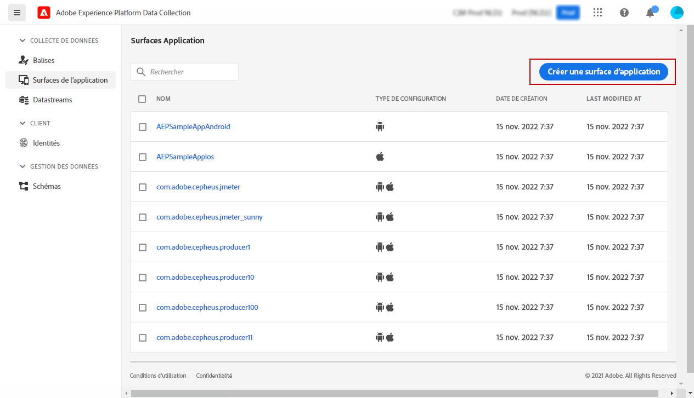

1. Entrez un **[!UICONTROL Nom]** pour la configuration.

1. Dans lʼécran **[!UICONTROL Configuration de lʼapplication mobile]**, sélectionnez le Système dʼexploitation :

   * **Pour iOS**

     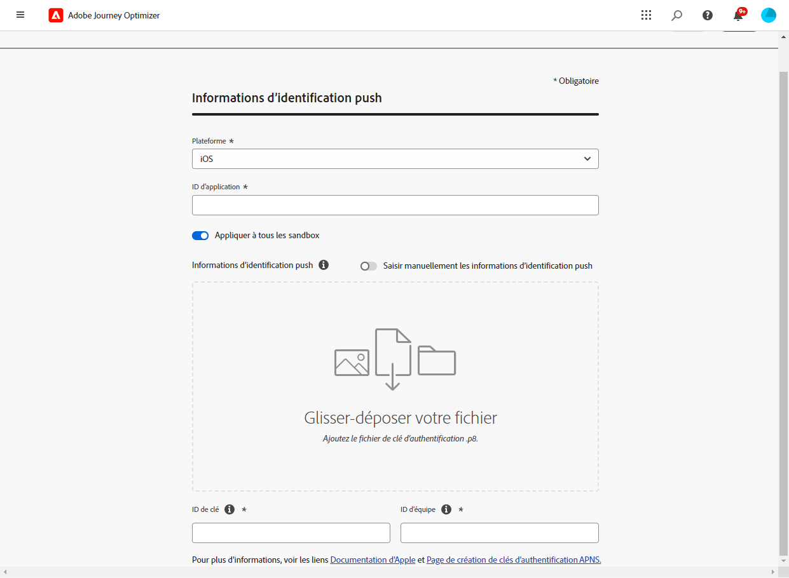

      1. Renseignez l&#39;**ID de bundle** de l&#39;application mobile dans le champ **[!UICONTROL ID de l&#39;application (ID de bundle iOS)]**. L&#39;ID de bundle de l&#39;application se trouve dans l&#39;onglet **Général** de la cible principale dans **XCode**.

      1. Activez le bouton **[!UICONTROL Informations d’identification push]** pour ajouter vos informations d’identification.

      1. Effectuez un glisser-déposer de votre fichier de clé d’authentification de notification push Apple .p8. Cette clé peut être obtenue à partir de la page **Certificats**, **Identifiants** et **Profils**.

      1. Indiquez l&#39;**identifiant de clé**. Il s&#39;agit d&#39;une chaîne de 10 caractères attribuée lors de la création de la clé d&#39;authentification p8. Elle se trouve sous l&#39;onglet **Clés** de la page **Certificats**, **Identifiants** et **Profils**.

      1. Indiquez l&#39;**identifiant d&#39;équipe**. Il s&#39;agit d&#39;une valeur de chaîne qui se trouve sous l&#39;onglet Abonnement.

   * **Pour Android**

     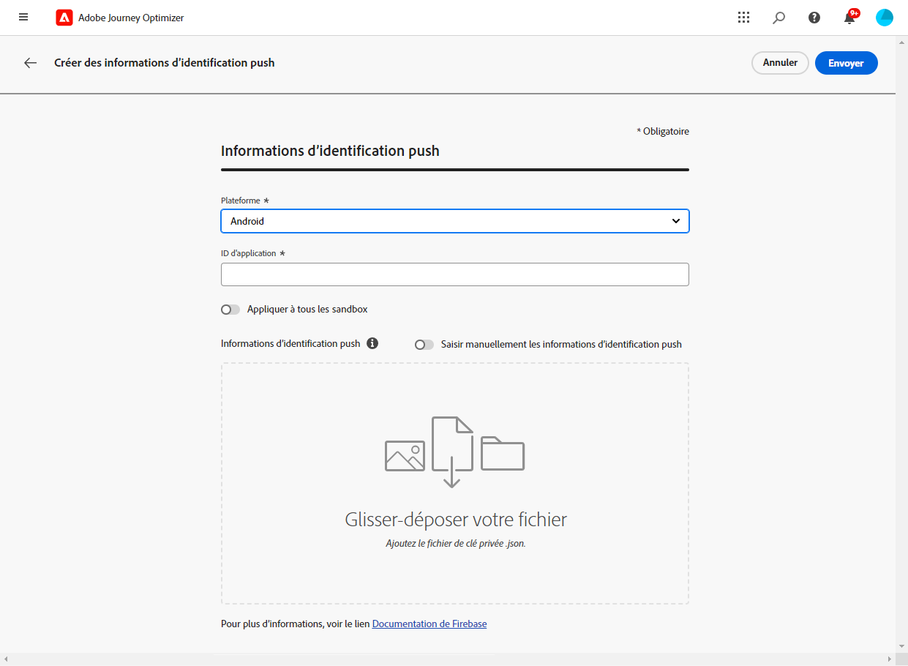

      1. Indiquez l&#39;**[!UICONTROL ID d&#39;application (nom du package Android)]** : en règle générale, le nom du package est l&#39;ID d&#39;application dans votre fichier `build.gradle`.

      1. Activez le bouton **[!UICONTROL Informations d’identification push]** pour ajouter vos informations d’identification.

      1. Effectuez un glisser-déposer des informations d&#39;identification push FCM. Pour plus d’informations sur l’obtention des informations d’identification push, voir la [Documentation Google](https://firebase.google.com/docs/admin/setup#initialize-sdk){target="_blank"}.


1. Cliquez sur **[!UICONTROL Enregistrer]** pour créer votre configuration d&#39;application.

<!--
## Step 2: Set up a mobile property in Adobe Experience Platform Launch {#launch-property}

Setting up a mobile property allows the mobile app developer or marketer to configure the mobile SDKs attributes such as Session Timeouts, the [!DNL Adobe Experience Platform] sandbox to be targeted and the **[!UICONTROL Adobe Experience Platform Datasets]** to be used for mobile SDK to send data to.

For further details and procedures on how to set up a **[!UICONTROL Platform Launch property]**, refer to the steps detailed in [Adobe Experience Platform Mobile SDK documentation](https://aep-sdks.gitbook.io/docs/getting-started/create-a-mobile-property#create-a-mobile-property).


To get the SDKs needed for push notification to work you will need the following SDK extensions, for both Android and iOS:

* **[!UICONTROL Mobile Core]** (installed automatically)
* **[!UICONTROL Profile]** (installed automatically)
* **[!UICONTROL Adobe Experience Platform Edge]**
* **[!UICONTROL Adobe Experience Platform Assurance]**, optional but recommended to debug the mobile implementation.

Learn more about [!DNL Adobe Experience Platform Launch] extensions in [Adobe Experience Platform Launch documentation](https://experienceleague.adobe.com/docs/launch-learn/implementing-in-mobile-android-apps-with-launch/configure-launch/launch-add-extensions.html).
-->

## Étape 2 : configuration de l&#39;extension Adobe Journey Optimizer dans votre propriété mobile. {#configure-journey-optimizer-extension}

Lʼ&#x200B;**extension Adobe Journey Optimizer** pour les SDK mobiles Adobe Experience Platform alimente les notifications push pour vos applications mobiles et vous aide à collecter des jetons push utilisateur et à gérer la mesure des interactions avec les services Adobe Experience Platform.

Découvrez comment configurer l’extension Journey Optimizer dans la [documentation du SDK mobile Adobe Experience Platform](https://developer.adobe.com/client-sdks/documentation/adobe-journey-optimizer/){target="_blank"}.


<!-- 
**[!UICONTROL Edge configuration]** is used by **[!UICONTROL Edge]** extension to send custom data from mobile device to [!DNL Adobe Experience Platform]. 
To configure [!DNL Adobe Experience Platform], you must provide the **[!UICONTROL Sandbox]** name and **[!UICONTROL Event Dataset]**.

1. From [!DNL Adobe Experience Platform Launch], select the **[!UICONTROL Edge Configurations]** tab and click **[!UICONTROL Edge Configurations]**.
    
1. Select **[!UICONTROL New Edge Configuration]** to add a new **[!UICONTROL Edge Configuration]**.
1. Enter a **[!UICONTROL Name]** and click **[!UICONTROL Save]**

1. Click the **[!UICONTROL Adobe Experience Platform]** toggle to enable it.

1. Fill in the **[!UICONTROL Sandbox]**, **[!UICONTROL Event dataset]** and **[!UICONTROL Profile Dataset]** fields. Then, click **[!UICONTROL Save]**.
    
    


1. From [!DNL Adobe Experience Platform Launch], ensure that **[!UICONTROL Client Side]** is selected in the drop-down menu.

1. select the **[!UICONTROL Properties]** tab and click **[!UICONTROL New Property]**.

    

1. Enter a **[!UICONTROL Name]** for your new property.

1. Select **[!UICONTROL Mobile]** as **[!UICONTROL Platform]**.

    

1. Click **[!UICONTROL Save]** to create your new property.

To configure **[!UICONTROL Adobe Experience Platform Edge Extension]** to send custom data from mobile devices to [!DNL Adobe Experience Platform].

1. Select your previously created property and select the **[!UICONTROL Extensions]** tab to view the extensions for this property.

    

1. Click **[!UICONTROL Configure]** under the **[!UICONTROL Adobe Experience Platform Edge]** Network' extension.

1. From the **[!UICONTROL Edge Configuration]** drop-down list, select the **[!UICONTROL Edge Configuration]** created in the previous steps. For more information on **[!UICONTROL Edge Configuration]**, refer to this [section](#edge-configuration).

1. Click **[!UICONTROL Save]**.

To configure **[!UICONTROL Adobe Experience Platform Messaging]** extension to send push profile and push interactions to the correct datasets, follow the same steps as above. Use **[!UICONTROL Sandbox]**, **[!UICONTROL Event dataset]** and **[!UICONTROL Profile Dataset]** created in the [Adobe Experience Platform setup](#edge-configuration).
-->

<!--
## Step 4: Publish the Property {#publish-property}

You now need to publish the property to integrate your configuration and to use it in the mobile app. 

To publish your property, refer to the steps detailed in [Adobe Experience Platform Mobile SDK documentation](https://aep-sdks.gitbook.io/docs/getting-started/create-a-mobile-property#publish-the-configuration)

## Step 5: Configure the ProfileDataSource {#configure-profiledatasource}

To configure the `ProfileDataSource`, use the `ProfileDCInletURL` from [!DNL Adobe Experience Platform] setup and add the following in the mobile app:

```
    MobileCore.updateConfiguration(
    mutableMapOf("messaging.dccs" to <ProfileDCSInletURL>)
```

-->

## Étape 3 : test de votre application mobile avec un événement. {#mobile-app-test}

Après avoir configuré votre application mobile dans Adobe Experience Platform et dans la [!DNL Adobe Experience Platform Data Collection], vous pouvez maintenant la tester avant dʼenvoyer des notifications push à vos profils. Dans ce cas d’utilisation, nous créons un parcours pour cibler notre application mobile et définir un événement qui déclenche la notification push.

<!--
You can use a test mobile app for this use case. For more on this, refer to this [page](https://wiki.corp.adobe.com/pages/viewpage.action?spaceKey=CJM&title=Details+of+setting+the+mobile+test+app) (internal use only).
-->

Pour que ce parcours fonctionne, vous devez créer un schéma XDM. Pour plus d’informations, consultez la [documentation XDM](https://experienceleague.adobe.com/docs/experience-platform/xdm/schema/composition.html?lang=fr#schemas-and-data-ingestion){target="_blank"}.

1. Dans la section du menu Gestion des données, cliquez sur **[!UICONTROL Schémas]**.
   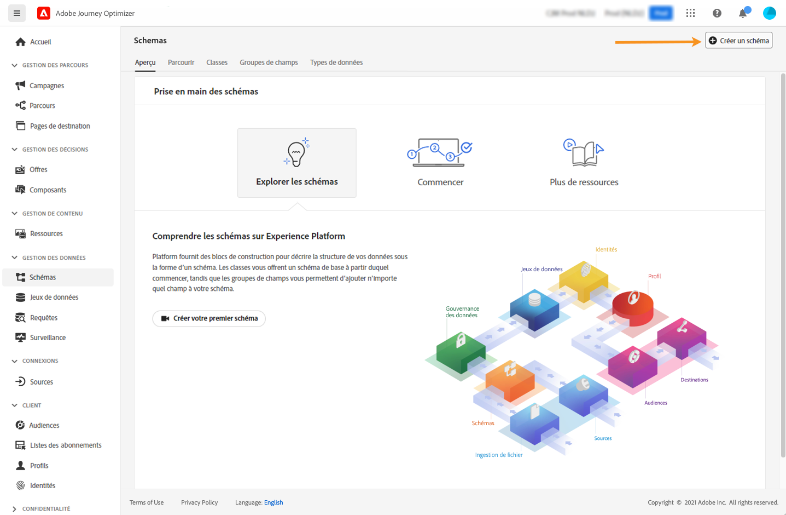
1. Cliquez sur **[!UICONTROL Créer un schéma]**, dans le coin supérieur droit, sélectionnez **[!UICONTROL Événement d’expérience]** et cliquez sur **Suivant**.
   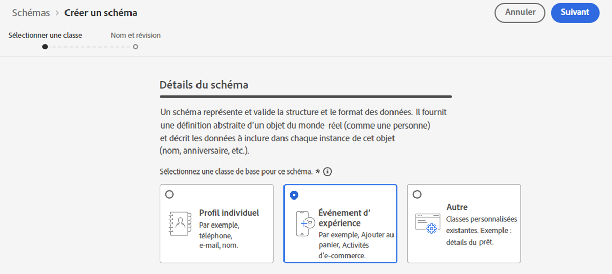
1. Saisissez le nom et la description de votre schéma, puis cliquez sur **Terminer**.
   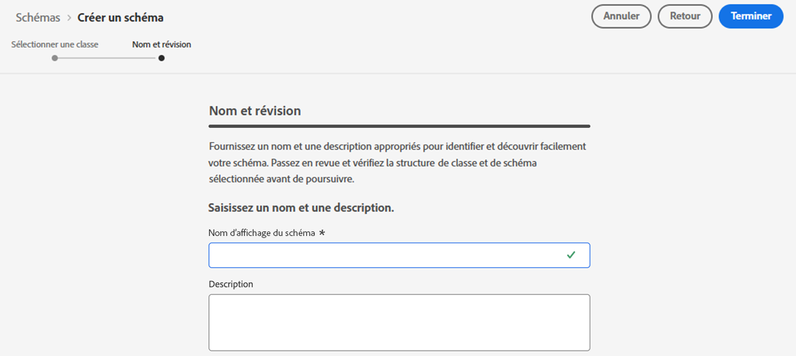
1. Dans la section **Groupes de champs**, à gauche, cliquez sur **Ajouter** et sélectionnez **[!UICONTROL Créer un groupe de champs]**.

1. Saisissez un **[!UICONTROL Nom d&#39;affichage]** et une **[!UICONTROL Description]**. Cliquez sur **[!UICONTROL Ajouter des groupes de champs]** lorsque vous avez terminé. Pour plus d’informations sur la création de groupes de champs, consultez la [documentation du système XDM](https://experienceleague.adobe.com/docs/experience-platform/xdm/tutorials/create-schema-ui.html?lang=fr){target="_blank"}.


   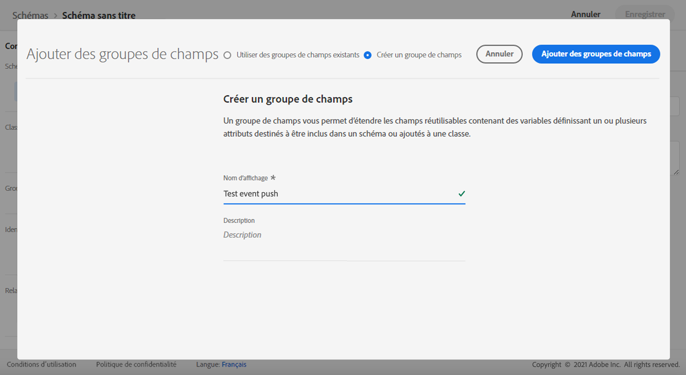

1. Sur le côté gauche, sélectionnez le schéma. Dans le volet de droite, activez ce schéma pour **[!UICONTROL Profil]**.

   


1. Sur le côté gauche, sélectionnez le groupe de champs, puis cliquez sur l&#39;icône + pour créer un champ. Dans la zone **[!UICONTROL Propriétés des groupes de champs]**, sur le côté droit, saisissez un **[!UICONTROL nom du champ]**, un **[!UICONTROL nom d&#39;affichage]** et sélectionnez **[!UICONTROL Chaîne]** comme **[!UICONTROL type]**.

   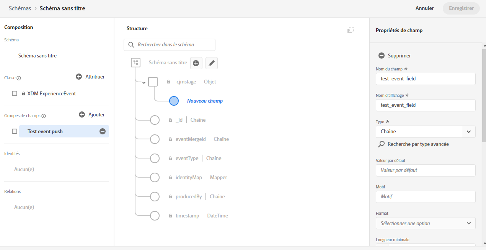

1. Cochez **[!UICONTROL Obligatoire]** et cliquez sur **[!UICONTROL Appliquer]**.

1. Cliquez sur **[!UICONTROL Enregistrer]**. Votre schéma est maintenant créé et peut être utilisé dans un événement.

Vous devez ensuite configurer un événement.

1. Dans le menu de gauche de la page d&#39;accueil, sous ADMINISTRATION, sélectionnez **[!UICONTROL Configurations]**. Cliquez sur **[!UICONTROL Gérer]** dans la section **[!UICONTROL Événements]** pour créer votre événement.

1. Cliquez sur **[!UICONTROL Créer un événement]**. Le volet de configuration de l&#39;événement s&#39;ouvre alors dans la partie droite de l&#39;écran.

   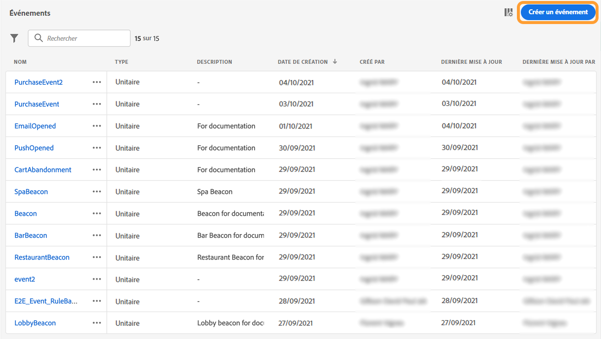

1. Saisissez le nom de votre événement. Vous pouvez également ajouter une description.

1. Dans le champ **[!UICONTROL Type d&#39;identifiant d&#39;événement]**, sélectionnez **[!UICONTROL Basé sur des règles]**.

1. Dans la section **[!UICONTROL Paramètres]**, sélectionnez le schéma créé précédemment.

   

1. Dans la liste des champs, vérifiez que le champ créé dans le groupe de champs du schéma est sélectionné.

   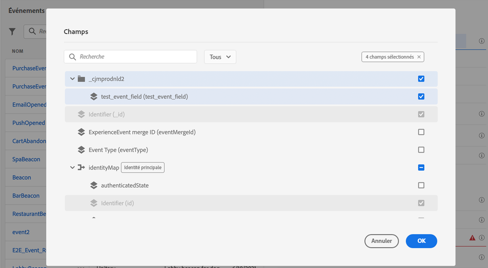

1. Cliquez sur **[!UICONTROL Modifier]** dans le champ **[!UICONTROL Condition d&#39;identifiant d&#39;événement]**. Effectuez un glisser-déposer du champ précédemment ajouté pour définir la condition qui sera utilisée par le système pour identifier les événements qui déclenchent votre parcours.

   

1. Saisissez la syntaxe à utiliser pour déclencher votre notification push dans votre application de test, dans cet exemple **confirmation de commande**.

   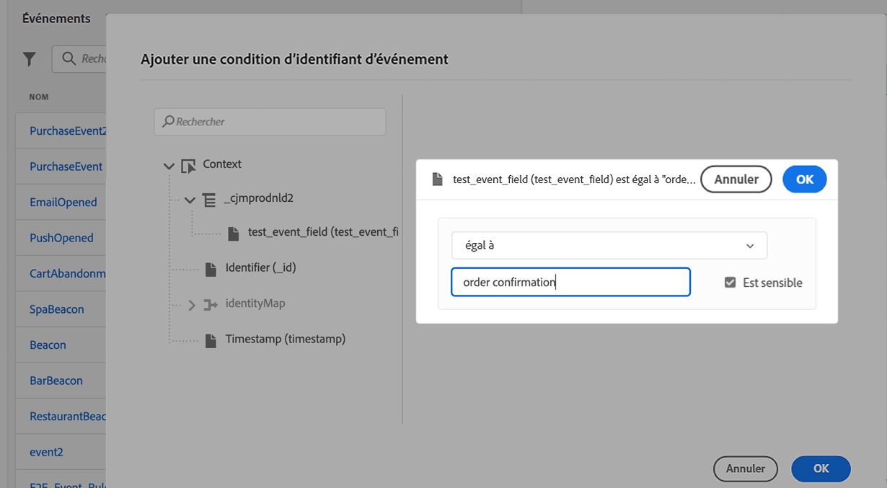

1. Sélectionnez **[!UICONTROL ECID]** comme **[!UICONTROL Espace de noms]**.

1. Cliquez sur **[!UICONTROL Ok]**, puis sur **[!UICONTROL Enregistrer]**.

Votre événement est maintenant créé et peut être utilisé dans un parcours.

1. Dans le menu de gauche, cliquez sur **[!UICONTROL Parcours]**.

1. Cliquez sur **[!UICONTROL Créer un parcours]** pour créer un parcours.

1. Modifiez les propriétés du parcours dans le volet de configuration qui s&#39;affiche dans la partie droite. En savoir plus dans cette [section](../building-journeys/journey-properties.md).

1. Commencez par faire glisser l&#39;événement créé lors des étapes précédentes à partir de la liste déroulante **[!UICONTROL Événements]**.

   

1. Dans la liste déroulante **[!UICONTROL Actions]**, faites glisser et déposez une activité **[!UICONTROL Push]** dans votre parcours.

1. Configurez la notification push. Pour plus d’informations sur la création de notifications push, consultez cette [page](create-push.md).

1. Cliquez sur l&#39;option **[!UICONTROL Test]** pour commencer à tester vos notifications push et cliquez sur **[!UICONTROL Déclencher un événement]**.

   

1. Saisissez votre ECID dans le champ **[!UICONTROL Clé]** puis saisissez **confirmation de commande** dans le deuxième champ.

   

1. Cliquez sur **[!UICONTROL Envoyer]**.

Votre événement sera déclenché et vous recevrez votre notification push sur votre application mobile.

## Étape 4 : création d’une surface de canal pour les notifications push{#message-preset}

Une fois votre application mobile configurée dans [!DNL Adobe Experience Platform Data Collection], vous devez créer une surface afin de pouvoir envoyer des notifications push depuis **[!DNL Journey Optimizer]**.

Découvrez comment créer et configurer une surface de canal dans [cette section](../configuration/channel-surfaces.md).

Vous êtes maintenant prêt à envoyer des notifications push avec Journey Optimizer.

* Découvrez comment créer un message push dans [cette page](create-push.md).
* Découvrez comment ajouter un message dans un parcours dans [cette section](../building-journeys/journeys-message.md).
