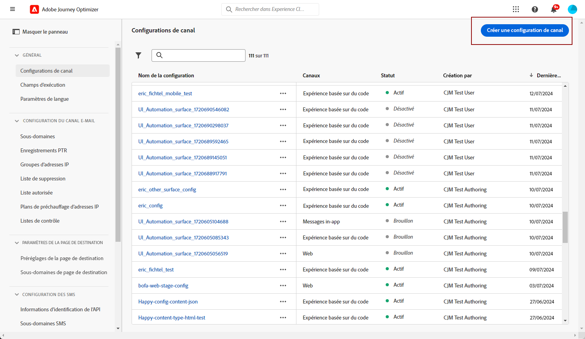
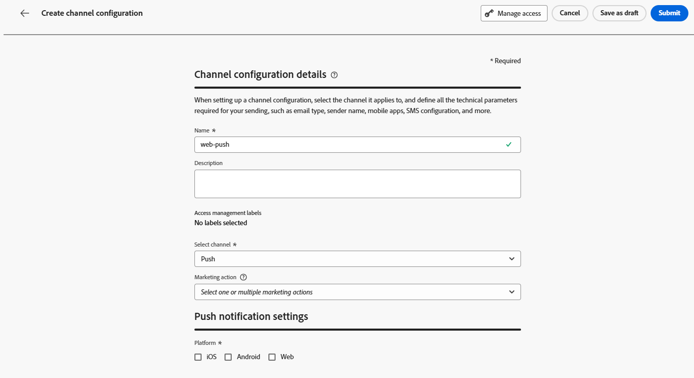
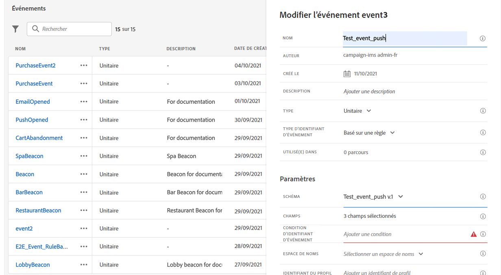
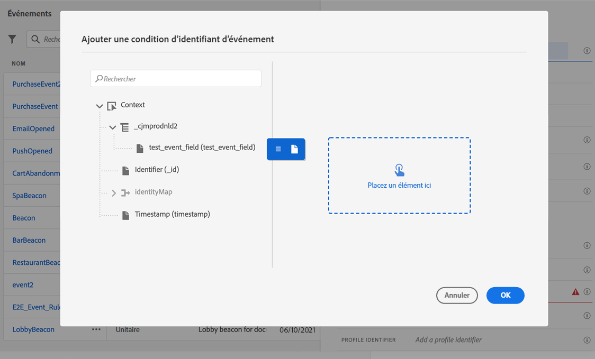
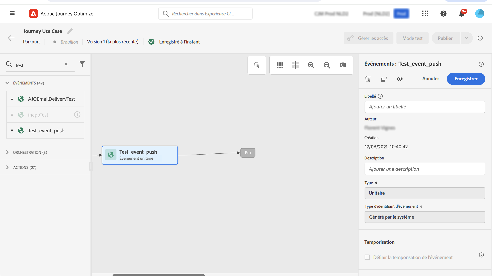

# Configuration du canal de notification push des applications mobiles {#push-notification-configuration}

[!DNL Journey Optimizer] vous permet de créer vos parcours et d&#39;envoyer des messages à une audience ciblée. Avant de commencer à envoyer des notifications push avec [!DNL Journey Optimizer], vous devez vous assurer que les configurations et les intégrations sont en place sur lʼapplication mobile et pour les balises dʼAdobe Experience Platform. Pour comprendre le flux de données des notifications push dans [!DNL Adobe Journey Optimizer], reportez-vous à [cette page](push-gs.md).

>[!AVAILABILITY]
>
>Le nouveau **workflow de démarrage rapide de l’intégration mobile** est désormais disponible. Utilisez cette nouvelle fonctionnalité de produit pour configurer rapidement le SDK mobile, afin de commencer à collecter et valider les données d’événement mobile et d’envoyer des notifications push mobiles. Cette fonctionnalité est accessible via la page d’accueil de collecte de données en tant que version Beta publique. [En savoir plus](mobile-onboarding-wf.md)
>

## Avant de commencer {#start-push}

### Configuration des autorisations {#setup-permissions}

Avant de créer une application mobile, vous devez dʼabord vous assurer que vous possédez ou accordez les autorisations utilisateur appropriées pour les balises dans Adobe Experience Platform. Pour en savoir plus, consultez la [documentation sur les balises](https://experienceleague.adobe.com/docs/experience-platform/tags/admin/user-permissions.html?lang=fr){target="_blank"}.

>[!CAUTION]
>
>La configuration des notifications push doit être effectuée par un utilisateur expérimenté. Selon votre modèle de mise en œuvre et les rôles impliqués dans cette mise en œuvre, vous devrez peut-être attribuer le jeu complet des autorisations à un profil de produit unique ou partager des autorisations entre le développeur d&#39;application et l&#39;administrateur **Adobe Journey Optimizer**. Découvrez les autorisations liées aux **Balises** dans [cette documentation](https://experienceleague.adobe.com/docs/experience-platform/tags/admin/user-permissions.html?lang=fr){target="_blank"}.

<!--ou need to your have access to perform following roles :

* Manage Datastreams
* Manage Client-side Properties
* Manage App Configurations
-->

Pour attribuer des droits **Propriété** et **Société**, procédez comme suit :

1. Accédez à **[!DNL Admin Console]**.

1. Dans l’onglet **[!UICONTROL Produits]**, sélectionnez la vignette **[!UICONTROL Collecte de données Adobe Experience Platform]**.

   

1. Sélectionnez un **[!UICONTROL Profil de produit]** existant ou créez-en un en cliquant sur le bouton **[!UICONTROL Nouveau profil]**. Découvrez comment créer un **[!UICONTROL nouveau profil]** dans la [documentation Admin Console](https://experienceleague.adobe.com/docs/experience-platform/access-control/ui/create-profile.html?lang=fr#ui){target="_blank"}.

1. Dans l&#39;onglet **[!UICONTROL Autorisations]**, sélectionnez **[!UICONTROL Droits de propriété]**.

   

1. Cliquez sur **[!UICONTROL Ajouter tout]**. Le droit suivant est alors ajouté à votre profil de produit :
   * **[!UICONTROL Approuver]**
   * **[!UICONTROL Développer]**
   * **[!UICONTROL Gérer les environnements]**
   * **[!UICONTROL Gérer les extensions]**
   * **[!UICONTROL Publier]**

   Ces autorisations sont requises pour installer et publier l&#39;extension Adobe Journey Optimizer et publier la propriété de l&#39;application dans le SDK mobile Adobe Experience Platform.

1. Sélectionnez ensuite **[!UICONTROL Droits d&#39;entreprise]** dans le menu de gauche.

   

1. Ajoutez les droits suivants :

   * **[!UICONTROL Gérer les configurations d&#39;application]**
   * **[!UICONTROL Gérer les propriétés]**

   Ces autorisations sont requises pour que le développeur ou la développeuse de l’application mobile configure les informations d’identification des notifications push dans la **Collecte des données Adobe Experience Platform** et définisse les configurations de canal des notifications push (c’est-à-dire les paramètres prédéfinis de message) dans **Adobe Journey Optimizer**.

   

1. Cliquez sur **[!UICONTROL Enregistrer]**.

Pour attribuer ce **[!UICONTROL profil de produit]** aux utilisateurs, procédez comme suit :

1. Accédez à **[!DNL Admin Console]**.

1. Dans l’onglet **[!UICONTROL Produits]**, sélectionnez la vignette **[!UICONTROL Collecte des données Adobe Experience Platform]**.

1. Sélectionnez votre **[!UICONTROL Profil de produit]** précédemment configuré.

1. Dans l’onglet **[!UICONTROL Utilisateurs et utilisatrices]**, cliquez sur **[!UICONTROL Ajouter un utilisateur ou une utilisatrice]**.

   

1. Saisissez le nom ou l&#39;adresse email de votre utilisateur et sélectionnez-le. Cliquez ensuite sur **[!UICONTROL Enregistrer]**.

   >[!NOTE]
   >
   >Si l&#39;utilisateur n&#39;a pas été créé auparavant dans Admin Console, consultez la [documentation relative à l&#39;ajout d&#39;utilisateurs](https://helpx.adobe.com/fr/enterprise/admin-guide.html/enterprise/using/manage-users-individually.ug.html?lang=fr#add-users).

   


### Vérifier les jeux de données {#push-datasets}

Les schémas et jeux de données suivants sont disponibles avec le canal de notification push :

| Schéma <br>Jeu de données | Groupe de champs | Opération |
| -------------------------------------------------------------------------------------- | --------------------------------------------------------------------------------------------------------------------------------------------------------------------------------------- | -------------------------------------------------------- |
| Schéma de profil de notification push CJM <br>Jeu de données de profil de notification push CJM | Détails de la notification push<br>Adobe CJM ExperienceEvent - Détails du profil du message<br>Adobe CJM ExperienceEvent - Détails d’exécution du message<br>Détails de l’application<br>Détails de l’environnement | Enregistrer un jeton push |
| Schéma d’événement d’expérience de suivi des notifications push CJM<br>Jeu de données d’événement d’expérience de suivi des notifications push CJM | Suivi de notification push | Suivre les interactions et fournir des données pour l’interface d’utilisation de création de rapports |


>[!NOTE]
>
>Lorsque des événements de suivi des notifications push sont ingérés dans le jeu de données d’événement d’expérience de suivi des notifications push CJM, certains échecs peuvent se produire, même si les données ont été partiellement ingérées. Cela peut se produire si certains champs de votre mappage n’existent pas dans les événements entrants : le système consigne les avertissements mais n’empêche pas l’ingestion de parties valides des données. Ces avertissements apparaissent dans le statut du lot comme « échec », mais reflètent un succès partiel de l’ingestion.
>
>Pour consulter la liste complète des champs et attributs de chaque schéma, consultez le [dictionnaire de schémas de Journey Optimizer](https://experienceleague.adobe.com/tools/ajo-schemas/schema-dictionary.html?lang=fr){target="_blank"}.


### Configuration de votre application {#configure-app}

La configuration technique implique une collaboration étroite entre le développeur d&#39;application et l&#39;administrateur de l&#39;entreprise. Avant de commencer à envoyer des notifications push avec [!DNL Journey Optimizer], vous devez créer les informations d’identification push et une configuration de canal push dans Adobe Journey Optimizer et intégrer votre application mobile aux SDK mobiles Adobe Experience Platform.

Suivez les étapes de mise en œuvre présentées dans les liens ci-dessous :

* Pour **Apple iOS** : découvrez comment enregistrer votre application auprès du service APNs dans la [Documentation Apple](https://developer.apple.com/documentation/usernotifications/registering_your_app_with_apns){target="_blank"}.
* Pour **Google Android** : découvrez comment configurer une application cliente Firebase Cloud Messaging sur Android dans la [Documentation Google](https://firebase.google.com/docs/cloud-messaging/android/client){target="_blank"}.

### Intégration de votre application mobile au SDK Adobe Experience Platform {#integrate-mobile-app}

Le SDK mobile Adobe Experience Platform fournit des API d&#39;intégration côté client pour vos mobiles via des SDK compatibles Android et iOS. Consultez la [documentation du SDK mobile Adobe Experience Platform](https://developer.adobe.com/client-sdks/documentation/getting-started/){target="_blank"} pour configurer les SDK mobiles Adobe Experience Platform dans votre application.

À la fin de cette lecture, vous aurez également créé et configuré une propriété mobile dans [!DNL Adobe Experience Platform Data Collection]. En règle générale, vous créez une propriété mobile pour chaque application mobile que vous souhaitez gérer. Découvrez comment créer et configurer une propriété mobile dans la [documentation du SDK mobile Adobe Experience Platform](https://developer.adobe.com/client-sdks/documentation/getting-started/create-a-mobile-property/){target="_blank"}.

<!--To enable **Web push notifications**, ensure that the [pushNotifications property](https://experienceleague.adobe.com/en/docs/experience-platform/web-sdk/commands/configure/pushnotifications) is properly configured within the Web SDK. Then, use [the sendPushSubscription command](https://experienceleague.adobe.com/en/docs/experience-platform/web-sdk/commands/sendpushsubscription) to register push subscriptions with Adobe Experience Platform.
-->

## Étape 1 : ajout des informations d’identification push dans Journey Optimizer {#push-credentials-launch}

Après avoir accordé les autorisations d’utilisation appropriées, vous devez maintenant ajouter les informations d’identification push de votre application mobile dans Journey Optimizer.

L&#39;enregistrement des informations d&#39;identification push de l&#39;application mobile est nécessaire pour autoriser Adobe à envoyer des notifications push en votre nom. Reportez-vous aux étapes détaillées ci-dessous :

1. Accédez au menu **[!UICONTROL Canaux]** > **[!UICONTROL Paramètres push]** > **[!UICONTROL Informations d’identification push]**.

1. Cliquez sur **[!UICONTROL Créer des informations d’identification push]**.

1. Dans la liste déroulante **[!UICONTROL Plateforme]**, sélectionnez le système d’exploitation :

   * **Pour iOS**

     

      1. Saisissez l’**[!UICONTROL ID d’application]** de l’application mobile.

      1. Activez l’option **[!UICONTROL Appliquer à tous les sandbox]** pour mettre ces informations d’identification push à disposition dans tous les sandbox. Si un sandbox spécifique possède ses propres informations d’identification pour la même paire d’identifiants de plateforme et d’application, ces informations d’identification spécifiques au sandbox sont prioritaires.

      1. Activez le bouton **[!UICONTROL Saisir manuellement les informations d’identification push]** pour ajouter vos informations d’identification.

      1. Effectuez un glisser-déposer de votre fichier de clé d’authentification de notification push Apple .p8. Cette clé peut être obtenue à partir de la page **Certificats**, **Identifiants** et **Profils**.

         >[!NOTE]
         >
         > Seules les clés de notification push Apple .p8 sont prises en charge. Utilisez un autre compte Apple Developer si vous avez atteint la limite de clés .p8.
         >Pour plus d’informations sur les limites de clés d’Apple, consultez la [documentation Apple Developer](https://developer.apple.com/documentation/usernotifications/registering_your_app_with_apns).


      1. Indiquez l&#39;**identifiant de clé**. Il s&#39;agit d&#39;une chaîne de 10 caractères attribuée lors de la création de la clé d&#39;authentification p8. Elle se trouve sous l&#39;onglet **Clés** de la page **Certificats**, **Identifiants** et **Profils**.

      1. Indiquez l&#39;**identifiant d&#39;équipe**. Il s&#39;agit d&#39;une valeur de chaîne qui se trouve sous l&#39;onglet Abonnement.

   * **Pour Android**

     

      1. Indiquez l’**[!UICONTROL ID d’application]**. En règle générale, le nom du package est l’ID d’application dans votre fichier `build.gradle`.

      1. Activez l’option **[!UICONTROL Appliquer à tous les sandbox]** pour mettre ces informations d’identification push à disposition dans tous les sandbox. Si un sandbox spécifique possède ses propres informations d’identification pour la même paire d’identifiants de plateforme et d’application, ces informations d’identification spécifiques au sandbox sont prioritaires.

      1. Activez le bouton **[!UICONTROL Saisir manuellement les informations d’identification push]** pour ajouter vos informations d’identification.

      1. Effectuez un glisser-déposer des informations d’identification push FCM. Pour plus d&#39;informations sur l&#39;obtention des informations d&#39;identification push, voir la [Documentation Google](https://firebase.google.com/docs/admin/setup#initialize-sdk){target="_blank"}.

<!--
    * **For Web**

        

        1. Provide the **[!UICONTROL App ID]**.

        1. Enter your **[!UICONTROL VAPID public key]** and **[!UICONTROL private key]**.
-->

1. Cliquez sur **[!UICONTROL Envoyer]** pour créer votre configuration d’application.

<!--
## Step 2: Set up a mobile property in Adobe Experience Platform Launch {#launch-property}

Setting up a mobile property allows the mobile app developer or marketer to configure the mobile SDKs attributes such as Session Timeouts, the [!DNL Adobe Experience Platform] sandbox to be targeted and the **[!UICONTROL Adobe Experience Platform Datasets]** to be used for mobile SDK to send data to.

For further details and procedures on how to set up a **[!UICONTROL Platform Launch property]**, refer to the steps detailed in [Adobe Experience Platform Mobile SDK documentation](https://aep-sdks.gitbook.io/docs/getting-started/create-a-mobile-property#create-a-mobile-property).


To get the SDKs needed for push notification to work you will need the following SDK extensions, for both Android and iOS:

* **[!UICONTROL Mobile Core]** (installed automatically)
* **[!UICONTROL Profile]** (installed automatically)
* **[!UICONTROL Adobe Experience Platform Edge]**
* **[!UICONTROL Adobe Experience Platform Assurance]**, optional but recommended to debug the mobile implementation.

Learn more about [!DNL Adobe Experience Platform Launch] extensions in [Adobe Experience Platform Launch documentation](https://experienceleague.adobe.com/docs/launch-learn/implementing-in-mobile-android-apps-with-launch/configure-launch/launch-add-extensions.html?lang=fr).
-->

## Étape 2 : création d’une configuration de canal pour les notifications push{#message-preset}

Une fois vos informations d’identification push créées, vous devez créer une configuration pour pouvoir envoyer des notifications push depuis **[!DNL Journey Optimizer]**.

1. Accédez au menu **[!UICONTROL Canaux]** > **[!UICONTROL Paramètres généraux]** > **[!UICONTROL Configuration des canaux]**, puis cliquez sur **[!UICONTROL Créer une configuration des canaux]**.

   

1. Saisissez un nom et une description (facultatif) pour la configuration.

   >[!NOTE]
   >
   > Les noms doivent commencer par une lettre (A-Z). Ils ne peuvent contenir que des caractères alphanumériques. Vous pouvez également utiliser le trait de soulignement `_`, le point`.` et le trait d&#39;union `-`.


1. Pour attribuer des libellés d’utilisation des données personnalisés ou de base à la configuration, vous pouvez sélectionner **[!UICONTROL Gérer l’accès]**. [En savoir plus sur le contrôle d’accès au niveau de l’objet (OLAC)](../administration/object-based-access.md)

1. Sélectionnez le canal **push**.

   

1. Sélectionnez une **[!UICONTROL Action marketing]** ou plusieurs pour associer des politiques de consentement aux messages utilisant cette configuration. Toutes les politiques de consentement associées à cette action marketing sont utilisées afin de respecter les préférences de vos clientes et clients. [En savoir plus](../action/consent.md#surface-marketing-actions)

1. Choisissez votre **[!UICONTROL plateforme]** : Android et/ou iOS <!--and/or Web-->.

1. Sélectionnez le même **[!UICONTROL ID d’application]** que pour vos [informations d’identification push](#push-credentials-launch) configurées ci-dessus.

1. Enregistrez vos modifications.

Vous pouvez maintenant sélectionner votre configuration lors de la création de vos notifications push.

## Étape 3 : configuration de l’extension Adobe Journey Optimizer dans votre propriété mobile {#configure-journey-optimizer-extension}

Lʼ&#x200B;**extension Adobe Journey Optimizer** pour les SDK mobiles Adobe Experience Platform alimente les notifications push pour vos applications mobiles et vous aide à collecter des jetons push utilisateur et à gérer la mesure des interactions avec les services Adobe Experience Platform.

Découvrez comment configurer l’extension Journey Optimizer dans la [documentation du SDK mobile Adobe Experience Platform](https://developer.adobe.com/client-sdks/documentation/adobe-journey-optimizer/){target="_blank"}.


<!-- 
**[!UICONTROL Edge configuration]** is used by **[!UICONTROL Edge]** extension to send custom data from mobile device to [!DNL Adobe Experience Platform]. 
To configure [!DNL Adobe Experience Platform], you must provide the **[!UICONTROL Sandbox]** name and **[!UICONTROL Event Dataset]**.

1. From [!DNL Adobe Experience Platform Launch], select the **[!UICONTROL Edge Configurations]** tab and click **[!UICONTROL Edge Configurations]**.
    
1. Select **[!UICONTROL New Edge Configuration]** to add a new **[!UICONTROL Edge Configuration]**.
1. Enter a **[!UICONTROL Name]** and click **[!UICONTROL Save]**

1. Click the **[!UICONTROL Adobe Experience Platform]** toggle to enable it.

1. Fill in the **[!UICONTROL Sandbox]**, **[!UICONTROL Event dataset]** and **[!UICONTROL Profile Dataset]** fields. Then, click **[!UICONTROL Save]**.
    
    


1. From [!DNL Adobe Experience Platform Launch], ensure that **[!UICONTROL Client Side]** is selected in the drop-down menu.

1. select the **[!UICONTROL Properties]** tab and click **[!UICONTROL New Property]**.

    

1. Enter a **[!UICONTROL Name]** for your new property.

1. Select **[!UICONTROL Mobile]** as **[!UICONTROL Platform]**.

    

1. Click **[!UICONTROL Save]** to create your new property.

To configure **[!UICONTROL Adobe Experience Platform Edge Extension]** to send custom data from mobile devices to [!DNL Adobe Experience Platform].

1. Select your previously created property and select the **[!UICONTROL Extensions]** tab to view the extensions for this property.

    

1. Click **[!UICONTROL Configure]** under the **[!UICONTROL Adobe Experience Platform Edge]** Network' extension.

1. From the **[!UICONTROL Edge Configuration]** drop-down list, select the **[!UICONTROL Edge Configuration]** created in the previous steps. For more information on **[!UICONTROL Edge Configuration]**, refer to this [section](#edge-configuration).

1. Click **[!UICONTROL Save]**.

To configure **[!UICONTROL Adobe Experience Platform Messaging]** extension to send push profile and push interactions to the correct datasets, follow the same steps as above. Use **[!UICONTROL Sandbox]**, **[!UICONTROL Event dataset]** and **[!UICONTROL Profile Dataset]** created in the [Adobe Experience Platform setup](#edge-configuration).
-->

<!--
## Step 4: Publish the Property {#publish-property}

You now need to publish the property to integrate your configuration and to use it in the mobile app. 

To publish your property, refer to the steps detailed in [Adobe Experience Platform Mobile SDK documentation](https://aep-sdks.gitbook.io/docs/getting-started/create-a-mobile-property#publish-the-configuration)

## Step 5: Configure the ProfileDataSource {#configure-profiledatasource}

To configure the `ProfileDataSource`, use the `ProfileDCInletURL` from [!DNL Adobe Experience Platform] setup and add the following in the mobile app:

```
    MobileCore.updateConfiguration(
    mutableMapOf("messaging.dccs" to <ProfileDCSInletURL>)
```

-->

## Étape 4 : test de votre application mobile avec un événement {#mobile-app-test}

Après avoir configuré votre application mobile dans Adobe Experience Platform et dans la [!DNL Adobe Experience Platform Data Collection], vous pouvez maintenant la tester avant dʼenvoyer des notifications push à vos profils. Dans ce cas d’utilisation, nous créons un parcours pour cibler notre application mobile et définir un événement qui déclenche la notification push.

<!--
You can use a test mobile app for this use case. For more on this, refer to this [page](https://wiki.corp.adobe.com/pages/viewpage.action?spaceKey=CJM&title=Details+of+setting+the+mobile+test+app) (internal use only).
-->

Pour que ce parcours fonctionne, vous devez créer un schéma XDM. Pour plus d&#39;informations, consultez la [documentation XDM](https://experienceleague.adobe.com/docs/experience-platform/xdm/schema/composition.html?lang=fr#schemas-and-data-ingestion){target="_blank"}.

1. Dans la section du menu Gestion des données, cliquez sur **[!UICONTROL Schémas]**.
   
1. Cliquez sur **[!UICONTROL Créer un schéma]**, dans le coin supérieur droit, sélectionnez **[!UICONTROL Événement d’expérience]** et cliquez sur **Suivant**.
   
1. Saisissez le nom et la description de votre schéma, puis cliquez sur **Terminer**.
   
1. Dans la section **Groupes de champs**, à gauche, cliquez sur **Ajouter** et sélectionnez **[!UICONTROL Créer un groupe de champs]**.

1. Saisissez un **[!UICONTROL Nom d&#39;affichage]** et une **[!UICONTROL Description]**. Cliquez sur **[!UICONTROL Ajouter des groupes de champs]** lorsque vous avez terminé. Pour plus d&#39;informations sur la création de groupes de champs, consultez la [documentation du système XDM](https://experienceleague.adobe.com/docs/experience-platform/xdm/tutorials/create-schema-ui.html?lang=fr){target="_blank"}.


   

1. Sur le côté gauche, sélectionnez le schéma. Dans le volet de droite, activez ce schéma pour **[!UICONTROL Profil]**.

   


1. Sur le côté gauche, sélectionnez le groupe de champs, puis cliquez sur l&#39;icône + pour créer un champ. Dans la zone **[!UICONTROL Propriétés des groupes de champs]**, sur le côté droit, saisissez un **[!UICONTROL nom du champ]**, un **[!UICONTROL nom d&#39;affichage]** et sélectionnez **[!UICONTROL Chaîne]** comme **[!UICONTROL type]**.

   

1. Cochez **[!UICONTROL Obligatoire]** et cliquez sur **[!UICONTROL Appliquer]**.

1. Cliquez sur **[!UICONTROL Enregistrer]**. Votre schéma est maintenant créé et peut être utilisé dans un événement.

Vous devez ensuite configurer un événement.

1. Dans le menu de gauche de la page d&#39;accueil, sous ADMINISTRATION, sélectionnez **[!UICONTROL Configurations]**. Cliquez sur **[!UICONTROL Gérer]** dans la section **[!UICONTROL Événements]** pour créer votre événement.

1. Cliquez sur **[!UICONTROL Créer un événement]**. Le volet de configuration de l&#39;événement s&#39;ouvre alors dans la partie droite de l&#39;écran.

   

1. Saisissez le nom de votre événement. Vous pouvez également ajouter une description.

1. Dans le champ **[!UICONTROL Type d&#39;identifiant d&#39;événement]**, sélectionnez **[!UICONTROL Basé sur des règles]**.

1. Dans la section **[!UICONTROL Paramètres]**, sélectionnez le schéma créé précédemment.

   

1. Dans la liste des champs, vérifiez que le champ créé dans le groupe de champs du schéma est sélectionné.

   

1. Cliquez sur **[!UICONTROL Modifier]** dans le champ **[!UICONTROL Condition d&#39;identifiant d&#39;événement]**. Effectuez un glisser-déposer du champ précédemment ajouté pour définir la condition qui sera utilisée par le système pour identifier les événements qui déclenchent votre parcours.

   

1. Saisissez la syntaxe à utiliser pour déclencher votre notification push dans votre application de test, dans cet exemple **confirmation de commande**.

   

1. Sélectionnez **[!UICONTROL ECID]** comme **[!UICONTROL Espace de noms]**.

1. Cliquez sur **[!UICONTROL Ok]**, puis sur **[!UICONTROL Enregistrer]**.

Votre événement est maintenant créé et peut être utilisé dans un parcours.

1. Dans le menu de gauche, cliquez sur **[!UICONTROL Parcours]**.

1. Cliquez sur **[!UICONTROL Créer un parcours]** pour créer un parcours.

1. Modifiez les propriétés du parcours dans le volet de configuration qui s&#39;affiche dans la partie droite. En savoir plus dans cette [section](../building-journeys/journey-properties.md).

1. Commencez par faire glisser l&#39;événement créé lors des étapes précédentes à partir de la liste déroulante **[!UICONTROL Événements]**.

   

1. Dans la liste déroulante **[!UICONTROL Actions]**, faites glisser et déposez une activité **[!UICONTROL Push]** dans votre parcours.

1. Configurez la notification push. Pour plus d’informations sur la création de notifications push, consultez cette [page](create-push.md).

1. Cliquez sur le bouton (bascule) **[!UICONTROL Test]** pour commencer à tester vos notifications push et cliquez sur **[!UICONTROL Déclencher un événement]**.

   

1. Saisissez votre ECID dans le champ **[!UICONTROL Clé]** puis saisissez **confirmation de commande** dans le deuxième champ.

   

1. Cliquez sur **[!UICONTROL Envoyer]**.

Votre événement sera déclenché et vous recevrez votre notification push sur votre application mobile.

