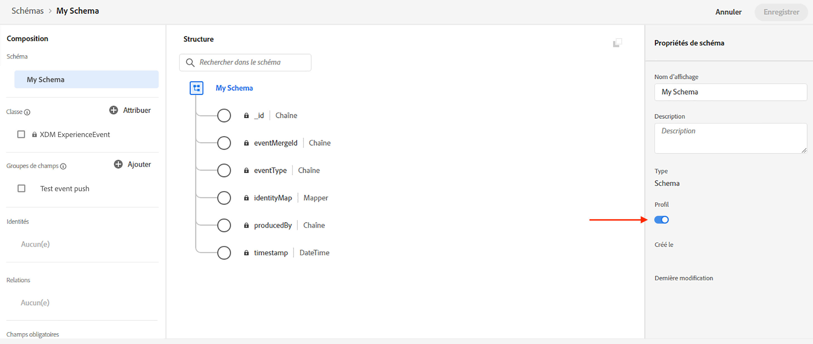

# Configuration du canal de notification push {#push-notification-configuration}

[!DNL Journey Optimizer] vous permet de créer vos parcours et d’envoyer des messages à une audience ciblée. Avant de commencer à envoyer des notifications push avec [!DNL Journey Optimizer], vous devez vous assurer que les configurations et les intégrations sont en place sur l’application mobile et pour les balises dans Adobe Experience Platform. Pour comprendre le flux de données des notifications push dans [!DNL Adobe Journey Optimizer] reportez-vous à la section [cette page](push-gs.md).

## Avant de commencer {#before-starting}

<!--
### Check provisioning

Your Adobe Experience Platform account must be provisioned to contain following schemas and datasets for push notification data flow to function correctly:

| Schema <br>Dataset                                                                       | Group of fields                                                                                                                                                                         | Operation                                                |
| -------------------------------------------------------------------------------------- | --------------------------------------------------------------------------------------------------------------------------------------------------------------------------------------- | -------------------------------------------------------- |
| CJM Push Profile Schema <br>CJM Push Profile Dataset                                     | Push Notification Details<br>Adobe CJM ExperienceEvent - Message Profile Details<br>Adobe CJM ExperienceEvent - Message Execution Details<br>Application Details<br>Environment Details | Register Push Token                                      |
| CJM Push Tracking Experience Event Schema<br>CJM Push Tracking Experience Event Dataset | Push Notification Tracking                                                                                                                                                              | Track interactions and provide data for the reporting UI |
-->

### Configuration des autorisations {#setup-permissions}

Avant de créer une application mobile, vous devez vous assurer que vous disposez ou que vous attribuez les autorisations utilisateur appropriées pour les balises dans Adobe Experience Platform. En savoir plus dans [Documentation sur les balises](https://experienceleague.adobe.com/docs/experience-platform/tags/admin/user-permissions.html){target=&quot;_blank&quot;}.

>[!CAUTION]
>
>La configuration push doit être effectuée par un utilisateur expert. Selon votre modèle de mise en oeuvre et les personnes impliquées dans cette mise en oeuvre, vous devrez peut-être attribuer l’ensemble des autorisations à un profil de produit unique ou partager les autorisations entre le développeur de l’application et le **Adobe Journey Optimizer** administrateur. En savoir plus sur **Balises** autorisations dans [cette documentation](https://experienceleague.adobe.com/docs/experience-platform/tags/admin/user-permissions.html){target=&quot;_blank&quot;}.

<!--ou need to your have access to perform following roles :

* Manage Datastreams
* Manage Client-side Properties
* Manage App Configurations
-->

Pour affecter **Propriété** et **Société** droits, procédez comme suit :

1. Accédez au **[!DNL Admin Console]**.

1. Dans la **[!UICONTROL Products]** , sélectionnez la variable **[!UICONTROL Adobe Experience Platform Data Collection]** carte.

   

1. Sélectionner un **[!UICONTROL Product Profile]** ou créez-en un à l’aide de la fonction **[!UICONTROL New profile]** bouton . Découvrez comment créer une **[!UICONTROL New profile]** dans le [Documentation de la console d’administration](https://experienceleague.adobe.com/docs/experience-platform/access-control/ui/create-profile.html#ui){target=&quot;_blank&quot;}.

1. Dans la **[!UICONTROL Permissions]** onglet, sélectionnez **[!UICONTROL Property rights]**.

   

1. Cliquez sur **[!UICONTROL Add all]**. Vous ajouterez ainsi les droits suivants à votre profil de produit :
   * **[!UICONTROL Approve]**
   * **[!UICONTROL Develop]**
   * **[!UICONTROL Manage Environments]**
   * **[!UICONTROL Manage Extensions]**
   * **[!UICONTROL Publish]**

   Ces autorisations sont requises pour installer et publier l’extension Adobe Journey Optimizer et publier la propriété de l’application dans le SDK Mobile Adobe Experience Platform.

1. Sélectionnez ensuite **[!UICONTROL Company rights]** dans le menu de gauche.

   

1. Ajoutez les droits suivants :

   * **[!UICONTROL Manage App Configurations]**
   * **[!UICONTROL Manage Properties]**

   Ces autorisations sont requises pour que le développeur d’applications mobiles configure les informations d’identification push dans **Collecte de données Adobe Experience Platform** et définir les surfaces du canal Notification push (c’est-à-dire les paramètres prédéfinis du message) dans **Adobe Journey Optimizer**.

   

1. Cliquez sur **[!UICONTROL Save]**.

Pour affecter **[!UICONTROL Product profile]** pour les utilisateurs, procédez comme suit :

1. Accédez au **[!DNL Admin Console]**.

1. Dans la **[!UICONTROL Products]** , sélectionnez la variable **[!UICONTROL Adobe Experience Platform Data Collection]** carte.

1. Sélectionnez votre **[!UICONTROL Product profile]**.

1. Dans la **[!UICONTROL Users]** , cliquez sur **[!UICONTROL Add user]**.

   

1. Saisissez le nom ou l’adresse électronique de votre utilisateur, puis sélectionnez-le. Cliquez ensuite sur **[!UICONTROL Save]**.

   >[!NOTE]
   >
   >Si l’utilisateur n’a pas été créé auparavant dans la console d’administration, reportez-vous à la section [Ajout de la documentation sur les utilisateurs](https://helpx.adobe.com/enterprise/admin-guide.html/enterprise/using/manage-users-individually.ug.html#add-users).

   

### Configuration de votre application {#configure-app}

La configuration technique implique une collaboration étroite entre le développeur de l’application et l’administrateur de l’entreprise. Avant de commencer à envoyer des notifications push avec [!DNL Journey Optimizer], vous devez définir les paramètres dans [!DNL Adobe Experience Platform Data Collection] et intégrer votre application mobile avec les SDK mobiles Adobe Experience Platform.

Suivez les étapes de mise en oeuvre présentées dans les liens ci-dessous :

* Pour **Apple iOS**: Découvrez comment enregistrer votre application avec des APNS dans [Documentation Apple](https://developer.apple.com/documentation/usernotifications/registering_your_app_with_apns){target=&quot;_blank&quot;}
* Pour **Google Android**: Découvrez comment configurer une application cliente Firebase Cloud Messaging sur Android dans [Documentation Google](https://firebase.google.com/docs/cloud-messaging/android/client){target=&quot;_blank&quot;}

### Intégration de votre application mobile avec le SDK Adobe Experience Platform {#integrate-mobile-app}

Le SDK Mobile Adobe Experience Platform fournit des API d’intégration côté client pour vos mobiles via des SDK compatibles Android et iOS. Suivez [Documentation du SDK Mobile Adobe Experience Platform](https://aep-sdks.gitbook.io/docs/getting-started/overview){target=&quot;_blank&quot;} pour obtenir une configuration avec les SDK mobiles Adobe Experience Platform dans votre application.

À la fin de cette période, vous devez également avoir créé et configuré une propriété mobile dans [!DNL Adobe Experience Platform Data Collection]. En règle générale, vous créez une propriété mobile pour chaque application mobile que vous souhaitez gérer. Découvrez comment créer et configurer une propriété mobile dans [Documentation du SDK Mobile Adobe Experience Platform](https://aep-sdks.gitbook.io/docs/getting-started/create-a-mobile-property){target=&quot;_blank&quot;}.


## Étape 1 : Ajout des informations d’identification push de votre application à la collecte de données Adobe Experience Platform {#push-credentials-launch}

Après avoir accordé les autorisations utilisateur appropriées, vous devez maintenant ajouter les informations d’identification push de votre application mobile dans [!DNL Adobe Experience Platform Data Collection].

L’enregistrement des informations d’identification push de l’application mobile est nécessaire pour autoriser Adobe à envoyer des notifications push en votre nom. Reportez-vous aux étapes détaillées ci-dessous :

1. De [!DNL Adobe Experience Platform Data Collection], sélectionnez la variable **[!UICONTROL App Surfaces]** dans le panneau de gauche.

1. Cliquez sur **[!UICONTROL Create App Surface]** pour créer une configuration.

   

1. Saisissez un **[!UICONTROL Name]** pour la configuration.

1. De **[!UICONTROL Mobile Application Configuration]**, sélectionnez Système opérationnel :

   * **Pour iOS**

      

      1. Saisie de l’application mobile **Bundle Id** dans le **[!UICONTROL App ID (iOS Bundle ID)]** champ . L’ID de bundle d’application se trouve dans la variable **Général** onglet de la cible principale dans **XCode**.

      1. Activé **[!UICONTROL Push Credentials]** pour ajouter vos informations d’identification.

      1. Faites glisser et déposez votre fichier de clé d’authentification de notification push Apple .p8. Cette clé peut être acquise à partir de la fonction **Certificats**, **Identificateurs** et **Profils** page.

      1. Fournissez les **ID de clé**. Chaîne de 10 caractères attribuée lors de la création de la clé d’authentification p8. Il se trouve sous **Clés** dans **Certificats**, **Identificateurs** et **Profils** page.

      1. Fournissez les **Identifiant de l’équipe**. Il s’agit d’une valeur de chaîne qui se trouve sous l’onglet Appartenance .
   * **Pour Android**

      

      1. Fournissez les **[!UICONTROL App ID (Android package name)]**: généralement, le nom du module correspond à l’ID d’application dans votre `build.gradle` fichier .

      1. Activé **[!UICONTROL Push Credentials]** pour ajouter vos informations d’identification.

      1. Faites glisser et déposez les informations d’identification push FCM. Pour plus d’informations sur la manière d’obtenir les informations d’identification push, reportez-vous à la section [Documentation Google](https://firebase.google.com/docs/admin/setup#initialize-sdk){target=&quot;_blank&quot;}.


1. Cliquez sur **[!UICONTROL Save]** pour créer la configuration de votre application.

<!--
## Step 2: Set up a mobile property in Adobe Experience Platform Launch {#launch-property}

Setting up a mobile property allows the mobile app developer or marketer to configure the mobile SDKs attributes such as Session Timeouts, the [!DNL Adobe Experience Platform] sandbox to be targeted and the **[!UICONTROL Adobe Experience Platform Datasets]** to be used for mobile SDK to send data to.

For further details and procedures on how to set up a **[!UICONTROL Platform Launch property]**, refer to the steps detailed in [Adobe Experience Platform Mobile SDK documentation](https://aep-sdks.gitbook.io/docs/getting-started/create-a-mobile-property#create-a-mobile-property).


To get the SDKs needed for push notification to work you will need the following SDK extensions, for both Android and iOS:

* **[!UICONTROL Mobile Core]** (installed automatically)
* **[!UICONTROL Profile]** (installed automatically)
* **[!UICONTROL Adobe Experience Platform Edge]**
* **[!UICONTROL Adobe Experience Platform Assurance]**, optional but recommended to debug the mobile implementation.

Learn more about [!DNL Adobe Experience Platform Launch] extensions in [Adobe Experience Platform Launch documentation](https://experienceleague.adobe.com/docs/launch-learn/implementing-in-mobile-android-apps-with-launch/configure-launch/launch-add-extensions.html).
-->

## Étape 2 : Configuration de l’extension Adobe Journey Optimizer dans votre propriété mobile {#configure-journey-optimizer-extension}

Le **Extension Adobe Journey Optimizer** pour les SDK mobiles d’Adobe Experience Platform, optimisez les notifications push pour vos applications mobiles et vous aide à collecter les jetons push utilisateur et à gérer la mesure d’interaction avec les services Adobe Experience Platform.

Découvrez comment configurer l’extension Journey Optimizer dans [Documentation du SDK Mobile Adobe Experience Platform](https://aep-sdks.gitbook.io/docs/using-mobile-extensions/adobe-journey-optimizer){target=&quot;_blank&quot;}.


<!-- 
**[!UICONTROL Edge configuration]** is used by **[!UICONTROL Edge]** extension to send custom data from mobile device to [!DNL Adobe Experience Platform]. 
To configure [!DNL Adobe Experience Platform], you must provide the **[!UICONTROL Sandbox]** name and **[!UICONTROL Event Dataset]**.

For further details and procedures on how to create **[!UICONTROL Edge configuration]**, refer to the steps detailed in [Adobe Experience Platform Mobile SDK documentation](https://aep-sdks.gitbook.io/docs/getting-started/configure-datastreams).

1. From [!DNL Adobe Experience Platform Launch], select the **[!UICONTROL Edge Configurations]** tab and click **[!UICONTROL Edge Configurations]**.
    
1. Select **[!UICONTROL New Edge Configuration]** to add a new **[!UICONTROL Edge Configuration]**.
1. Enter a **[!UICONTROL Name]** and click **[!UICONTROL Save]**

1. Click the **[!UICONTROL Adobe Experience Platform]** toggle to enable it.

1. Fill in the **[!UICONTROL Sandbox]**, **[!UICONTROL Event dataset]** and **[!UICONTROL Profile Dataset]** fields. Then, click **[!UICONTROL Save]**.
    
    


1. From [!DNL Adobe Experience Platform Launch], ensure that **[!UICONTROL Client Side]** is selected in the drop-down menu.

1. select the **[!UICONTROL Properties]** tab and click **[!UICONTROL New Property]**.

    

1. Enter a **[!UICONTROL Name]** for your new property.

1. Select **[!UICONTROL Mobile]** as **[!UICONTROL Platform]**.

    

1. Click **[!UICONTROL Save]** to create your new property.

To configure **[!UICONTROL Adobe Experience Platform Edge Extension]** to send custom data from mobile devices to [!DNL Adobe Experience Platform].

1. Select your previously created property and select the **[!UICONTROL Extensions]** tab to view the extensions for this property.

    

1. Click **[!UICONTROL Configure]** under the **[!UICONTROL Adobe Experience Platform Edge]** Network' extension.

1. From the **[!UICONTROL Edge Configuration]** drop-down list, select the **[!UICONTROL Edge Configuration]** created in the previous steps. For more information on **[!UICONTROL Edge Configuration]**, refer to this [section](#edge-configuration).

1. Click **[!UICONTROL Save]**.

To configure **[!UICONTROL Adobe Experience Platform Messaging]** extension to send push profile and push interactions to the correct datasets, follow the same steps as above. Use **[!UICONTROL Sandbox]**, **[!UICONTROL Event dataset]** and **[!UICONTROL Profile Dataset]** created in the [Adobe Experience Platform setup](#edge-configuration).
-->

<!--
## Step 4: Publish the Property {#publish-property}

You now need to publish the property to integrate your configuration and to use it in the mobile app. 

To publish your property, refer to the steps detailed in [Adobe Experience Platform Mobile SDK documentation](https://aep-sdks.gitbook.io/docs/getting-started/create-a-mobile-property#publish-the-configuration)

## Step 5: Configure the ProfileDataSource {#configure-profiledatasource}

To configure the `ProfileDataSource`, use the `ProfileDCInletURL` from [!DNL Adobe Experience Platform] setup and add the following in the mobile app:

```
    MobileCore.updateConfiguration(
    mutableMapOf("messaging.dccs" to <ProfileDCSInletURL>)
```

-->

## Étape 3 : Test de votre application mobile avec un événement {#mobile-app-test}

Après avoir configuré votre application mobile dans Adobe Experience Platform et dans [!DNL Adobe Experience Platform Data Collection], vous pouvez désormais le tester avant d’envoyer des notifications push à vos profils. Dans ce cas pratique, nous créons un parcours pour cibler notre application mobile et définir un événement qui déclenche la notification push.

<!--
You can use a test mobile app for this use case. For more on this, refer to this [page](https://wiki.corp.adobe.com/pages/viewpage.action?spaceKey=CJM&title=Details+of+setting+the+mobile+test+app) (internal use only).
-->

Pour que ce parcours fonctionne, vous devez créer un schéma XDM. Pour plus d’informations, reportez-vous à la section [Documentation XDM](https://experienceleague.adobe.com/docs/experience-platform/xdm/schema/composition.html#schemas-and-data-ingestion){target=&quot;_blank&quot;}.

1. Dans le menu de gauche, accédez à **[!UICONTROL Schemas]**.

1. Cliquez sur **[!UICONTROL Create schema]** puis sélectionnez **[!UICONTROL XDM ExperienceEvent]**.

   

1. Sélectionner **[!UICONTROL Create a new field group]**.

1. Saisissez un **[!UICONTROL Display Name]** et un **[!UICONTROL Description]**. Cliquez sur **[!UICONTROL Add field groups]** une fois terminé. Pour plus d’informations sur la création de groupes de champs, reportez-vous à la section [Documentation du système XDM](https://experienceleague.adobe.com/docs/experience-platform/xdm/tutorials/create-schema-ui.html){target=&quot;_blank&quot;}.


   

1. Sur le côté gauche, sélectionnez le schéma. Dans le volet de droite, saisissez le nom de votre schéma et votre description. Activer ce schéma pour **[!UICONTROL Profile]**.

   


1. Sur le côté gauche, sélectionnez le groupe de champs, puis cliquez sur l’icône + pour créer un champ. Dans le **[!UICONTROL Field groups properties]**, sur le côté droit, saisissez une **[!UICONTROL Field name]**, **[!UICONTROL Display name]** et sélectionnez **[!UICONTROL String]** as **[!UICONTROL Type]**.

   

1. Vérifier **[!UICONTROL Required]** et cliquez sur **[!UICONTROL Apply]**.

1. Cliquez sur **[!UICONTROL Save]**. Votre schéma est maintenant créé et peut être utilisé dans un événement.

Vous devez ensuite configurer un événement.

1. Dans le menu de gauche de la page d’accueil, sous ADMINISTRATION, sélectionnez **[!UICONTROL Configurations]**. Le clic **[!UICONTROL Manage]** dans le **[!UICONTROL Events]** pour créer votre événement.

1. Cliquez sur **[!UICONTROL Create Event]**, le volet de configuration des événements s’ouvre sur le côté droit de l’écran.

   

1. Saisissez le nom de votre événement. Vous pouvez également ajouter une description.

1. Dans le **[!UICONTROL Event ID type]** champ, sélectionnez **[!UICONTROL Rule Based]**.

1. Dans le **[!UICONTROL Parameters]**, sélectionnez le schéma créé précédemment.

   

1. Dans la liste des champs, vérifiez que le champ créé dans le groupe de champs du schéma est sélectionné.

   

1. Cliquez sur **[!UICONTROL Edit]** dans le **[!UICONTROL Event ID condition]** champ . Faites glisser et déposez le champ précédemment ajouté pour définir la condition qui sera utilisée par le système pour identifier les événements qui déclenchent votre parcours.

   

1. Saisissez la syntaxe que vous devez utiliser pour déclencher votre notification push dans votre application de test, dans cet exemple. **confirmation de commande**.

   

1. Sélectionner **[!UICONTROL ECID]** en tant que **[!UICONTROL Namespace]**.

1. Cliquez sur **[!UICONTROL Ok]** then **[!UICONTROL Save]**.

Votre événement est maintenant créé et peut désormais être utilisé dans un parcours.

1. Dans le menu de gauche, cliquez sur **[!UICONTROL Journeys]**.

1. Cliquez sur **[!UICONTROL Create Journey]** pour créer un parcours.

1. Modifiez les propriétés du parcours dans le volet de configuration affiché sur le côté droit. En savoir plus à ce sujet [section](../building-journeys/journey-gs.md#change-properties).

1. Commencez par faire glisser et déposer l’événement créé lors des étapes précédentes à partir du **[!UICONTROL Events]** menu déroulant.

   

1. Dans la **[!UICONTROL Actions]** , effectuez un glisser-déposer d’une **[!UICONTROL Push]** à votre parcours.

1. Configurez la notification push. Pour plus d&#39;informations sur la création de notifications push, reportez-vous à cette section [page](create-push.md).

1. Cliquez sur le bouton **[!UICONTROL Test]** bascule pour commencer à tester vos notifications push et cliquez sur **[!UICONTROL Trigger an event]**.

   

1. Entrez votre ECID dans la variable **[!UICONTROL Key]** champ , puis saisissez **confirmation de commande** dans le deuxième champ.

   

1. Cliquez sur **[!UICONTROL Send]**.

Votre événement sera déclenché et vous recevrez votre notification push vers votre application mobile.

## Étape 4 : Création d’une surface de canal pour les notifications push{#message-preset}

Une fois votre application mobile configurée dans [!DNL Adobe Experience Platform Data Collection], vous devez créer une surface pour pouvoir envoyer des notifications push depuis **[!DNL Journey Optimizer]**.

Découvrez comment créer et configurer une surface de canal dans [cette section](../configuration/channel-surfaces.md).

Vous êtes maintenant prêt à envoyer des notifications push avec Journey Optimizer.

* Découvrez comment créer un message push dans [cette page](create-push.md).
* Découvrez comment ajouter un message à un parcours dans [cette section](../building-journeys/journeys-message.md).
