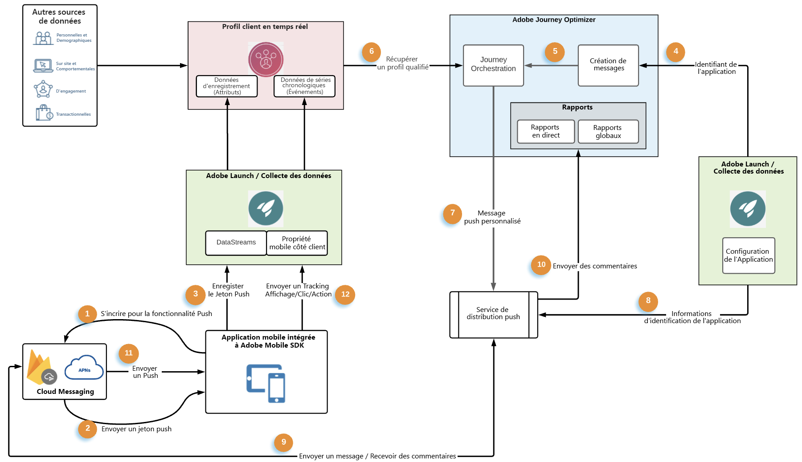
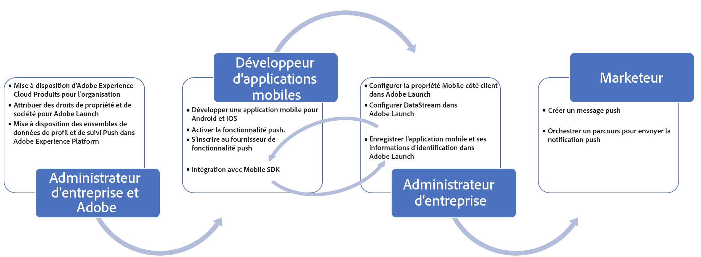

# Flux de données et composants des notifications push {#get-started-push}

Cette page vous aidera à configurer et à comprendre les services et les workflows clés impliqués dans les notifications push dans [!DNL Journey Optimizer].

>[!AVAILABILITY]
>
>Le nouveau **workflow de démarrage rapide de l’intégration mobile** est désormais disponible. Utilisez cette nouvelle fonctionnalité de produit pour configurer rapidement le SDK mobile, afin de commencer à collecter et valider les données d’événement mobile et d’envoyer des notifications push mobiles. Cette fonctionnalité est accessible via la page d’accueil de collecte de données en tant que version Beta publique. [En savoir plus](mobile-onboarding-wf.md)
>

Apprenez sur [cette page](create-push.md) à créer des notifications push.

Les étapes de configuration du canal push dans [!DNL Adobe Journey Optimizer] sont présentées dans [cette page](push-configuration.md).

Le graphique suivant montre les systèmes et services impliqués dans les flux de données associés et décrit comment les notifications push sont diffusées sous la forme d&#39;un service de bout en bout.

1. Enregistrement de votre application mobile de marque (Android ou iOS) auprès d&#39;APNs d&#39;Apple et des services de messagerie push Google FCM
1. Les services de messagerie génèrent un jeton push, qui est un identifiant qu’utilisera [!DNL Adobe Journey Optimizer] pour cibler l’appareil spécifique avec une notification push.
1. Le jeton push généré précédemment est transmis à Adobe Experience Platform et synchronisé avec le profil client en temps réel. Cette opération est effectuée en standard avec un SDK client facile à intégrer.

   >[!NOTE]
   >
   >La gestion des jetons diffère selon les plateformes. Sur **Android (FCM)**, les jetons sont automatiquement marqués comme non valides lorsque les utilisateurs effacent le cache de l’application ou réinstallent l’application, générant un nouveau jeton et un ECID. Sur **iOS (APNs)**, les jetons ne sont pas systématiquement marqués comme non valides dans ces scénarios. Si un profil contient plusieurs ECID avec des jetons valides, les notifications push sont envoyées à tous les appareils associés.

1. Les messages push sont créés dans [!DNL Adobe Journey Optimizer]. Ils respectent une configuration de canal (c’est-à-dire un préréglage de message).
1. Les messages push peuvent être inclus dans la zone de travail d&#39;orchestration des parcours.
1. Lors de la publication des parcours, les profils client basés sur les conditions des parcours sont qualifiés pour recevoir des notifications push. Les payloads de messagerie push sont personnalisées à cette étape.
1. Les payloads push personnalisées sont transférées vers un service de diffusion de messagerie push interne.
1. Ce service interne valide ensuite les informations d&#39;identification de l&#39;application associée au message, et
1. envoie le message aux services de messagerie Apple et Google pour une diffusion finale.
1. Les retours d’expérience des services de messagerie sont notés, les erreurs et les succès sont consignés pour le reporting dans les rapports dynamiques sur les parcours et Customer Journey Analytics.
1. Les notifications push sont diffusées sur les appareils de l&#39;utilisateur final.
1. Les interactions de notification push de l’utilisateur final sont envoyées en tant qu’événements d’expérience depuis le client de l’utilisateur final via l’intégration du SDK.

## Rôles des services clés des notifications push {#roles-of-key-services}

* Les **fournisseurs de services de notification push** sont les services web des composants principaux qui diffusent des notifications de serveurs distants vers des applications mobiles.

  [!DNL Adobe Journey Optimizer] prend en charge les plateformes Android et iOS et s&#39;intègre ainsi aux fonctionnalités suivantes :
   * [Firebase Cloud Messaging (FCM)](https://firebase.google.com/docs/cloud-messaging) - pour envoyer des notifications à l&#39;application mobile Android
   * [Apple Push Notification Service (APNs)](https://developer.apple.com/library/archive/documentation/NetworkingInternet/Conceptual/RemoteNotificationsPG/APNSOverview.html) - pour envoyer des notifications à l&#39;application mobile iOS

* **SDK mobile Adobe Experience Platform** qui fournit des API d&#39;intégration côté client pour vos mobiles via des SDK compatibles Android et iOS. Le SDK fournit une extension [!DNL Adobe Journey Optimizer] exposant différentes API spécifiques à la messagerie push et permettant les flux de données, comme l&#39;enregistrement du jeton push ou l&#39;envoi d&#39;événements de suivi push ou de tout autre événement d&#39;expérience personnalisé à Adobe Experience Platform. Le SDK fournit également de nombreuses autres extensions qui activent d&#39;autres fonctionnalités Adobe Experience Cloud ainsi que des fonctionnalités de partenaires tiers.

  L&#39;intégration du SDK nécessite également la configuration des services de [collecte de données](https://experienceleague.adobe.com/docs/experience-platform/tags/home.html?lang=fr){target="_blank"} Adobe Experience Platform, notamment :

   * Création d&#39;un flux de données pour configurer les jeux de données de profil et d&#39;événement d&#39;expérience par rapport auxquels les données sont transmises à Adobe Experience Platform
   * Création de propriétés mobiles côté client et ajout d&#39;extensions. Le SDK s&#39;intègre étroitement avec ces extensions pour offrir une expérience de collecte de données transparente.
   * Enregistrement de l&#39;identifiant d&#39;offre groupée d&#39;applications mobiles et des informations d&#39;identification de l&#39;application

* Le **Profil client en temps réel Adobe Experience Platform** offre une vue holistique de chaque client en combinant des données issues de plusieurs canaux, notamment le web, les appareils mobiles, le CRM et des tiers. Le Profil vous permet de consolider vos données client en une vue unifiée offrant un compte horodaté et exploitable de chaque interaction client. Le jeton push d&#39;un utilisateur de l&#39;application donné est stocké par rapport au profil de l&#39;utilisateur en tant que données d&#39;enregistrement, tandis que les interactions de l&#39;utilisateur avec les notifications push sont suivies en tant que données d&#39;événements de série temporelle. [En savoir plus sur le profil client en temps réel Adobe Experience Platform](https://experienceleague.adobe.com/docs/experience-platform/profile/home.html?lang=fr){target="_blank"}

* **[!DNL Adobe Journey Optimizer]** : une fois que vos intégrations d’applications mobiles avec les composants mentionnés ci-dessus sont en place, ainsi que vos profils clients dans Adobe Experience Platform, vous pouvez créer et orchestrer des notifications push dans [!DNL Adobe Journey Optimizer] pour interagir avec vos utilisateurs et utilisatrices.

## Configuration technique des notifications push et workflows pratiques {#push-technical-setup}

Le graphique suivant présente l&#39;ensemble des différentes étapes de la configuration des composants qui forment l&#39;ossature du flux de données push. Les éléments d&#39;action ont été classés en fonction du rôle exécutant la configuration et du composant en cours de configuration.

**Rubriques connexes**

* [Configuration du canal push](push-configuration.md)
* [Rapport des notifications push](../reports/journey-global-report-cja-push.md)
* [Créer une notification push](create-push.md)
* [Ajouter un message dans un parcours](../building-journeys/journeys-message.md)
* [Ajouter un message dans une campagne](../campaigns/create-campaign.md)