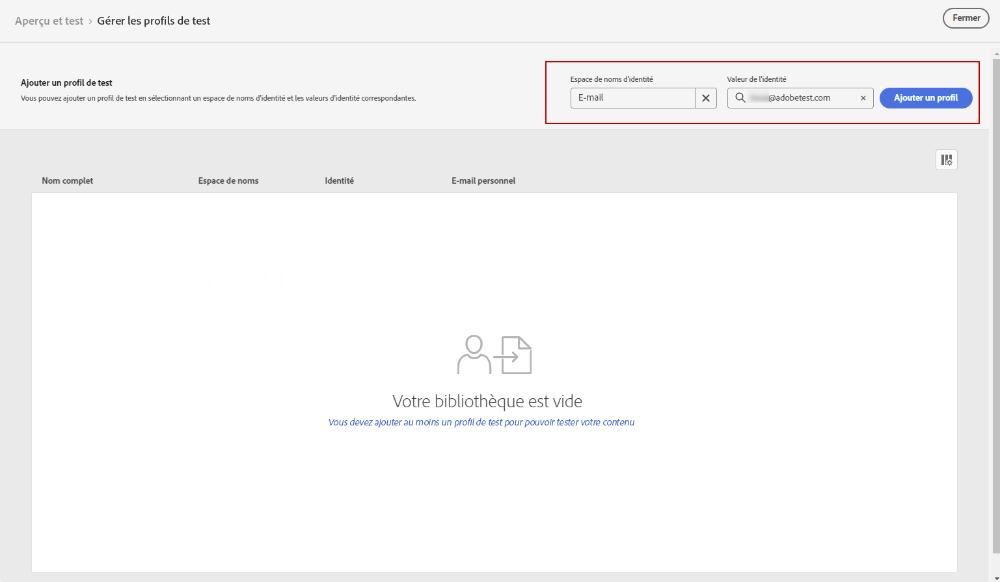

# Prévisualisez et testez votre notification push. {#send-push}

## Prévisualiser votre notification push {#preview-push}

Une fois le contenu de votre message défini, vous pouvez utiliser des profils de test pour le prévisualiser et le tester. Si vous avez inséré du contenu personnalisé, vous pouvez vérifier l’affichage de celui-ci dans le message à l’aide des données de profil de test.

1. Cliquez sur **[!UICONTROL Simuler du contenu]**.

1. Cliquez sur **[!UICONTROL Gérer les profils de test]** pour ajouter un profil de test.

1. Recherchez votre profil de test avec les champs **[!UICONTROL Espace de noms d’identité]** et **[!UICONTROL Valeur d’identité]**. Cliquez ensuite sur **[!UICONTROL Ajouter un profil]**.

   

1. Une fois que vous avez sélectionné votre profil de test, vous pouvez fermer la fenêtre **[!UICONTROL Ajouter un profil de test]**.

1. Dans la fenêtre **Prévisualiser et tester**, les données du profil de test sont ajoutées au contenu du message.

   Sélectionnez le type de périphérique sur lequel prévisualiser le contenu : **[!UICONTROL iOS]** ou **[!UICONTROL Android]**.

   

## Valider la notification push {#push-validate}

Vous devez vérifier les alertes dans la section supérieure de l’éditeur. Certaines d’entre elles sont de simples avertissements, mais d’autres peuvent vous empêcher d’envoyer le message. Deux types d’alertes peuvent se produire : avertissements et erreurs.

* Les **avertissements** se rapportent aux recommandations et aux bonnes pratiques.

* Les **erreurs** vous empêchent de tester ou d’activer le parcours tant qu’elles ne sont pas corrigées, telles que :

   * **[!UICONTROL La version push du message est vide]** : cette erreur s’affiche lorsque le titre ou le corps de la notification push est manquant. Découvrez comment définir le contenu des notifications push dans [cette section](create-push.md).

   * **[!UICONTROL La surface n’existe pas]** : vous ne pouvez pas publier votre message si la surface que vous avez sélectionnée est supprimée après la création du message. Si cette erreur se produit, sélectionnez une autre surface dans les **[!UICONTROL Propriétés]** du message. Pour en savoir plus sur les surfaces de canal, consultez [cette section](../configuration/channel-surfaces.md).

   * **[!UICONTROL La payload iOS/Android push dépasse la limite de 4 Ko]** : la taille de la notification push ne peut pas dépasser 4 Ko. Pour respecter cette limite, essayez de réduire l’utilisation des images ou des émoticônes. Découvrez comment gérer le contenu de vos notifications push dans [cette section](../push/create-push.md).

  

>[!NOTE]
>
> Pour une meilleure délivrabilité, vous devez toujours utiliser les numéros de téléphone dans les formats pris en charge par le fournisseur. Par exemple, Twilio et Sinch ne prennent en charge que les numéros de téléphone au format E.164.

## Envoyer votre notification push{#push-send}

Une fois votre message push prêt, effectuez la configuration de votre [parcours](../building-journeys/journey-gs.md) ou [campagne](../campaigns/create-campaign.md) pour l’envoyer.

**Rubriques connexes**

* [Configuration du canal push](push-configuration.md)
* [Rapport des notifications push](../reports/journey-global-report.md#push-global)
* [Créer une notification push](create-push.md)
* [Ajouter un message dans un parcours](../building-journeys/journeys-message.md)
* [Ajouter un message dans une campagne](../campaigns/create-campaign.md)

