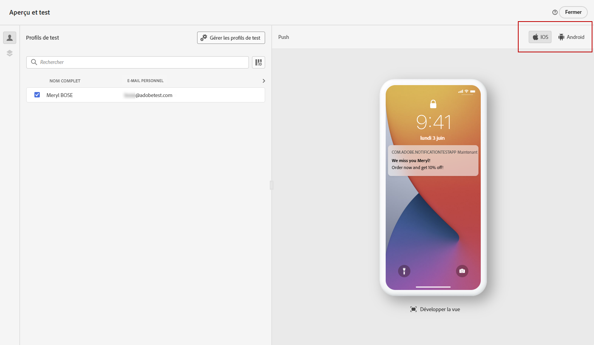
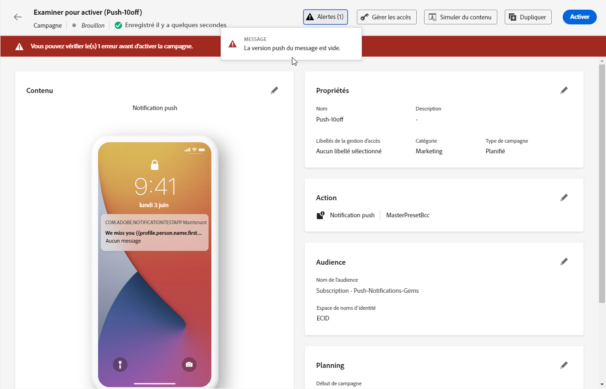

# Vérifier et envoyer votre notification push {#send-push}

## Prévisualiser votre notification push {#preview-push}

Une fois le contenu de votre message défini, vous pouvez utiliser des profils de test ou des exemples de données d’entrée chargés à partir d’un fichier CSV/JSON ou ajoutés manuellement pour prévisualiser son contenu. Si vous avez inséré du contenu personnalisé, vous pouvez vérifier la façon dont celui-ci s’affiche dans le message.

Pour ce faire, cliquez sur **[!UICONTROL Simuler le contenu]**. Vous pouvez ensuite sélectionner le type d’appareil sur lequel prévisualiser le contenu : **[!UICONTROL iOS]**, **[!UICONTROL Android]** ou **[!UICONTROL Web]**.

Vous trouverez des informations détaillées sur comment prévisualiser et tester votre contenu dans la section [Gestion de contenu](../content-management/preview-test.md).

## Valider la notification push {#push-validate}

Vous devez vérifier les alertes dans la section supérieure de l’éditeur. Certaines d’entre elles sont de simples avertissements, mais d’autres peuvent vous empêcher d’envoyer le message. Deux types d’alertes peuvent se produire : avertissements et erreurs.

* Les **avertissements** se rapportent aux recommandations et aux bonnes pratiques.

* Les **erreurs** vous empêchent de tester ou d’activer le parcours tant qu’elles ne sont pas corrigées, telles que :

   * **[!UICONTROL La version push du message est vide]** : cette erreur s’affiche lorsque le titre ou le corps de la notification push est manquant. Découvrez comment définir le contenu des notifications push dans [cette section](create-push.md).

   * **[!UICONTROL La configuration n’existe pas]** : vous ne pouvez pas utiliser votre message si la configuration que vous avez sélectionnée est supprimée après la création du message. Si cette erreur se produit, sélectionnez une autre configuration dans les **[!UICONTROL Propriétés]** du message. En savoir plus sur les configurations de canal dans [cette section](../configuration/channel-surfaces.md).

   * **[!UICONTROL La payload iOS/Android push dépasse la limite de 4 Ko]** : la taille de la notification push ne peut pas dépasser 4 Ko. Pour respecter cette limite, essayez de réduire l’utilisation des images ou des émoticônes. Découvrez comment gérer le contenu de vos notifications push dans [cette section](../push/create-push.md).

  

>[!NOTE]
>
> Pour une meilleure délivrabilité, vous devez toujours utiliser les numéros de téléphone dans les formats pris en charge par le fournisseur. Par exemple, Twilio et Sinch ne prennent en charge que les numéros de téléphone au format E.164.

## Envoyer votre notification push{#push-send}

>[!IMPORTANT]
>
> Si votre campagne est soumise à une politique d’approbation, vous devrez effectuer une demande d’approbation afin de pouvoir envoyer votre notification push. [En savoir plus](../test-approve/gs-approval.md)

Une fois votre message push prêt, effectuez la configuration de votre [parcours](../building-journeys/journey-gs.md) ou [campagne](../campaigns/create-campaign.md) pour l’envoyer.

**Rubriques connexes**

* [Configuration du canal push pour mobile](push-configuration.md)
* [Configurer le canal push pour le web](push-configuration-web.md)
* [Rapport des notifications push](../reports/journey-global-report-cja-push.md)
* [Créer une notification push](create-push.md)
* [Ajouter un message dans un parcours](../building-journeys/journey-action.md)
* [Ajouter un message dans une campagne](../campaigns/create-campaign.md)

