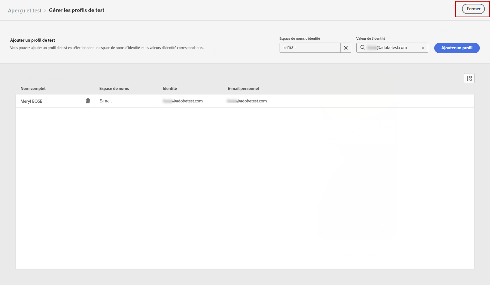

# Envoyer votre notification push {#send-push}

## Prévisualiser votre notification push {#preview-push}

Une fois le contenu de votre message défini, vous pouvez utiliser des profils de test pour le prévisualiser et le tester. Si vous avez inséré du contenu personnalisé, vous pouvez vérifier l’affichage de ce contenu dans le message en exploitant les données de profil de test.

1. Cliquez sur **[!UICONTROL Simulate content]**.

1. Cliquez sur **[!UICONTROL Manage test profiles]** pour ajouter un profil de test.

1. Recherchez votre profil de test avec la méthode **[!UICONTROL Identity namespace]** et **[!UICONTROL Identity value]** champs. Cliquez ensuite sur **[!UICONTROL Add profile]**.

   

1. appliquer les mêmes étapes que celles décrites ci-dessus pour sélectionner un profil de test ;

   

1. Dans l’aperçu push, les données de profil de test sont exploitées dans le contenu du message.

   Sélectionnez le type de périphérique sur lequel prévisualiser le contenu : **[!UICONTROL iOS]** ou **[!UICONTROL Android]**.

   

## Validation de la notification push {#push-validate}

>[!NOTE]
>
> Pour une meilleure délivrabilité, vous devez toujours utiliser les numéros de téléphone dans les formats pris en charge par le fournisseur. Par exemple, Twilio et Sinch ne prennent en charge que les numéros de téléphone au format E.164.

Vous devez également vérifier les alertes dans la section supérieure de l’éditeur.  Certains d’entre eux sont de simples avertissements, mais d’autres peuvent vous empêcher d’utiliser le message. Deux types d’alertes peuvent se produire :

* **Avertissements** voir recommandations et bonnes pratiques.

* **Erreurs** vous empêche de tester ou d’activer le parcours tant qu’il n’est pas résolu, par exemple :

   * **[!UICONTROL The push version of the message is empty]**: cette erreur s&#39;affiche lorsque le titre ou le corps de la notification push est manquant. Découvrez comment définir le contenu d&#39;une notification push dans [cette section](create-push.md).

   * **[!UICONTROL Surface doesn't exist]**: vous ne pouvez pas utiliser votre message si la surface que vous avez sélectionnée est supprimée après la création du message. Si cette erreur se produit, sélectionnez une autre surface dans le message. **[!UICONTROL Properties]**. En savoir plus sur les surfaces des canaux dans [cette section](../configuration/channel-surfaces.md).

   * **[!UICONTROL Push iOS/Android payload has exceeded limit of 4KB]**: la taille de la notification push ne peut pas dépasser 4 Ko. Pour respecter cette limite, essayez de réduire l’utilisation des images ou des émoticônes. Découvrez comment gérer le contenu de votre notification push dans [cette section](../push/create-push.md).

Une fois votre notification push prête, effectuez la configuration de votre [parcours](../building-journeys/journey-gs.md) ou [campaign](../campaigns/create-campaign.md) pour l’envoyer.
