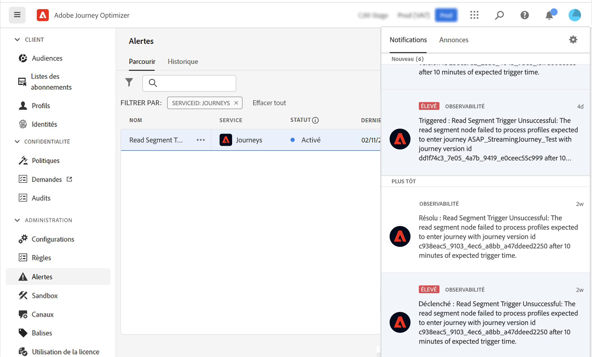

# Prise en main des alertes {#alerts}

Journey Optimizer exploite les fonctionnalités d’alerte de Adobe Experience Platform. Vous pouvez ainsi accéder aux alertes système par le biais de l’interface utilisateur. Vous pouvez afficher les alertes disponibles et vous y abonner. Lorsqu’un certain ensemble de conditions de vos opérations est atteint (par exemple, un problème potentiel lorsque le système enfreint un seuil), des messages d’alerte sont envoyés à tous les utilisateurs de votre organisation qui se sont abonnés à eux. Ces messages peuvent se répéter pendant un intervalle prédéfini jusqu’à ce que l’alerte ait été résolue.

En savoir plus sur les alertes dans Adobe Experience Platform [documentation](https://experienceleague.adobe.com/docs/experience-platform/observability/alerts/overview.html?lang=fr).
Pour découvrir comment vous abonner à des alertes et les paramétrer, reportez-vous à cette section [page](https://experienceleague.adobe.com/docs/experience-platform/observability/alerts/ui.html).

Dans le menu de gauche, sous **Administration**, cliquez sur **Alertes**. Une alerte préconfigurée pour Journey Optimizer est disponible. Cette alerte vous avertit si un noeud de segment lu n’a traité aucun profil pendant la période définie.

Si un tel comportement inattendu se produit, une notification d’alerte est envoyée aux abonnés de l’alerte par courrier électronique et notification dans l’application, dans le coin supérieur droit de l’interface.

Lors de l’[affichage des règles d’alerte dans l’interface utilisateur de Platform](https://experienceleague.adobe.com/docs/experience-platform/observability/alerts/ui.html), vous pouvez vous abonner à chaque règle. Toutefois, lorsque vous vous abonnez à des alertes par le biais des [Notifications d’événements I/O](https://experienceleague.adobe.com/docs/experience-platform/observability/alerts/subscribe.html), les règles d’alerte sont organisées en différents packages d’abonnement. Le nom d’abonnement à l’événement d’E/S correspondant à l’alerte Lecture de segment est le suivant : &quot;Lecture par Parcours des segments retardés, échecs et erreurs&quot;.

>[!WARNING]
>
>Ces alertes s’appliquent uniquement aux parcours actifs. Les alertes ne seront pas déclenchées pour les parcours en mode test.