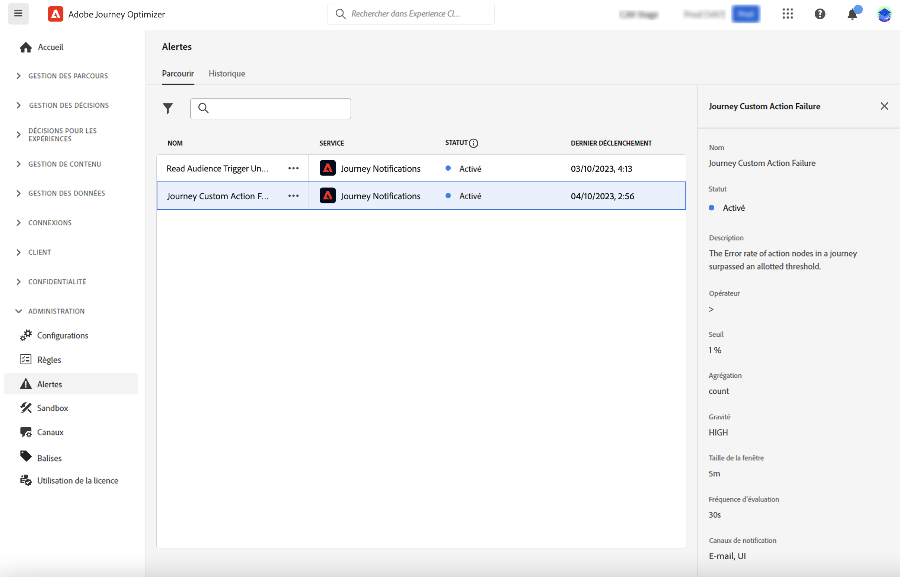

# Accès et abonnement aux alertes système {#alerts}

Lors de la création de vos parcours et campagnes, utilisez le bouton **Alertes** pour vérifier et résoudre les erreurs avant de les exécuter ou de les publier. Découvrez comment résoudre les problèmes de vos parcours sur [cette page](../building-journeys/troubleshooting.md). Découvrez comment examiner vos campagnes sur [cette page](../campaigns/review-activate-campaign.md).

Vous pouvez également vous abonner à des alertes système Adobe Journey Optimizer, comme décrit sur cette page.

## Accéder et s’abonner aux alertes {#alerting-capabilities}

En cas d’échec, vous pouvez obtenir des alertes système dans le centre de notification de Journey Optimizer (alertes in-app) et/ou recevoir un e-mail.

Dans le menu **Alertes**, vous pouvez afficher les alertes disponibles et vous y abonner. Lorsqu’un certain ensemble de conditions de vos opérations est atteint (par exemple, un problème potentiel lorsque le système dépasse un certain seuil), des messages d’alerte sont envoyés à l’ensemble des personnes de votre organisation qui s’y sont abonnées.

<!--These messages can repeat over a pre-defined time interval until the alert has been resolved.-->

En savoir plus sur les alertes dans Adobe Experience Platform dans la documentation de [Adobe Experience Platform](https://experienceleague.adobe.com/docs/experience-platform/observability/alerts/overview.html?lang=fr){target="_blank"}.

Dans le menu de gauche, sous **Administration**, cliquez sur **Alertes**. Deux alertes préconfigurées pour Journey Optimizer sont disponibles : l’alerte [Échec de l’action personnalisée du parcours](#alert-custom-actions) et l’alerte [Échec du déclenchement de la lecture d’audience](#alert-read-audiences). Ces alertes sont décrites ci-dessous.

Vous pouvez vous abonner individuellement à chaque alerte depuis l’interface utilisateur en sélectionnant l’option **S’abonner** dans le tableau de bord **Alertes**. Utilisez la même méthode pour vous désabonner.

Vous pouvez également vous abonner à des alertes par le biais des notifications d’événement [ I/O](https://experienceleague.adobe.com/docs/experience-platform/observability/alerts/subscribe.html?lang=fr){target="_blank"}. Les règles d’alerte sont organisées en différents packages d’abonnement. Les abonnements aux événements correspondant aux alertes Journey Optimizer spécifiques sont présentés ci-dessous.

Si un comportement inattendu se produit, une notification d’alerte est envoyée aux personnes abonnées. En fonction des préférences des personnes, les alertes sont envoyées par e-mail ou directement dans le centre de notification de Journey Optimizer, dans le coin supérieur droit de l’interface utilisateur. Par défaut, seules les alertes in-app sont activées. Pour activer les alertes par email, consultez la documentation de [Adobe Experience Platform](https://experienceleague.adobe.com/docs/experience-platform/observability/alerts/ui.html?lang=fr#enable-email-alerts){target="_blank"}.

Lorsqu’une alerte est résolue, les personnes abonnées reçoivent une notification « Résolue ».

>[!CAUTION]
>
>Les alertes spécifiques à Adobe Journey Optimizer s’appliquent uniquement aux parcours **dynamiques**. Les alertes ne seront pas déclenchées pour les parcours en mode test.

## Échec de l’action personnalisée du parcours {#alert-custom-actions}

Cette alerte vous avertit si une action personnalisée échoue. Nous considérons qu’il existe un échec quand plus de 1 % d’erreurs sont commises sur une action personnalisée spécifique au cours des 5 dernières minutes. Ces données sont évaluées toutes les 30 secondes.

Les alertes relatives aux actions personnalisées sont résolues lorsque, au cours des 5 dernières minutes :

* il n’y a eu aucune erreur sur cette action personnalisée (ou les erreurs sont inférieures au seuil de 1 %) ;

* ou aucun profil n’a atteint cette action personnalisée.

Le nom d’abonnement à l’événement d’E/S correspondant à l’alerte d’action personnalisée est **Échec de l’action personnalisée du parcours**.

## Échec du déclenchement de la lecture d’audience {#alert-read-audiences}

Cette alerte vous avertit si une activité **Lecture d’audience** n’a traité aucun profil 10 minutes après l’heure planifiée de l’exécution. Cet échec peut être dû à des problèmes techniques ou parce que l’audience est vide. Si cet échec est dû à des problèmes techniques, sachez que des reprises peuvent toujours se produire, selon le type de problème (par exemple : si la création du traitement d’export a échoué, nous allons réessayer toutes les 10 minutes pendant 1 h au maximum).

Les alertes sur l’activité **Lecture d’audience** ne s’appliquent qu’aux parcours récurrents. Les activités **Lecture d’audience** dans des parcours dynamiques dont l’exécution est planifiée **Une fois** ou **Dès que possible** sont ignorées.

Les alertes sur **Lecture d’audience** sont résolues lorsqu’un profil entre dans le nœud **Lecture d’audience**.

Le nom d’abonnement à l’événement d’E/S correspondant à l’alerte **Échec du déclenchement de la lecture d’audience** est **Retards, échecs et erreurs dans la lecture d’audience du parcours**.

## Dépannage {#alert-troubleshooting}

Pour résoudre les alertes **Lecture d’audience**, vérifiez la taille de l’audience dans l’interface d’Experience Platform.

Pour résoudre les alertes **Action personnalisée** :

* Vérifiez votre action personnalisée à l’aide du mode test sur un autre parcours :

  

* Consultez le rapport de votre parcours pour afficher les motifs d’erreur lors de l’action.

  

* Vérifiez vos événements stepEvents de parcours pour obtenir plus d’informations sur « failureReason ».

* Vérifiez votre configuration d’action personnalisée et que l’authentification est toujours correcte. Effectuez un contrôle manuel avec Postman, par exemple.
