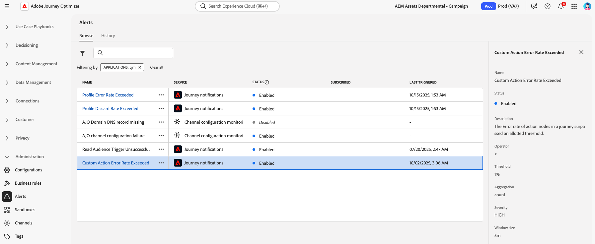

# Accéder et s’abonner aux alertes système {#alerts}

## Présentation

Adobe Journey Optimizer propose deux types d’alertes pour vous aider à surveiller et à résoudre les problèmes liés à vos opérations :

* **Alertes de validation dans la zone de travail** : lors de la création de parcours et de campagnes, utilisez le bouton **Alertes** dans la zone de travail pour identifier et résoudre les erreurs de configuration avant la publication. Découvrez comment [résoudre les problèmes liés aux parcours &#x200B;](../building-journeys/troubleshooting.md) et examiner vos campagnes : [Campagnes d’action](../campaigns/review-activate-campaign.md) | [Campagnes déclenchées par API](../campaigns/review-activate-api-triggered-campaign.md) | [Campagnes orchestrées](../orchestrated/start-monitor-campaigns.md).

* **Alertes de surveillance du système** (présentées dans cette page) : recevez des notifications proactives lorsque les seuils opérationnels sont dépassés ou que des problèmes sont détectés dans les parcours en direct et les configurations de canal. Ces alertes vous aident à réagir rapidement aux problèmes potentiels avant qu’ils n’aient une incidence sur vos expériences client.

Les alertes système sont disponibles à partir du menu **[!UICONTROL Alertes]** sous **[!UICONTROL Administration]**. Adobe Experience Platform fournit plusieurs règles d’alerte prédéfinies que vous pouvez activer, y compris des alertes spécifiques aux [!DNL Adobe Journey Optimizer] pour les parcours et les configurations de canal.

## Conditions préalables

Avant d’utiliser des alertes :

* **Autorisations** : vous avez besoin d’autorisations spécifiques pour afficher et gérer les alertes. Voir [autorisations requises dans Adobe Experience Platform](https://experienceleague.adobe.com/docs/experience-platform/observability/alerts/overview.html#permissions){target="_blank"}.

* **Sensibilité aux sandbox** : les abonnements aux alertes sont spécifiques aux sandbox. Lorsque vous vous abonnez à des alertes, elles s’appliquent uniquement au sandbox actuel. Lorsqu’un sandbox est réinitialisé, tous les abonnements aux alertes sont également réinitialisés.

* **Préférences de notification** : configurez la manière dont vous recevez les alertes (par e-mail et/ou in-app) dans vos [Préférences Adobe Experience Cloud](../start/user-interface.md#in-product-uc).

>[!NOTE]
>
>Les alertes spécifiques à Journey Optimizer s’appliquent uniquement aux parcours **en ligne**. Les alertes ne sont pas déclenchées pour les parcours en mode test. Pour plus d’informations sur le framework d’alerte, consultez la documentation sur les alertes Adobe Experience Platform [&#128279;](https://experienceleague.adobe.com/docs/experience-platform/observability/alerts/overview.html?lang=fr){target="_blank"}.

## Alertes disponibles

Pour accéder aux alertes, accédez à **[!UICONTROL Administration]** > **[!UICONTROL Alertes]** dans le menu de gauche. L’onglet **Parcourir** affiche toutes les alertes préconfigurées disponibles pour Journey Optimizer.

{width=50%}

Journey Optimizer propose deux catégories d’alertes système :

**Alertes de Parcours** - Surveillez l’exécution et les performances du parcours :

* [Échec du déclenchement de la lecture d’audience](#alert-read-audiences) - Avertit lorsqu’une activité Lecture d’audience ne parvient pas à traiter les profils
* [&#x200B; Taux d’erreur d’action personnalisée dépassé &#x200B;](#alert-custom-action-error-rate) - Détecte des taux d’erreur élevés dans les appels d’API d’action personnalisée (remplace l’alerte d’échec d’action personnalisée de Parcours précédente)
* [Taux d’abandon du profil dépassé](#alert-discard-rate) - Identifie le moment où les profils sont ignorés à un taux anormal
* [Taux d’erreur de profil dépassé](#alert-profile-error-rate) - Indique les erreurs rencontrées par les profils lors de l’exécution du parcours
* [Parcours publié &#x200B;](#alert-journey-published) - Notification d&#39;information lors de la publication d&#39;un parcours
* [Parcours terminé &#x200B;](#alert-journey-finished) - Notification d&#39;information lorsqu&#39;un parcours est terminé
* [Limitation d’action personnalisée déclenchée](#alert-custom-action-capping) - Indique lorsque les limites d’appel API sont atteintes

**Alertes de configuration des canaux** - Détectez les problèmes liés à la configuration de la délivrabilité des e-mails :

* [Enregistrement DNS du domaine AJO manquant](#alert-dns-record-missing) - Identifie les enregistrements DNS manquants ou mal configurés
* [Échec de configuration du canal AJO &#x200B;](#alert-channel-config-failure) - Détecte les problèmes de configuration des e-mails (enregistrements SPF, DKIM, MX)
  <!--* the [AJO domain certificates renewal unsuccessful](#alert-certificates-renewal) alert-->

>[!NOTE]
>
>Pour les alertes provenant d’autres services Adobe Experience Platform (ingestion de données, résolution d’identité, segmentation, etc.), consultez la [documentation sur les règles d’alerte standard](https://experienceleague.adobe.com/docs/experience-platform/observability/alerts/rules.html){target="_blank"}.

## S’abonner aux alertes {#subscribe-alerts}

Les notifications d’alerte sont diffusées aux utilisateurs qui s’y sont abonnés lorsque des conditions spécifiques sont remplies (telles que le dépassement des seuils ou la détection de problèmes de configuration).

Vous pouvez vous abonner à des alertes de deux manières :

* **[Abonnement global](#global-subscription)** : s’applique à tous les parcours et campagnes du sandbox actuel
* **[Abonnement spécifique au Parcours](#unitary-subscription)** : s&#39;applique uniquement aux parcours individuels

**Fonctionnement des notifications d’alerte :**

* **Canaux de diffusion** : les alertes sont envoyées par e-mail et/ou notifications in-app dans le centre de notification Journey Optimizer (icône représentant une cloche dans le coin supérieur droit). Configurez vos canaux de diffusion préférés dans vos [Préférences Adobe Experience Cloud](../start/user-interface.md#in-product-uc).

* **Types d’alerte** : Journey Optimizer fournit des alertes ponctuelles (événements informatifs tels que les parcours publiés) et des alertes répétées (seuils de surveillance). Les alertes répétées se poursuivent jusqu’à ce que la condition soit résolue.

* **Résolution** : lorsqu’une condition d’alerte est résolue, les abonnés reçoivent une notification « Résolu ». Pour éviter que la fatigue des notifications ne fluctue en fonction des valeurs, les alertes se résolvent automatiquement au bout d’1 heure, même si la condition persiste.

Pour plus d’informations sur l’abonnement via les événements I/O, consultez la documentation de Adobe Experience Platform [&#128279;](https://experienceleague.adobe.com/docs/experience-platform/observability/alerts/subscribe.html?lang=fr){target="_blank"}.

### Abonnement global {#global-subscription}

Les abonnements globaux vous permettent de recevoir des alertes pour tous les parcours et campagnes du sandbox actuel.

**Pour vous abonner à une alerte :**

1. Accédez à **[!UICONTROL Administration]** > **[!UICONTROL Alertes]** dans le menu de gauche.

1. Dans l’onglet **[!UICONTROL Parcourir]**, recherchez l’alerte à surveiller.

1. Cliquez sur **[!UICONTROL S’abonner]** pour afficher l’alerte souhaitée.

   {width=80%}

**Pour vous désabonner :**

Cliquez sur **[!UICONTROL Se désabonner]** en regard de l’alerte.

>[!IMPORTANT]
>
>Les abonnements aux alertes sont spécifiques au sandbox. Vous devez vous abonner aux alertes séparément dans chaque sandbox où vous souhaitez recevoir des notifications.

**Autre méthode d’abonnement :**

Vous pouvez également vous abonner via les notifications d’événement [I/O](https://experienceleague.adobe.com/docs/experience-platform/observability/alerts/subscribe.html?lang=fr){target="_blank"}, qui permettent l’intégration à des systèmes externes. Les noms d’abonnement aux événements pour les alertes Journey Optimizer sont répertoriés dans chaque [description de l’alerte ci-dessous](#journey-alerts).

### Abonnement spécifique au parcours {#unitary-subscription}

Les abonnements spécifiques aux parcours vous permettent de surveiller les parcours prioritaires individuels sans recevoir d’alertes pour tous les parcours de votre entreprise.

**Pour vous abonner à des alertes relatives à un parcours spécifique, procédez comme suit**

1. Accédez à l’inventaire des parcours.

1. Cliquez sur le menu **⋯** (autres actions) du parcours que vous souhaitez surveiller.

1. Sélectionnez **[!UICONTROL S’abonner aux alertes]**.

   {width=75%}

1. Sélectionnez la ou les alertes à activer dans les options disponibles :
   * [Taux de rejet de profil dépassé](#alert-discard-rate)
   * [Taux d’erreur d’action personnalisée dépassé](#alert-custom-action-error-rate)
   * [Taux d’erreur de profil dépassé](#alert-profile-error-rate)
   * [Parcours publié](#alert-journey-published)
   * [Parcours terminé](#alert-journey-finished)
   * [Limitation d’action personnalisée déclenchée](#alert-custom-action-capping)

1. Cliquez sur **[!UICONTROL Enregistrer]** pour confirmer vos abonnements.

**Pour vous désabonner :**

Ouvrez la même boîte de dialogue, désélectionnez la ou les alertes, puis cliquez sur **[!UICONTROL Enregistrer]**.

>[!NOTE]
>
>L’alerte [Échec du déclenchement de la lecture d’audience](#alert-read-audiences) n’est disponible que par abonnement global, et non par abonnement par parcours.

<!--To enable email alerting, refer to [Adobe Experience Platform documentation](https://experienceleague.adobe.com/docs/experience-platform/observability/alerts/ui.html#enable-email-alerts){target="_blank"}.-->

## Alertes de parcours {#journey-alerts}

Toutes les notifications de parcours disponibles dans l’interface d’utilisation sont répertoriées ci-dessous.

>[!CAUTION]
>
>Les alertes spécifiques à Adobe Journey Optimizer s’appliquent uniquement aux parcours **dynamiques**. Les alertes ne seront pas déclenchées pour les parcours en mode test.

### Échec du déclenchement de la lecture d’audience {#alert-read-audiences}

Cette alerte vous avertit si une activité **Lecture d’audience** n’a traité aucun profil 10 minutes après l’heure planifiée de l’exécution. Cet échec peut être dû à des problèmes techniques ou parce que l’audience est vide. Si cet échec est dû à des problèmes techniques, sachez que des reprises peuvent toujours se produire, selon le type de problème (par exemple : si la création du traitement d’export a échoué, nous allons réessayer toutes les 10 minutes pendant 1 h au maximum).

Les alertes sur l’activité **Lecture d’audience** ne s’appliquent qu’aux parcours récurrents. Les activités **Lecture d’audience** dans des parcours dynamiques dont l’exécution est planifiée **Une fois** ou **Dès que possible** sont ignorées.

Les alertes sur **Lecture d’audience** sont résolues lorsqu’un profil entre dans le nœud **Lecture d’audience**, ou après une heure.

Le nom d’abonnement à l’événement d’E/S correspondant à l’alerte **Échec du déclenchement de la lecture d’audience** est **Retards, échecs et erreurs dans la lecture d’audience du parcours**.

Pour résoudre les alertes **Lecture d’audience**, vérifiez la taille de l’audience dans l’interface d’Experience Platform.

### Taux de rejet de profil dépassé {#alert-discard-rate}

Cette alerte vous avertit si le ratio des rejets de profil par rapport aux profils ayant rejoint le parcours au cours des 5 dernières minutes a dépassé le seuil. Le seuil par défaut est défini sur 20 %, mais vous pouvez [définir un seuil personnalisé](#custom-threshold).

Cliquez sur le nom de l’alerte pour vérifier ses détails et sa configuration.

Il existe plusieurs raisons pour lesquelles un profil peut être rejeté, ce qui orientera la méthode de dépannage. Voici quelques raisons courantes :

* Profil rejeté à l’entrée car il est déjà actif dans ce parcours unitaire. Pour résoudre ce problème, assurez-vous que le profil a suffisamment de temps pour quitter le parcours avant l’arrivée de l’événement suivant pour celui-ci.
* L’identité n’est pas définie pour le profil ou l’espace de noms utilisé par le parcours Lecture d’audience n’est pas utilisé dans ce profil. Pour résoudre ce problème, assurez-vous que l’espace de noms du parcours correspond à l’espace de noms d’identité utilisé par les profils.
* Le taux de débit d’événement est dépassé. Pour résoudre ce problème, assurez-vous que les événements qui entrent dans le système ne dépassent pas ces limites.

### Taux d’erreur d’action personnalisée dépassé {#alert-custom-action-error-rate}

Cette alerte vous alerte si le ratio des erreurs d’action personnalisée par rapport aux appels HTTP réussis au cours des 5 dernières minutes et ayant dépassé le seuil. Le seuil par défaut est défini sur 20 %, mais vous pouvez [définir un seuil personnalisé](#custom-threshold).

>[!NOTE]
>
>Cette alerte remplace l’alerte précédente **Échec de l’action personnalisée du parcours**.

Cliquez sur le nom de l’alerte pour vérifier ses détails et sa configuration.

Les erreurs d’actions personnalisées peuvent se produire pour diverses raisons. Pour résoudre ces erreurs, vous pouvez :

* Vérifiez votre action personnalisée à l’aide du [mode test](../building-journeys/testing-the-journey.md) sur un autre parcours.
* Consultez le [rapport de votre parcours](../reports/journey-live-report.md) pour afficher les motifs d’erreur lors de l’action.
* Vérifiez vos événements stepEvents de parcours pour obtenir plus d’informations sur « failureReason ».
* Vérifiez que l’action personnalisée est bien configurée et que l’authentification est toujours valide. Effectuez un contrôle manuel avec Postman, par exemple.
* Vérifiez que le point d’entrée est accessible et que l’action personnalisée peut y accéder via le vérificateur de connectivité de l’action personnalisée.
* vérifier les informations d’authentification, la connectivité Internet, etc.

### Taux d’erreur de profil dépassé {#alert-profile-error-rate}

Cette alerte vous avertit si le ratio des profils erronés par rapport aux profils ayant rejoint le parcours au cours des 5 dernières minutes a dépassé le seuil. Le seuil par défaut est défini sur 20 %, mais vous pouvez [définir un seuil personnalisé](#custom-threshold).

Cliquez sur le nom de l’alerte pour vérifier ses détails et sa configuration.

Pour résoudre les erreurs de profil, vous pouvez interroger les données des événements d’étape afin de déterminer où et pourquoi le profil a échoué dans le parcours.

### Parcours publié {#alert-journey-published}

Cette alerte vous avertit lorsqu’un parcours a été publié par un utilisateur ou une utilisatrice dans la zone de travail du parcours.

Il s’agit d’une alerte informative qui vous permet de suivre les événements de cycle de vie du parcours dans votre organisation. Il n’existe aucun critère de résolution, car il s’agit d’une notification ponctuelle.

### Parcours terminé {#alert-journey-finished}

Cette alerte vous avertit lorsqu’un parcours est terminé. La définition de « terminé » varie en fonction du type de parcours. [En savoir plus sur les parcours considérés comme terminés](../building-journeys/end-journey.md#journey-finished-definition).

Il s’agit d’une alerte informative qui vous permet de suivre l’achèvement du parcours. Il n’existe aucun critère de résolution, car il s’agit d’une notification ponctuelle.

### Limitation d’action personnalisée déclenchée {#alert-custom-action-capping}

Cette alerte vous avertit lorsque la limitation a été déclenchée sur une action personnalisée. La limitation est utilisée pour définir un nombre maximal d’appels envoyés à un point d’entrée externe afin d’éviter de le surcharger.

Cliquez sur le nom de l’alerte pour vérifier ses détails et sa configuration.

Lorsque la limitation est déclenchée, cela signifie que le nombre maximal d’appels API a été atteint au cours de la période définie et que d’autres appels sont limités ou mis en file d’attente. En savoir plus sur la limitation des actions personnalisées sur [cette page](../action/about-custom-action-configuration.md#custom-action-enhancements-best-practices).

Cette alerte est résolue lorsque la limitation n’est plus active ou lorsqu’aucun profil n’atteint l’action personnalisée pendant la période d’évaluation.

Pour résoudre les problèmes de limitation :

* Passez en revue la configuration de limitation de votre action personnalisée pour vous assurer que les limites sont appropriées à votre cas d’utilisation.
* Vérifiez si le volume des appels API est plus élevé que prévu et envisagez d’ajuster la conception de votre parcours ou les paramètres de limitation.
* Surveillez le point d’entrée externe pour vous assurer qu’il peut gérer la charge attendue.

## Alertes de configuration {#configuration-alerts}

Les alertes de surveillance de la configuration des canaux disponibles dans l’interface d’utilisation sont répertoriées ci-dessous.

### Enregistrement DNS du domaine AJO manquant {#alert-dns-record-missing}

Cette alerte vous avertit lorsque des enregistrements DNS critiques (NS ou CNAME) requis pour une configuration de délivrabilité appropriée sont manquants ou mal configurés. Sans ces enregistrements, la délivrabilité des e-mails peut être compromise.

>[!NOTE]
>
>* Les enregistrements NS sont essentiels pour la délégation complète de sous-domaines à Adobe. [En savoir plus](../configuration/about-subdomain-delegation.md#full-subdomain-delegation)
>
>* Les enregistrements CNAME prennent en charge la configuration des sous-domaines CNAME. [En savoir plus](../configuration/about-subdomain-delegation.md#cname-subdomain-setup)

L’alerte **Enregistrement DNS du domaine AJO manquant** est déclenchée lorsque le système détecte que les enregistrements NS ou CNAME requis sont absents ou qu’ils ne correspondent pas aux normes de configuration.

1. Cliquez sur l’alerte pour accéder au [sous-domaine](../configuration/delegate-subdomain.md) concerné dans l’interface [!DNL Journey Optimizer].

   <!--For guidance on editing delegated subdomains, see [this section](../configuration/delegate-subdomain.md).-->

1. Corrigez la configuration DNS en définissant correctement les enregistrements et [soumettez à nouveau la délégation du sous-domaine](../configuration/delegate-subdomain.md#submit-subdomain).

   >[!NOTE]
   >
   >Assurez-vous que tous les enregistrements sont correctement créés sur votre solution d’hébergement de domaine avant de continuer.

1. Si vous ne connaissez pas les valeurs correctes, vous pouvez créer un nouveau sous-domaine dans [!DNL Journey Optimizer] avec le même nom que le sous-domaine concerné. [Découvrez comment configurer un nouveau sous-domaine](../configuration/delegate-subdomain.md#set-up-subdomain).

Si les modifications ne permettent pas de résoudre le problème, la même alerte sera déclenchée à nouveau le lendemain.

<!--The I/O event subscription name corresponding to this alert is xx. > Do we need to mention this?-->

### Échec de configuration des canaux AJO {#alert-channel-config-failure}

>[!IMPORTANT]
>
>Cette alerte s’applique uniquement aux configurations du canal **E-mail** utilisant le type de délégation [sous-domaine personnalisé](../configuration/delegate-custom-subdomain.md). <!--Other channel types (such as SMS, push, or in-app) are not covered by this alert.-->

Cette alerte est déclenchée lorsque l’audit système détecte des problèmes de configuration du canal E-mail. Ces problèmes peuvent comprendre des paramètres de canal mal configurés, une configuration DNS non valide, un problème de liste de suppression, une incohérence d’adresses IP ou toute autre erreur pouvant avoir un impact sur la diffusion des e-mails.

Si vous recevez une alerte de ce type, les étapes de résolution sont répertoriées ci-dessous :

1. Cliquez sur l’alerte pour accéder à la [configuration du canal e-mail](../email/get-started-email-config.md) concernée dans l’interface [!DNL Journey Optimizer].

   Pour obtenir des instructions afin de modifier des configurations de canal, voir [cette section](../configuration/channel-surfaces.md#edit-channel-surface).

1. Vérifiez les détails de configuration et les messages d’erreur fournis. Les causes courantes d’échec sont les suivantes :

   * Échec de la validation SPF
   * Échec de la validation DKIM
   * Échec de la validation des enregistrements MX
   * Enregistrements DNS non valides

   >[!NOTE]
   >
   >Les raisons possibles de l’échec de configuration sont répertoriées dans [cette section](../configuration/channel-surfaces.md).

1. Résolvez le problème :

   * Mettez à jour la configuration du canal si nécessaire.
   * Vous devrez peut-être résoudre des problèmes DNS spécifiques mentionnés dans l’alerte.

   >[!NOTE]
   >
   >Comme un seul domaine peut être associé à plusieurs configurations de canal, la résolution des problèmes DNS pour une configuration de canal peut permettre de corriger automatiquement les problèmes liés à plusieurs configurations.

Si les modifications ne permettent pas de résoudre le problème, la même alerte sera déclenchée à nouveau le lendemain.

Lors de la résolution des problèmes de configuration du canal e-mail, gardez à l’esprit les bonnes pratiques répertoriées ci-dessous :

* Agissez rapidement : corrigez les erreurs de configuration dès qu’elles sont détectéss afin d’éviter toute interruption de la diffusion des e-mails.
* Vérifiez toutes les configurations : si l’alerte indique plusieurs configurations d’e-mail affectées, examinez et corrigez chacune d’elles.

<!--### AJO domain certificates renewal unsuccessful {#alert-certificates-renewal}

This alert warns you if a domain certificate (CDN, tracking URL) renewal failed for a specific Journey Optimizer subdomain.-->

## Gérer les alertes {#manage-alerts}

### Modifier une alerte

Vous pouvez vérifier les détails d’une alerte en cliquant sur sa ligne. Le nom, le statut et les canaux de notification s’affichent dans le panneau de gauche.
Pour les alertes de parcours, utilisez le bouton **[!UICONTROL Autres actions]** pour les modifier. Vous pouvez ensuite définir un [seuil personnalisé](#custom-threshold) pour ces alertes.

{width=60%}

### Définir un seuil personnalisé {#custom-threshold}

Vous pouvez définir des seuils pour les [alertes de parcours](#journey-alerts). Le seuil des alertes ci-dessus est défini par défaut sur 20 %.

Pour modifier le seuil :

1. Accédez à l’écran **Alertes**.
1. Cliquez sur le bouton **[!UICONTROL Autres actions]** de l’alerte à mettre à jour.
1. Saisissez le nouveau seuil et confirmez. Le nouveau seuil s’applique à **tous** les parcours.

{width=60%}

>[!CAUTION]
>
>Les niveaux de seuil sont globaux pour tous les parcours et ne peuvent pas être modifiés individuellement par parcours.

### Désactiver une alerte

Par défaut, toutes les alertes sont activées. Pour désactiver une alerte, sélectionnez l’option **[!UICONTROL Désactiver l’alerte]** : les personnes abonnées à cette alerte ne recevront plus les notifications associées.

### Statuts d’alerte

Les statuts d’alerte possibles sont énumérés ci-dessous :

* **[!UICONTROL Activé]** : l’alerte est activée et contrôle la condition de déclenchement.
* **[!UICONTROL Désactivé]** : l’alerte est désactivée et ne contrôle pas la condition de déclenchement. Vous ne recevrez aucune notification pour cette alerte.
* **[!UICONTROL Déclenché]** : la condition de déclenchement de l’alerte est respectée.

### Afficher et mettre à jour les personnes abonnées {#manage-subscribers}

Sélectionnez **[!UICONTROL Gérer les personnes abonnées aux alertes]** pour afficher la liste des personnes qui se sont abonnées à l’alerte.

{width=80%}

Pour ajouter d’autres personnes abonnées, saisissez les adresses e-mails séparées par des virgules, puis sélectionnez **[!UICONTROL Mettre à jour]**.

Pour supprimer des personnes abonnées, supprimez leurs adresses e-mail de la liste des personnes actuellement abonnées, puis sélectionnez **[!UICONTROL Mettre à jour]**.

## Ressources supplémentaires {#additional-resources-alerts}

* Découvrez comment résoudre les problèmes de vos parcours sur [cette page](../building-journeys/troubleshooting.md).
* Découvrez comment vérifier vos campagnes sur [cette page](../campaigns/review-activate-campaign.md).
