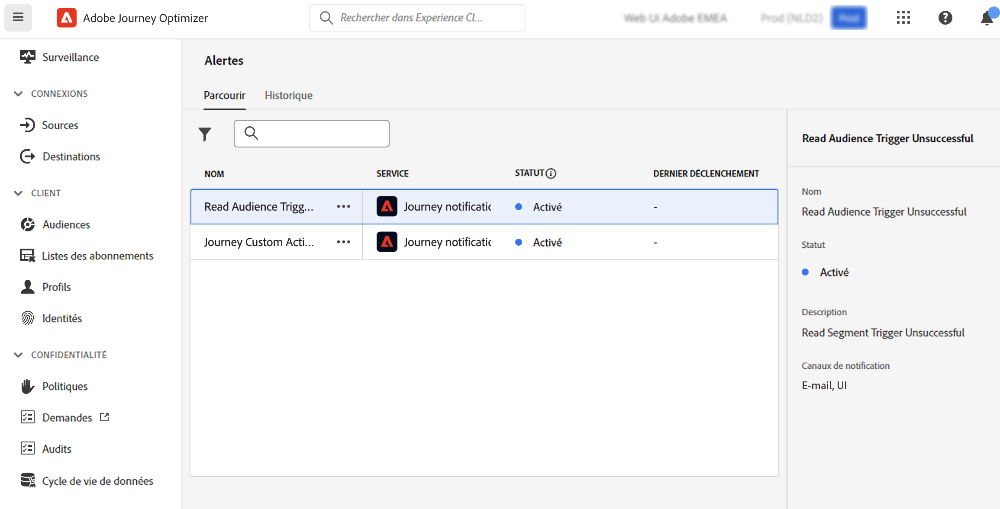

# Prise en main des alertes {#alerts}

Journey Optimizer exploite les fonctionnalités d’alerte d’Adobe Experience Platform. Vous pouvez ainsi accéder aux alertes système à travers l’interface utilisateur. Vous pouvez afficher les alertes disponibles et vous y abonner.

Lorsqu’un certain ensemble de conditions de vos opérations est atteint (par exemple, un problème potentiel lorsque le système dépasse un certain seuil), des messages d’alerte sont envoyés à tous les utilisateurs et utilisatrices de votre organisation qui se sont abonnés à ces messages.

<!--These messages can repeat over a pre-defined time interval until the alert has been resolved.-->

En savoir plus sur les alertes dans la [documentation](https://experienceleague.adobe.com/docs/experience-platform/observability/alerts/overview.html?lang=fr) d’Adobe Experience Platform.

Pour découvrir comment vous abonner à des alertes et les configurer, reportez-vous à cette [page](https://experienceleague.adobe.com/docs/experience-platform/observability/alerts/ui.html?lang=fr).

>[!AVAILABILITY]
>
>Certaines modifications de conception sont en cours pour l’alerte « Échec du déclenchement de la lecture de l’audience ». Par conséquent, cette alerte est suspendue pour l’instant et a été temporairement supprimée de l’interface utilisateur. Une fois ces modifications publiées, l’alerte sera de nouveau disponible et vous pourrez vous y abonner.

Dans le menu de gauche, sous **Administration**, cliquez sur **Alertes**. Une alerte préconfigurée pour Journey Optimizer est disponible. Cette alerte vous avertit si une action personnalisée échoue. Nous considérons qu’il existe un échec quand plus de 1 % d’erreurs sont commises sur une action personnalisée spécifique au cours des 5 dernières minutes. Ces données sont évaluées toutes les 30 secondes.

<!--A pre-configured alert for Journey Optimizer is available. This alert will warn you if a read segment node has not processed any profile during the defined time frame.

-->

Si un comportement inattendu se produit, une notification d’alerte est envoyée aux personnes abonnées à l’alerte, par e-mail ou directement dans Journey Optimizer. La notification s’affiche alors dans le coin supérieur droit de l’interface, en fonction des préférences de la personne.

Lorsqu’une alerte est résolue, vous recevez une notification « Résolue ». L’alerte d’action personnalisée peut être déclenchée pour deux raisons :
* Au cours des 5 dernières minutes, il n’y a eu aucune erreur sur cette action personnalisée (ou les erreurs sont inférieures au seuil de 1 %).
* Aucun profil n’a atteint cette action personnalisée.

Lors de l’[affichage des règles d’alerte dans l’interface utilisateur d’Adobe Experience Platform](https://experienceleague.adobe.com/docs/experience-platform/observability/alerts/ui.html?lang=fr), vous pouvez vous abonner à chaque règle. Toutefois, lorsque vous vous abonnez à des alertes par le biais des [Notifications d’événements I/O](https://experienceleague.adobe.com/docs/experience-platform/observability/alerts/subscribe.html?lang=fr), les règles d’alerte sont organisées en différents packages d’abonnement. Le nom d’abonnement à l’événement d’E/S correspondant à l’alerte d’action personnalisée est : « Échec de l’action personnalisée du Parcours ».

<!--The I/O event subscription name corresponding to the Read segment alert is: "Journey read segment Delays, Failures and Errors".-->

>[!WARNING]
>
>Ces alertes s’appliquent uniquement aux parcours dynamiques. Les alertes ne seront pas déclenchées pour les parcours en mode test.

