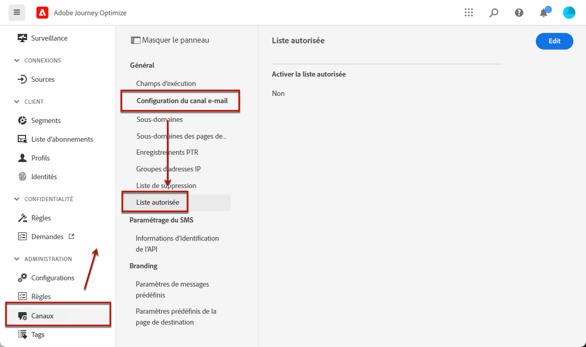
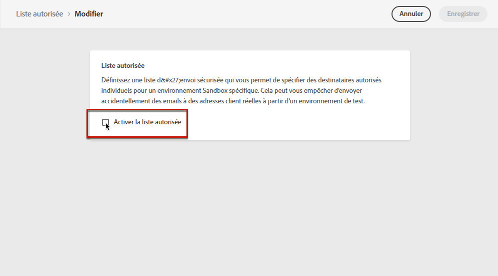
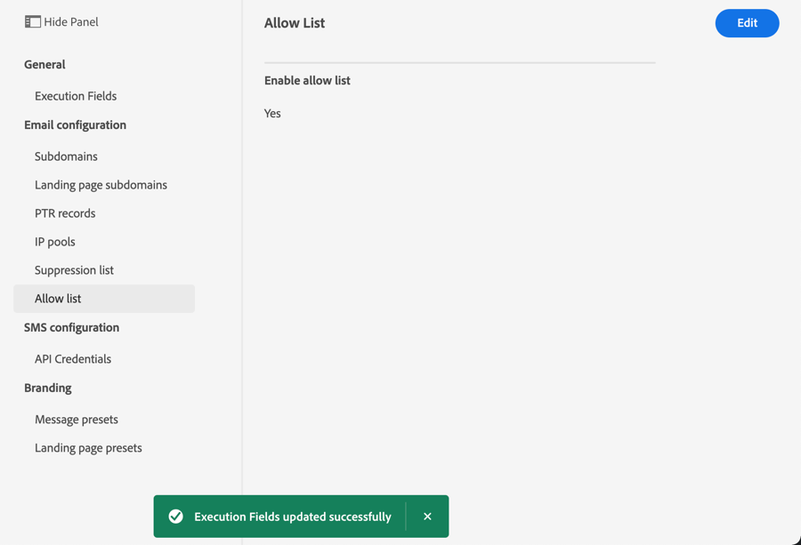

# Liste autorisée {#allow-list}

Il est possible de définir une liste de sécurité d’envoi spécifique à l’adresse [sandbox](../administration/sandboxes.md) pour disposer d’un environnement sûr à des fins de test. Sur une instance hors production, où des erreurs peuvent se produire, la liste autorisée garantit que vous n&#39;avez aucun risque d&#39;envoyer des messages indésirables à vos clients.

La liste autorisée vous permet de spécifier des adresses e-mail ou des domaines individuels qui seront les seuls destinataires ou domaines autorisés à recevoir les e-mails que vous envoyez à partir d&#39;un environnement Sandbox spécifique. Cela peut vous empêcher d&#39;envoyer accidentellement des e-mails à des adresses client réelles lorsque vous vous trouvez dans un environnement de test.

>[!CAUTION]
>
>Cette fonctionnalité **n&#39;est pas** disponible sur les environnements Sandbox de production. Elle s’applique uniquement au canal e-mail.

## Activation de la liste autorisée {#enable-allow-list}

<!--To enable the allowed list on a non-production sandbox, you need to update the general settings using the corresponding API end point in the Message Presets Service. Using this API, you can also disable the feature at any time.-->

<!--You can update the allowed list before or after enabling the feature. To do so, you need to update the general settings using the corresponding API end point in the Message Presets Service.?-->

Pour activer la liste autorisée sur un environnement de test hors production, procédez comme suit.

1. Accédez au  **[!UICONTROL Canaux]** > **[!UICONTROL Configuration des emails]** > **[!UICONTROL Liste autorisée]** .

   

1. Cliquez sur **[!UICONTROL Modifier]**.

   

1. Sélectionner **[!UICONTROL Activer la liste autorisée]**.

   

1. Cliquez sur **[!UICONTROL Enregistrer]**. La liste autorisée est activée.

   

La logique de liste autorisée s’applique lorsque la fonction est activée **et** si la liste autorisée est **non** vide. En savoir plus dans [cette section](#logic).

>[!NOTE]
>
>Lorsqu&#39;elle est activée, la fonctionnalité de liste autorisée est respectée lors de l&#39;exécution des parcours, mais également lors du test des messages avec des [bons à tirer](../design/preview.md#send-proofs) et du test des parcours à l&#39;aide du [mode test](../building-journeys/testing-the-journey.md).

## Ajout d&#39;entités à la liste autorisée {#add-entities}

Pour ajouter de nouvelles adresses e-mail ou de nouveaux domaines à la liste autorisée pour un environnement Sandbox spécifique, vous devez appeler l&#39;API de suppression avec la valeur `ALLOWED` pour l&#39;attribut `listType`. Par exemple :


Vous pouvez effectuer les opérations **Ajouter**, **Supprimer** et **Obtenir**.

>[!NOTE]
>
>La liste autorisée peut contenir jusqu&#39;à 1 000 entrées.

Pour en savoir plus sur l’émission d’appels d’API, consultez la documentation de référence [API Adobe Experience Platform](https://experienceleague.adobe.com/docs/experience-platform/landing/platform-apis/api-guide.html?lang=fr){target=&quot;_blank&quot;}.

## Logique de liste autorisée {#logic}

Lorsque la liste autorisée est **vide**, la logique de liste autorisée n&#39;est pas appliquée. Cela signifie que vous pouvez envoyer des e-mails à n&#39;importe quel profil, à condition qu&#39;il ne figure pas dans la [liste de suppression](suppression-list.md).

Lorsque la liste autorisée n&#39;est **pas vide**, la logique de liste autorisée est appliquée :

* Si une entité n&#39;est **pas sur la liste autorisée** et la liste de suppression, le destinataire correspondant ne recevra pas l&#39;e-mail, la raison étant **[!UICONTROL Non autorisé]**.

* Si une entité est **sur la liste autorisée** et pas sur la liste de suppression, l&#39;e-mail peut être envoyé au destinataire correspondant. Cependant, si l&#39;entité figure également dans la [liste de suppression](suppression-list.md), le destinataire correspondant ne recevra pas l&#39;e-mail, la raison étant **[!UICONTROL Supprimé]**.

>[!NOTE]
>
>Les profils avec le statut **[!UICONTROL Non autorisé]** sont exclus pendant le processus d’envoi du message. Par conséquent, bien que les **rapports de parcours** indiquent que ces profils ont traversé le parcours ([Lecture de segment](../building-journeys/read-segment.md) et [Message](../building-journeys/journeys-message.md)), les **Rapports par e-mail** ne les incluront pas dans les mesures **[!UICONTROL Envoyés]** étant donné qu’ils sont filtrés avant l’envoi de l’e-mail.
>
>En savoir plus sur le [Rapport dynamique](../reports/live-report.md) et le [Rapport global](../reports/global-report.md).

## Rapport d’exclusion {#reporting}

Lorsque cette fonction est activée sur un environnement Sandbox hors production, vous pouvez récupérer les adresses électroniques ou les domaines qui ont été exclus d’un envoi car ils ne se trouvaient pas sur la liste autorisée. Pour ce faire, vous pouvez utiliser le [service de requête d’Adobe Experience Platform](https://experienceleague.adobe.com/docs/experience-platform/query/api/getting-started.html?lang=fr){target=&quot;_blank&quot;} pour effectuer les appels API ci-dessous.

Pour obtenir le **nombre d’e-mails** qui n’ont pas été envoyés car les destinataires n’étaient pas sur la liste autorisée, utilisez la requête suivante :

```sql
SELECT count(distinct _id) from cjm_message_feedback_event_dataset WHERE
_experience.customerJourneyManagement.messageExecution.messageExecutionID = '<MESSAGE_EXECUTION_ID>' AND
_experience.customerJourneyManagement.messageDeliveryfeedback.feedbackStatus = 'exclude' AND
_experience.customerJourneyManagement.messageDeliveryfeedback.messageExclusion.reason = 'EmailNotAllowed'
```

Pour obtenir la **liste des adresses e-mail** qui n’ont pas été envoyées car les destinataires n’étaient pas sur la liste autorisée, utilisez la requête suivante :

```sql
SELECT distinct(_experience.customerJourneyManagement.emailChannelContext.address) from cjm_message_feedback_event_dataset WHERE
_experience.customerJourneyManagement.messageExecution.messageExecutionID IS NOT NULL AND
_experience.customerJourneyManagement.messageDeliveryfeedback.feedbackStatus = 'exclude' AND
_experience.customerJourneyManagement.messageDeliveryfeedback.messageExclusion.reason = 'EmailNotAllowed'
```
