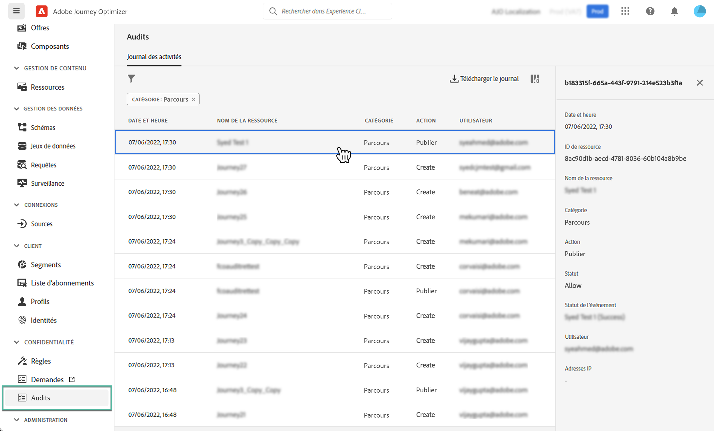

# Actions d’audit sur les ressources Journey Optimizer {#track-changes}

## À propos des journaux d’audit {#audit-logs}

Avec Journey Optimizer, vous pouvez identifier les actions effectuées par les utilisateurs du système sur divers services et fonctionnalités tels que les parcours, les messages, les landing pages, etc.

Cela vous permet d’accroître la visibilité des activités exécutées dans le système, de résoudre les problèmes et d’aider votre entreprise à se conformer aux réglementations et aux politiques de gestion des données d’entreprise.

Chaque action est enregistrée avec des métadonnées dans les &quot;journaux d’audit&quot; qui sont accessibles dans Adobe Experience Platform. Pour plus d’informations sur les journaux d’audit, y compris sur leur affichage et leur gestion dans l’interface utilisateur ou l’API, reportez-vous à la section [Documentation d’Adobe Experience Platform](https://experienceleague.adobe.com/docs/experience-platform/landing/governance-privacy-security/audit-logs/overview.html).

## Types d’événement capturés par les journaux d’audit {#events}

Le tableau suivant décrit les actions sur lesquelles les ressources Journey Optimizer sont enregistrées par les journaux d’audit.

>[!NOTE]
>
>La liste complète des actions capturées dans les journaux d’audit est disponible dans [Documentation d’Adobe Experience Platform](https://experienceleague.adobe.com/docs/experience-platform/landing/governance-privacy-security/audit-logs/overview.html#category).

| Ressource | Action |
|-----------|------------------|
| Groupe de champs | Créer / Supprimer / Mettre à jour |
| Sous-domaine AJO | Créer / Supprimer / Mettre à jour |
| Liste de suppression CJM | Créer/supprimer/télécharger un fichier CSV |
| Paramètre prédéfini de message AJO | Créer / Supprimer / Mettre à jour |
| Enregistrement PTR AJO | Créer / Supprimer / Mettre à jour |
| Stratégie de classement | Créer / Supprimer / Mettre à jour |
| Action personnalisée parcours | Créer / Supprimer / Mettre à jour |
| Modèle de HTML de landing page AJO | Créer / Supprimer / Mettre à jour |
| pool d’adresses IP AJO | Créer / Supprimer / Mettre à jour |
| Sous-domaine de page d’entrée AJO | Créer / Supprimer / Mettre à jour |
| Informations d’identification de l’API SMS AJO | Créer / Supprimer / Mettre à jour |
| Paramètre prédéfini de page d’entrée AJO | Créer / Supprimer / Mettre à jour |
| Source de données de parcours | Créer / Supprimer / Mettre à jour |
| événement parcours | Créer / Supprimer / Mettre à jour |
| Modèle d’expression enregistrée AJO | Créer / Supprimer / Mettre à jour |
| Règle de fréquence des messages | Créer / Supprimer / Mettre à jour |
| Page d’entrée AJO | Créer / Supprimer / Mettre à jour / Publier / Annuler la publication |
| Parcours | Créer / Supprimer / Mettre à jour / Arrêter / Publier |
| Message AJO | Créer/supprimer/mettre à jour/publier |
| Paramètre général du canal AJO | Créer / Supprimer / Mettre à jour |
