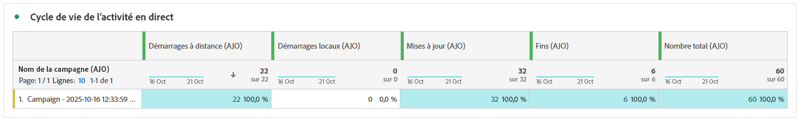
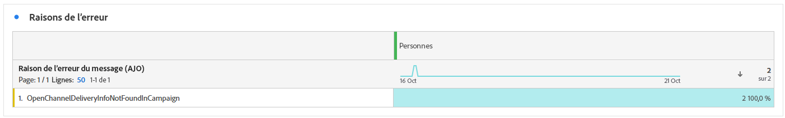

# Rapport de campagne d’activité dynamique {#campaign-global-report-cja-activity}

>[!BEGINSHADEBOX]

Vous pouvez accéder au rapport de campagne d’activité dynamique en cliquant sur le bouton **[!UICONTROL Rapports]** de votre campagne, puis en sélectionnant **[!UICONTROL Afficher le rapport de toutes les périodes]**. [En savoir plus](report-gs-cja.md)


>[!ENDSHADEBOX]

## Statistiques d’envoi {#sending-statistics-mobile}


Le tableau **[!UICONTROL Statistiques d’envoi]** fournit un aperçu détaillé des mesures clés liées à votre campagne d’activités Live. Il affiche des informations essentielles telles que la taille de l’audience ciblée et le nombre d’activités en direct diffusées avec succès, ce qui vous aide à évaluer la portée et les performances globales de votre activité en direct.

+++ En savoir plus sur les mesures de statistiques d’envoi

* **[!UICONTROL Ciblés]** : nombre de profils qui remplissent les critères de l’audience avant l’application des exclusions, des suppressions ou des suppressions de consentement.

* **[!UICONTROL Envois]** : nombre total d’événements d’activité en direct ayant tenté d’être envoyés aux profils ciblés.

* **[!UICONTROL Délivrés]** : nombre d’événements d’activité dynamique délivrés avec succès aux appareils, par rapport au nombre total de tentatives d’envoi.

* **[!UICONTROL Erreurs d’envoi]** : nombre total d’événements d’activité actifs qui n’ont pas pu être envoyés en raison d’erreurs (par exemple, des jetons non valides ou des problèmes de connectivité).

* **[!UICONTROL Exclusions d’envoi]** : nombre de profils exclus de l’envoi par Adobe Journey Optimizer (par exemple, en raison du statut d’opt-out ou des règles d’éligibilité).

+++

## Cycle de vie d’une activité dynamique {#lifecycle}

Le tableau **[!UICONTROL Cycle de vie des activités en direct]** offre une vue d’ensemble complète de la progression de votre activité en direct au fil du temps. Il offre une visibilité sur les événements clés, tels que le moment où l’activité est lancée, mise à jour ou terminée, ce qui vous permet de mieux comprendre l’interaction client et le cycle de vie global de votre campagne d’activités dynamiques.

Le compte rendu des performances diffère selon que vous utilisez des campagnes transactionnelles ou marketing.

### Activité transactionnelle en direct



Pour une campagne transactionnelle, le rapport de campagne d’activité dynamique affiche tous les événements de cycle de vie, y compris les démarrages distants, les démarrages locaux, les mises à jour et les fins de campagne.

+++ En savoir plus sur les mesures de cycle de vie des activités dynamiques avec les campagnes transactionnelles

* **[!UICONTROL Démarrages à distance]** : nombre total d’événements de démarrage d’activité dynamique à distance, généralement déclenchés par le serveur ou les systèmes principaux.

* **[!UICONTROL Lancements locaux]** : nombre total d’événements de démarrage d’activité dynamique lancés localement sur l’appareil d’un utilisateur, souvent à la suite d’une interaction utilisateur ou de déclencheurs côté client.

* **[!UICONTROL Mises à jour]** : nombre total de mises à jour d’activité dynamique envoyées aux appareils. Les mises à jour peuvent inclure des changements de statut, du nouveau contenu ou des notifications de progression.

* **[!UICONTROL Ends]** : nombre total d’événements de fin d’activité Live envoyés aux appareils.

* **[!UICONTROL Totaux]** : total général de tous les événements du cycle de vie d’une activité dynamique, y compris les démarrages, les mises à jour et les fins, fournissant une mesure complète du volume d’activité dynamique.

+++

### Activité Marketing Live


Les campagnes marketing utilisent l’activité Live pour les cas d’utilisation de diffusion, envoyant des mises à jour à plusieurs appareils simultanément.

Pour l’activité iOS Live dans les campagnes marketing, le rapport affiche uniquement les événements **[!UICONTROL Démarrages à distance]** et **[!UICONTROL Erreurs de démarrages à distance]** au démarrage. Les événements **[!UICONTROL Mises à jour]** et **[!UICONTROL Fin]** ne sont pas suivis, car APNs distribue les mises à jour à tous les appareils sans fournir de commentaires. Pour afficher les événements **[!UICONTROL Mises à jour]** et **[!UICONTROL Se termine]**, utilisez la console [Notification push Apple](https://developer.apple.com/notifications/push-notifications-console/).

+++ En savoir plus sur les mesures de cycle de vie des activités dynamiques avec les campagnes marketing

* **[!UICONTROL Démarrages à distance]** : nombre total d’événements de démarrage d’activité dynamique à distance, généralement déclenchés par le serveur ou les systèmes principaux.

* **[!UICONTROL Erreurs de démarrage à distance]** : nombre total d’erreurs qui se sont produites lors de la tentative de démarrage à distance d’une activité Live (par exemple, jetons non valides ou problèmes de connectivité).

+++

#### Récupération des mises à jour et des nombres de fins via l’API {#retrieving-updates-end-api}

Au lieu d&#39;utiliser la console de notifications push Apple, vous pouvez obtenir des mises à jour et des nombres de fins par le biais d&#39;appels d&#39;API découplés.

Lors de l’exécution des appels d’API de mise à jour ou de fin pour les cas d’utilisation de diffusion, la réponse inclut une section `controlBreakdown` qui fournit des compteurs indiquant le nombre d’appels de mise à jour et de fin exécutés pour l’exécution de l’activité en direct. Ce bloc est absent des exécutions héritées sans données de cycle de vie. Le statut d’exécution peut également être récupéré explicitement à l’aide du point d’entrée GET si nécessaire.

**MISE À JOUR/FIN de la réponse (200 OK)**

```json
{
  "executionId": "HA-exec-abc",
  "campaignId": "campaign-abc-123",
  "campaignVersionId": "v1",
  "audienceId": "audience-segment-id",
  "status": "processing",
  "targetedProfileCount": 150000,
  "createdAt": "2026-02-27T10:00:00Z",
  "executionLifecycle": {
    "lastControlAt": "2026-02-27T10:45:00Z",
    "controlBreakdown": {
      "update": 5,
      "end": 1
    }
  }
}
```

**Statut d’exécution (GET)**

```
GET /im/executions/audience/{executionId}
```

## Raisons des erreurs {#error-reasons}



Le tableau **[!UICONTROL Causes des erreurs]** vous permet d’identifier les erreurs spécifiques qui se sont produites au cours du processus d’envoi de votre activité Live , ce qui facilite une analyse approfondie des problèmes rencontrés.

## Causes d’exclusion {#excluded-reasons}


Le tableau **[!UICONTROL Causes d’exclusion]** décrit visuellement les différents facteurs qui ont conduit à l’exclusion des profils d’utilisateurs et d’utilisatrices de l’audience ciblée, ce qui les empêche de recevoir votre activité dynamique.
