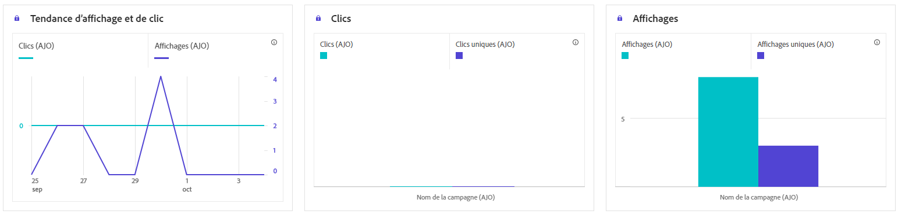
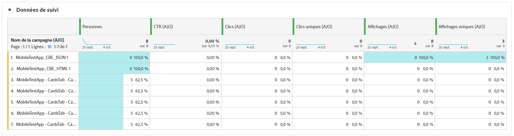
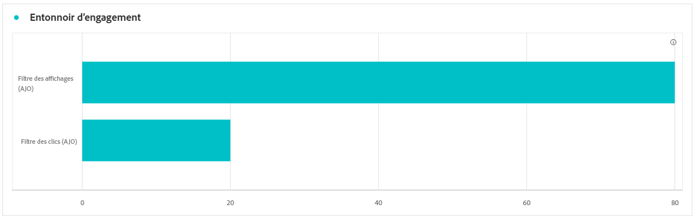
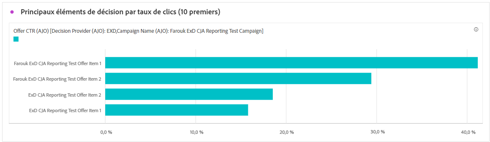
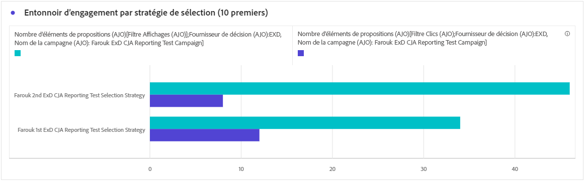
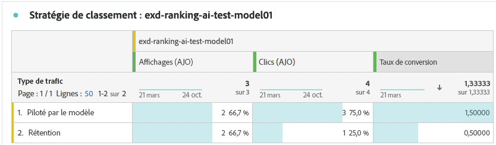
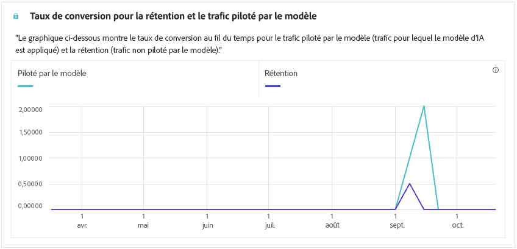

# Rapport de campagne basée sur du code {#campaign-global-report-cja-code}

>[!BEGINSHADEBOX]

Vous pouvez accéder au rapport de campagne basée sur du code en cliquant sur le bouton **[!UICONTROL Rapports]** de votre campagne, puis en sélectionnant **[!UICONTROL Afficher le rapport de toutes les périodes]**. [En savoir plus](report-gs-cja.md)

>[!ENDSHADEBOX]

>[!NOTE]
>
>Les expériences basées sur du code fonctionnent comme des interactions entrantes dans lesquelles les utilisateurs s’inscrivent en accédant à votre site ou à votre application. Par conséquent, les mesures **Ciblées** ou **Audience**, qui effectuent le suivi des profils choisis pour la diffusion des messages sortants, ne sont pas incrémentées pour les campagnes basées sur le code.

## Affichages et clics {#impressions-code}

Les graphiques **[!UICONTROL Affichages et clics]** présentent une analyse détaillée de l’engagement de vos profils avec vos expériences basées sur du code, offrant des informations précieuses sur la manière dont les profils interagissent avec votre contenu.

+++ En savoir plus sur les mesures des impressions et des clics

* **[!UICONTROL Clics uniques]** : nombre de profils qui ont cliqué sur un contenu dans vos expériences.

* **[!UICONTROL Clics]** : nombre de clics sur un contenu dans vos expériences.

* **[!UICONTROL Affichages]** : nombre dʼouvertures de l’expérience.

* **[!UICONTROL Affichages uniques]** : nombre dʼouvertures de l’expérience, les multiples interactions dʼun même profil ne sont pas prises en compte.

+++

## Données de suivi {#track-data-code}

Le tableau **[!UICONTROL Données de suivi]** offre un instantané détaillé de l’activité de profil liée à vos expériences basées sur du code, fournissant des informations essentielles sur l’engagement et l’efficacité des expériences.

+++ En savoir plus sur les mesures de données de tracking

* **[!UICONTROL Personnes]** : nombre de profils d’utilisateurs et d’utilisatrices qui sont qualifiés en tant que profils cibles pour vos expériences.

* **[!UICONTROL Taux de clics (CTR)]** : pourcentage d’utilisateurs et d’utilisatrices ayant interagi avec vos expériences.

* **[!UICONTROL Clics]** : nombre de clics sur un contenu dans vos expériences.

* **[!UICONTROL Clics uniques]** : nombre de profils qui ont cliqué sur un contenu dans vos expériences.

* **[!UICONTROL Affichages]** : nombre dʼouvertures de votre expérience.

* **[!UICONTROL Affichages uniques]** : nombre dʼouvertures de votre expérience, les multiples interactions dʼun même profil ne sont pas prises en compte.

+++

## Libellés des liens de suivi {#track-link-code}

Le tableau **[!UICONTROL Libellés des liens de suivi]** fournit une vue d’ensemble complète des libellés des liens dans vos expériences basées sur du code qui génèrent le plus de trafic de visiteurs et de visiteuses. Cette fonctionnalité vous permet d’identifier et de hiérarchiser les liens les plus populaires.

+++ En savoir plus sur les mesures des libellés des liens de suivi

* **[!UICONTROL Clics uniques]** : nombre de profils qui ont cliqué sur un contenu dans vos expériences basées sur du code.

* **[!UICONTROL Clics]** : nombre de clics sur un contenu dans vos expériences basées sur du code.

* **[!UICONTROL Affichages]** : nombre dʼouvertures de l’expérience.

* **[!UICONTROL Affichages uniques]** : nombre dʼouvertures de l’expérience, les multiples interactions dʼun même profil ne sont pas prises en compte.

+++

## Rapports de prise de décisions {#decisioning-reporting}

### KPI de prise de décision {#decisioning-kpis}

Les **KPI de prise de décision** fournissent des informations clés sur l’engagement de vos visiteurs et visiteuses envers vos expériences, y compris des mesures telles que les suivantes :

* **[!UICONTROL Nombre total d’éléments]** : nombre total d’éléments individuels qui faisaient partie d’une expérience personnalisée ou d’un processus de prise de décision au cours d’une période spécifiée.

* **[!UICONTROL Nombre total d’affichages]** :

* **[!UICONTROL Nombre total de clics]** : nombre total de fois où les utilisateurs et les utilisatrices ont cliqué sur des éléments, des liens, des produits ou d’autres éléments interactifs au cours d’une période donnée.

* **[!UICONTROL Taux d’instances de secours]** : pourcentage d’instances où aucune stratégie de sélection n’était applicable, ce qui a entraîné l’affichage d’une option générique ou moins spécifique.

### Entonnoir d’engagement {#engagement-funnel}

Le tableau **[!UICONTROL Entonnoir d’engagement]** surveille les performances des expériences personnalisées en évaluant l’efficacité de chaque étape de l’entonnoir à susciter des interactions des utilisateurs et des utilisatrices.

* **[!UICONTROL Affichages]** : nombre total de fois où des expériences personnalisées ont été affichées ou présentées aux utilisateurs et aux utilisatrices via les différents points de contact.

* **[!UICONTROL Clics]** : nombre total de fois où des utilisateurs et utilisatrices ont cliqué sur des expériences personnalisées qui leur ont été présentées.

### Principaux éléments de décision par taux de clics {#top-decision}

Le tableau **[!UICONTROL Principaux éléments de décision par taux de clics]** met en évidence les performances de chaque élément en fonction de son taux de clics. Cette mesure permet d’évaluer quels éléments sont les plus efficaces pour générer de l’engagement par les utilisateurs et les utilisatrices et susciter des interactions.

* **[!UICONTROL Taux de clics]** : pourcentage des utilisateurs et des utilisatrices qui cliquent sur un lien, une publicité ou une recommandation par rapport au nombre d’affichages de ces derniers.

### Entonnoir d’engagement par stratégie de sélection {#engagement-funnel-selection}

Le tableau **[!UICONTROL Entonnoir d’engagement par stratégie de sélection]** vous permet de surveiller et d’analyser l’efficacité des différentes stratégies de sélection à générer de l’engagement des utilisateurs et des utilisatrices avec des expériences personnalisées.

* **[!UICONTROL Affichages]** : nombre total de fois où des expériences personnalisées ont été affichées ou présentées aux utilisateurs et aux utilisatrices via les différents points de contact.

* **[!UICONTROL Clics]** : nombre total de fois où des utilisateurs et utilisatrices ont cliqué sur des expériences personnalisées qui leur ont été présentées.

### Performances des éléments de décision {#decision-items-performance}

Le tableau **[!UICONTROL Performances des éléments de décision]** évalue les performances de chaque élément concernant leur capacité à générer de l’engagement de la part des utilisateurs et des utilisatrices et à produire des actions souhaitées, telles que des achats, des clics ou d’autres types de réactions.

* **[!UICONTROL Affichages]** : nombre total de fois où des expériences personnalisées ont été affichées ou présentées aux utilisateurs et aux utilisatrices via les différents points de contact.

* **[!UICONTROL Clics]** : nombre total de fois où des utilisateurs et utilisatrices ont cliqué sur des expériences personnalisées qui leur ont été présentées.

### Stratégie de classement {#ranking-strategy}

>[!NOTE]
>
>Le tableau **[!UICONTROL Stratégie de classement]** devient disponible uniquement lorsqu’un [modèle d’IA](../experience-decisioning/ranking/ai-models.md) est intégré à la campagne. <!--[Learn more](../experience-decisioning/ranking/ranking-formulas.md)-->

Le tableau **[!UICONTROL Stratégie de classement]** fournit des informations sur les performances des modèles de classement pilotés par l’IA dans les expériences personnalisées en comparant deux types de trafic :

* **Piloté par modèle** : les utilisateurs et les utilisatrices reçoivent du contenu classé par le modèle d’IA, optimisé pour la pertinence et l’engagement.

* **Exclusion** : les utilisateurs et utilisatrices reçoivent du contenu diffusé de manière aléatoire pendant la phase d’exploration du modèle.

Les mesures clés affichées sont les suivantes :

* **[!UICONTROL Affichages]** : nombre total de fois où des expériences personnalisées ont été affichées ou présentées aux utilisateurs et aux utilisatrices via les différents points de contact.

* **[!UICONTROL Clics]** : nombre total de fois où des utilisateurs et les utilisatrices ont cliqué sur des expériences personnalisées qui leur ont été présentées.

* **[!UICONTROL Taux de conversion]** : pourcentage d’affichages qui ont généré des actions de l’utilisateur ou de l’utilisatrice (par exemple, des clics), indiquant la capacité du modèle à générer de l’engagement des utilisateurs et des utilisatrices.

>[!NOTE]
>
>Actuellement, le rapport [Mesure de l’effet élévateur](../experience-decisioning/ranking/auto-optimization-model.md#lift) n’est disponible que pour le modèle d’IA [Optimisation personnalisée](../experience-decisioning/ranking/personalized-optimization-model.md). Si vous avez besoin de rapports sur la mesure de l’effet élévateur, utilisez plutôt le modèle d’optimisation personnalisée.

### Taux de conversion pour le trafic Exclusion et le trafic Piloté par modèle {#conversion-rate}

>[!NOTE]
>
>Le graphique **[!UICONTROL Taux de conversion pour la rétension et le trafic piloté par le modèle]** devient disponible uniquement lorsqu’un [modèle d’IA](../experience-decisioning/ranking/ai-models.md) est intégré à la campagne. <!--[Learn more](../experience-decisioning/ranking/ranking-formulas.md)-->

Le graphique **[!UICONTROL Taux de conversion pour le trafic Exclusion et le trafic Piloté par modèle]** indique le taux de conversion au fil du temps pour deux types de trafic :

* **Piloté par modèle** : les utilisateurs et les utilisatrices reçoivent du contenu classé par le modèle d’IA, optimisé pour la pertinence et l’engagement.

* **Exclusion** : les utilisateurs et utilisatrices reçoivent du contenu diffusé de manière aléatoire pendant la phase d’exploration du modèle.

>[!CAUTION]
>
>Lors de l’utilisation d’un modèle d’IA intégré à une [formule de classement](../experience-decisioning/ranking/ranking-formulas.md), les données ne sont pas reflétées dans le rapport sur les taux de conversion.
