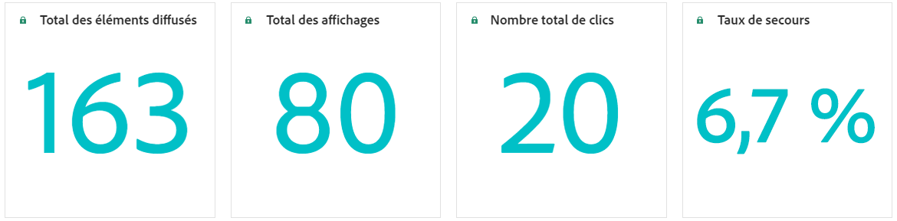

# Rapport de campagne basé sur le code {#campaign-global-report-cja-code}

## Affichages et clics {#impressions-code}

Les graphiques **[!UICONTROL Affichages et clics]** présentent une analyse détaillée de l’engagement de vos profils avec vos expériences basées sur du code, offrant des informations précieuses sur la manière dont les profils interagissent avec votre contenu.

+++ En savoir plus sur les mesures des impressions et des clics

* **[!UICONTROL Clics uniques]** : nombre de profils qui ont cliqué sur un contenu dans vos expériences.

* **[!UICONTROL Clics]** : nombre de clics sur un contenu dans vos expériences.

* **[!UICONTROL Affichages]** : nombre dʼouvertures de l’expérience.

* **[!UICONTROL Affichages uniques]** : nombre dʼouvertures de l’expérience, les multiples interactions dʼun même profil ne sont pas prises en compte.

+++

## Données de suivi {#track-data-code}

Le tableau **[!UICONTROL Données de suivi]** offre un instantané détaillé de l’activité de profil liée à vos expériences basées sur du code, fournissant des informations essentielles sur l’engagement et l’efficacité des expériences.

+++ En savoir plus sur les mesures de données de suivi

* **[!UICONTROL Personnes]** : nombre de profils d’utilisateurs et d’utilisatrices qui sont qualifiés en tant que profils cibles pour vos expériences.

* **[!UICONTROL Taux de clics (CTR)]** : pourcentage d’utilisateurs et d’utilisatrices ayant interagi avec vos expériences.

* **[!UICONTROL Clics]** : nombre de clics sur un contenu dans vos expériences.

* **[!UICONTROL Clics uniques]** : nombre de profils qui ont cliqué sur un contenu dans vos expériences.

* **[!UICONTROL Affichages]** : nombre dʼouvertures de votre expérience.

* **[!UICONTROL Affichages uniques]** : nombre dʼouvertures de votre expérience, les multiples interactions dʼun même profil ne sont pas prises en compte.

+++

## Libellés des liens de suivi {#track-link-code}

Le tableau **[!UICONTROL Libellés des liens de suivi]** fournit une vue d’ensemble complète des libellés des liens dans vos expériences basées sur du code qui génèrent le plus de trafic de visiteurs et de visiteuses. Cette fonctionnalité vous permet d’identifier et de hiérarchiser les liens les plus populaires.

+++ En savoir plus sur les mesures des libellés des liens de suivi

* **[!UICONTROL Clics uniques]** : nombre de profils qui ont cliqué sur un contenu dans vos expériences basées sur du code.

* **[!UICONTROL Clics]** : nombre de clics sur un contenu dans vos expériences basées sur du code.

* **[!UICONTROL Affichages]** : nombre dʼouvertures de l’expérience.

* **[!UICONTROL Affichages uniques]** : nombre dʼouvertures de l’expérience, les multiples interactions dʼun même profil ne sont pas prises en compte.

+++

## IPC de prise de décision {#decisioning-kpis}

Les **indicateurs de performance clés de prise de décision** fournissent des informations clés sur l’engagement de vos visiteurs avec vos expériences, notamment des mesures telles que :

* **[!UICONTROL Total des éléments]** : nombre total d’éléments individuels qui faisaient partie d’une expérience personnalisée ou d’un processus de prise de décision au cours d’une période spécifiée.

* **[!UICONTROL Total affichages]** :

* **[!UICONTROL Nombre total de clics]** : nombre total de fois où les utilisateurs ont cliqué sur des éléments, des liens, des produits ou d’autres éléments interactifs au cours d’une période donnée.

* **[!UICONTROL Taux de secours]** : pourcentage d’instances où aucune stratégie de sélection n’est qualifiée, ce qui entraîne l’affichage d’une option générique ou moins spécifique.

## Entonnoir d’engagement {#engagement-funnel}

La table **[!UICONTROL Entonnoir d’engagement]** surveille les performances des expériences personnalisées en évaluant l’efficacité de chaque étape de l’entonnoir sur les interactions utilisateur.

* **[!UICONTROL Affichages]** : nombre total de fois où des expériences personnalisées ont été affichées ou présentées aux utilisateurs sur différents points de contact.

* **[!UICONTROL Clics]** : nombre total de fois où des utilisateurs ont cliqué sur des expériences personnalisées qui leur ont été affichées.

## Principaux éléments de décision par taux de clics publicitaires {#top-decision}

Le tableau **[!UICONTROL Principaux éléments de décision par CTR]** met en évidence les performances de chaque élément en fonction de son taux de clics publicitaires. Cette mesure permet d’évaluer les éléments les plus efficaces pour impliquer les utilisateurs et générer des interactions.

* **[!UICONTROL Taux de clics publicitaires (CTR)]** : pourcentage des utilisateurs qui cliquent sur un lien, une publicité ou une recommandation par rapport au nombre de fois où il s’affichait.

## Entonnoir d’engagement par stratégie de sélection {#engagement-funnel-selection}

La table **[!UICONTROL Entonnoir d’engagement par stratégie de sélection]** vous permet de surveiller et d’analyser l’efficacité des différentes stratégies de sélection pour impliquer les utilisateurs avec des expériences personnalisées.

* **[!UICONTROL Affichages]** : nombre total de fois où des expériences personnalisées ont été affichées ou présentées aux utilisateurs sur différents points de contact.

* **[!UICONTROL Clics]** : nombre total de fois où des utilisateurs ont cliqué sur des expériences personnalisées qui leur ont été affichées.

## Performances des éléments de décision {#decision-items-performance}

Le tableau **[!UICONTROL Performances des éléments de décision]** évalue les performances de chaque élément pour interagir avec les utilisateurs et générer les actions souhaitées, telles que les achats, les clics ou d’autres réponses.

* **[!UICONTROL Affichages]** : nombre total de fois où des expériences personnalisées ont été affichées ou présentées aux utilisateurs sur différents points de contact.

* **[!UICONTROL Clics]** : nombre total de fois où des utilisateurs ont cliqué sur des expériences personnalisées qui leur ont été affichées.

## Stratégie de classement {#ranking-strategy}

>[!NOTE]
>
>La table **[!UICONTROL Stratégie de classement]** devient disponible uniquement lorsqu’un modèle d’IA est intégré à la campagne. [En savoir plus](../experience-decisioning/ranking.md)

La table **[!UICONTROL Stratégie de classement]** fournit des informations sur les performances des modèles de classement pilotés par l’IA dans les expériences personnalisées en comparant deux types de trafic :

* **Moteur piloté par le modèle** : les utilisateurs reçoivent du contenu classé selon le modèle d’IA, optimisé pour la pertinence et l’engagement.

* **Holdout** : les utilisateurs voient une version générique du contenu, servant de groupe témoin pour mesurer l’efficacité du modèle d’IA.

Les mesures clés affichées sont les suivantes :

* **[!UICONTROL Affichages]** : nombre total de fois où des expériences personnalisées ont été affichées ou présentées aux utilisateurs sur différents points de contact.

* **[!UICONTROL Clics]** : nombre total de fois où des utilisateurs ont cliqué sur des expériences personnalisées qui leur ont été affichées.

* **[!UICONTROL Taux de conversion]** : pourcentage d’affichages qui ont généré des actions de l’utilisateur (par exemple, des clics), indiquant le succès du modèle dans l’engagement des utilisateurs.

## Taux de conversion pour le trafic d’exclusion et piloté par le modèle {#conversion-rate}

>[!NOTE]
>
>Le graphique **[!UICONTROL Taux de conversion du trafic d’abandon et piloté par le modèle]** devient disponible uniquement lorsqu’un modèle AI est intégré à la campagne. [En savoir plus](../experience-decisioning/ranking.md)

Le graphique **[!UICONTROL Taux de conversion du trafic d’abandon et piloté par le modèle]** montre le taux de conversion au fil du temps de deux types de trafic :

* **Moteur piloté par le modèle** : les utilisateurs reçoivent du contenu classé selon le modèle d’IA, optimisé pour la pertinence et l’engagement.

* **Holdout** : les utilisateurs voient une version générique du contenu, servant de groupe témoin pour mesurer l’efficacité du modèle d’IA.
