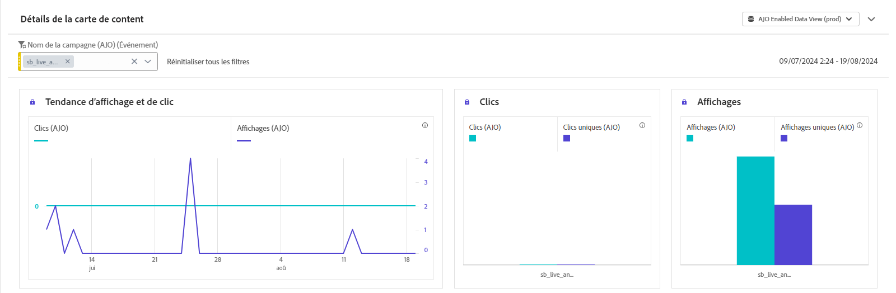
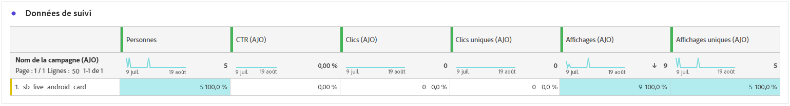

# Rapport de campagne de carte de contenu {#campaign-global-report-cja-content}

## Tendance des affichages et des clics {#display-click}

Les graphiques **[!UICONTROL Tendance des affichages et des clics]** vous permet de comprendre à la fois la portée globale du message et le nombre de profils uniques qui interagissent avec lui.

+++ En savoir plus sur les mesures sur les affichages et les clics

* **[!UICONTROL Clics]** : nombre de fois où un contenu a fait l’objet d’un clic dans une carte de contenu.

* **[!UICONTROL Affichages]** : nombre d’ouvertures du message.

* **[!UICONTROL Affichages uniques]** : nombre dʼouvertures du message, les multiples interactions dʼun même profil ne sont pas prises en compte.

+++

## Données de suivi {#tracking-data}

Le tableau **[!UICONTROL Données de suivi]** offre un instantané détaillé de l’activité de profil liée à vos cartes de contenu, fournissant des informations essentielles sur l’engagement et l’efficacité des cartes de contenu.

+++ En savoir plus sur les mesures de données de suivi

* **[!UICONTROL Personnes]** : nombre de profils d’utilisateurs et d’utilisatrices qui sont qualifiés en tant que profils cibles pour vos cartes de contenu.

* **[!UICONTROL Taux de clics (CTR)]** : pourcentage d’utilisateurs et d’utilisatrices ayant interagi avec la carte de contenu.

* **[!UICONTROL Clics]** : nombre de fois où un contenu a fait l’objet d’un clic dans votre carte de contenu.

* **[!UICONTROL Clics uniques]** : nombre de profils qui ont cliqué sur un contenu dans votre carte de contenu.

* **[!UICONTROL Affichages]** : nombre d’ouvertures du message.

* **[!UICONTROL Affichages uniques]** : nombre dʼouvertures du message, les multiples interactions dʼun même profil ne sont pas prises en compte.

+++

## Libellés suivis {#tracked-labels}

Le tableau **[!UICONTROL Libellés suivis]** offre une vue d’ensemble complète des libellés des liens dans vos cartes de contenu, mettant en évidence ceux qui génèrent le plus de trafic de visiteurs et visiteuses. Cette fonctionnalité vous permet d’identifier et de hiérarchiser les liens les plus populaires.

+++ En savoir plus sur les mesures des libellés suivis

* **[!UICONTROL Clics uniques]** : nombre de profils qui ont cliqué sur un contenu dans vos cartes de contenu.

* **[!UICONTROL Clics]** : nombre de fois où un contenu a fait l’objet d’un clic dans vos cartes de contenu.

* **[!UICONTROL Affichages]** : nombre d’ouvertures du message.

* **[!UICONTROL Affichages uniques]** : nombre d’ouvertures du message, les interactions multiples d’un même profil ne sont pas prises en compte.

+++
