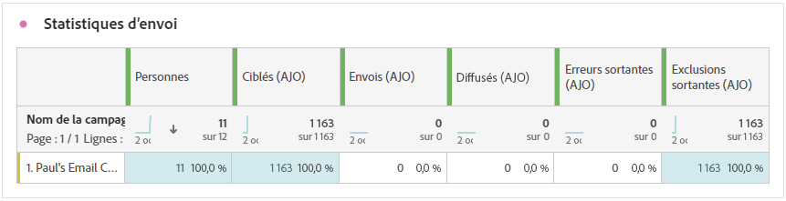
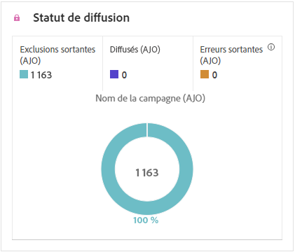

# Rapport de campagne par courrier {#campaign-global-report-cja-direct}

>[!BEGINSHADEBOX]

Vous pouvez accéder au rapport de campagne par courrier en cliquant sur le bouton **[!UICONTROL Rapports]** de votre campagne, puis en sélectionnant **[!UICONTROL Afficher le rapport de toutes les périodes]**. [En savoir plus](report-gs-cja.md)

>[!ENDSHADEBOX]

## Statistiques d’envoi {#sending-statistics-directmail}

Le tableau **[!UICONTROL Statistiques d’envoi]** fournit un résumé complet des données essentielles concernant vos campagnes de publipostage direct. Il fournit des informations détaillées sur des mesures clés, tels que la taille de l’audience ciblée et le nombre d’e-mails envoyés avec succès, vous permettant d’obtenir des informations précieuses sur l’efficacité et la portée de vos campagnes de publipostage direct.

+++ En savoir plus sur les mesures de statistiques d’envoi

* **[!UICONTROL Personnes]** : nombre de profils d’utilisateurs et d’utilisatrices identifiés comme cibles de vos messages.

* **[!UICONTROL Ciblés]** : nombre de profils qui remplissent les critères de l’audience avant l’application des exclusions, des suppressions ou des suppressions de consentement. Dans les parcours dont la rentrée est activée, un profil peut être ciblé plusieurs fois.

* **[!UICONTROL Envois]** : nombre total de messages de publipostage direct envoyés.

* **[!UICONTROL Diffusés]** : nombre de messages de publipostage direct envoyés avec succès, par rapport au nombre total de messages envoyés.

* **[!UICONTROL Erreurs sortantes]** : nombre total d’erreurs survenues au cours de la procédure d’envoi, empêchant l’envoi à des profils.

* **[!UICONTROL Exclusions sortantes]** : nombre de profils qui ont été exclus par Adobe Journey Optimizer.

+++

## Statut de la diffusion {#delivery-status-directmail}

Le graphique **[!UICONTROL Statut de diffusion]** fournit une vue complète des données relatives aux messages de publipostage direct envoyés dans le cadre de votre campagne, offrant des informations sur les mesures clés telles que les diffusions et les erreurs. Cela permet une analyse approfondie du processus d’envoi des messages de publipostage direct, fournissant des informations précieuses sur l’efficacité et la performance de vos campagnes.

+++ En savoir plus sur les mesures de statut de la diffusion

* **[!UICONTROL Diffusés]** : nombre de messages de publipostage direct envoyés avec succès, par rapport au nombre total de messages de publipostage direct envoyés.

* **[!UICONTROL Erreurs sortantes]** : nombre total d’erreurs survenues au cours de la procédure d’envoi, empêchant les messages de publipostage direct d’être envoyés à des profils.

* **[!UICONTROL Exclusions sortantes]** : nombre de profils qui ont été exclus par Adobe Journey Optimizer.

+++

## Raisons des erreurs {#error-reasons-directmail}

Le tableau **[!UICONTROL Raisons des erreurs]** offre une visibilité des erreurs spécifiques survenues pendant le processus d’envoi de vos message de publipostage direct, fournissant une analyse minutieuse de tout problème rencontré.

## Causes d’exclusion {#exclude-reasons-directmail}

[&#128279;](assets/cja-direct-excluded.png)

Le tableau **[!UICONTROL Causes d’exclusion]** décrit visuellement les différents facteurs qui ont conduit à l’exclusion des profils d’utilisateurs et d’utilisatrices de l’audience ciblée, ce qui les empêche de recevoir vos messages de publipostage direct.

Consultez [cette page](exclusion-list.md) pour la liste complète des causes d’exclusion.
