# Rapport de campagne par e-mail {#campaign-global-report-cja-email}

>[!INFO]
>
>Depuis qu’Apple a introduit de nouvelles fonctionnalités de protection de la confidentialité pour son application Mail native, notamment la protection de la confidentialité dans Mail, les expéditeurs et expéditrices ne sont plus en mesure d’utiliser les pixels de suivi pour collecter des données sur les profils qui ont activé la protection de la confidentialité dans l’application Mail d’Apple. Par conséquent, la capacité d’Adobe Journey Optimizer à suivre les ouvertures d’e-mail à l’aide de pixels de suivi peut être affectée.
> [En savoir plus](https://experienceleaguecommunities.adobe.com/t5/adobe-campaign-classic-blogs/the-impact-of-apple-ios-privacy-changes-on-email-marketing-and/ba-p/699780?profile.language=fr) sur l’impact des modifications apportées à la confidentialité d’Apple iOS sur le marketing par e-mail.
> 
> Nous vous recommandons de vous concentrer sur les clics et les mesures de conversion plutôt que sur les taux d’ouverture pour obtenir des informations plus précises.

>[!BEGINSHADEBOX]

Vous pouvez accéder au rapport de campagne par e-mail en cliquant sur le bouton **[!UICONTROL Rapports]** de votre campagne, puis en sélectionnant **[!UICONTROL Afficher le rapport de toutes les périodes]**. [En savoir plus](report-gs-cja.md)

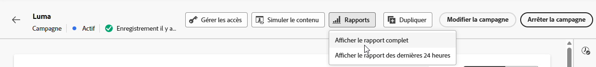

>[!ENDSHADEBOX]

## KPI relatifs aux e-mails

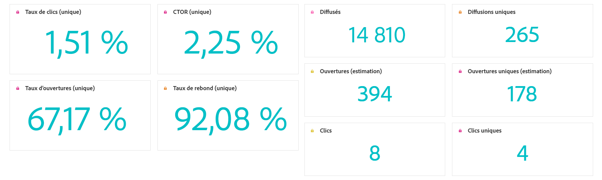

Les KPI des **[!UICONTROL e-mails]** fournissent un tableau de bord ciblé de mesures uniques et agrégées qui reflètent les performances et les niveaux d’engagement de vos campagnes par e-mail.

+++ En savoir plus sur les mesures des KPI relatifs aux e-mails

* **[!UICONTROL Taux de clics uniques]** : pourcentage de profils uniques qui ont cliqué sur au moins un lien dans l’e-mail, par rapport au nombre d’e-mails diffusés uniques.

* **[!UICONTROL Taux de clics d’ouverture (CTOR)]** : pourcentage de profils ayant interagi avec le message.

* **[!UICONTROL Taux d’ouvertures uniques]** : pourcentage de profils uniques ayant ouvert l’e-mail au moins une fois, par rapport au nombre d’e-mails diffusés uniques.

* **[!UICONTROL Taux de rebond unique]** : pourcentage de profils uniques dont l’e-mail a fait l’objet d’un rebond au moins une fois, en fonction du nombre total d’envois uniques.

* **[!UICONTROL Diffusés]** : nombre d’e-mails envoyés avec succès, par rapport au nombre total de messages envoyés.

* **[!UICONTROL Diffusions uniques]** : nombre de profils uniques ayant reçu au moins un message.

* **[!UICONTROL Estimation des ouvertures]** : estimation du nombre total d’ouvertures d’e-mails, prenant en compte les ouvertures directes par les profils et les ouvertures automatisées déclenchées par les serveurs de messagerie. Cette mesure prend en compte les ouvertures déclenchées par les serveurs de messagerie à des fins d’analyse de la confidentialité ou de la sécurité en appliquant un taux d’ouverture calculé à partir des destinataires qui ont ouvert manuellement l’e-mail par rapport à ceux dont les e-mails n’ont été ouverts que par des serveurs de messagerie.

* **[!UICONTROL Estimation des ouvertures uniques]** : estimation du nombre de destinataires d’e-mails uniques qui ont probablement ouvert l’e-mail. Cette mesure vise à fournir un nombre plus précis d’engagements individuels déclenchés par des serveurs de messagerie pour l’analyse de la confidentialité ou de la sécurité en appliquant un taux d’ouverture unique calculé à partir des profils uniques qui ont ouvert manuellement l’e-mail par rapport à ceux dont les e-mails n’ont été ouverts que par des serveurs de messagerie.

* **[!UICONTROL Clics]** : nombre total de clics sur un lien du message, y compris les clics multiples par le même profil.

* **[!UICONTROL Clics uniques]** : nombre de profils uniques qui ont cliqué sur un contenu dans votre message.

+++

## Entonnoir de clics uniques

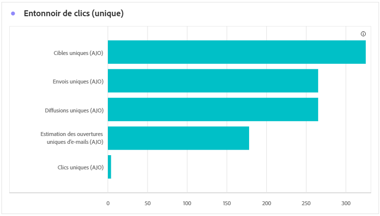

Le graphique **[!UICONTROL Entonnoir de clics]** fournit une analyse approfondie de l’engagement des profils avec le contenu de vos e-mails, offrant ainsi des informations précieuses sur chaque étape de l’interaction, depuis la diffusion jusqu’aux clics. Cela vous aide à comprendre l’efficacité de vos messages pour stimuler l’engagement client.

+++ En savoir plus sur les mesures de l’entonnoir des clics

* **[!UICONTROL Ciblés uniques]** : nombre de profils uniques qualifiés pour l’audience avant l’application des exclusions, des suppressions ou des suppressions de consentement.

* **[!UICONTROL Envois uniques]** : nombre de profils uniques pour lesquels au moins une tentative d’envoi d’e-mail a eu lieu.

* **[!UICONTROL Diffusions uniques]** : nombre de profils uniques ayant reçu au moins un message.

* **[!UICONTROL Estimation des ouvertures uniques]** : estimation du nombre de destinataires uniques des e-mails qui ont probablement ouvert l’e-mail. Cette mesure vise à fournir un nombre plus précis d’engagements individuels déclenchés par des serveurs de messagerie pour l’analyse de la confidentialité ou de la sécurité en appliquant un taux d’ouverture unique calculé à partir des profils uniques qui ont ouvert manuellement l’e-mail par rapport à ceux dont les e-mails n’ont été ouverts que par des serveurs de messagerie.

* **[!UICONTROL Clics uniques]** : nombre de profils uniques qui ont cliqué sur un contenu dans votre message.

+++

## Statut de diffusion unique

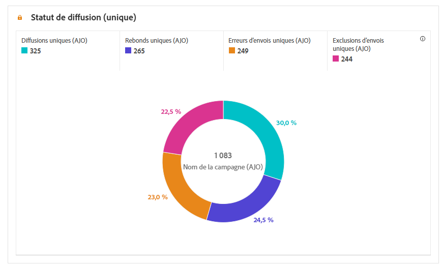

Le graphe **[!UICONTROL Statut de la diffusion]** fournit une vue complète des données liées aux e-mails envoyés dans votre campagne, fournissant des informations sur les mesures clés telles que les diffusions et les rebonds. Il propose une analyse détaillée du processus d’envoi des e-mails, fournissant des informations précieuses sur l’efficacité et les performances de vos campagnes.

+++ En savoir plus sur les mesures de statut de la diffusion

* **[!UICONTROL Erreurs d’envois uniques]** : nombre de profils uniques qui ont rencontré au moins une erreur d’envoi lors du processus sortant.

* **[!UICONTROL Diffusions uniques]** : nombre de profils uniques ayant reçu au moins un message.

* **[!UICONTROL Exclusions d’envois uniques]** : nombre de profils uniques exclus de la réception des messages en raison de règles ou de critères d’audience prédéfinis.

* **[!UICONTROL Rebonds uniques]** : nombre de profils uniques pour lesquels au moins un message a fait l’objet d’un rebond pendant le processus d’envoi.

+++

## Tendance des diffusions et clics {#delivered-click}

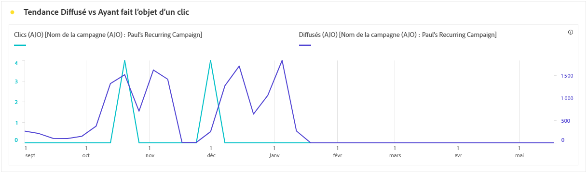

Le graphique **[!UICONTROL Tendance des diffusions et clics]** présente une analyse détaillée de l’engagement de vos profils avec vos e-mails, offrant des informations précieuses sur la manière dont les profils interagissent avec votre contenu. Le graphique utilise deux axes pour afficher les e-mails et les clics diffusés côte à côte, ce qui permet de repérer plus facilement les modèles inhabituels ou les changements d’engagement par rapport au nombre d’e-mails envoyés.

+++ En savoir plus sur les mesures de tendance Diffusés et clics

* **[!UICONTROL Diffusés]** : nombre d’e-mails envoyés avec succès, par rapport au nombre total d’e-mails envoyés.

* **[!UICONTROL Clics]** : nombre de clics sur un contenu dans vos e-mails.

+++

## Statistiques d’envois uniques {#unique-sending-statistics-email}

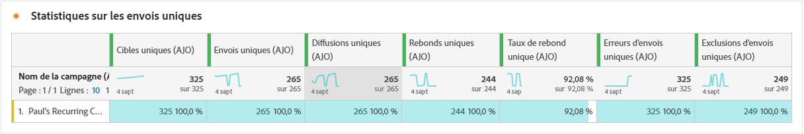

Le tableau **[!UICONTROL Statistiques d’envois uniques]** présente une vue d’ensemble détaillée des mesures de performances des e-mails uniques dans vos campagnes. Il se concentre sur les profils individuels, tels que ceux qui sont ciblés, reçoivent un envoi, font l’objet d’un rebond ou sont exclus de manière unique, ce qui permet d’obtenir des informations plus détaillées sur la manière dont vos e-mails atteignent votre audience et l’engagent.

+++ En savoir plus sur la mesure Statistiques d’envois uniques

* **[!UICONTROL Ciblés uniques]** : nombre de profils uniques qualifiés pour l’audience avant l’application des exclusions, des suppressions ou des suppressions de consentement.

* **[!UICONTROL Envois uniques]** : nombre de profils uniques pour lesquels au moins une tentative d’envoi d’e-mail a eu lieu.

* **[!UICONTROL Diffusions uniques]** : nombre de profils uniques ayant reçu au moins un e-mail.

* **[!UICONTROL Rebonds uniques]** : nombre de profils uniques pour lesquels au moins un e-mail a entraîné un rebond.

* **[!UICONTROL Taux de rebond unique]** : pourcentage de profils uniques dont l’e-mail a fait l’objet d’un rebond au moins une fois, en fonction du nombre total d’envois uniques.

* **[!UICONTROL Erreurs d’envoi unique]** : nombre de profils uniques ayant rencontré au moins une erreur d’envoi lors du processus sortant.

* **[!UICONTROL Exclusions d’envoi unique]** : nombre de profils uniques exclus de la réception des messages en raison de règles d’éligibilité, de la segmentation de l’audience ou du statut du profil.

+++

## Statistiques de tracking unique {#unique-tracking-statistics-email}

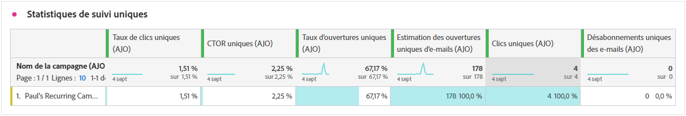

Le tableau **[!UICONTROL Statistiques de tracking unique]** fournit une vue ciblée de l’engagement au niveau du profil avec les e-mails de votre campagne. Il met en évidence des mesures uniques offrant des informations précieuses sur la manière dont les profils individuels interagissent avec le contenu de vos e-mails à travers les étapes clés de l’engagement.

+++ En savoir plus sur la mesure Statistiques de tracking

* **[!UICONTROL Taux de clic unique (CTR)]** : pourcentage de profils uniques qui ont cliqué sur au moins un lien dans l’e-mail, par rapport au nombre d’e-mails diffusés uniques.

* **[!UICONTROL Taux d’ouvertures de clics uniques (CTOR)]** : pourcentage de profils uniques qui ont cliqué sur un lien après l’ouverture de l’e-mail, en fonction des ouvertures uniques.

* **[!UICONTROL Taux d’ouvertures uniques]** : pourcentage de profils uniques ayant ouvert l’e-mail au moins une fois, par rapport au nombre d’e-mails diffusés uniques.

* **[!UICONTROL Clics uniques]** : nombre de profils uniques qui ont cliqué sur au moins un élément de contenu de l’e-mail.

* **[!UICONTROL Estimation des ouvertures uniques d’e-mails]** : estimation du nombre de destinataires uniques d’e-mails qui ont probablement ouvert l’e-mail. Cette mesure vise à fournir un nombre plus précis d’engagements individuels déclenchés par des serveurs de messagerie pour l’analyse de la confidentialité ou de la sécurité en appliquant un taux d’ouverture unique calculé à partir des profils uniques qui ont ouvert manuellement l’e-mail par rapport à ceux dont les e-mails n’ont été ouverts que par des serveurs de messagerie.

* **[!UICONTROL Désabonnements uniques des e-mails]** : nombre de profils uniques qui ont cliqué sur le lien de désabonnement dans vos e-mails ou sur la page de destination associée.

+++

## Statistiques d’envoi {#sending-statistics-email}

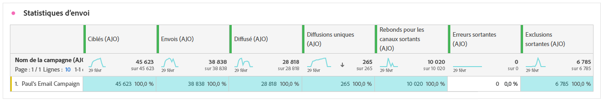

Le tableau **[!UICONTROL Statistiques d’envoi]** fournit un résumé complet des données essentielles concernant les e-mails dans vos campagnes. Il détaille les mesures clés, telles que les interactions avec vos e-mails et le nombre d’e-mails diffusés, ce qui vous permet d’obtenir des informations précieuses sur l’efficacité et la portée de vos e-mails et campagnes.

+++ En savoir plus sur les mesures de statistiques d’envoi

* **[!UICONTROL Ciblés]** : nombre de profils qui remplissent les critères de l’audience avant l’application des exclusions, des suppressions ou des suppressions de consentement. Dans les parcours dont la rentrée est activée, un profil peut être ciblé plusieurs fois.

* **[!UICONTROL Envois]** : nombre total d’e-mails envoyés.

* **[!UICONTROL Diffusions]** : nombre total d’e-mails envoyés avec succès, par rapport au nombre total de messages envoyés.

* **[!UICONTROL Rebonds]** : nombre total d’erreurs cumulées lors de la procédure d’envoi et du traitement automatique des retours par rapport au nombre total de messages envoyés.

* **[!UICONTROL Taux de rebond]** : pourcentage d’e-mails ayant entraîné un rebond, par rapport au nombre total d’e-mails envoyés.

* **[!UICONTROL Erreurs d’envoi]** : nombre total d’erreurs qui se sont produites au cours de la procédure d’envoi, empêchant le message d’être envoyé à des profils.

* **[!UICONTROL Exclusions d’envoi]** : nombre total de profils qui ont été exclus par Adobe Journey Optimizer.

+++

## Statistiques de tracking {#tracking-statistics-email}

Le tableau **[!UICONTROL E-mail - Statistiques de tracking]** offre un compte rendu détaillé de l’activité de profil associée aux e-mails inclus dans votre campagne. Cela inclut des mesures sur les ouvertures, les clics et d’autres indicateurs d’engagement pertinents, offrant une vue d’ensemble complète de la manière dont les profils interagissent avec le contenu de vos e-mails.

+++ En savoir plus sur la mesure Statistiques de tracking

* **[!UICONTROL Taux de clics (CTR)]** : pourcentage d’utilisateurs et d’utilisatrices ayant interagi avec l’e-mail.

* **[!UICONTROL Taux d’ouverture par clic (CTOR)]** : nombre de fois où l’e-mail a été ouvert.

* **[!UICONTROL Estimation des ouvertures d’e-mail]** : estimation du nombre total d’ouvertures d’e-mail, prenant en compte les ouvertures directes par les profils et les ouvertures automatisées déclenchées par les serveurs de messagerie. Cette mesure prend en compte les ouvertures déclenchées par les serveurs de messagerie à des fins d’analyse de la confidentialité ou de la sécurité en appliquant un taux d’ouverture calculé à partir des destinataires qui ont ouvert manuellement l’e-mail par rapport à ceux dont les e-mails n’ont été ouverts que par des serveurs de messagerie.

* **[!UICONTROL Clics]** : nombre de clics sur un contenu dans vos e-mails.

* **[!UICONTROL Plaintes relatives aux spams]** : nombre de fois où un message a été déclaré comme spam ou courrier indésirable.

* **[!UICONTROL Désabonnements]** : nombre de clics sur le lien de désabonnement ou sur la page de destination associée.

+++

## Domaines d’e-mails {#email-domains}

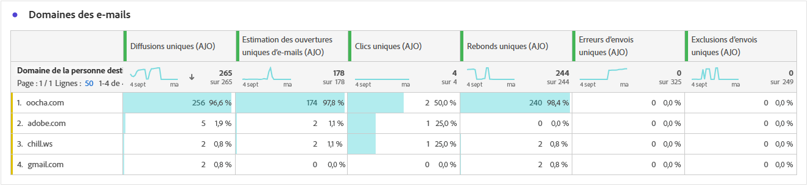

Le tableau **[!UICONTROL Domaines d’e-mails]** propose une répartition détaillée des e-mails classés par domaine, fournissant des informations détaillées sur les mesures de performances de vos campagnes par e-mail. Cette analyse exhaustive vous permet de comprendre le comportement de différents domaines en réponse au contenu de vos e-mails.

+++ En savoir plus sur les mesures des domaines d’e-mails

* **[!UICONTROL Diffusions uniques]** : nombre de profils uniques ayant reçu au moins un e-mail.

* **[!UICONTROL Estimation des ouvertures d’e-mail]** : estimation du nombre total d’ouvertures d’e-mails, prenant en compte les ouvertures directes par les profils et les ouvertures automatisées déclenchées par les serveurs de messagerie. Cette mesure prend en compte les ouvertures déclenchées par les serveurs de messagerie à des fins d’analyse de la confidentialité ou de la sécurité en appliquant un taux d’ouverture calculé à partir des destinataires qui ont ouvert manuellement l’e-mail par rapport à ceux dont les e-mails n’ont été ouverts que par des serveurs de messagerie.

* **[!UICONTROL Clics uniques]** : nombre de profils uniques ayant cliqué sur au moins un élément de contenu de l’e-mail.

* **[!UICONTROL Rebonds uniques]** : nombre de profils uniques pour lesquels au moins un e-mail a entraîné un rebond.

* **[!UICONTROL Erreurs d’envoi unique]** : nombre de profils uniques ayant rencontré au moins une erreur d’envoi lors du processus sortant.

* **[!UICONTROL Exclusions d’envois uniques]** : nombre de profils uniques exclus de la réception des messages en raison de règles d’éligibilité, de la segmentation de l’audience ou du statut de profil.

+++

## Libellés des liens de suivi {#track-link-label}

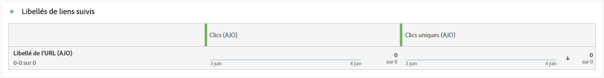

Le tableau **[!UICONTROL Libellés des liens de suivi]** fournit une vue d’ensemble complète des libellés des liens dans vos e-mails qui attirent le plus de visiteurs et de visiteuses. Cette fonctionnalité vous permet d’identifier et de hiérarchiser les liens les plus populaires.

+++ En savoir plus sur les mesures des libellés des liens de suivi

* **[!UICONTROL Clics uniques]** : nombre de profils qui ont cliqué sur un contenu dans un e-mail.

* **[!UICONTROL Clics]** : nombre de clics sur un contenu dans vos e-mails.

+++

## URL des liens de suivi {#track-link-url}

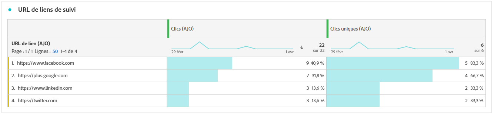

Le tableau **[!UICONTROL URL des liens de suivi]** fournit une vue d’ensemble complète des URL de votre e-mail qui attirent le plus de visiteurs et de visiteuses. Cela vous permet d’identifier et de hiérarchiser les liens les plus populaires, ce qui améliore votre compréhension de l’engagement des profils avec du contenu spécifique dans vos e-mails.

+++ En savoir plus sur les mesures des URL des liens de suivi

* **[!UICONTROL Clics uniques]** : nombre de profils qui ont cliqué sur un contenu dans un e-mail.

* **[!UICONTROL Clics]** : nombre de clics sur un contenu dans vos e-mails.

+++

## Objets des e-mails {#email-subjects}

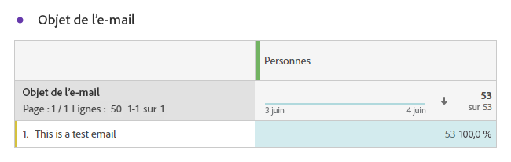

Le tableau **[!UICONTROL Objets des e-mails]** présente une vue d’ensemble complète des objets des e-mails qui ont attiré le plus de visiteurs et visiteuses. Cette ressource offre des informations précieuses sur la dynamique d’engagement des audiences.

+++ En savoir plus sur les mesures des objets des e-mails

* **[!UICONTROL Taux d’ouverture unique]** : pourcentage de profils uniques ayant ouvert l’e-mail au moins une fois, par rapport au nombre d’e-mails diffusés uniques.

* **[!UICONTROL Estimation des ouvertures uniques d’e-mails]** : estimation du nombre de destinataires uniques d’e-mails qui ont probablement ouvert l’e-mail. Cette mesure vise à fournir un nombre plus précis d’engagements individuels déclenchés par des serveurs de messagerie pour l’analyse de la confidentialité ou de la sécurité en appliquant un taux d’ouverture unique calculé à partir des profils uniques qui ont ouvert manuellement l’e-mail par rapport à ceux dont les e-mails n’ont été ouverts que par des serveurs de messagerie.

* **[!UICONTROL Taux d’ouvertures]** : pourcentage d’ouvertures d’e-mails par rapport au nombre total d’e-mails diffusés, y compris les ouvertures multiples par le même profil.

* **[!UICONTROL Estimation des ouvertures d’e-mail]** : estimation du nombre total d’ouvertures d’e-mails qui prend en compte les ouvertures directes par les profils et les ouvertures automatisées déclenchées par les serveurs de messagerie. Cette mesure prend en compte les ouvertures déclenchées par les serveurs de messagerie à des fins d’analyse de la confidentialité ou de la sécurité en appliquant un taux d’ouverture calculé à partir des destinataires qui ont ouvert manuellement l’e-mail par rapport à ceux dont les e-mails n’ont été ouverts que par des serveurs de messagerie.

+++

## Causes d’exclusion {#excluded-reasons}

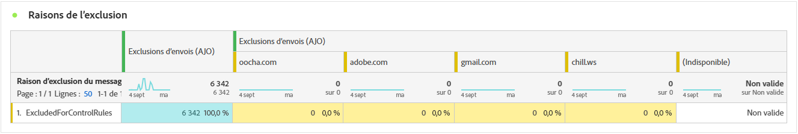

Le tableau **[!UICONTROL Causes d’exclusion]** présente une vue d’ensemble complète des différents facteurs qui ont abouti à l’exclusion des profils d’utilisateurs et d’utilisatrices de l’audience ciblée, entraînant la non-réception du message.

Consultez [cette page](exclusion-list.md) pour obtenir la liste complète des causes d’exclusion.

## Raisons de rebond {#bounce-reasons-email}

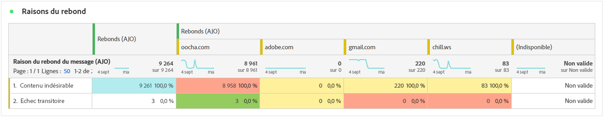

Le tableau **[!UICONTROL Raisons de rebond]** compile les données disponibles relatives aux rebonds de messages, fournissant des informations détaillées sur les raisons spécifiques des rebonds d’e-mails.

Pour plus d’informations sur les rebonds, consultez la page [Liste de suppression](../reports/suppression-list.md).

## Raisons des erreurs {#error-reasons-email}

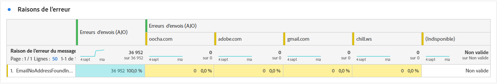

Le tableau **[!UICONTROL Causes d’erreur]** offre une visibilité des erreurs spécifiques survenues pendant le processus d’envoi, fournissant des informations précieuses sur la nature et l’occurrence des erreurs.
