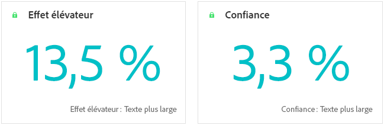
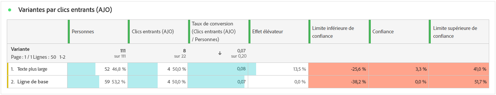
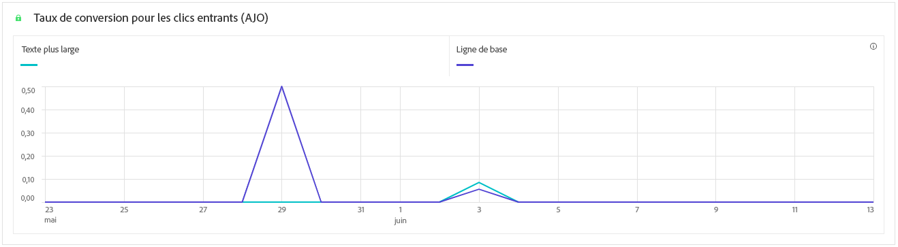

# Rapport de campagne d’expérimentation {#campaign-global-report-cja-experimentation}

>[!CONTEXTUALHELP]
>id="ajo_campaigns_content_experiment_click"
>title="Mesure de succès"
>abstract="Valeur totale de la mesure de succès, précédemment sélectionnée lors de la création de vos expériences, divisée par le nombre de profils."

## Expérimentation {#experimentation}

L’onglet **[!UICONTROL Expérimentation]** fournit des informations clés sur les performances de chaque variante et identifie la variante la plus réussie.

Notez que la définition de la meilleure performance peut prendre un certain temps. Si votre expérience échoue, elle est définie sur **Non concluant**.

### KPI d’expérimentation {#experimentation-kpis}

Les indicateurs clés de performance (KPI) d’**[!UICONTROL expérimentation]** fonctionnent comme un tableau de bord global, fournissant une analyse des mesures essentielles associées à votre expérimentation.

+++ En savoir plus sur les mesures des KPI d’expérimentation

* **[!UICONTROL Effet élévateur]** : mesure de l’amélioration en pourcentage du taux de conversion d’un traitement donné par rapport à la ligne de base.

* **[!UICONTROL Confiance]** : preuves qu’un traitement donné est le même que le traitement de la ligne de base. [En savoir plus](../content-management/experiment-calculations.md#adobes-statistical-methodology-any-time-valid-confidence-sequences)

+++

### Variante par mesure de succès {#variant-inbound}

Le tableau **Variante par mesure de succès** indique les performances de chaque variante en fonction de la mesure de succès sélectionnée lors de la configuration de l’expérience.
Pour un examen approfondi de ces résultats et de leur interprétation, reportez-vous à [cette page](../content-management/get-started-experiment.md#interpret-results).

+++ En savoir plus sur le tableau Variante par mesure de succès

* **[!UICONTROL Personnes]** : nombre de profils d’utilisateurs et d’utilisatrices identifiés comme cibles de vos messages.

* **[!UICONTROL Clics entrants]** : valeur totale de la mesure de succès, précédemment sélectionnée lors de la création de vos expériences.

* **[!UICONTROL Taux de conversion]** : valeur totale de la mesure de succès, précédemment sélectionnée lors de la création de vos expériences, divisée par le nombre de profils.

* **[!UICONTROL Effet élévateur]** : mesure de l’amélioration en pourcentage du taux de conversion d’un traitement donné par rapport à la ligne de base.

* **[!UICONTROL Limite inférieure de confiance]** : valeur estimée la plus basse de la différence de taux de conversion entre le traitement et la référence, dans l’intervalle de confiance choisi.

* **[!UICONTROL Confiance]** : preuves qu’un traitement donné est le même que le traitement de la ligne de base. [En savoir plus](../content-management/experiment-calculations.md#adobes-statistical-methodology-any-time-valid-confidence-sequences)

* **[!UICONTROL Limite supérieure de confiance]** : valeur estimée la plus élevée de la différence de taux de conversion entre le traitement et la référence, dans l’intervalle de confiance choisi.

+++

### Taux de conversion de la mesure de succès {#conversion-rate}

Le graphique **[!UICONTROL Intervalle de confiance]** indique la plage d’amélioration possible, en comparant la référence au traitement le plus performant pour la mesure de succès choisie. [En savoir plus](../content-management/experiment-calculations.md#adobes-statistical-methodology-any-time-valid-confidence-sequences).