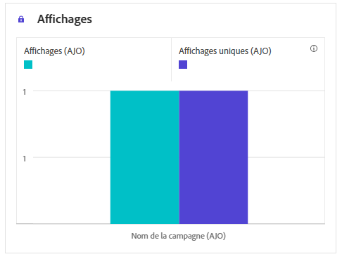
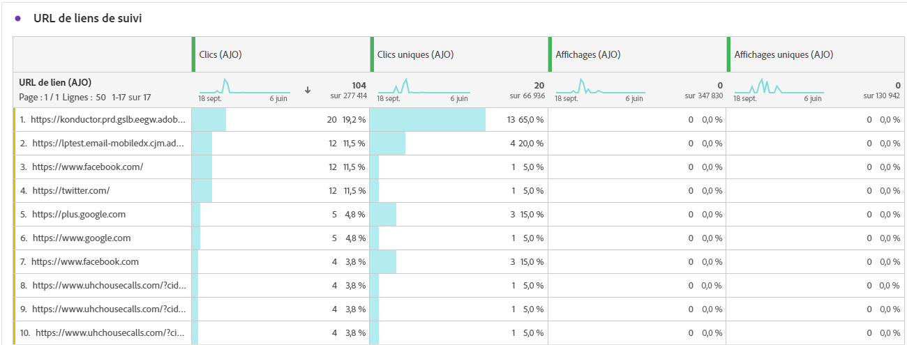

# Rapport de campagne in-app {#campaign-global-report-cja-inapp}

>[!IMPORTANT]
>
>Avant de pouvoir créer des rapports sur vos campagnes et parcours in-app, veillez à respecter les conditions préalables de création de rapports fournies sur [cette page](../in-app/inapp-configuration.md#experiment-prerequisites).

>[!BEGINSHADEBOX]

Vous pouvez accéder à votre rapport de campagne in-app en cliquant sur le bouton **[!UICONTROL Rapports]** de votre campagne, puis en sélectionnant **[!UICONTROL Afficher le rapport de toutes les périodes]**. [En savoir plus](report-gs-cja.md)

>[!ENDSHADEBOX]

## Tendance des affichages et des clics {#impression-click-trend}

Le graphique **[!UICONTROL Tendance des impressions et des clics]** présente une analyse détaillée de l’engagement de vos profils avec vos messages in-app, offrant des informations précieuses sur la manière dont les profils interagissent avec votre contenu.

+++ En savoir plus sur les mesures de tendance des impressions et des clics

* **[!UICONTROL Clics]** : nombre de fois où l’utilisateur ou l’utilisatrice a interagi avec les messages in-app.

* **[!UICONTROL Affichages]** : nombre de fois où le message in-app a été affiché pour l’utilisateur ou l’utilisatrice.

+++

## Clics {#clicks-inapp}

Le graphe **[!UICONTROL Clics]** affiche les mesures des clics in-app, qui illustrent à la fois le nombre total de clics sur le contenu et le nombre de profils uniques ayant cliqué sur le contenu.

+++ En savoir plus sur les mesures de clics

* **[!UICONTROL Clics uniques]** : nombre de profils qui ont cliqué sur un contenu dans vos messages in-app.

* **[!UICONTROL Clics]** : nombre de fois où l’utilisateur ou l’utilisatrice a interagi avec les messages in-app.

+++

## Affichage {#display-inapp}

Le graphe **[!UICONTROL Affichages]** vous permet de comprendre à la fois la portée globale du message et le nombre de profils uniques qui interagissent avec lui.

+++ En savoir plus sur les mesures d’affichage

* **[!UICONTROL Affichages]** : nombre de fois où le message in-app a été affiché pour l’utilisateur ou l’utilisatrice.

* **[!UICONTROL Affichages uniques]** : nombre dʼouvertures du message, les multiples interactions dʼun même profil ne sont pas prises en compte.

+++

## Données de suivi {#tracking-data-inapp}

Le tableau **[!UICONTROL Données de suivi]** offre un instantané détaillé de l’activité de profil liée à vos messages in-app, fournissant des informations essentielles sur l’engagement et l’efficacité des messages in-app.

+++ En savoir plus sur les mesures de données de tracking

* **[!UICONTROL Personnes]** : nombre de profils d’utilisateurs et d’utilisatrices qui sont qualifiés en tant que profils cibles pour vos messages in-app.

* **[!UICONTROL Taux de clics (CTR)]** : pourcentage d’utilisateurs et d’utilisatrices ayant interagi avec les messages in-app.

* **[!UICONTROL Taux d’ouverture des clics (CTOR)]** : nombre d’ouvertures des messages in-app.

* **[!UICONTROL Clics]** : nombre de fois où l’utilisateur ou l’utilisatrice a interagi avec les messages in-app.

* **[!UICONTROL Clics uniques]** : nombre de profils qui ont cliqué sur un contenu dans vos messages in-app.

* **[!UICONTROL Affichages]** : nombre de fois où le message in-app a été affiché pour l’utilisateur ou l’utilisatrice.

* **[!UICONTROL Affichages uniques]** : nombre dʼouvertures du message, les multiples interactions dʼun même profil ne sont pas prises en compte.

* **[!UICONTROL Envois]** : nombre de fois où l’application a demandé la campagne in-app. Plusieurs requêtes par session d’utilisateur ou d’utilisatrice (par exemple, au lancement ou au rechargement) peuvent entraîner le dépassement du nombre d’utilisateurs et d’utilisatrices uniques si les données de la campagne ne sont pas mises en cache.

* **[!UICONTROL Entrant déclenché]** : nombre de fois où l’application a considéré l’affichage du message in-app. Ce nombre peut être inférieur au nombre total d’envois si des règles côté application ont empêché l’affichage du message.

* **[!UICONTROL Entrants ignorés]** : nombre de fois où les utilisateurs et utilisatrices ont ignoré le message in-app sans interagir avec celui-ci.

+++

## Libellés des liens de suivi {#track-link-label-inapp}

Le tableau **[!UICONTROL Libellés des liens de suivi]** fournit une vue d’ensemble complète des libellés des liens dans vos messages in-app qui attirent le plus de visiteurs et de visiteuses. Cette fonctionnalité vous permet d’identifier et de hiérarchiser les liens les plus populaires.

+++ En savoir plus sur les mesures des libellés des liens de suivi

* **[!UICONTROL Clics uniques]** : nombre de profils qui ont cliqué sur un contenu dans vos messages in-app.

* **[!UICONTROL Clics]** : nombre de fois où l’utilisateur ou l’utilisatrice a interagi avec les messages in-app.

* **[!UICONTROL Affichages]** : nombre de fois où le message in-app a été affiché pour l’utilisateur ou l’utilisatrice.

* **[!UICONTROL Affichages uniques]** : nombre dʼouvertures du message, les multiples interactions dʼun même profil ne sont pas prises en compte.

+++

## URL des liens de suivi {#track-link-url-inapp}

Le tableau **[!UICONTROL URL des liens de suivi]** fournit une vue d’ensemble complète des URL de vos messages in-app qui attirent le plus de visiteurs et de visiteuses. Cela vous aide à détecter les liens les plus populaires et à les hiérarchiser, améliorant ainsi votre compréhension de l’engagement des profils avec un contenu spécifique dans vos messages in-app.

+++ En savoir plus sur les mesures des URL des liens de suivi

* **[!UICONTROL Clics uniques]** : nombre de profils qui ont cliqué sur un contenu dans vos messages in-app.

* **[!UICONTROL Clics]** : nombre de fois où l’utilisateur ou l’utilisatrice a interagi avec les messages in-app.

+++
