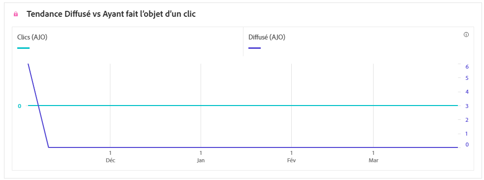
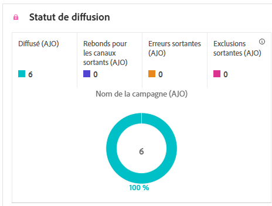

# Rapport de campagne par SMS {#campaign-global-report-cja-sms}

>[!BEGINSHADEBOX]

**Sur cette page :** découvrez comment lire le rapport de campagne par SMS dans Adobe Journey Optimizer pour analyser les tendances de diffusion et les clics, l’état de la diffusion, les liens suivis, les messages entrants, ainsi que les raisons de bounces, d’erreurs et d’exclusions de vos SMS.

>[!ENDSHADEBOX]

>[!BEGINSHADEBOX]

Vous pouvez accéder au rapport de campagne par SMS en cliquant sur le bouton **[!UICONTROL Rapports]** de votre campagne, puis en sélectionnant **[!UICONTROL Afficher le rapport de toutes les périodes]**. [En savoir plus](report-gs-cja.md)

>[!ENDSHADEBOX]

## Tendance diffusés et clics {#delivered-click-sms}

Le graphe **[!UICONTROL Tendance diffusés et clics]** présente une analyse détaillée de l’engagement de vos profils avec vos e-mails, fournissant des informations précieuses sur la manière dont les profils interagissent avec votre contenu.

+++ En savoir plus sur les mesures de tendance Diffusés et clics

* **[!UICONTROL Diffusés]** : nombre de messages SMS envoyés avec succès, par rapport au nombre total de SMS envoyés.

* **[!UICONTROL Clics]** : nombre de fois où un contenu a fait l’objet d’un clic dans vos SMS.

+++

## Statut de la diffusion {#delivery-status-sms}

Le tableau **[!UICONTROL Statut de diffusion]** offre un compte-rendu détaillé de l’activité du profil associée à vos campagnes par SMS. Cela inclut des mesures sur les diffusions, les clics et d’autres indicateurs d’engagement pertinents, offrant une vue d’ensemble complète de la manière dont les profils interagissent avec le contenu de vos SMS.

+++ En savoir plus sur les mesures de statut de la diffusion

* **[!UICONTROL Diffusés]** : nombre de messages SMS envoyés avec succès, par rapport au nombre total de SMS envoyés.

* **[!UICONTROL Bounces]** : nombre total d&#39;erreurs cumulées lors du processus d&#39;envoi et du traitement automatique des retours par rapport au nombre total de SMS envoyés.

* **[!UICONTROL Erreurs d’envoi]** : nombre total d’erreurs qui se sont produites, l’empêchant d’être envoyée aux profils.

* **[!UICONTROL Exclusions d’envois]** : nombre de profils qui ont été exclus par Adobe Journey Optimizer.

+++

## Vue d’ensemble de la campagne {#campaign-global}

Le tableau **[!UICONTROL Présentation de la campagne]** sert de tableau de bord pour les performances des SMS dans votre campagne. Il résume les profils ciblés, les mesures de clics publicitaires et publicitaires (y compris les clics estimés qui excluent le trafic d’interactions non humaines et robots) et les résultats de la diffusion tels que les bounces, les erreurs d’envoi et les exclusions.

+++ En savoir plus sur les mesures de vue d’ensemble de campagne

* **[!UICONTROL Personnes]** : nombre de profils d’utilisateurs et d’utilisatrices identifiés comme cibles de vos messages.

* **[!UICONTROL Taux de clics]** : pourcentage d’utilisateurs et d’utilisatrices ayant interagi avec le message.

* **[!UICONTROL Clics]** : nombre de clics sur un contenu de votre message.

* **[!UICONTROL Clics uniques]** : nombre de profils uniques qui ont cliqué sur au moins un élément de contenu du message mobile.

* **[!UICONTROL Estimation des clics]** : nombre de clics sur un contenu de votre message, à l’exclusion du trafic de robots identifiés et des interactions non humaines (NHI).

* **[!UICONTROL Diffusés]** : nombre d’e-mails envoyés avec succès, par rapport au nombre total de messages envoyés.

* **[!UICONTROL Bounces]** : nombre total d&#39;erreurs cumulées lors du processus d&#39;envoi et du traitement automatique des retours par rapport au nombre total de messages envoyés.

* **[!UICONTROL Erreurs d’envoi]** : nombre total d’erreurs survenues pendant le processus d’envoi, l’empêchant d’être envoyée à des profils.

* **[!UICONTROL Exclure des envois]** : nombre de profils qui ont été exclus par Adobe Journey Optimizer. [En savoir plus sur la comptabilisation des exclusions](exclusion-list.md#exclusion-list).

+++

## Libellés suivis {#track-label-sms}

Le tableau **[!UICONTROL Libellés suivis]** offre une vue d’ensemble complète des libellés des liens dans vos SMS, en mettant en évidence ceux qui génèrent le trafic de visiteurs le plus élevé. Cette fonctionnalité vous permet d’identifier et de hiérarchiser les liens les plus populaires.

+++ En savoir plus sur les mesures des libellés des liens de suivi

* **[!UICONTROL Clics]** : nombre de fois où un contenu a fait l’objet d’un clic dans vos SMS.

* **[!UICONTROL Estimation des clics]** : nombre de clics sur un contenu de votre message, à l’exclusion du trafic de robots identifiés et des interactions non humaines (NHI).

* **[!UICONTROL Clics uniques]** : nombre de profils uniques qui ont cliqué sur au moins un élément de contenu du message mobile.

+++

## URL des liens de suivi {#track-link-url-sms}

Le tableau **[!UICONTROL URL des liens de suivi]** fournit une vue d’ensemble complète des URL de vos SMS qui attirent le plus de visiteurs et de visiteuses. Cela vous permet d’identifier et de hiérarchiser les liens les plus populaires, ce qui améliore votre compréhension de l’engagement des profils avec du contenu spécifique dans vos SMS.

+++ En savoir plus sur les mesures des URL des liens de suivi

* **[!UICONTROL Clics]** : nombre de fois où un contenu a fait l’objet d’un clic dans vos SMS.

* **[!UICONTROL Estimation des clics]** : nombre de clics sur un contenu de votre message, à l’exclusion du trafic de robots identifiés et des interactions non humaines (NHI).

* **[!UICONTROL Clics uniques]** : nombre de profils uniques qui ont cliqué sur au moins un élément de contenu du message mobile.

* **[!UICONTROL Affichages]** : nombre d’ouvertures du message.

* **[!UICONTROL Affichages uniques]** : nombre dʼouvertures du message, les multiples interactions dʼun même profil ne sont pas prises en compte.

+++

## SMS entrant {#sms-inbound}

Le tableau **[!UICONTROL SMS entrants]** fournit une vue d’ensemble complète des SMS qui ont attiré le plus de visiteurs et de visiteuses. Cette ressource offre des informations précieuses sur la dynamique d’engagement des audiences.

+++ En savoir plus sur les mesures de SMS entrant

* **[!UICONTROL Personnes]** : nombre de profils d’utilisateurs et d’utilisatrices qui sont qualifiés en tant que profils cibles pour vos SMS.

+++

## Type de SMS {#sms-message-type}

Le tableau **[!UICONTROL Type de SMS]** présente une vue d’ensemble détaillée des types de SMS qui ont attiré le plus de visiteurs et visiteuses. Cette ressource offre des informations précieuses sur la dynamique d’engagement des audiences.

+++ En savoir plus sur les mesures de type de SMS

* **[!UICONTROL Personnes]** : nombre de profils d’utilisateurs et d’utilisatrices qui sont qualifiés en tant que profils cibles pour vos SMS.

+++

## Fournisseurs de SMS {#sms-providers}

Le tableau **[!UICONTROL Fournisseurs de SMS]** fournit une vue d’ensemble complète des fournisseurs de SMS qui ont attiré le plus de visiteurs et de visiteuses. Cette ressource offre des informations précieuses sur la dynamique d’engagement des audiences.

+++ En savoir plus sur les mesures des fournisseurs de SMS

* **[!UICONTROL Personnes]** : nombre de profils d’utilisateurs et d’utilisatrices qui sont qualifiés en tant que profils cibles pour vos SMS.

+++

## Raisons de rebond {#bounce-reasons-sms}

Le tableau **[!UICONTROL Causes des rebonds]** fournit une vue d’ensemble complète des données relatives aux rebonds des SMS, fournissant des informations précieuses sur les causes précises des rebonds de messages SMS.

## Raisons des erreurs {#error-reasons-sms}

Le tableau **[!UICONTROL Raisons des erreurs]** offre une visibilité des erreurs spécifiques survenues pendant le processus d’envoi de vos SMS, fournissant une analyse minutieuse de tout problème rencontré.

## Causes d’exclusion {#excluded-reasons-sms}

Le tableau **[!UICONTROL Causes d’exclusion]** décrit visuellement les différents facteurs qui ont conduit à l’exclusion des profils d’utilisateurs et d’utilisatrices de l’audience ciblée, ce qui les empêche de recevoir vos SMS.

Consultez [cette page](exclusion-list.md) pour la liste complète des causes d’exclusion.
