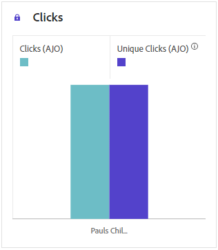
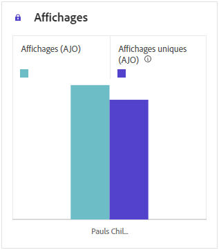
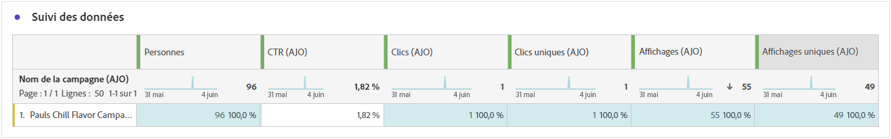

# Rapport de campagne web {#campaign-global-report-cja-web}

>[!BEGINSHADEBOX]

Pour accéder au rapport de campagne web, cliquez sur le bouton **[!UICONTROL Rapports]** de votre campagne, puis sélectionnez **[!UICONTROL Afficher le rapport à toute heure]**. [ En savoir plus ](report-gs-cja.md)

>[!ENDSHADEBOX]

## Tendance des impressions et des clics {#impressions-web}

Le graphique **[!UICONTROL Tendance des impressions et des clics]** présente une analyse détaillée de l’engagement de vos profils avec vos pages web, offrant des informations précieuses sur la manière dont les profils interagissent avec votre contenu.

+++ En savoir plus sur les mesures Tendance des impressions et des clics

* **[!UICONTROL Clics]** : nombre de clics sur un contenu de vos pages web.

* **[!UICONTROL Affichages]** : nombre d’ouvertures du message.

+++

## Clics {#clicks-web}

Le graphique **[!UICONTROL Clics]** affiche les mesures de clics sur les pages Web, illustrant à la fois le nombre total de clics sur le contenu et le nombre de profils uniques ayant cliqué sur le contenu.

+++ En savoir plus sur les mesures Clics

* **[!UICONTROL Clics uniques]** : nombre de profils ayant cliqué sur un contenu de vos pages web.

* **[!UICONTROL Clics]** : nombre de clics sur un contenu de vos pages web.

+++

## Affichages {#displays-web}

Le graphique **[!UICONTROL Affichages]** vous permet de comprendre à la fois la portée globale du message et le nombre de profils uniques qui l’interagissent.

+++ En savoir plus sur les mesures Affichage

* **[!UICONTROL Affichages]** : nombre d’ouvertures du message.

* **[!UICONTROL Affichages uniques]** : nombre d’ouvertures du message. Les interactions multiples d’un profil ne sont pas prises en compte.

+++

## Données de tracking {#track-data-web}

Le tableau **[!UICONTROL Données de tracking]** offre un instantané détaillé de l’activité des profils liée à vos pages web, ce qui fournit des informations essentielles sur l’engagement et l’efficacité des pages web.

+++ En savoir plus sur les mesures de données de tracking

* **[!UICONTROL Personnes]** : nombre de profils utilisateur qui remplissent les critères de profils cibles pour vos pages web.

* **[!UICONTROL Taux de clics (CTR)]** : pourcentage d’utilisateurs ayant interagi avec les pages web.

* **[!UICONTROL Clics]** : nombre de clics sur un contenu de vos pages web.

* **[!UICONTROL Clics uniques]** : nombre de profils ayant cliqué sur un contenu de vos pages web.

* **[!UICONTROL Affichages]** : nombre d’ouvertures de la page web.

* **[!UICONTROL Affichages uniques]** : nombre d’ouvertures de la page web. Les interactions multiples d’un profil ne sont pas prises en compte.

+++

## Libellés des liens suivis {#track-link-web}

Le tableau **[!UICONTROL Libellés des liens suivis]** offre un aperçu complet des libellés des liens dans vos pages web, en mettant en surbrillance ceux qui génèrent le trafic le plus élevé de visiteurs. Cette fonctionnalité vous permet d’identifier et de classer par priorité les liens les plus populaires.

+++ En savoir plus sur les mesures des libellés des liens suivis

* **[!UICONTROL Clics uniques]** : nombre de profils ayant cliqué sur un contenu de vos pages web.

* **[!UICONTROL Clics]** : nombre de clics sur un contenu de vos pages web.

* **[!UICONTROL Affichages]** : nombre d’ouvertures du message.

* **[!UICONTROL Affichages uniques]** : nombre d’ouvertures du message. Les interactions multiples d’un profil ne sont pas prises en compte.

+++

## URL des liens trackés {#track-url-web}

Le tableau **[!UICONTROL URL de lien suivi]** fournit un aperçu complet des URL de vos pages web qui attirent le trafic le plus élevé. Vous pouvez ainsi identifier et classer par priorité les liens les plus populaires, ce qui vous permet de mieux comprendre l’engagement des profils avec du contenu spécifique dans vos pages web.

+++ En savoir plus sur les mesures des URL de liens trackés

* **[!UICONTROL Clics uniques]** : nombre de profils ayant cliqué sur un contenu de vos pages web.

* **[!UICONTROL Clics]** : nombre de clics sur un contenu de vos pages web.

* **[!UICONTROL Affichages]** : nombre d’ouvertures du message.

* **[!UICONTROL Affichages uniques]** : nombre d’ouvertures du message. Les interactions multiples d’un profil ne sont pas prises en compte.

+++
