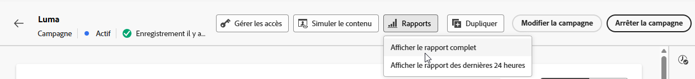

# Rapport de campagne {#campaign-global-report-cja}

>[!BEGINSHADEBOX]

Vous pouvez accéder au rapport de campagne en cliquant sur le bouton **[!UICONTROL Rapports]** de votre campagne, puis en sélectionnant **[!UICONTROL Afficher le rapport de toutes les périodes]**. [En savoir plus](report-gs-cja.md)

>[!ENDSHADEBOX]

## KPI de campagne {#campaign-kpis}

Les indicateurs clés de performances (KPI) **[!UICONTROL Campagne]** fonctionnent comme un tableau de bord global, fournissant une analyse des mesures essentielles associées à votre campagne. Cela inclut des détails tels que le nombre de clics et le nombre de messages diffusés, ce qui vous offre des informations complètes sur l’efficacité et le niveau d’engagement de votre campagne.

Les KPI varient en fonction des canaux utilisés dans votre campagne.

+++ En savoir plus sur les mesures des KPI de campagne

* **[!UICONTROL Taux de clics]** : pourcentage d’utilisateurs et d’utilisatrices ayant interagi avec le message.

* **[!UICONTROL Clics]** : nombre de clics sur un contenu de votre message.

* **[!UICONTROL Diffusés]** : nombre d’e-mails envoyés avec succès, par rapport au nombre total de messages envoyés.

* **[!UICONTROL Affichages]** : nombre de fois que le message a été ouvert.

+++

>[!AVAILABILITY]
>Les campagnes orchestrées ne prennent en charge que les canaux SMS, E-mail et Notification push. Les autres canaux (In-app, Web, Courrier, etc.) ne sont pas disponibles dans les campagnes orchestrées et n’apparaissent pas dans les rapports.

### Vue d’ensemble de la campagne {#delivery-global}

Le tableau **[!UICONTROL Vue d’ensemble de la campagne]** constitue un tableau de bord complet, qui propose une répartition détaillée des mesures clés liées à votre campagne. La section contient des informations essentielles telles que le nombre de profils et les actions diffusées, ce qui vous permet de bien comprendre les performances de votre campagne et l’engagement avec celle-ci.

Notez que les mesures varient en fonction des canaux utilisés dans votre campagne.

+++ En savoir plus sur les mesures de vue d’ensemble de campagne

* **[!UICONTROL Personnes]** : nombre de profils d’utilisateurs et d’utilisatrices identifiés comme cibles de vos messages.

* **[!UICONTROL Taux de clics]** : pourcentage d’utilisateurs et d’utilisatrices ayant interagi avec le message.

* **[!UICONTROL Clics]** : nombre de clics sur un contenu de votre message.

* **[!UICONTROL Clics uniques]** : nombre de profils qui ont cliqué sur un contenu dans votre message.

* **[!UICONTROL Diffusés]** : nombre d’e-mails envoyés avec succès, par rapport au nombre total de messages envoyés.

* **[!UICONTROL Rebonds pour les canaux sortants]** : nombre total d’erreurs cumulées lors de la procédure d’envoi et du traitement automatique des retours par rapport au nombre total de messages envoyés.

* **[!UICONTROL Erreurs sortantes]** : nombre total d’erreurs survenues au cours de la procédure d’envoi, empêchant le message d’être envoyé à des profils.

* **[!UICONTROL Exclusions sortantes]** : nombre de profils qui ont été exclus par Adobe Journey Optimizer. [En savoir plus sur la comptabilisation des exclusions](exclusion-list.md#exclusion-list).

* **[!UICONTROL Affichages]** : nombre d’ouvertures du message.

* **[!UICONTROL Affichages uniques]** : nombre de fois où le message a été ouvert, les interactions multiples d’un même profil ne sont pas prises en compte.

+++

### Entonnoir de résultats de la campagne {#campaign-funnel}

Le graphe **[!UICONTROL Entonnoir de résultats de la campagne]** présente une analyse détaillée de l’engagement de vos profils avec vos messages, fournissant des informations précieuses sur la manière dont différents profils ont interagi avec votre contenu.

+++ En savoir plus sur les mesures de l’entonnoir de résultats de la campagne

* **[!UICONTROL Diffusés]** : nombre d’e-mails envoyés avec succès, par rapport au nombre total de messages envoyés.

* **[!UICONTROL Clics]** : nombre de clics sur un contenu de votre message.
+++

### Libellé des liens de suivi {#campaign-track}

Le tableau **[!UICONTROL Libellé des liens de suivi]** offre des informations essentielles sur l’engagement de vos visiteurs et visiteuses avec les URL incluses dans vos messages, fournissant des informations précieuses sur les liens qui attirent le plus d’interactions.

+++ En savoir plus sur les mesures de libellés des liens de suivi

* **[!UICONTROL Clics uniques]** : nombre de profils qui ont cliqué sur un contenu dans votre message.

* **[!UICONTROL Clics]** : nombre de clics sur un contenu de votre message.

+++

## Vue d’ensemble du ciblage {#targeting}

Si vous configurez des **[!UICONTROL règles de ciblage]** pour votre contenu, le tableau **[!UICONTROL Vue d’ensemble du ciblage]** fournit une vue détaillée des mesures d’engagement clés, montrant comment les profils ciblés de chaque règle ont interagi avec votre contenu.

➡️ [En savoir plus sur les règles de ciblage](../content-management/optimization-targeting.md)

+++ En savoir plus sur les mesures du tableau Vue d’ensemble du ciblage

* **[!UICONTROL Personnes]** : nombre de profils d’utilisateurs et d’utilisatrices identifiés comme cibles de vos événements.

* **[!UICONTROL Clics uniques]** : nombre de profils qui ont cliqué sur un contenu dans un e-mail.

* **[!UICONTROL Taux de clics uniques]** : pourcentage de profils ciblés ayant cliqué au moins une fois.

+++
