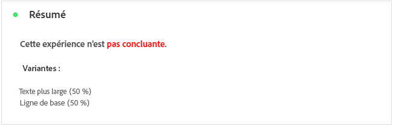
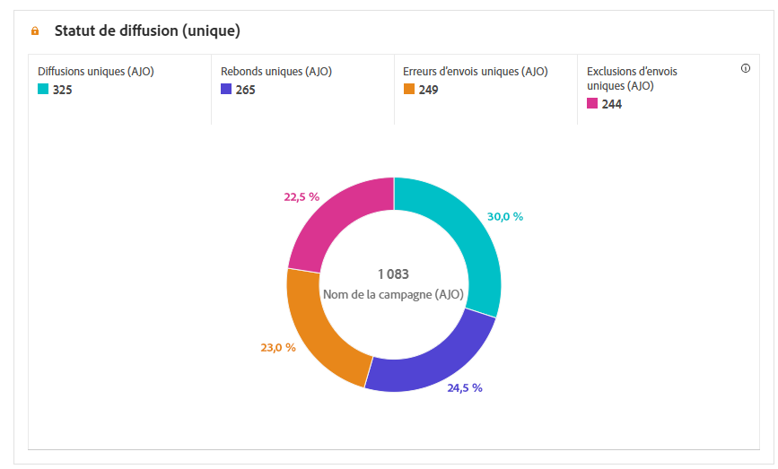
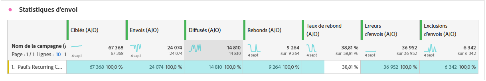
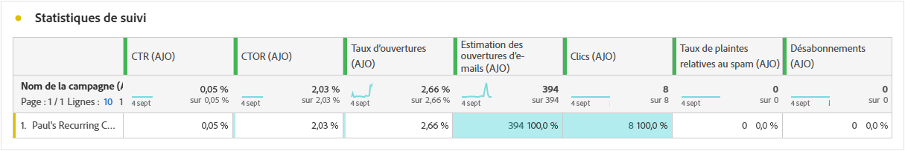
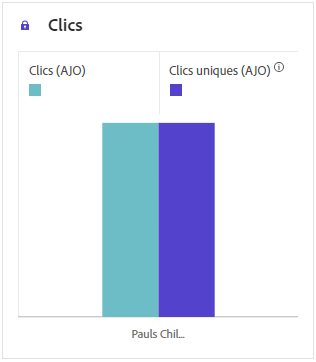
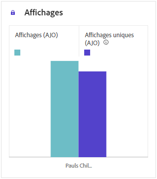

# Rapport de campagne {#campaign-global-report-cja}

Le **rapport de campagne** agit comme un tableau de bord complet qui fournit une analyse détaillée des mesures clés associées à votre campagne. Il comprend des données telles que le nombre de clics, les messages diffusés, les numéros de profil et les actions entreprises. En offrant un vue d’ensemble complète de l’efficacité et des niveaux d’engagement de votre campagne, le rapport vous permet d’avoir une compréhension complète des performances globales de votre campagne.

Vous pouvez accéder directement au rapport de campagne à partir de votre campagne à l’aide du bouton **[!UICONTROL Rapports]**.

La page **Rapport de campagne** s’affiche avec les onglets suivants en fonction du canal choisi :

* [Campagne](#campaign-global)
* [Expérimentation](#experimentation)
* [E-mail](#email-global)
* [SMS](#sms)
* [Notification push](#push-notification)
* [Courrier](#direct-mail)
* [Web](#web)

Pour en savoir plus sur Customer Journey Analytics Workspace et sur le filtrage et l’analyse des données, consultez [cette page](https://experienceleague.adobe.com/fr/docs/analytics-platform/using/cja-workspace/home).

## Campagne {#campaign-global}

### KPI de campagne {#campaign-kpis}

Les indicateurs clés de performances (KPI) **[!UICONTROL Campagne]** fonctionnent comme un tableau de bord global, fournissant une analyse des mesures essentielles associées à votre campagne. Cela inclut des détails tels que le nombre de clics et le nombre de messages diffusés, ce qui vous offre des informations complètes sur l’efficacité et le niveau d’engagement de votre campagne.

Les KPI varient en fonction des canaux utilisés dans votre campagne.

+++ En savoir plus sur les mesures des KPI de campagne

* **[!UICONTROL Taux de clics]** : pourcentage d’utilisateurs et d’utilisatrices ayant interagi avec le message.

* **[!UICONTROL Clics]** : nombre de clics sur un contenu de votre message.

* **[!UICONTROL Diffusés]** : nombre d’e-mails envoyés avec succès, par rapport au nombre total de messages envoyés.

* **[!UICONTROL Affichages]** : nombre de fois que le message a été ouvert.

+++

### Vue d’ensemble de la campagne {#delivery-global}

Le tableau **[!UICONTROL Vue d’ensemble de la campagne]** constitue un tableau de bord complet, qui propose une répartition détaillée des mesures clés liées à votre campagne. La section contient des informations essentielles telles que le nombre de profils et les actions diffusées, ce qui vous permet de bien comprendre les performances de votre campagne et l’engagement avec celle-ci.

Notez que les mesures varient en fonction des canaux utilisés dans votre campagne.

+++ En savoir plus sur les mesures de vue d’ensemble de campagne

* **[!UICONTROL Personnes]** : nombre de profils qui sont qualifiés en tant que profils cibles pour vos messages.

* **[!UICONTROL Taux de clics]** : pourcentage d’utilisateurs et d’utilisatrices ayant interagi avec le message.

* **[!UICONTROL Clics]** : nombre de clics sur un contenu de votre message.

* **[!UICONTROL Clics uniques]** : nombre de profils qui ont cliqué sur un contenu dans votre message.

* **[!UICONTROL Diffusés]** : nombre d’e-mails envoyés avec succès, par rapport au nombre total de messages envoyés.

* **[!UICONTROL Rebonds pour les canaux sortants]** : nombre total d’erreurs cumulées lors de la procédure d’envoi et du traitement automatique des retours par rapport au nombre total de messages envoyés.

* **[!UICONTROL Erreurs sortantes]** : nombre total d’erreurs survenues au cours de la procédure d’envoi, empêchant le message d’être envoyé à des profils.

* **[!UICONTROL Exclusions sortantes]** : nombre de profils qui ont été exclus par Adobe Journey Optimizer.

* **[!UICONTROL Affichages]** : nombre de fois que le message a été ouvert.

* **[!UICONTROL Affichages uniques]** : nombre de fois où le message a été ouvert, les interactions multiples d’un même profil ne sont pas prises en compte.

+++

### Entonnoir de résultats de la campagne {#campaign-funnel}

Le graphe **[!UICONTROL Entonnoir de résultats de la campagne]** présente une analyse détaillée de l’engagement de vos profils avec vos messages, fournissant des informations précieuses sur la manière dont différents profils ont interagi avec votre contenu.

+++ En savoir plus sur les mesures de l’entonnoir de résultats de la campagne

* **[!UICONTROL Diffusés]** : nombre d’e-mails envoyés avec succès, par rapport au nombre total de messages envoyés.

* **[!UICONTROL Clics]** : nombre de clics sur un contenu de votre message.
+++

### Libellé des liens de suivi {#campaign-track}

Le tableau **[!UICONTROL Libellé des liens de suivi]** offre des informations essentielles sur l’engagement de vos visiteurs et visiteuses avec les URL incluses dans vos messages, fournissant des informations précieuses sur les liens qui attirent le plus d’interactions.

+++ En savoir plus sur les mesures de libellés des liens de suivi

* **[!UICONTROL Clics uniques]** : nombre de profils qui ont cliqué sur un contenu dans votre message.

* **[!UICONTROL Clics]** : nombre de clics sur un contenu de votre message.

+++

## Expérimentation {#experimentation}

L’onglet **[!UICONTROL Expérimentation]** fournit des informations clés sur les performances de chaque variante et identifie la variante la plus réussie.

Notez que la définition de la meilleure performance peut prendre un certain temps. Si votre expérience échoue, elle est définie sur **Non concluant**.

### KPI d’expérimentation {#experimentation-kpis}

Les indicateurs clés de performance (KPI) d’**[!UICONTROL expérimentation]** fonctionnent comme un tableau de bord global, fournissant une analyse des mesures essentielles associées à votre expérimentation.

+++ En savoir plus sur les mesures des KPI d’expérimentation

* **[!UICONTROL Effet élévateur]** : mesure de l’amélioration en pourcentage du taux de conversion d’un traitement donné par rapport à la ligne de base.

* **[!UICONTROL Confiance]** : preuves qu’un traitement donné est le même que le traitement de la ligne de base. [En savoir plus](../content-management/experiment-calculations.md#understand-confidence)

+++

### Variante par clics entrants {#variant-inbound}

Le widget **[!UICONTROL Variante par clics entrants]** décrit les performances de chaque variante.
Pour un examen approfondi de ces résultats et de leur interprétation, reportez-vous à [cette page](../content-management/get-started-experiment.md#interpret-results).

+++ En savoir plus sur les mesures de variante par clics entrants

* **[!UICONTROL Personnes]** : nombre de profils qui sont qualifiés en tant que profils cibles pour vos messages.

* **[!UICONTROL Clics entrants]** : nombre total de clics sur les canaux sortants.

* **[!UICONTROL Taux de conversion]** : valeur totale de la mesure de succès, précédemment sélectionnée lors de la création de vos expériences, divisée par le nombre de profils.

* **[!UICONTROL Effet élévateur]** : mesure de l’amélioration en pourcentage du taux de conversion d’un traitement donné par rapport à la ligne de base.

* **[!UICONTROL Confiance]** : preuves qu’un traitement donné est le même que le traitement de la ligne de base. [En savoir plus](../content-management/experiment-calculations.md#understand-confidence)

<!--
* **[!UICONTROL Confidence Upper bound]**:

* **[!UICONTROL Confidence Lower bound]**:
-->
+++

### Taux de conversion des clics entrants {#conversion-rate}

Le graphe **[!UICONTROL Intervalle de confiance]** mesure l’incertitude quant à l’amélioration. Il indique la différence de performance en pourcentage entre la ligne de base et le traitement le plus performant. [En savoir plus](../content-management/experiment-calculations.md#confidence-intervals).

## E-mail {#email-global}

### Tendance diffusés et clics {#delivered-click}

Le graphe **[!UICONTROL Tendance diffusés et clics]** présente une analyse détaillée de l’engagement de vos profils avec vos e-mails, fournissant des informations précieuses sur la manière dont les profils interagissent avec votre contenu.

+++ En savoir plus sur les mesures de tendance diffusés et clics

* **[!UICONTROL Diffusés]** : nombre d’e-mails envoyés avec succès, par rapport au nombre total d’e-mails envoyés.

* **[!UICONTROL Clics]** : nombre de clics sur un contenu dans vos e-mails.

+++

### Statut de la diffusion {#delivery-status}

Le graphe **[!UICONTROL Statut de la diffusion]** fournit une vue complète des données liées aux e-mails envoyés dans votre campagne, fournissant des informations sur les mesures clés telles que les diffusions et les rebonds. Il propose une analyse détaillée du processus d’envoi des e-mails, fournissant des informations précieuses sur l’efficacité et les performances de vos campagnes.

+++ En savoir plus sur les mesures de statut de la diffusion.

* **[!UICONTROL Diffusés]** : nombre d’e-mails envoyés avec succès, par rapport au nombre total d’e-mails envoyés.

* **[!UICONTROL Rebonds pour les canaux sortants]** : nombre total d’erreurs cumulées lors de la procédure d’envoi et du traitement automatique des retours par rapport au nombre total de messages envoyés.

* **[!UICONTROL Erreurs sortantes]** : nombre total d’erreurs survenues au cours de la procédure d’envoi, empêchant l’envoi du message à des profils.

* **[!UICONTROL Exclusions sortantes]** : nombre de profils qui ont été exclus par Adobe Journey Optimizer.

+++

### Statistiques d’envoi {#sending-statistics-email}

Le tableau **[!UICONTROL Statistiques d’envoi]** fournit un résumé complet des données essentielles concernant les e-mails dans vos campagnes. Il détaille les mesures clés, telles que les interactions avec vos e-mails et le nombre d’e-mails diffusés, ce qui vous permet d’obtenir des informations précieuses sur l’efficacité et la portée de vos e-mails et campagnes.

+++ En savoir plus sur les mesures de statistiques d’envoi

* **[!UICONTROL Personnes]** : nombre de profils d’utilisateurs et d’utilisatrices qui sont qualifiés en tant que profils cibles pour vos messages.

* **[!UICONTROL Ciblés]** : nombre total d’e-mails traités lors de la procédure d’envoi.

* **[!UICONTROL Envois]** : nombre total d’e-mails envoyés.

* **[!UICONTROL Diffusés]** : nombre d’e-mails envoyés avec succès, par rapport au nombre total de messages envoyés.

* **[!UICONTROL Rebonds pour les canaux sortants]** : nombre total d’erreurs cumulées lors de la procédure d’envoi et du traitement automatique des retours par rapport au nombre total de messages envoyés.

* **[!UICONTROL Erreurs sortantes]** : nombre total d’erreurs survenues au cours de la procédure d’envoi, empêchant le message d’être envoyé à des profils.

* **[!UICONTROL Exclusions sortantes]** : nombre de profils qui ont été exclus par Adobe Journey Optimizer.

+++

### Statistiques de tracking {#tracking-statistics-email}

Le tableau **[!UICONTROL E-mail - Statistiques de tracking]** offre un compte rendu détaillé de l’activité de profil associée aux e-mails inclus dans votre campagne. Cela inclut des mesures sur les ouvertures, les clics et d’autres indicateurs d’engagement pertinents, offrant une vue d’ensemble complète de la manière dont les profils interagissent avec le contenu de vos e-mails.

+++ En savoir plus sur les mesures des statistiques de tracking

* **[!UICONTROL Taux de clics (CTR)]** : pourcentage d’utilisateurs et d’utilisatrices ayant interagi avec l’e-mail.

* **[!UICONTROL Taux d’ouverture par clic (CTOR)]** : nombre de fois où l’e-mail a été ouvert.

* **[!UICONTROL Clics]** : nombre de clics sur un contenu dans vos e-mails.

* **[!UICONTROL Clics uniques]** : nombre de profils qui ont cliqué sur un contenu dans un e-mail.

* **[!UICONTROL Ouvertures d’e-mail]** : nombre d’ouvertures de vos e-mails dans une campagne.

* **[!UICONTROL Ouvertures uniques d’e-mail]** : pourcentage d’e-mails ouverts.

* **[!UICONTROL Plaintes relatives aux spams]** : nombre de fois où un message a été déclaré comme spam ou courrier indésirable.

* **[!UICONTROL Désabonnements]** : nombre de clics sur le lien de désabonnement.

+++

### Domaines d’e-mails {#email-domains}

Le tableau **[!UICONTROL Domaines d’e-mails]** propose une ventilation détaillée des e-mails classés par domaine, fournissant des informations détaillées sur les mesures de performances de vos campagnes par e-mail. Cette analyse exhaustive vous permet de comprendre le comportement de différents domaines en réponse au contenu de vos e-mails.

+++ En savoir plus sur les mesures des domaines d’e-mails

* **[!UICONTROL Envois]** : nombre total d’e-mails envoyés.

* **[!UICONTROL Diffusés]** : nombre d’e-mails envoyés avec succès, par rapport au nombre total d’e-mails envoyés.

* **[!UICONTROL Ouvertures d’e-mail]** : nombre d’ouvertures de vos e-mails dans une campagne.

* **[!UICONTROL Clics]** : nombre de clics sur un contenu dans vos e-mails.

* **[!UICONTROL Rebonds pour les canaux sortants]** : nombre total d’erreurs cumulées lors de la procédure d’envoi et du traitement automatique des retours par rapport au nombre total d’e-mails envoyés.

* **[!UICONTROL Erreurs sortantes]** : nombre total d’erreurs survenues au cours de la procédure d’envoi, empêchant l’envoi à des profils.
+++

### Libellés des liens de suivi {#track-link-label}

Le tableau **[!UICONTROL Libellés des liens de suivi]** fournit une vue d’ensemble complète des libellés des liens dans vos e-mails qui attirent le plus de visiteurs et de visiteuses. Cette fonctionnalité vous permet d’identifier et de hiérarchiser les liens les plus populaires.

+++ En savoir plus sur les mesures des libellés des liens de suivi

* **[!UICONTROL Clics uniques]** : nombre de profils qui ont cliqué sur un contenu dans un e-mail.

* **[!UICONTROL Clics]** : nombre de clics sur un contenu dans vos e-mails.

+++

### URL des liens de suivi {#track-link-url}

Le tableau **[!UICONTROL URL des liens de suivi]** fournit une vue d’ensemble complète des URL de votre e-mail qui attirent le plus de visiteurs et de visiteuses. Cela vous permet d’identifier et de hiérarchiser les liens les plus populaires, ce qui améliore votre compréhension de l’engagement des profils avec du contenu spécifique dans vos e-mails.

+++ En savoir plus sur les mesures des URL des liens de suivi

* **[!UICONTROL Clics uniques]** : nombre de profils qui ont cliqué sur un contenu dans un e-mail.

* **[!UICONTROL Clics]** : nombre de clics sur un contenu dans vos e-mails.

* **[!UICONTROL Affichages]** : nombre de fois où l’e-mail a été ouvert.

* **[!UICONTROL Affichages uniques]** : nombre de fois que l’e-mail a été ouvert, les interactions multiples d’un même profil ne sont pas prises en compte.

+++

### Objets des e-mails {#email-subjects}

Le tableau **[!UICONTROL Objets des e-mails]** présente une vue d’ensemble complète des objets des e-mails qui ont attiré le plus de visiteurs et visiteuses. Cette ressource offre des informations précieuses sur la dynamique d’engagement des audiences.

+++ En savoir plus sur les mesures des objets des e-mails

* **[!UICONTROL Personnes]** : nombre de profils qui sont qualifiés en tant que profils cibles pour vos e-mails.

+++

### Causes d’exclusion {#excluded-reasons}

Le tableau **[!UICONTROL Causes d’exclusion]** présente une vue d’ensemble complète des différents facteurs qui ont abouti à l’exclusion des profils d’utilisateurs et d’utilisatrices de l’audience ciblée, entraînant la non-réception du message.

Consultez [cette page](exclusion-list.md) pour obtenir la liste complète des causes d’exclusion.

### Raisons de rebond {#bounce-reasons-email}

Le tableau **[!UICONTROL Raisons de rebond]** compile les données disponibles relatives aux rebonds de messages, fournissant des informations détaillées sur les raisons spécifiques des rebonds d’e-mails.

Pour plus d’informations sur les rebonds, consultez la page [Liste de suppression](../reports/suppression-list.md).

### Raisons des erreurs {#error-reasons-email}

Le tableau **[!UICONTROL Raisons des erreurs]** offre une visibilité des erreurs spécifiques survenues pendant le processus d’envoi, ce qui permet d’obtenir des informations précieuses sur la nature et l’occurrence des erreurs.

## SMS {#sms}

### Tendance diffusés et clics {#delivered-click-sms}

Le graphe **[!UICONTROL Tendance diffusés et clics]** présente une analyse détaillée de l’engagement de vos profils avec vos e-mails, fournissant des informations précieuses sur la manière dont les profils interagissent avec votre contenu.

+++ En savoir plus sur les mesures de tendance diffusés et clics

* **[!UICONTROL Diffusés]** : nombre de messages SMS envoyés avec succès, par rapport au nombre total de SMS envoyés.

* **[!UICONTROL Clics]** : nombre de fois où un contenu a fait l’objet d’un clic dans vos SMS.

+++

### Statut de la diffusion {#delivery-status-sms}

Le tableau **[!UICONTROL Statut de diffusion]** offre un compte-rendu détaillé de l’activité du profil associée à vos campagnes par SMS. Cela inclut des mesures sur les diffusions, les clics et d’autres indicateurs d’engagement pertinents, offrant une vue d’ensemble complète de la manière dont les profils interagissent avec le contenu de vos SMS.

+++ En savoir plus sur les mesures de statut de la diffusion.

* **[!UICONTROL Diffusés]** : nombre de messages SMS envoyés avec succès, par rapport au nombre total de SMS envoyés.

* **[!UICONTROL Rebonds pour les canaux sortants]** : nombre total d’erreurs cumulées lors de la procédure d’envoi et du traitement automatique des retours par rapport au nombre total de SMS envoyés.

* **[!UICONTROL Erreurs sortantes]** : nombre total d’erreurs survenues empêchant l’envoi à des profils.

* **[!UICONTROL Exclusions sortantes]** : nombre de profils qui ont été exclus par Adobe Journey Optimizer.

+++

### Libellés des liens de suivi {#track-link-label-sms}

Le tableau **[!UICONTROL Libellés des liens de suivi]** fournit une vue d’ensemble complète des libellés des liens dans vos SMS qui attirent le plus de visiteurs et de visiteuses. Cette fonctionnalité vous permet d’identifier et de hiérarchiser les liens les plus populaires.

+++ En savoir plus sur les mesures des libellés des liens de suivi

* **[!UICONTROL Clics uniques]** : nombre de profils qui ont cliqué sur un contenu dans vos SMS.

* **[!UICONTROL Clics]** : nombre de fois où un contenu a fait l’objet d’un clic dans vos SMS.

+++

### URL des liens de suivi {#track-link-url-sms}

Le tableau **[!UICONTROL URL des liens de suivi]** fournit une vue d’ensemble complète des URL de vos SMS qui attirent le plus de visiteurs et de visiteuses. Cela vous permet d’identifier et de hiérarchiser les liens les plus populaires, ce qui améliore votre compréhension de l’engagement des profils avec du contenu spécifique dans vos SMS.

+++ En savoir plus sur les mesures des URL des liens de suivi

* **[!UICONTROL Clics uniques]** : nombre de profils qui ont cliqué sur un contenu dans vos SMS.

* **[!UICONTROL Clics]** : nombre de fois où un contenu a fait l’objet d’un clic dans vos SMS.

* **[!UICONTROL Affichages]** : nombre d’ouvertures du message.

* **[!UICONTROL Affichages uniques]** : nombre dʼouvertures du message, les multiples interactions dʼun même profil ne sont pas prises en compte.

+++

### SMS entrant {#sms-inbound}

Le tableau **[!UICONTROL SMS entrants]** fournit une vue d’ensemble complète des SMS qui ont attiré le plus de visiteurs et de visiteuses. Cette ressource offre des informations précieuses sur la dynamique d’engagement des audiences.

+++ En savoir plus sur les mesures de SMS entrant

* **[!UICONTROL Personnes]** : nombre de profils d’utilisateurs et d’utilisatrices qui sont qualifiés en tant que profils cibles pour vos SMS.

+++

### Type de SMS {#sms-message-type}

Le tableau **[!UICONTROL Type de SMS]** présente une vue d’ensemble détaillée des types de SMS qui ont attiré le plus de visiteurs et visiteuses. Cette ressource offre des informations précieuses sur la dynamique d’engagement des audiences.

+++ En savoir plus sur les mesures de type de SMS

* **[!UICONTROL Personnes]** : nombre de profils d’utilisateurs et d’utilisatrices qui sont qualifiés en tant que profils cibles pour vos SMS.

+++

### Fournisseurs de SMS {#sms-providers}

Le tableau **[!UICONTROL Fournisseurs de SMS]** fournit une vue d’ensemble complète des fournisseurs de SMS qui ont attiré le plus de visiteurs et de visiteuses. Cette ressource offre des informations précieuses sur la dynamique d’engagement des audiences.

+++ En savoir plus sur les mesures des fournisseurs de SMS

* **[!UICONTROL Personnes]** : nombre de profils d’utilisateurs et d’utilisatrices qui sont qualifiés en tant que profils cibles pour vos SMS.

+++

### Raisons de rebond {#bounce-reasons-sms}

Le tableau **[!UICONTROL Causes de rebonds]** fournit une vue d’ensemble complète des données relatives aux rebonds de SMS, fournissant des informations précieuses sur les raisons spécifiques à l’origine des rebonds des SMS.

### Raisons des erreurs {#error-reasons-sms}

Le tableau **[!UICONTROL Raisons des erreurs]** offre une visibilité des erreurs spécifiques survenues pendant le processus d’envoi de vos SMS, fournissant une analyse minutieuse de tout problème rencontré.

### Causes d’exclusion {#excluded-reasons-sms}

Le tableau **[!UICONTROL Causes d’exclusion]** décrit visuellement les différents facteurs qui ont conduit à l’exclusion des profils d’utilisateurs et d’utilisatrices de l’audience ciblée, ce qui les empêche de recevoir vos SMS.

Consultez [cette page](exclusion-list.md) pour la liste complète des causes d’exclusion.

## Notification push {#push-notification}

### Statistiques d’envoi {#sending-statistics-push}

Le tableau **[!UICONTROL Statistiques d’envoi]** fournit un résumé complet des données essentielles concernant vos campagnes par notification. Il détaille les mesures clés, telles que la taille de l’audience ciblée et le nombre de notifications push diffusées avec succès, ce qui vous permet d’obtenir des informations précieuses sur l’efficacité et la portée de votre notification push.

+++ En savoir plus sur les mesures de statistiques d’envoi

* **[!UICONTROL Personnes]** : nombre de profils qui sont qualifiés en tant que profils cibles pour les notifications push.

* **[!UICONTROL Ciblées]** : nombre total de notifications push traitées lors de l’analyse.

* **[!UICONTROL Envois]** : nombre total d’envois pour la notification push.

* **[!UICONTROL Diffusées]** : nombre de notifications push envoyées avec succès, par rapport au nombre total de notifications push envoyées.

* **[!UICONTROL Rebonds pour les canaux sortants]** : nombre total d’erreurs cumulées lors du processus d’envoi et du traitement automatique des retours par rapport au nombre total de notifications push envoyées.

* **[!UICONTROL Erreurs sortantes]** : nombre total d’erreurs survenues empêchant l’envoi à des profils.

* **[!UICONTROL Exclusions sortantes]** : nombre de profils qui ont été exclus par Adobe Journey Optimizer.

+++

### Statistiques de tracking {#tracking-statistics-push}

Le tableau **[!UICONTROL Statistiques de suivi]** offre un instantané détaillé de l’activité de profil liée à vos notifications push, fournissant des informations essentielles sur l’engagement et l’efficacité des notifications push.

+++ En savoir plus sur les mesures des statistiques de tracking

* **[!UICONTROL Taux de clics (CTR)]** : pourcentage d’utilisateurs et d’utilisatrices ayant interagi avec les notifications push.

* **[!UICONTROL Taux d’ouverture par clic (CTOR)]** : nombre de fois où les notifications push ont été ouvertes.

* **[!UICONTROL Clics]** : nombre de clics sur un contenu dans vos notifications push.

* **[!UICONTROL Clics uniques]** : nombre de profils qui ont cliqué sur un contenu dans vos notifications push.

<!--
* **[!UICONTROL Push custom actions]**: 
-->
+++

### Libellés des liens de suivi {#track-link-label-push}

Le tableau **[!UICONTROL Libellés des liens de suivi]** fournit une vue d’ensemble complète des libellés des liens dans vos notifications push, mettant en évidence celles qui attirent le plus de visiteurs et de visiteuses. Cette fonctionnalité vous permet d’identifier et de hiérarchiser les liens les plus populaires.

+++ En savoir plus sur les mesures des libellés des liens de suivi

* **[!UICONTROL Clics uniques]** : nombre de profils qui ont cliqué sur un contenu dans vos notifications push.

* **[!UICONTROL Clics]** : nombre de clics sur un contenu dans vos notifications push.

+++

### URL des liens de suivi {#track-link-url-push}

Le tableau **[!UICONTROL URL des liens de suivi]** fournit une vue d’ensemble complète des URL de vos notifications push qui attirent le plus de visiteurs et de visiteuses. Cela vous permet d’identifier et de hiérarchiser les liens les plus populaires, ce qui améliore votre compréhension de l’engagement des profils avec du contenu spécifique dans vos notifications push.

+++ En savoir plus sur les mesures des URL des liens de suivi

* **[!UICONTROL Clics uniques]** : nombre de profils qui ont cliqué sur un contenu dans vos notifications push.

* **[!UICONTROL Clics]** : nombre de clics sur un contenu dans vos notifications push.

+++

### Raisons de rebond {#bounce-reasons-push}

Le tableau **[!UICONTROL Causes de rebonds]** fournit une vue d’ensemble complète des données relatives aux rebonds de notifications push, fournissant des informations précieuses sur les raisons spécifiques à l’origine des rebonds des notifications push.

### Raisons des erreurs {#error-reasons-push}

Le tableau **[!UICONTROL Raisons des erreurs]** vous permet d’identifier les erreurs spécifiques qui se sont produites au cours du processus d’envoi de vos notifications push, fournissant une analyse minutieuse de tout problème rencontré.

### Causes d’exclusion {#exclude-reasons-push}

Le tableau **[!UICONTROL Causes d’exclusion]** décrit visuellement les différents facteurs qui ont conduit à l’exclusion des profils d’utilisateurs et d’utilisatrices de l’audience ciblée, ce qui les empêche de recevoir vos notifications push.

Consultez [cette page](exclusion-list.md) pour la liste complète des causes d’exclusion.

## In-app {#in-app}

### Tendance impressions et clics {#impression-click-trend}

Le graphique **[!UICONTROL Tendance impressions et clics]** présente une analyse détaillée de l’engagement de vos profils avec vos messages in-app, offrant des informations précieuses sur la manière dont les profils interagissent avec votre contenu.

+++ En savoir plus sur les mesures de tendance des impressions et des clics

* **[!UICONTROL Clics]** : nombre de fois où un contenu a fait l’objet d’un clic dans vos messages in-app.

* **[!UICONTROL Affichages]** : nombre d’ouvertures du message.

+++

### Clics {#clicks-inapp}

Le graphe **[!UICONTROL Clics]** affiche les mesures des clics in-app, qui illustrent à la fois le nombre total de clics sur le contenu et le nombre de profils uniques ayant cliqué sur le contenu.

+++ En savoir plus sur les mesures de clics

* **[!UICONTROL Clics uniques]** : nombre de profils qui ont cliqué sur un contenu dans vos messages in-app.

* **[!UICONTROL Clics]** : nombre de fois où un contenu a fait l’objet d’un clic dans vos messages in-app.

+++

### Affichage {#display-inapp}

Le graphique **[!UICONTROL Affichages]** vous permet de comprendre à la fois la portée globale du message et le nombre de profils uniques qui interagissent avec lui.

+++ En savoir plus sur les mesures d’affichage

* **[!UICONTROL Affichages]** : nombre d’ouvertures du message.

* **[!UICONTROL Affichages uniques]** : nombre dʼouvertures du message, les multiples interactions dʼun même profil ne sont pas prises en compte.

+++

### Données de suivi {#tracking-data-inapp}

Le tableau **[!UICONTROL Données de suivi]** offre un instantané détaillé de l’activité de profil liée à vos messages in-app, fournissant des informations essentielles sur l’engagement et l’efficacité des messages in-app.

+++ En savoir plus sur les mesures de données de suivi

* **[!UICONTROL Personnes]** : nombre de profils d’utilisateurs et d’utilisatrices qui sont qualifiés en tant que profils cibles pour vos messages in-app.

* **[!UICONTROL Taux de clics (CTR)]** : pourcentage d’utilisateurs et d’utilisatrices ayant interagi avec les messages in-app.

* **[!UICONTROL Taux d’ouverture des clics (CTOR)]** : nombre d’ouvertures des messages in-app.

* **[!UICONTROL Clics]** : nombre de fois où un contenu a fait l’objet d’un clic dans vos messages in-app.

* **[!UICONTROL Clics uniques]** : nombre de profils qui ont cliqué sur un contenu dans vos messages in-app.

* **[!UICONTROL Affichages]** : nombre d’ouvertures du message.

* **[!UICONTROL Affichages uniques]** : nombre dʼouvertures du message, les multiples interactions dʼun même profil ne sont pas prises en compte.

* **[!UICONTROL Envois]** : nombre total de messages in-app envoyés.

<!--
* **[!UICONTROL Inbound triggered]**: 

* **[!UICONTROL Inbound dismisses]**: 
-->
+++

### Libellés des liens de suivi {#track-link-label-inapp}

Le tableau **[!UICONTROL Libellés des liens de suivi]** fournit une vue d’ensemble complète des libellés des liens dans vos messages in-app qui attirent le plus de visiteurs et de visiteuses. Cette fonctionnalité vous permet d’identifier et de hiérarchiser les liens les plus populaires.

+++ En savoir plus sur les mesures des libellés des liens de suivi

* **[!UICONTROL Clics uniques]** : nombre de profils qui ont cliqué sur un contenu dans vos messages in-app.

* **[!UICONTROL Clics]** : nombre de fois qu’un contenu a fait l’objet d’un clic dans vos messages in-app.

* **[!UICONTROL Affichages]** : nombre dʼouvertures du message.

* **[!UICONTROL Affichages uniques]** : nombre dʼouvertures du message, les multiples interactions dʼun même profil ne sont pas prises en compte.

+++

### URL des liens de suivi {#track-link-url-inapp}

Le tableau **[!UICONTROL URL des liens de suivi]** fournit une vue d’ensemble complète des URL de vos messages in-app qui attirent le plus de visiteurs et de visiteuses. Cela vous aide à détecter les liens les plus populaires et à les hiérarchiser, améliorant ainsi votre compréhension de l’engagement des profils avec un contenu spécifique dans vos messages in-app.

+++ En savoir plus sur les mesures des URL des liens de suivi

* **[!UICONTROL Clics uniques]** : nombre de profils qui ont cliqué sur un contenu dans vos messages in-app.

* **[!UICONTROL Clics]** : nombre de fois où un contenu a fait l’objet d’un clic dans vos messages in-app.

+++

## Courrier {#direct-mail}

### Statistiques d’envoi {#sending-statistics-directmail}

Le tableau **[!UICONTROL Statistiques d’envoi]** fournit un résumé complet des données essentielles concernant vos campagnes de publipostage direct. Il fournit des informations détaillées sur des mesures clés, tels que la taille de l’audience ciblée et le nombre d’e-mails envoyés avec succès, vous permettant d’obtenir des informations précieuses sur l’efficacité et la portée de vos campagnes de publipostage direct.

+++ En savoir plus sur les mesures de statistiques d’envoi

* **[!UICONTROL Personnes]** : nombre de profils d’utilisateurs et d’utilisatrices qui sont qualifiés en tant que profils cibles pour vos messages.

* **[!UICONTROL Ciblés]** : nombre total de messages de publipostage direct traités lors de la procédure d’envoi.

* **[!UICONTROL Envois]** : nombre total de messages de publipostage direct envoyés.

* **[!UICONTROL Diffusés]** : nombre de messages de publipostage direct envoyés avec succès, par rapport au nombre total de messages envoyés.

* **[!UICONTROL Erreurs sortantes]** : nombre total d’erreurs survenues au cours de la procédure d’envoi, empêchant l’envoi à des profils.

* **[!UICONTROL Exclusions sortantes]** : nombre de profils qui ont été exclus par Adobe Journey Optimizer.

+++

### Statut de la diffusion {#delivery-status-directmail}

Le graphique **[!UICONTROL Statut de diffusion]** fournit une vue complète des données relatives aux messages de publipostage direct envoyés dans le cadre de votre campagne, offrant des informations sur les mesures clés telles que les diffusions et les erreurs. Cela permet une analyse approfondie du processus d’envoi des messages de publipostage direct, fournissant des informations précieuses sur l’efficacité et la performance de vos campagnes.

+++ En savoir plus sur les mesures de statut de la diffusion.

* **[!UICONTROL Diffusés]** : nombre de messages de publipostage direct envoyés avec succès, par rapport au nombre total de messages de publipostage direct envoyés.

* **[!UICONTROL Erreurs sortantes]** : nombre total d’erreurs survenues au cours de la procédure d’envoi, empêchant les messages de publipostage direct d’être envoyés à des profils.

* **[!UICONTROL Exclusions sortantes]** : nombre de profils qui ont été exclus par Adobe Journey Optimizer.

+++

### Raisons des erreurs {#error-reasons-directmail}

Le tableau **[!UICONTROL Raisons des erreurs]** offre une visibilité des erreurs spécifiques survenues pendant le processus d’envoi de vos message de publipostage direct, fournissant une analyse minutieuse de tout problème rencontré.

### Causes d’exclusion {#exclude-reasons-directmail}

Le tableau **[!UICONTROL Causes d’exclusion]** décrit visuellement les différents facteurs qui ont conduit à l’exclusion des profils d’utilisateurs et d’utilisatrices de l’audience ciblée, ce qui les empêche de recevoir vos messages de publipostage direct.

Consultez [cette page](exclusion-list.md) pour la liste complète des causes d’exclusion.

## Web {#web}

### Tendance impressions et clics {#impressions-web}

Le graphique **[!UICONTROL Tendance impressions et clics]** présente une analyse détaillée de l’engagement de vos profils avec vos pages web, offrant des informations précieuses sur la manière dont les profils interagissent avec votre contenu.

+++ En savoir plus sur les mesures de tendance des impressions et des clics

* **[!UICONTROL Clics]** : nombre de fois où un contenu a fait l’objet d’un clic dans vos pages web.

* **[!UICONTROL Affichages]** : nombre d’ouvertures du message.

+++

### Clics {#clicks-web}

Le graphe **[!UICONTROL Clics]** affiche les mesures de clics sur les pages web, illustrant à la fois le nombre total de clics sur le contenu et le nombre de profils uniques ayant cliqué sur le contenu.

+++ En savoir plus sur les mesures de clics

* **[!UICONTROL Clics uniques]** : nombre de profils qui ont cliqué sur un contenu dans vos pages web.

* **[!UICONTROL Clics]** : nombre de fois où un contenu a fait l’objet d’un clic dans vos pages web.

+++

### Affichages {#displays-web}

Le graphe **[!UICONTROL Affichages]** vous permet de comprendre à la fois la portée globale du message et le nombre de profils uniques qui interagissent avec lui.

+++ En savoir plus sur les mesures d’affichage

* **[!UICONTROL Affichages]** : nombre d’ouvertures du message.

* **[!UICONTROL Affichages uniques]** : nombre dʼouvertures du message, les multiples interactions dʼun même profil ne sont pas prises en compte.

+++

### Données de suivi {#track-data-web}

Le tableau **[!UICONTROL Données de suivi]** offre un instantané détaillé de l’activité des profils liés à vos pages web, fournissant des informations essentielles sur l’engagement et l’efficacité des pages web.

+++ En savoir plus sur les mesures de données de suivi

* **[!UICONTROL Personnes]** : nombre de profils d’utilisateurs et d’utilisatrices qui se qualifient en tant que profils cibles pour vos pages web.

* **[!UICONTROL Taux de clics (CTR)]** : pourcentage d’utilisateurs et d’utilisatrices ayant interagi avec les pages web.

* **[!UICONTROL Clics]** : nombre de fois où un contenu a fait l’objet d’un clic dans vos pages web.

* **[!UICONTROL Clics uniques]** : nombre de profils qui ont cliqué sur un contenu dans vos pages web.

* **[!UICONTROL Affichages]** : nombre d’ouvertures de la page web.

* **[!UICONTROL Affichages uniques]** : nombre dʼouvertures de la page web, les multiples interactions dʼun même profil ne sont pas prises en compte.

+++

### Libellés des liens de suivi {#track-link-web}

Le tableau **[!UICONTROL Libellés des liens de suivi]** fournit une vue d’ensemble complète des libellés des liens dans vos pages web qui attirent le plus de visiteurs et de visiteuses. Cette fonctionnalité vous permet d’identifier et de hiérarchiser les liens les plus populaires.

+++ En savoir plus sur les mesures des libellés des liens de suivi

* **[!UICONTROL Clics uniques]** : nombre de profils qui ont cliqué sur un contenu dans vos pages web.

* **[!UICONTROL Clics]** : nombre de fois où un contenu a fait l’objet d’un clic dans vos pages web.

* **[!UICONTROL Affichages]** : nombre d’ouvertures du message.

* **[!UICONTROL Affichages uniques]** : nombre dʼouvertures du message, les multiples interactions dʼun même profil ne sont pas prises en compte.

+++

### URL des liens de suivi {#track-url-web}

Le tableau **[!UICONTROL URL des liens suivis]** fournit une vue d’ensemble complète des URL de vos pages web qui attirent le plus de visiteurs et de visiteuses. Cela vous permet d’identifier et de hiérarchiser les liens les plus populaires, ce qui améliore votre compréhension de l’engagement des profils avec du contenu spécifique dans vos pages web.

+++ En savoir plus sur les mesures des URL des liens de suivi

* **[!UICONTROL Clics uniques]** : nombre de profils qui ont cliqué sur un contenu dans vos pages web.

* **[!UICONTROL Clics]** : nombre de fois où un contenu a fait l’objet d’un clic dans vos pages web.

* **[!UICONTROL Affichages]** : nombre d’ouvertures du message.

* **[!UICONTROL Affichages uniques]** : nombre d’ouvertures du message, les interactions multiples d’un même profil ne sont pas prises en compte.

+++
